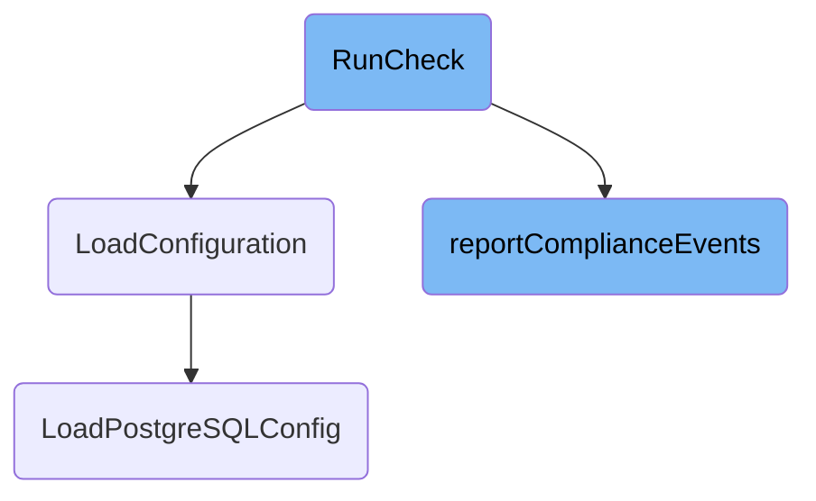

This document explains the process of running a compliance check. The process involves obtaining the hostname, setting up a statsd client if metrics are enabled, loading configurations, evaluating compliance rules, and reporting the results.

The flow starts by getting the hostname and setting up a client for metrics if needed. It then loads the necessary configurations and compliance rules. Each rule is evaluated, and the results are collected. Finally, the results are either saved to a file or reported for monitoring.

# Flow drill down



<SwmSnippet path="/cmd/security-agent/subcommands/check/command.go" line="111">

---

## <SwmToken path="cmd/security-agent/subcommands/check/command.go" pos="111:2:2" line-data="// RunCheck runs a check">`RunCheck`</SwmToken>

The <SwmToken path="cmd/security-agent/subcommands/check/command.go" pos="111:2:2" line-data="// RunCheck runs a check">`RunCheck`</SwmToken> function orchestrates the compliance check process. It starts by obtaining the hostname and setting up a statsd client if metrics are enabled. Depending on the arguments provided, it may load Kubernetes configuration or initialize a compliance resolver. The function then loads compliance rules from specified directories and evaluates each rule, collecting events. Finally, it either dumps the events to a file or reports them.

```go
// RunCheck runs a check
func RunCheck(log log.Component, config config.Component, _ secrets.Component, statsdComp statsd.Component, checkArgs *CliParams) error {
	hname, err := hostname.Get(context.TODO())
	if err != nil {
		return err
	}

	var statsdClient ddgostatsd.ClientInterface
	metricsEnabled := config.GetBool("compliance_config.metrics.enabled")
	if metricsEnabled {
		cl, err := statsdComp.Get()
		if err != nil {
			log.Warnf("Error creating statsd Client: %s", err)
		} else {
			statsdClient = cl
			defer cl.Flush()
		}
	}

	if len(checkArgs.args) == 1 && checkArgs.args[0] == "k8sconfig" {
		_, resourceData := k8sconfig.LoadConfiguration(context.Background(), os.Getenv("HOST_ROOT"))
```

---

</SwmSnippet>

<SwmSnippet path="/pkg/compliance/dbconfig/loader.go" line="81">

---

## <SwmToken path="pkg/compliance/dbconfig/loader.go" pos="81:2:2" line-data="// LoadConfiguration loads and returns an optional DBResource associated with the">`LoadConfiguration`</SwmToken>

The <SwmToken path="pkg/compliance/dbconfig/loader.go" pos="81:2:2" line-data="// LoadConfiguration loads and returns an optional DBResource associated with the">`LoadConfiguration`</SwmToken> function determines the type of database resource associated with a given process and loads the corresponding configuration. It supports <SwmToken path="pkg/compliance/dbconfig/loader.go" pos="228:12:12" line-data="// LoadPostgreSQLConfig loads and extracts the PostgreSQL configuration data found on the system.">`PostgreSQL`</SwmToken>, <SwmToken path="pkg/compliance/dbconfig/loader.go" pos="145:12:12" line-data="// LoadMongoDBConfig loads and extracts the MongoDB configuration data found">`MongoDB`</SwmToken>, and Cassandra, delegating the actual loading to specific functions like <SwmToken path="pkg/compliance/dbconfig/loader.go" pos="91:8:8" line-data="		conf, ok = LoadPostgreSQLConfig(ctx, rootPath, proc)">`LoadPostgreSQLConfig`</SwmToken>.

```go
// LoadConfiguration loads and returns an optional DBResource associated with the
// given process PID.
func LoadConfiguration(ctx context.Context, rootPath string, proc *process.Process) (string, *DBConfig, bool) {
	resourceType, ok := GetProcResourceType(proc)
	if !ok {
		return "", nil, false
	}
	var conf *DBConfig
	switch resourceType {
	case postgresqlResourceType:
		conf, ok = LoadPostgreSQLConfig(ctx, rootPath, proc)
	case mongoDBResourceType:
		conf, ok = LoadMongoDBConfig(ctx, rootPath, proc)
	case cassandraResourceType:
		conf, ok = LoadCassandraConfig(ctx, rootPath, proc)
	default:
		ok = false
	}
	if !ok || conf == nil {
		return "", nil, false
	}
```

---

</SwmSnippet>

<SwmSnippet path="/cmd/security-agent/subcommands/check/command.go" line="244">

---

## <SwmToken path="cmd/security-agent/subcommands/check/command.go" pos="244:2:2" line-data="func reportComplianceEvents(log log.Component, events []*compliance.CheckEvent) error {">`reportComplianceEvents`</SwmToken>

The <SwmToken path="cmd/security-agent/subcommands/check/command.go" pos="244:2:2" line-data="func reportComplianceEvents(log log.Component, events []*compliance.CheckEvent) error {">`reportComplianceEvents`</SwmToken> function is responsible for reporting compliance check events. It retrieves the hostname, sets up a log context, and uses a `LogReporter` to send each event. This ensures that the compliance results are properly logged and can be monitored.

```go
func reportComplianceEvents(log log.Component, events []*compliance.CheckEvent) error {
	hostnameDetected, err := utils.GetHostnameWithContextAndFallback(context.Background())
	if err != nil {
		return log.Errorf("Error while getting hostname, exiting: %v", err)
	}
	endpoints, context, err := common.NewLogContextCompliance()
	if err != nil {
		return fmt.Errorf("reporter: could not reate log context for compliance: %w", err)
	}
	reporter := compliance.NewLogReporter(hostnameDetected, "compliance-agent", "compliance", endpoints, context)
	defer reporter.Stop()
	for _, event := range events {
		reporter.ReportEvent(event)
	}
	return nil
}
```

---

</SwmSnippet>

<SwmSnippet path="/pkg/compliance/dbconfig/loader.go" line="228">

---

## <SwmToken path="pkg/compliance/dbconfig/loader.go" pos="228:2:2" line-data="// LoadPostgreSQLConfig loads and extracts the PostgreSQL configuration data found on the system.">`LoadPostgreSQLConfig`</SwmToken>

The <SwmToken path="pkg/compliance/dbconfig/loader.go" pos="228:2:2" line-data="// LoadPostgreSQLConfig loads and extracts the PostgreSQL configuration data found on the system.">`LoadPostgreSQLConfig`</SwmToken> function extracts <SwmToken path="pkg/compliance/dbconfig/loader.go" pos="228:12:12" line-data="// LoadPostgreSQLConfig loads and extracts the PostgreSQL configuration data found on the system.">`PostgreSQL`</SwmToken> configuration data from the system. It parses command-line arguments to locate the configuration file, retrieves file metadata, and reads the configuration data. This information is then returned as a <SwmToken path="pkg/compliance/dbconfig/loader.go" pos="229:26:26" line-data="func LoadPostgreSQLConfig(ctx context.Context, hostroot string, proc *process.Process) (*DBConfig, bool) {">`DBConfig`</SwmToken> object.

```go
// LoadPostgreSQLConfig loads and extracts the PostgreSQL configuration data found on the system.
func LoadPostgreSQLConfig(ctx context.Context, hostroot string, proc *process.Process) (*DBConfig, bool) {
	var result DBConfig

	// Let's try to parse the -D command line argument containing the data
	// directory of PG. Configuration file may be located in this directory.
	result.ProcessUser, _ = proc.UsernameWithContext(ctx)
	result.ProcessName, _ = proc.NameWithContext(ctx)

	var hintPath string
	cmdline, _ := proc.CmdlineSlice()
	for i, arg := range cmdline {
		if arg == "-D" && i+1 < len(cmdline) {
			hintPath = filepath.Join(cmdline[i+1], "postgresql.conf")
			break
		}
		if arg == "--config-file" && i+1 < len(cmdline) {
			hintPath = filepath.Clean(cmdline[i+1])
			break
		}
		if strings.HasPrefix(arg, "--config-file=") {
```

---

</SwmSnippet>

&nbsp;

*This is an auto-generated document by Swimm AI 🌊 and has not yet been verified by a human*

<SwmMeta version="3.0.0" repo-id="Z2l0aHViJTNBJTNBZGF0YWRvZy1hZ2VudCUzQSUzQVN3aW1tLURlbW8=" repo-name="datadog-agent"><sup>Powered by [Swimm](/)</sup></SwmMeta>
