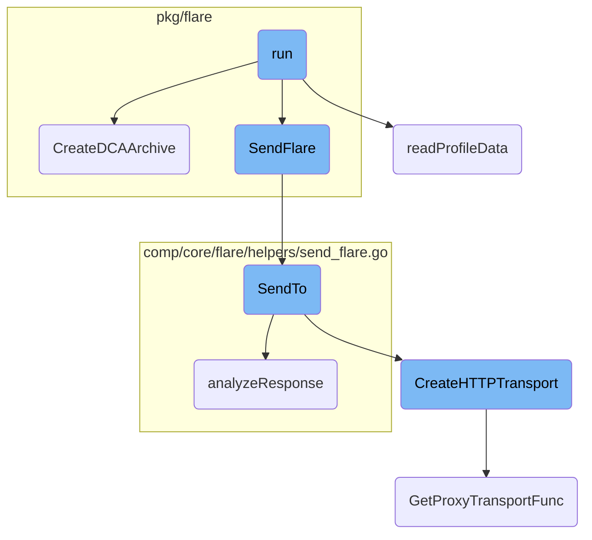
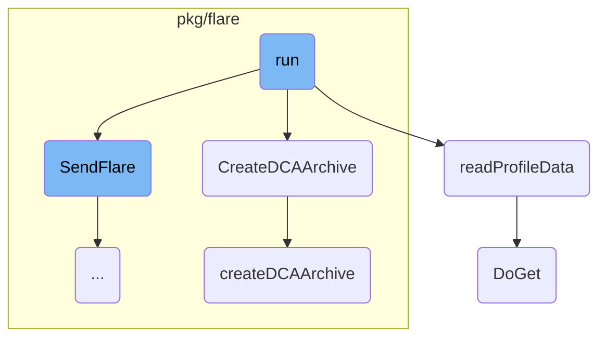
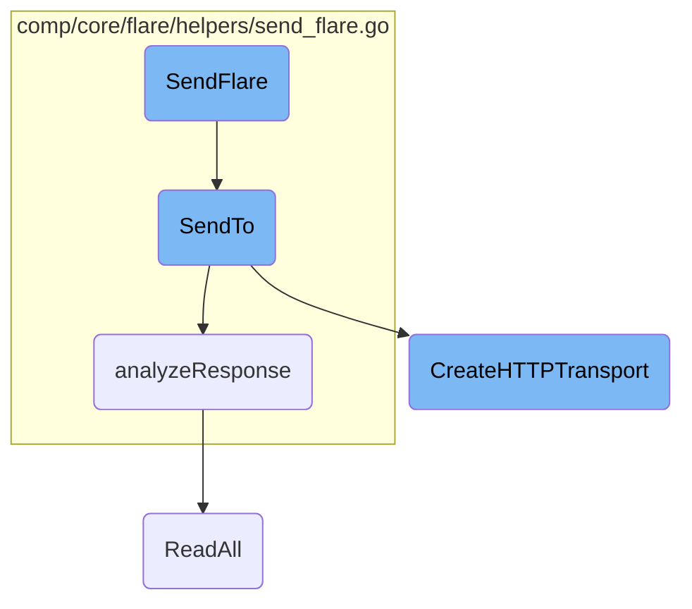

This document explains the process of running the diagnostic information collection and sending it to Datadog. The process involves creating a flare archive, reading profile data, and sending the collected information to Datadog for analysis.

The flow starts with creating a flare archive, which packages necessary files and logs. Next, it reads profile data from the Datadog Cluster Agent by performing HTTP GET requests to gather various performance profiles. Finally, the collected data is sent to Datadog using a custom HTTP transport, ensuring all relevant diagnostic information is uploaded for further analysis.

Here is a high level diagram of the flow, showing only the most important functions:



# Flow drill down

First, we'll zoom into this section of the flow:



<SwmSnippet path="/pkg/cli/subcommands/dcaflare/command.go" line="211">

---

## Creating the Flare Archive

If the agent encounters an error while making the flare, it initiates the flare creation locally using the <SwmToken path="pkg/cli/subcommands/dcaflare/command.go" pos="211:10:10" line-data="		filePath, e = flare.CreateDCAArchive(true, path.GetDistPath(), logFile, profile, nil)">`CreateDCAArchive`</SwmToken> function. This ensures that even if some logs are missing, a flare archive is still created.

```go
		filePath, e = flare.CreateDCAArchive(true, path.GetDistPath(), logFile, profile, nil)
		if e != nil {
			fmt.Printf("The flare zipfile failed to be created: %s\n", e)
			return e
		}
```

---

</SwmSnippet>

<SwmSnippet path="/pkg/cli/subcommands/dcaflare/command.go" line="229">

---

## Sending the Flare Archive

The <SwmToken path="pkg/cli/subcommands/dcaflare/command.go" pos="229:10:10" line-data="	response, e := flare.SendFlare(pkgconfig.Datadog(), filePath, cliParams.caseID, cliParams.email, helpers.NewLocalFlareSource())">`SendFlare`</SwmToken> function is called to upload the created flare archive to Datadog. This step is crucial for sending the collected diagnostic information to Datadog for further analysis.

```go
	response, e := flare.SendFlare(pkgconfig.Datadog(), filePath, cliParams.caseID, cliParams.email, helpers.NewLocalFlareSource())
	fmt.Println(response)
	if e != nil {
		return e
	}
```

---

</SwmSnippet>

<SwmSnippet path="/pkg/flare/archive_dca.go" line="31">

---

### Creating the DCA Archive

The <SwmToken path="pkg/flare/archive_dca.go" pos="31:2:2" line-data="// CreateDCAArchive packages up the files">`CreateDCAArchive`</SwmToken> function packages up the necessary files into a flare archive. It initializes a <SwmToken path="pkg/flare/archive_dca.go" pos="47:8:8" line-data="func createDCAArchive(fb flaretypes.FlareBuilder, confSearchPaths map[string]string, logFilePath string, pdata ProfileData, statusComponent status.Component) {">`FlareBuilder`</SwmToken> and calls <SwmToken path="pkg/flare/archive_dca.go" pos="31:2:2" line-data="// CreateDCAArchive packages up the files">`CreateDCAArchive`</SwmToken> to add various logs and configuration files to the archive.

```go
// CreateDCAArchive packages up the files
func CreateDCAArchive(local bool, distPath, logFilePath string, pdata ProfileData, statusComponent status.Component) (string, error) {
	fb, err := flarehelpers.NewFlareBuilder(local)
	if err != nil {
		return "", err
	}

	confSearchPaths := map[string]string{
		"":     config.Datadog().GetString("confd_path"),
		"dist": filepath.Join(distPath, "conf.d"),
	}

	createDCAArchive(fb, confSearchPaths, logFilePath, pdata, statusComponent)
	return fb.Save()
}
```

---

</SwmSnippet>

<SwmSnippet path="/pkg/cli/subcommands/dcaflare/command.go" line="108">

---

### Reading Profile Data

The <SwmToken path="pkg/cli/subcommands/dcaflare/command.go" pos="108:2:2" line-data="func readProfileData(seconds int) (flare.ProfileData, error) {">`readProfileData`</SwmToken> function collects performance profile data from the Datadog Cluster Agent. It performs HTTP GET requests to retrieve different types of profiles like heap, CPU, mutex, and goroutine blocking profiles.

```go
func readProfileData(seconds int) (flare.ProfileData, error) {
	pdata := flare.ProfileData{}
	c := util.GetClient(false)

	fmt.Fprintln(color.Output, color.BlueString("Getting a %ds profile snapshot from datadog-cluster-agent.", seconds))
	pprofURL := fmt.Sprintf("http://127.0.0.1:%d/debug/pprof", pkgconfig.Datadog().GetInt("expvar_port"))

	for _, prof := range []struct{ name, URL string }{
		{
			// 1st heap profile
			name: "datadog-cluster-agent-1st-heap.pprof",
			URL:  pprofURL + "/heap",
		},
		{
			// CPU profile
			name: "datadog-cluster-agent-cpu.pprof",
			URL:  fmt.Sprintf("%s/profile?seconds=%d", pprofURL, seconds),
		},
		{
			// 2nd heap profile
			name: "datadog-cluster-agent-2nd-heap.pprof",
```

---

</SwmSnippet>

<SwmSnippet path="/pkg/api/util/doget.go" line="49">

---

### Performing HTTP GET Requests

The <SwmToken path="pkg/api/util/doget.go" pos="49:2:2" line-data="// DoGet is a wrapper around performing HTTP GET requests">`DoGet`</SwmToken> function is a wrapper around performing HTTP GET requests. It is used in <SwmToken path="pkg/cli/subcommands/dcaflare/command.go" pos="108:2:2" line-data="func readProfileData(seconds int) (flare.ProfileData, error) {">`readProfileData`</SwmToken> to fetch profile data from the Cluster Agent.

```go
// DoGet is a wrapper around performing HTTP GET requests
func DoGet(c *http.Client, url string, conn ShouldCloseConnection) (body []byte, e error) {
	return DoGetWithOptions(c, url, &ReqOptions{Conn: conn})
}
```

---

</SwmSnippet>

<SwmSnippet path="/pkg/flare/archive_dca.go" line="47">

---

### Adding Files to the Archive

The <SwmToken path="pkg/flare/archive_dca.go" pos="47:2:2" line-data="func createDCAArchive(fb flaretypes.FlareBuilder, confSearchPaths map[string]string, logFilePath string, pdata ProfileData, statusComponent status.Component) {">`createDCAArchive`</SwmToken> function adds various files to the flare archive. It includes logs, configuration files, status checks, and performance profiles. This function ensures that all relevant diagnostic information is included in the archive.

```go
func createDCAArchive(fb flaretypes.FlareBuilder, confSearchPaths map[string]string, logFilePath string, pdata ProfileData, statusComponent status.Component) {
	// If the request against the API does not go through we don't collect the status log.
	if fb.IsLocal() {
		fb.AddFile("local", nil) //nolint:errcheck
	} else {
		// The Status will be unavailable unless the agent is running.
		// Only zip it up if the agent is running
		err := fb.AddFileFromFunc("cluster-agent-status.log", func() ([]byte, error) { return statusComponent.GetStatus("text", true) }) //nolint:errcheck
		if err != nil {
			log.Errorf("Error getting the status of the DCA, %q", err)
			return
		}

	}

	getLogFiles(fb, logFilePath)
	getConfigFiles(fb, confSearchPaths)
	getClusterAgentConfigCheck(fb)                                                 //nolint:errcheck
	getExpVar(fb)                                                                  //nolint:errcheck
	getMetadataMap(fb)                                                             //nolint:errcheck
	getClusterAgentClusterChecks(fb)                                               //nolint:errcheck
```

---

</SwmSnippet>

Now, lets zoom into this section of the flow:



<SwmSnippet path="/pkg/flare/flare.go" line="15">

---

## <SwmToken path="pkg/flare/flare.go" pos="15:2:2" line-data="// SendFlare sends a flare and returns the message returned by the backend. This entry point is deprecated in favor of">`SendFlare`</SwmToken>

The <SwmToken path="pkg/flare/flare.go" pos="15:2:2" line-data="// SendFlare sends a flare and returns the message returned by the backend. This entry point is deprecated in favor of">`SendFlare`</SwmToken> function is responsible for sending a flare and returning the message from the backend. It calls the <SwmToken path="pkg/flare/flare.go" pos="18:5:5" line-data="	return helpers.SendTo(cfg, archivePath, caseID, email, config.Datadog().GetString(&quot;api_key&quot;), utils.GetInfraEndpoint(config.Datadog()), source)">`SendTo`</SwmToken> function, passing necessary parameters like configuration, archive path, case ID, email, API key, and endpoint.

```go
// SendFlare sends a flare and returns the message returned by the backend. This entry point is deprecated in favor of
// the 'Send' method of the flare component.
func SendFlare(cfg pkgconfigmodel.Reader, archivePath string, caseID string, email string, source helpers.FlareSource) (string, error) {
	return helpers.SendTo(cfg, archivePath, caseID, email, config.Datadog().GetString("api_key"), utils.GetInfraEndpoint(config.Datadog()), source)
}
```

---

</SwmSnippet>

<SwmSnippet path="/comp/core/flare/helpers/send_flare.go" line="227">

---

## <SwmToken path="comp/core/flare/helpers/send_flare.go" pos="227:2:2" line-data="// SendTo sends a flare file to the backend. This is part of the &quot;helpers&quot; package while all the code is moved to">`SendTo`</SwmToken>

The <SwmToken path="comp/core/flare/helpers/send_flare.go" pos="227:2:2" line-data="// SendTo sends a flare file to the backend. This is part of the &quot;helpers&quot; package while all the code is moved to">`SendTo`</SwmToken> function handles the actual sending of the flare file to the backend. It first retrieves the hostname and sanitizes the API key. It then creates an HTTP client with a custom transport and constructs the URL for the POST request. The function reads and posts the flare file, and finally calls <SwmToken path="comp/core/flare/helpers/send_flare.go" pos="144:2:2" line-data="func analyzeResponse(r *http.Response, apiKey string) (string, error) {">`analyzeResponse`</SwmToken> to process the server's response.

```go
// SendTo sends a flare file to the backend. This is part of the "helpers" package while all the code is moved to
// components. When possible use the "Send" method of the "flare" component instead.
func SendTo(cfg pkgconfigmodel.Reader, archivePath, caseID, email, apiKey, url string, source FlareSource) (string, error) {
	hostname, err := hostnameUtil.Get(context.TODO())
	if err != nil {
		hostname = "unknown"
	}

	apiKey = configUtils.SanitizeAPIKey(apiKey)
	baseURL, _ := configUtils.AddAgentVersionToDomain(url, "flare")

	transport := httputils.CreateHTTPTransport(cfg)
	client := &http.Client{
		Transport: transport,
		Timeout:   httpTimeout,
	}

	url = mkURL(baseURL, caseID)

	url, err = resolveFlarePOSTURL(url, client, apiKey)
	if err != nil {
```

---

</SwmSnippet>

<SwmSnippet path="/pkg/util/http/transport.go" line="63">

---

### Creating HTTP Transport

The <SwmToken path="pkg/util/http/transport.go" pos="63:2:2" line-data="// CreateHTTPTransport creates an *http.Transport for use in the agent">`CreateHTTPTransport`</SwmToken> function creates a custom HTTP transport for the agent. It configures TLS settings, timeouts, and proxy settings based on the provided configuration. This transport is used by the HTTP client in the <SwmToken path="pkg/flare/flare.go" pos="18:5:5" line-data="	return helpers.SendTo(cfg, archivePath, caseID, email, config.Datadog().GetString(&quot;api_key&quot;), utils.GetInfraEndpoint(config.Datadog()), source)">`SendTo`</SwmToken> function.

```go
// CreateHTTPTransport creates an *http.Transport for use in the agent
func CreateHTTPTransport(cfg pkgconfigmodel.Reader) *http.Transport {
	// It’s OK to reuse the same file for all the http.Transport objects we create
	// because all the writes to that file are protected by a global mutex.
	// See https://github.com/golang/go/blob/go1.17.3/src/crypto/tls/common.go#L1316-L1318
	keyLogWriterInit.Do(func() {
		sslKeyLogFile := cfg.GetString("sslkeylogfile")
		if sslKeyLogFile != "" {
			var err error
			keyLogWriter, err = os.OpenFile(sslKeyLogFile, os.O_WRONLY|os.O_CREATE|os.O_APPEND, 0600)
			if err != nil {
				log.Warnf("Failed to open %s for writing NSS keys: %v", sslKeyLogFile, err)
			}
		}
	})

	tlsConfig := &tls.Config{
		KeyLogWriter:       keyLogWriter,
		InsecureSkipVerify: cfg.GetBool("skip_ssl_validation"),
	}

```

---

</SwmSnippet>

<SwmSnippet path="/comp/core/flare/helpers/send_flare.go" line="144">

---

## <SwmToken path="comp/core/flare/helpers/send_flare.go" pos="144:2:2" line-data="func analyzeResponse(r *http.Response, apiKey string) (string, error) {">`analyzeResponse`</SwmToken>

The <SwmToken path="comp/core/flare/helpers/send_flare.go" pos="144:2:2" line-data="func analyzeResponse(r *http.Response, apiKey string) (string, error) {">`analyzeResponse`</SwmToken> function processes the HTTP response from the server. It checks for forbidden status codes and attempts to deserialize the response body. If the response contains an error, it formats an appropriate message. Otherwise, it confirms the successful upload of the flare.

```go
func analyzeResponse(r *http.Response, apiKey string) (string, error) {
	if r.StatusCode == http.StatusForbidden {
		var errStr string

		if len(apiKey) == 0 {
			errStr = "API key is missing"
		} else {
			if len(apiKey) > 5 {
				apiKey = apiKey[len(apiKey)-5:]
			}
			errStr = fmt.Sprintf("Make sure your API key is valid. API Key ending with: %v", apiKey)
		}

		return "", fmt.Errorf("HTTP 403 Forbidden: %s", errStr)
	}

	res := flareResponse{}

	var err error
	b, _ := io.ReadAll(r.Body)
	if r.StatusCode != http.StatusOK {
```

---

</SwmSnippet>

&nbsp;

*This is an auto-generated document by Swimm AI 🌊 and has not yet been verified by a human*

<SwmMeta version="3.0.0" repo-id="Z2l0aHViJTNBJTNBZGF0YWRvZy1hZ2VudCUzQSUzQVN3aW1tLURlbW8=" repo-name="datadog-agent"><sup>Powered by [Swimm](/)</sup></SwmMeta>
