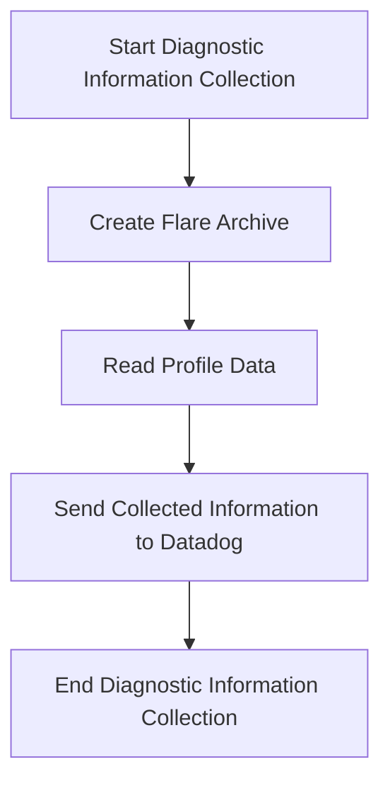

This document will cover the process of running diagnostic information collection, which includes:

1. Creating a flare archive
2. Reading profile data
3. Sending the collected information to Datadog.

Technical document: <SwmLink doc-title="Running Diagnostic Information Collection">[Running Diagnostic Information Collection](/.swm/running-diagnostic-information-collection.b98aw4gh.sw.md)</SwmLink>

# [Creating a Flare Archive](https://app.swimm.io/repos/Z2l0aHViJTNBJTNBZGF0YWRvZy1hZ2VudCUzQSUzQVN3aW1tLURlbW8=/docs/b98aw4gh#creating-the-flare-archive)

The process begins with creating a flare archive. This step involves packaging necessary files and logs into a single archive. The flare archive is essential for collecting all relevant diagnostic information in one place. If the agent encounters an error while making the flare, it initiates the flare creation locally. This ensures that even if some logs are missing, a flare archive is still created.

# [Reading Profile Data](https://app.swimm.io/repos/Z2l0aHViJTNBJTNBZGF0YWRvZy1hZ2VudCUzQSUzQVN3aW1tLURlbW8=/docs/b98aw4gh#reading-profile-data)

Next, the process involves reading profile data from the Datadog Cluster Agent. This step collects various performance profiles by performing HTTP GET requests. The profiles include heap, CPU, mutex, and goroutine blocking profiles. This data is crucial for understanding the performance characteristics of the system at the time of the diagnostic collection.

# [Sending the Collected Information to Datadog](https://app.swimm.io/repos/Z2l0aHViJTNBJTNBZGF0YWRvZy1hZ2VudCUzQSUzQVN3aW1tLURlbW8=/docs/b98aw4gh#sending-the-flare-archive)

Finally, the collected diagnostic information is sent to Datadog. This step involves uploading the flare archive to Datadog using a custom HTTP transport. The transport ensures that all relevant diagnostic information is uploaded securely and efficiently. Once the data is sent, it can be analyzed by Datadog for further insights and troubleshooting.

&nbsp;

*This is an auto-generated document by Swimm AI 🌊 and has not yet been verified by a human*

<SwmMeta version="3.0.0" repo-id="Z2l0aHViJTNBJTNBZGF0YWRvZy1hZ2VudCUzQSUzQVN3aW1tLURlbW8=" repo-name="datadog-agent">Powered by [Swimm](/)</SwmMeta>
