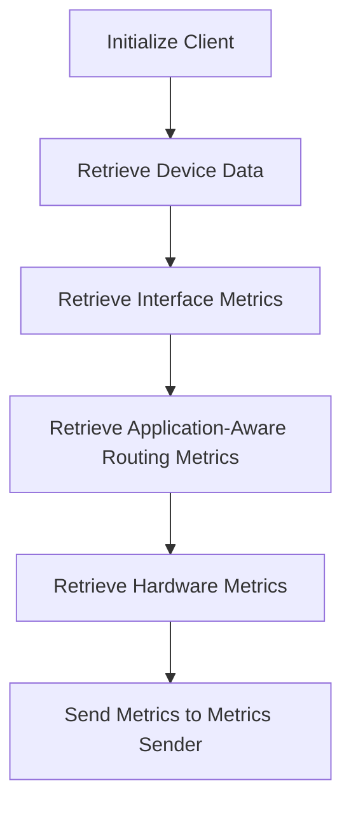

This document will cover the process of running the Cisco SD-WAN Client to collect various metrics. We'll cover:

1. Initializing the client
2. Retrieving device and interface data
3. Sending collected metrics to the metrics sender.

Technical document: <SwmLink doc-title="Running the Cisco SD-WAN Client">[Running the Cisco SD-WAN Client](/.swm/running-the-cisco-sd-wan-client.bsjfmiit.sw.md)</SwmLink>

# [Initializing the Client](https://app.swimm.io/repos/Z2l0aHViJTNBJTNBZGF0YWRvZy1hZ2VudCUzQSUzQVN3aW1tLURlbW8=/docs/bsjfmiit#run)

The process begins with initializing the Cisco SD-WAN client using the provided configuration. This step ensures that the client is properly set up with the necessary credentials and endpoint information to communicate with the Cisco SD-WAN API. This initialization is crucial as it sets the foundation for all subsequent data retrieval operations.

# [Retrieving Device Data](https://app.swimm.io/repos/Z2l0aHViJTNBJTNBZGF0YWRvZy1hZ2VudCUzQSUzQVN3aW1tLURlbW8=/docs/bsjfmiit#run)

Once the client is initialized, it retrieves data from the Cisco SD-WAN API. This includes device information which is essential for understanding the network topology and the devices being monitored. This data provides a comprehensive view of the network's structure and the devices' roles within it.

# [Retrieving Interface Metrics](https://app.swimm.io/repos/Z2l0aHViJTNBJTNBZGF0YWRvZy1hZ2VudCUzQSUzQVN3aW1tLURlbW8=/docs/bsjfmiit#getinterfacesmetrics)

The client then retrieves interface metrics, which include data on the performance and status of network interfaces. This information is vital for monitoring the health and performance of the network interfaces, identifying potential issues, and ensuring optimal network performance.

# [Retrieving Application-Aware Routing Metrics](https://app.swimm.io/repos/Z2l0aHViJTNBJTNBZGF0YWRvZy1hZ2VudCUzQSUzQVN3aW1tLURlbW8=/docs/bsjfmiit#getapplicationawareroutingmetrics)

Next, the client fetches application-aware routing metrics. These metrics provide insights into how traffic is being routed through the network based on application requirements. This helps in optimizing network performance and ensuring that critical applications receive the necessary bandwidth and priority.

# [Retrieving Hardware Metrics](https://app.swimm.io/repos/Z2l0aHViJTNBJTNBZGF0YWRvZy1hZ2VudCUzQSUzQVN3aW1tLURlbW8=/docs/bsjfmiit#getdevicehardwaremetrics)

The client also collects hardware metrics for the devices. This includes data on the physical status and performance of the network hardware. Monitoring these metrics is important for maintaining the health of the network infrastructure and preemptively addressing any hardware-related issues.

# [Sending Collected Metrics to the Metrics Sender](https://app.swimm.io/repos/Z2l0aHViJTNBJTNBZGF0YWRvZy1hZ2VudCUzQSUzQVN3aW1tLURlbW8=/docs/bsjfmiit#run)

Finally, all the collected metrics are sent to the metrics sender for further analysis. This step ensures that the data is available for monitoring and analysis, enabling network administrators to make informed decisions based on the collected metrics. The metrics sender processes and stores the data, making it accessible for reporting and alerting purposes.

&nbsp;

*This is an auto-generated document by Swimm AI 🌊 and has not yet been verified by a human*

<SwmMeta version="3.0.0" repo-id="Z2l0aHViJTNBJTNBZGF0YWRvZy1hZ2VudCUzQSUzQVN3aW1tLURlbW8=" repo-name="datadog-agent">Powered by [Swimm](/)</SwmMeta>
