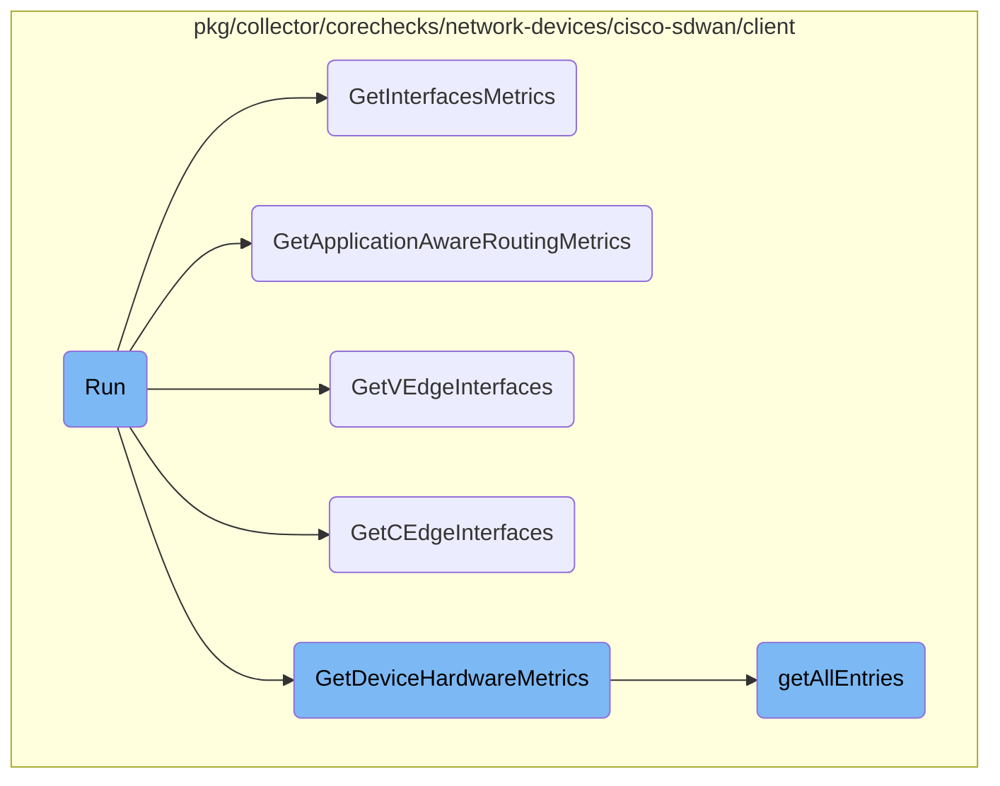

In this document, we will explain the process of running the Cisco <SwmToken path="pkg/collector/corechecks/network-devices/cisco-sdwan/sdwan.go" pos="72:7:9" line-data="	// Create Cisco SD-WAN API client">`SD-WAN`</SwmToken> client to collect various metrics. The process involves initializing the client, retrieving device and interface data, and sending the collected metrics to the metrics sender.

The flow starts with initializing the client using the provided configuration. Once the client is ready, it retrieves data from the Cisco <SwmToken path="pkg/collector/corechecks/network-devices/cisco-sdwan/sdwan.go" pos="72:7:9" line-data="	// Create Cisco SD-WAN API client">`SD-WAN`</SwmToken> API, including device information, interface metrics, <SwmToken path="pkg/collector/corechecks/network-devices/cisco-sdwan/sdwan.go" pos="124:10:12" line-data="			log.Warnf(&quot;Error getting application-aware routing metrics from Cisco SD-WAN API: %s&quot;, err)">`application-aware`</SwmToken> routing metrics, and hardware metrics. This data is then processed and sent to the metrics sender for further analysis.

# Flow drill down



<SwmSnippet path="/pkg/collector/corechecks/network-devices/cisco-sdwan/sdwan.go" line="65">

---

## Run

The <SwmToken path="pkg/collector/corechecks/network-devices/cisco-sdwan/sdwan.go" pos="65:2:2" line-data="// Run executes the check">`Run`</SwmToken> function orchestrates the entire process of collecting various metrics from Cisco <SwmToken path="pkg/collector/corechecks/network-devices/cisco-sdwan/sdwan.go" pos="72:7:9" line-data="	// Create Cisco SD-WAN API client">`SD-WAN`</SwmToken> devices. It initializes the client, retrieves device and interface data, and sends the collected metrics to the metrics sender. This function is crucial as it integrates multiple steps to ensure that all necessary data is collected and processed.

```go
// Run executes the check
func (c *CiscoSdwanCheck) Run() error {
	clientOptions, err := c.buildClientOptions()
	if err != nil {
		return err
	}

	// Create Cisco SD-WAN API client
	client, err := client.NewClient(c.config.VManageEndpoint, c.config.Username, c.config.Password, c.config.UseHTTP, clientOptions...)
	if err != nil {
		return err
	}

	devices, err := client.GetDevices()
	if err != nil {
		log.Warnf("Error getting devices from Cisco SD-WAN API: %s", err)
	}
	vEdgeInterfaces, err := client.GetVEdgeInterfaces()
	if err != nil {
		log.Warnf("Error getting vEdge interfaces from Cisco SD-WAN API: %s", err)
	}
```

---

</SwmSnippet>

<SwmSnippet path="/pkg/collector/corechecks/network-devices/cisco-sdwan/client/client.go" line="216">

---

## <SwmToken path="pkg/collector/corechecks/network-devices/cisco-sdwan/client/client.go" pos="216:2:2" line-data="// GetInterfacesMetrics gets interface metrics">`GetInterfacesMetrics`</SwmToken>

The <SwmToken path="pkg/collector/corechecks/network-devices/cisco-sdwan/client/client.go" pos="216:2:2" line-data="// GetInterfacesMetrics gets interface metrics">`GetInterfacesMetrics`</SwmToken> function retrieves interface metrics by making an API call to the Cisco <SwmToken path="pkg/collector/corechecks/network-devices/cisco-sdwan/sdwan.go" pos="72:7:9" line-data="	// Create Cisco SD-WAN API client">`SD-WAN`</SwmToken> service. It uses the <SwmToken path="pkg/collector/corechecks/network-devices/cisco-sdwan/client/client.go" pos="227:8:8" line-data="	interfaces, err := getAllEntries[InterfaceStats](client, &quot;/dataservice/data/device/statistics/interfacestatistics&quot;, params)">`getAllEntries`</SwmToken> helper function to handle paginated responses and returns the collected data.

```go
// GetInterfacesMetrics gets interface metrics
func (client *Client) GetInterfacesMetrics() ([]InterfaceStats, error) {
	startDate, endDate := client.statisticsTimeRange()

	params := map[string]string{
		"startDate": startDate,
		"endDate":   endDate,
		"timeZone":  "UTC",
		"count":     client.maxCount,
	}

	interfaces, err := getAllEntries[InterfaceStats](client, "/dataservice/data/device/statistics/interfacestatistics", params)
	if err != nil {
		return nil, err
	}

	return interfaces.Data, nil
}
```

---

</SwmSnippet>

<SwmSnippet path="/pkg/collector/corechecks/network-devices/cisco-sdwan/client/client.go" line="254">

---

## <SwmToken path="pkg/collector/corechecks/network-devices/cisco-sdwan/client/client.go" pos="254:2:2" line-data="// GetApplicationAwareRoutingMetrics gets application aware routing metrics">`GetApplicationAwareRoutingMetrics`</SwmToken>

The <SwmToken path="pkg/collector/corechecks/network-devices/cisco-sdwan/client/client.go" pos="254:2:2" line-data="// GetApplicationAwareRoutingMetrics gets application aware routing metrics">`GetApplicationAwareRoutingMetrics`</SwmToken> function fetches <SwmToken path="pkg/collector/corechecks/network-devices/cisco-sdwan/sdwan.go" pos="124:10:12" line-data="			log.Warnf(&quot;Error getting application-aware routing metrics from Cisco SD-WAN API: %s&quot;, err)">`application-aware`</SwmToken> routing metrics. Similar to <SwmToken path="pkg/collector/corechecks/network-devices/cisco-sdwan/client/client.go" pos="216:2:2" line-data="// GetInterfacesMetrics gets interface metrics">`GetInterfacesMetrics`</SwmToken>, it uses the <SwmToken path="pkg/collector/corechecks/network-devices/cisco-sdwan/client/client.go" pos="265:8:8" line-data="	appRoutes, err := getAllEntries[AppRouteStatistics](client, &quot;/dataservice/data/device/statistics/approutestatsstatistics&quot;, params)">`getAllEntries`</SwmToken> helper function to manage paginated API responses and returns the data.

```go
// GetApplicationAwareRoutingMetrics gets application aware routing metrics
func (client *Client) GetApplicationAwareRoutingMetrics() ([]AppRouteStatistics, error) {
	startDate, endDate := client.statisticsTimeRange()

	params := map[string]string{
		"startDate": startDate,
		"endDate":   endDate,
		"timeZone":  "UTC",
		"count":     client.maxCount,
	}

	appRoutes, err := getAllEntries[AppRouteStatistics](client, "/dataservice/data/device/statistics/approutestatsstatistics", params)
	if err != nil {
		return nil, err
	}

	return appRoutes.Data, nil
}
```

---

</SwmSnippet>

<SwmSnippet path="/pkg/collector/corechecks/network-devices/cisco-sdwan/client/client.go" line="189">

---

## <SwmToken path="pkg/collector/corechecks/network-devices/cisco-sdwan/client/client.go" pos="189:2:2" line-data="// GetVEdgeInterfaces gets all Viptela device interfaces">`GetVEdgeInterfaces`</SwmToken>

The <SwmToken path="pkg/collector/corechecks/network-devices/cisco-sdwan/client/client.go" pos="189:2:2" line-data="// GetVEdgeInterfaces gets all Viptela device interfaces">`GetVEdgeInterfaces`</SwmToken> function retrieves all Viptela device interfaces. It constructs the necessary parameters and uses the <SwmToken path="pkg/collector/corechecks/network-devices/cisco-sdwan/client/client.go" pos="195:8:8" line-data="	interfaces, err := getAllEntries[InterfaceState](client, &quot;/dataservice/data/device/state/Interface&quot;, params)">`getAllEntries`</SwmToken> function to fetch the data from the API.

```go
// GetVEdgeInterfaces gets all Viptela device interfaces
func (client *Client) GetVEdgeInterfaces() ([]InterfaceState, error) {
	params := map[string]string{
		"count": client.maxCount,
	}

	interfaces, err := getAllEntries[InterfaceState](client, "/dataservice/data/device/state/Interface", params)
	if err != nil {
		return nil, err
	}
	return interfaces.Data, nil
}
```

---

</SwmSnippet>

<SwmSnippet path="/pkg/collector/corechecks/network-devices/cisco-sdwan/client/client.go" line="202">

---

## <SwmToken path="pkg/collector/corechecks/network-devices/cisco-sdwan/client/client.go" pos="202:2:2" line-data="// GetCEdgeInterfaces gets all Cisco device interfaces">`GetCEdgeInterfaces`</SwmToken>

The <SwmToken path="pkg/collector/corechecks/network-devices/cisco-sdwan/client/client.go" pos="202:2:2" line-data="// GetCEdgeInterfaces gets all Cisco device interfaces">`GetCEdgeInterfaces`</SwmToken> function is responsible for fetching all Cisco device interfaces. It sets up the required parameters and calls the <SwmToken path="pkg/collector/corechecks/network-devices/cisco-sdwan/client/client.go" pos="208:8:8" line-data="	interfaces, err := getAllEntries[CEdgeInterfaceState](client, &quot;/dataservice/data/device/state/CEdgeInterface&quot;, params)">`getAllEntries`</SwmToken> function to obtain the data.

```go
// GetCEdgeInterfaces gets all Cisco device interfaces
func (client *Client) GetCEdgeInterfaces() ([]CEdgeInterfaceState, error) {
	params := map[string]string{
		"count": client.maxCount,
	}

	interfaces, err := getAllEntries[CEdgeInterfaceState](client, "/dataservice/data/device/state/CEdgeInterface", params)
	if err != nil {
		return nil, err
	}

	return interfaces.Data, nil
}
```

---

</SwmSnippet>

<SwmSnippet path="/pkg/collector/corechecks/network-devices/cisco-sdwan/client/client.go" line="235">

---

## <SwmToken path="pkg/collector/corechecks/network-devices/cisco-sdwan/client/client.go" pos="235:2:2" line-data="// GetDeviceHardwareMetrics gets device hardware metrics">`GetDeviceHardwareMetrics`</SwmToken>

The <SwmToken path="pkg/collector/corechecks/network-devices/cisco-sdwan/client/client.go" pos="235:2:2" line-data="// GetDeviceHardwareMetrics gets device hardware metrics">`GetDeviceHardwareMetrics`</SwmToken> function collects hardware metrics for devices. It defines the time range and parameters, then uses the <SwmToken path="pkg/collector/corechecks/network-devices/cisco-sdwan/client/client.go" pos="246:8:8" line-data="	interfaces, err := getAllEntries[DeviceStatistics](client, &quot;/dataservice/data/device/statistics/devicesystemstatusstatistics&quot;, params)">`getAllEntries`</SwmToken> function to gather the data from the API.

```go
// GetDeviceHardwareMetrics gets device hardware metrics
func (client *Client) GetDeviceHardwareMetrics() ([]DeviceStatistics, error) {
	startDate, endDate := client.statisticsTimeRange()

	params := map[string]string{
		"startDate": startDate,
		"endDate":   endDate,
		"timeZone":  "UTC",
		"count":     client.maxCount,
	}

	interfaces, err := getAllEntries[DeviceStatistics](client, "/dataservice/data/device/statistics/devicesystemstatusstatistics", params)
	if err != nil {
		return nil, err
	}

	return interfaces.Data, nil
}
```

---

</SwmSnippet>

<SwmSnippet path="/pkg/collector/corechecks/network-devices/cisco-sdwan/client/request.go" line="157">

---

## <SwmToken path="pkg/collector/corechecks/network-devices/cisco-sdwan/client/request.go" pos="157:2:2" line-data="// getAllEntries gets all entries from paginated endpoints">`getAllEntries`</SwmToken>

The <SwmToken path="pkg/collector/corechecks/network-devices/cisco-sdwan/client/request.go" pos="157:2:2" line-data="// getAllEntries gets all entries from paginated endpoints">`getAllEntries`</SwmToken> function is a generic helper function that handles paginated API responses. It first fetches the initial set of data and then retrieves additional entries if the response is paginated, combining all the data into a single response.

```go
// getAllEntries gets all entries from paginated endpoints
func getAllEntries[T Content](client *Client, endpoint string, params map[string]string) (*Response[T], error) {
	data, err := get[T](client, endpoint, params)
	if err != nil {
		return nil, err
	}

	// If API response is paginated, get the rest
	entries, err := getMoreEntries[T](client, endpoint, data.PageInfo)
	if err != nil {
		return nil, err
	}

	data.Data = append(data.Data, entries...)

	return data, nil
}
```

---

</SwmSnippet>

&nbsp;

*This is an auto-generated document by Swimm AI 🌊 and has not yet been verified by a human*

<SwmMeta version="3.0.0" repo-id="Z2l0aHViJTNBJTNBZGF0YWRvZy1hZ2VudCUzQSUzQVN3aW1tLURlbW8=" repo-name="datadog-agent"><sup>Powered by [Swimm](/)</sup></SwmMeta>
