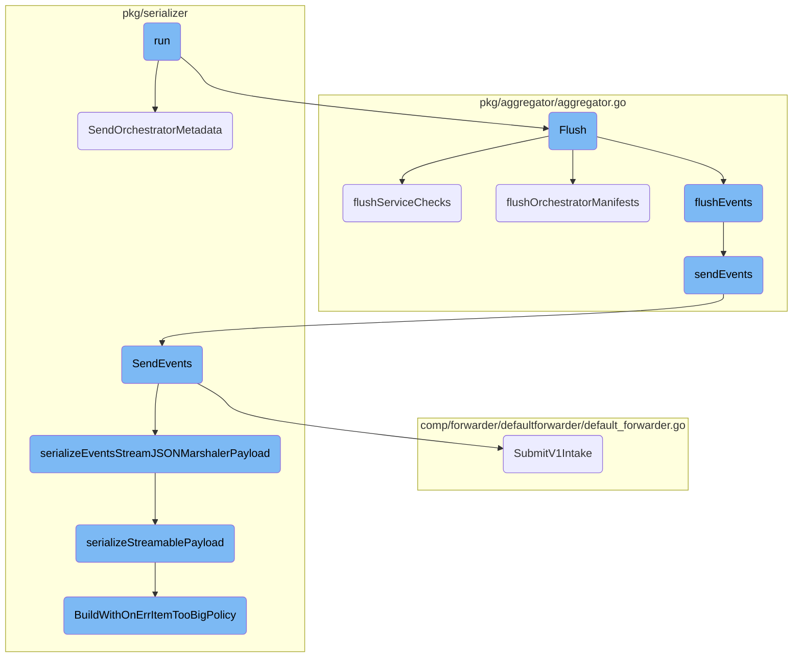
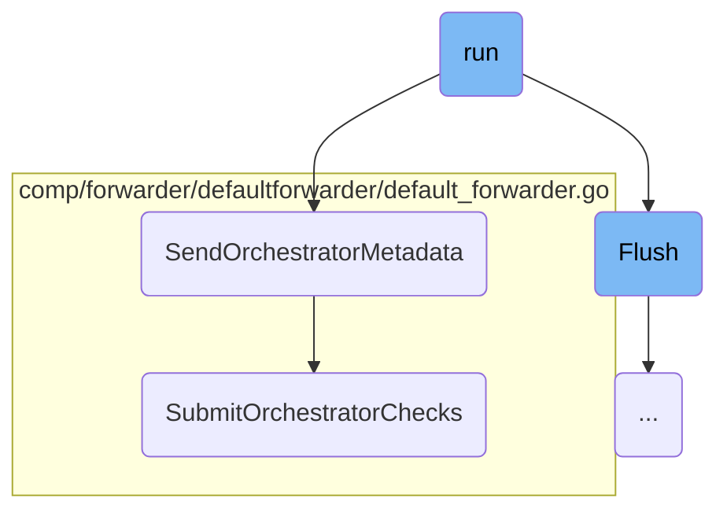
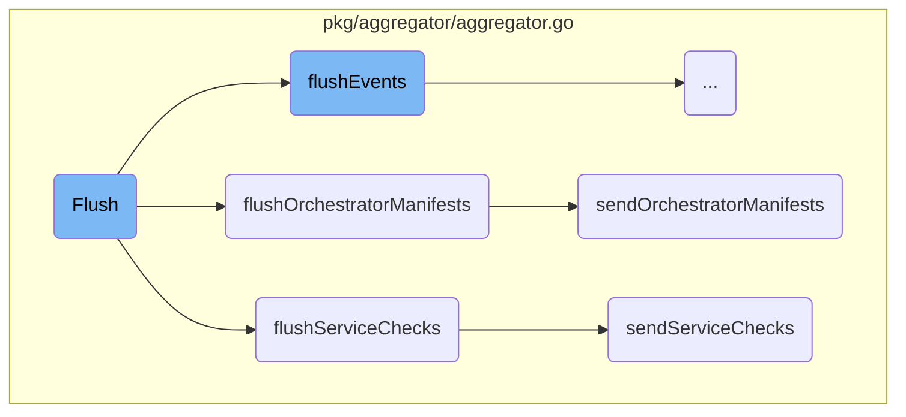
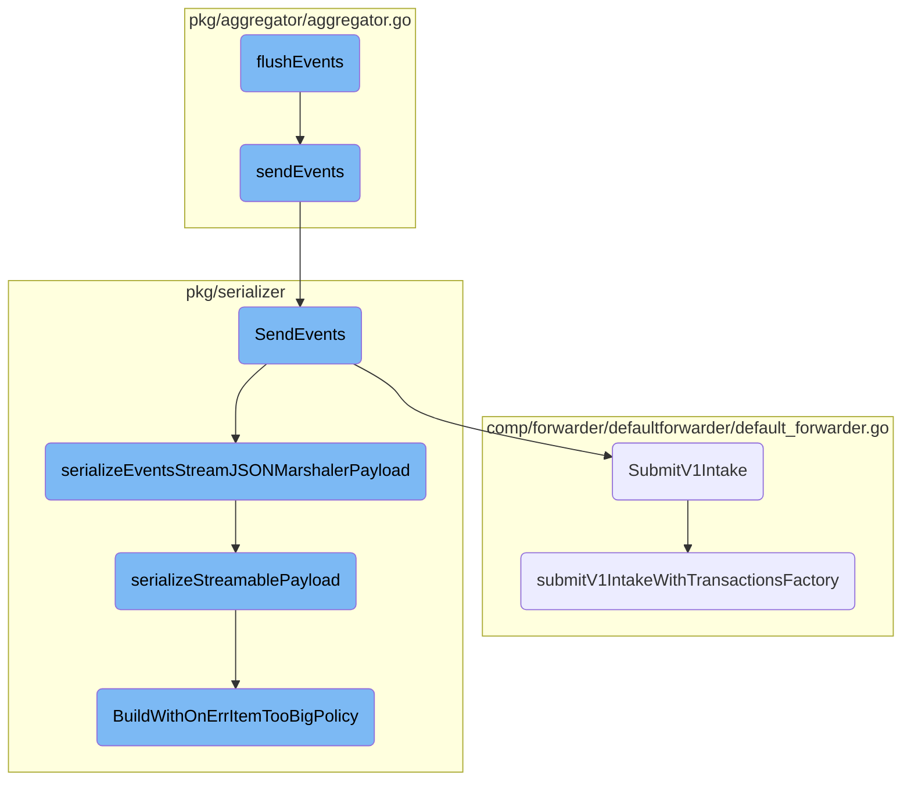

In this document, we will explain the process of running the Datadog Agent's <SwmToken path="rtloader/test/python/datadog_checks/base/checks/__init__.py" pos="9:3:3" line-data="    def run(self):">`run`</SwmToken> function. This function is responsible for handling various types of data, such as orchestrator metadata, service checks, and events, and ensuring they are properly serialized and sent to the Datadog platform.

The flow starts with the <SwmToken path="rtloader/test/python/datadog_checks/base/checks/__init__.py" pos="9:3:3" line-data="    def run(self):">`run`</SwmToken> function receiving orchestrator metadata, service checks, and events. It processes each type of data by serializing it and then sending it to the appropriate endpoint. For orchestrator metadata, it uses a goroutine to avoid blocking and calls <SwmToken path="pkg/aggregator/aggregator.go" pos="783:9:9" line-data="				err := agg.serializer.SendOrchestratorMetadata(">`SendOrchestratorMetadata`</SwmToken>. For service checks and events, it flushes the data and sends it either synchronously or asynchronously based on certain flags. The serialized data is then submitted to the Datadog platform for monitoring and analysis.

Here is a high level diagram of the flow, showing only the most important functions:



# Flow drill down

First, we'll zoom into this section of the flow:



<SwmSnippet path="/pkg/aggregator/aggregator.go" line="778">

---

## Handling Orchestrator Metadata

The <SwmToken path="rtloader/test/python/datadog_checks/base/checks/__init__.py" pos="9:3:3" line-data="    def run(self):">`run`</SwmToken> function handles orchestrator metadata by receiving it from the <SwmToken path="pkg/aggregator/aggregator.go" pos="778:10:10" line-data="		case orchestratorMetadata := &lt;-agg.orchestratorMetadataIn:">`orchestratorMetadataIn`</SwmToken> channel. It increments the <SwmToken path="pkg/aggregator/aggregator.go" pos="779:1:1" line-data="			aggregatorOrchestratorMetadata.Add(1)">`aggregatorOrchestratorMetadata`</SwmToken> metric and uses a goroutine to call <SwmToken path="pkg/aggregator/aggregator.go" pos="783:9:9" line-data="				err := agg.serializer.SendOrchestratorMetadata(">`SendOrchestratorMetadata`</SwmToken> to avoid blocking the aggregator.

```go
		case orchestratorMetadata := <-agg.orchestratorMetadataIn:
			aggregatorOrchestratorMetadata.Add(1)
			// each resource has its own payload so we cannot aggregate
			// use a routine to avoid blocking the aggregator
			go func(orchestratorMetadata senderOrchestratorMetadata) {
				err := agg.serializer.SendOrchestratorMetadata(
					orchestratorMetadata.msgs,
					agg.hostname,
					orchestratorMetadata.clusterID,
					orchestratorMetadata.payloadType,
				)
				if err != nil {
					aggregatorOrchestratorMetadataErrors.Add(1)
					log.Errorf("Error submitting orchestrator data: %s", err)
				}
			}(orchestratorMetadata)
```

---

</SwmSnippet>

<SwmSnippet path="/pkg/serializer/serializer.go" line="514">

---

## Sending Orchestrator Metadata

The <SwmToken path="pkg/serializer/serializer.go" pos="514:9:9" line-data="func (s *Serializer) SendOrchestratorMetadata(msgs []types.ProcessMessageBody, hostName, clusterID string, payloadType int) error {">`SendOrchestratorMetadata`</SwmToken> function serializes and sends orchestrator metadata payloads. It retrieves the orchestrator forwarder and iterates over the messages to create payloads and extra headers. These payloads are then submitted using <SwmToken path="pkg/serializer/serializer.go" pos="526:10:10" line-data="		responses, err := orchestratorForwarder.SubmitOrchestratorChecks(payloads, extraHeaders, payloadType)">`SubmitOrchestratorChecks`</SwmToken>.

```go
func (s *Serializer) SendOrchestratorMetadata(msgs []types.ProcessMessageBody, hostName, clusterID string, payloadType int) error {
	orchestratorForwarder, found := s.orchestratorForwarder.Get()

	if !found {
		return errors.New("orchestrator forwarder is not setup")
	}
	for _, m := range msgs {
		payloads, extraHeaders, err := makeOrchestratorPayloads(m, hostName, clusterID)
		if err != nil {
			return log.Errorf("Unable to encode message: %s", err)
		}

		responses, err := orchestratorForwarder.SubmitOrchestratorChecks(payloads, extraHeaders, payloadType)
		if err != nil {
			return log.Errorf("Unable to submit payload: %s", err)
		}

		// Consume the responses so that writers to the channel do not become blocked
		// we don't need the bodies here though
		//nolint:revive // TODO(AML) Fix revive linter
		for range responses {
```

---

</SwmSnippet>

<SwmSnippet path="/comp/forwarder/defaultforwarder/default_forwarder.go" line="656">

---

### Submitting Orchestrator Checks

The <SwmToken path="comp/forwarder/defaultforwarder/default_forwarder.go" pos="656:9:9" line-data="func (f *DefaultForwarder) SubmitOrchestratorChecks(payload transaction.BytesPayloads, extra http.Header, payloadType int) (chan Response, error) {">`SubmitOrchestratorChecks`</SwmToken> function sends orchestrator checks by determining the appropriate endpoint and calling <SwmToken path="comp/forwarder/defaultforwarder/default_forwarder.go" pos="664:5:5" line-data="	return f.submitProcessLikePayload(endpoint, payload, extra, true)">`submitProcessLikePayload`</SwmToken> to handle the actual submission of the payload.

```go
func (f *DefaultForwarder) SubmitOrchestratorChecks(payload transaction.BytesPayloads, extra http.Header, payloadType int) (chan Response, error) {
	bumpOrchestratorPayload(f.log, payloadType)

	endpoint := endpoints.OrchestratorEndpoint
	if f.config.IsSet("orchestrator_explorer.use_legacy_endpoint") {
		endpoint = endpoints.LegacyOrchestratorEndpoint
	}

	return f.submitProcessLikePayload(endpoint, payload, extra, true)
}
```

---

</SwmSnippet>

Now, lets zoom into this section of the flow:



<SwmSnippet path="/pkg/aggregator/aggregator.go" line="716">

---

## Flush

The <SwmToken path="pkg/aggregator/aggregator.go" pos="716:2:2" line-data="// Flush flushes the data contained in the BufferedAggregator into the Forwarder.">`Flush`</SwmToken> method is responsible for flushing the data contained in the <SwmToken path="pkg/aggregator/aggregator.go" pos="716:16:16" line-data="// Flush flushes the data contained in the BufferedAggregator into the Forwarder.">`BufferedAggregator`</SwmToken> into the <SwmToken path="pkg/aggregator/aggregator.go" pos="716:22:22" line-data="// Flush flushes the data contained in the BufferedAggregator into the Forwarder.">`Forwarder`</SwmToken>. It locks the flush mutex to ensure thread safety, flushes series and sketches, and then calls specific flush methods for service checks, events, and orchestrator manifests. It also updates telemetry checks.

```go
// Flush flushes the data contained in the BufferedAggregator into the Forwarder.
// This method can be called from multiple routines.
func (agg *BufferedAggregator) Flush(trigger flushTrigger) {
	agg.flushMutex.Lock()
	defer agg.flushMutex.Unlock()
	agg.flushSeriesAndSketches(trigger)
	// notify the triggerer that we're done flushing the series and sketches
	if trigger.blockChan != nil {
		trigger.blockChan <- struct{}{}
	}
	agg.flushServiceChecks(trigger.time, trigger.waitForSerializer)
	agg.flushEvents(trigger.time, trigger.waitForSerializer)
	agg.flushOrchestratorManifests(trigger.time, trigger.waitForSerializer)
	agg.updateChecksTelemetry()
}
```

---

</SwmSnippet>

<SwmSnippet path="/pkg/aggregator/aggregator.go" line="632">

---

### <SwmToken path="pkg/aggregator/aggregator.go" pos="632:9:9" line-data="func (agg *BufferedAggregator) flushServiceChecks(start time.Time, waitForSerializer bool) {">`flushServiceChecks`</SwmToken>

The <SwmToken path="pkg/aggregator/aggregator.go" pos="632:9:9" line-data="func (agg *BufferedAggregator) flushServiceChecks(start time.Time, waitForSerializer bool) {">`flushServiceChecks`</SwmToken> method adds a simple service check for the Agent status, retrieves all service checks, logs them if payload logging is enabled, and then sends them either synchronously or asynchronously based on the <SwmToken path="pkg/aggregator/aggregator.go" pos="632:18:18" line-data="func (agg *BufferedAggregator) flushServiceChecks(start time.Time, waitForSerializer bool) {">`waitForSerializer`</SwmToken> flag.

```go
func (agg *BufferedAggregator) flushServiceChecks(start time.Time, waitForSerializer bool) {
	// Add a simple service check for the Agent status
	agg.addServiceCheck(servicecheck.ServiceCheck{
		CheckName: fmt.Sprintf("datadog.%s.up", agg.agentName),
		Status:    servicecheck.ServiceCheckOK,
		Tags:      agg.tags(false),
		Host:      agg.hostname,
	})

	serviceChecks := agg.GetServiceChecks()
	addFlushCount("ServiceChecks", int64(len(serviceChecks)))

	// For debug purposes print out all serviceCheck/tag combinations
	if config.Datadog().GetBool("log_payloads") {
		log.Debug("Flushing the following Service Checks:")
		for _, sc := range serviceChecks {
			log.Debugf("%s", sc)
		}
	}

	if waitForSerializer {
```

---

</SwmSnippet>

<SwmSnippet path="/pkg/aggregator/aggregator.go" line="358">

---

### <SwmToken path="pkg/aggregator/aggregator.go" pos="358:2:2" line-data="// flushOrchestratorManifests serializes and forwards events in a separate goroutine">`flushOrchestratorManifests`</SwmToken>

The <SwmToken path="pkg/aggregator/aggregator.go" pos="358:2:2" line-data="// flushOrchestratorManifests serializes and forwards events in a separate goroutine">`flushOrchestratorManifests`</SwmToken> method retrieves orchestrator manifests, logs the count, and sends them either synchronously or asynchronously based on the <SwmToken path="pkg/aggregator/aggregator.go" pos="359:18:18" line-data="func (agg *BufferedAggregator) flushOrchestratorManifests(start time.Time, waitForSerializer bool) {">`waitForSerializer`</SwmToken> flag.

```go
// flushOrchestratorManifests serializes and forwards events in a separate goroutine
func (agg *BufferedAggregator) flushOrchestratorManifests(start time.Time, waitForSerializer bool) {
	manifests := agg.getOrchestratorManifests()
	if len(manifests) == 0 {
		return
	}
	addFlushCount("Manifests", int64(len(manifests)))

	if waitForSerializer {
		agg.sendOrchestratorManifests(start, manifests)
	} else {
		go agg.sendOrchestratorManifests(start, manifests)
	}
}
```

---

</SwmSnippet>

<SwmSnippet path="/pkg/aggregator/aggregator.go" line="341">

---

### <SwmToken path="pkg/aggregator/aggregator.go" pos="341:9:9" line-data="func (agg *BufferedAggregator) sendOrchestratorManifests(start time.Time, senderManifests []*senderOrchestratorManifest) {">`sendOrchestratorManifests`</SwmToken>

The <SwmToken path="pkg/aggregator/aggregator.go" pos="341:9:9" line-data="func (agg *BufferedAggregator) sendOrchestratorManifests(start time.Time, senderManifests []*senderOrchestratorManifest) {">`sendOrchestratorManifests`</SwmToken> method iterates over the orchestrator manifests and sends them using the serializer. It logs any errors encountered and updates relevant metrics.

```go
func (agg *BufferedAggregator) sendOrchestratorManifests(start time.Time, senderManifests []*senderOrchestratorManifest) {
	for _, senderManifest := range senderManifests {
		err := agg.serializer.SendOrchestratorManifests(
			senderManifest.msgs,
			agg.hostname,
			senderManifest.clusterID,
		)
		if err != nil {
			log.Warnf("Error flushing events: %v", err)
			aggregatorOrchestratorMetadataErrors.Add(1)
		}
		aggregatorOrchestratorManifests.Add(1)
		addFlushTime("ManifestsTime", int64(time.Since(start)))

	}
}
```

---

</SwmSnippet>

<SwmSnippet path="/pkg/aggregator/aggregator.go" line="619">

---

### <SwmToken path="pkg/aggregator/aggregator.go" pos="619:9:9" line-data="func (agg *BufferedAggregator) sendServiceChecks(start time.Time, serviceChecks servicecheck.ServiceChecks) {">`sendServiceChecks`</SwmToken>

The <SwmToken path="pkg/aggregator/aggregator.go" pos="619:9:9" line-data="func (agg *BufferedAggregator) sendServiceChecks(start time.Time, serviceChecks servicecheck.ServiceChecks) {">`sendServiceChecks`</SwmToken> method sends the service checks using the serializer, logs any errors, updates flush time metrics, and increments the count of flushed service checks.

```go
func (agg *BufferedAggregator) sendServiceChecks(start time.Time, serviceChecks servicecheck.ServiceChecks) {
	log.Debugf("Flushing %d service checks to the forwarder", len(serviceChecks))
	state := stateOk
	if err := agg.serializer.SendServiceChecks(serviceChecks); err != nil {
		log.Warnf("Error flushing service checks: %v", err)
		aggregatorServiceCheckFlushErrors.Add(1)
		state = stateError
	}
	addFlushTime("ServiceCheckFlushTime", int64(time.Since(start)))
	aggregatorServiceCheckFlushed.Add(int64(len(serviceChecks)))
	tlmFlush.Add(float64(len(serviceChecks)), "service_checks", state)
}
```

---

</SwmSnippet>

Now, lets zoom into this section of the flow:



<SwmSnippet path="/pkg/aggregator/aggregator.go" line="692">

---

## <SwmToken path="pkg/aggregator/aggregator.go" pos="692:2:2" line-data="// flushEvents serializes and forwards events in a separate goroutine">`flushEvents`</SwmToken>

The <SwmToken path="pkg/aggregator/aggregator.go" pos="692:2:2" line-data="// flushEvents serializes and forwards events in a separate goroutine">`flushEvents`</SwmToken> function is responsible for serializing and forwarding events in a separate goroutine. It first retrieves the events using <SwmToken path="pkg/aggregator/aggregator.go" pos="695:5:9" line-data="	events := agg.GetEvents()">`agg.GetEvents()`</SwmToken>. If there are no events, it returns immediately. Otherwise, it logs the events if the <SwmToken path="pkg/aggregator/aggregator.go" pos="702:12:12" line-data="	if config.Datadog().GetBool(&quot;log_payloads&quot;) {">`log_payloads`</SwmToken> configuration is enabled. Depending on the <SwmToken path="pkg/aggregator/aggregator.go" pos="693:18:18" line-data="func (agg *BufferedAggregator) flushEvents(start time.Time, waitForSerializer bool) {">`waitForSerializer`</SwmToken> flag, it either calls <SwmToken path="pkg/aggregator/aggregator.go" pos="710:1:3" line-data="		agg.sendEvents(start, events)">`agg.sendEvents`</SwmToken> synchronously or asynchronously.

```go
// flushEvents serializes and forwards events in a separate goroutine
func (agg *BufferedAggregator) flushEvents(start time.Time, waitForSerializer bool) {
	// Serialize and forward in a separate goroutine
	events := agg.GetEvents()
	if len(events) == 0 {
		return
	}
	addFlushCount("Events", int64(len(events)))

	// For debug purposes print out all Event/tag combinations
	if config.Datadog().GetBool("log_payloads") {
		log.Debug("Flushing the following Events:")
		for _, event := range events {
			log.Debugf("%s", event)
		}
	}

	if waitForSerializer {
		agg.sendEvents(start, events)
	} else {
		go agg.sendEvents(start, events)
```

---

</SwmSnippet>

<SwmSnippet path="/pkg/aggregator/aggregator.go" line="678">

---

### <SwmToken path="pkg/aggregator/aggregator.go" pos="678:9:9" line-data="func (agg *BufferedAggregator) sendEvents(start time.Time, events event.Events) {">`sendEvents`</SwmToken>

The <SwmToken path="pkg/aggregator/aggregator.go" pos="678:9:9" line-data="func (agg *BufferedAggregator) sendEvents(start time.Time, events event.Events) {">`sendEvents`</SwmToken> function is called by <SwmToken path="pkg/aggregator/aggregator.go" pos="692:2:2" line-data="// flushEvents serializes and forwards events in a separate goroutine">`flushEvents`</SwmToken> to handle the actual sending of events. It logs the number of events being flushed and calls <SwmToken path="pkg/aggregator/aggregator.go" pos="680:5:9" line-data="	err := agg.serializer.SendEvents(events)">`agg.serializer.SendEvents`</SwmToken> to serialize and send the events. If an error occurs during this process, it logs a warning and updates the flush error metrics. Finally, it updates the flush time and the number of events flushed.

```go
func (agg *BufferedAggregator) sendEvents(start time.Time, events event.Events) {
	log.Debugf("Flushing %d events to the forwarder", len(events))
	err := agg.serializer.SendEvents(events)
	state := stateOk
	if err != nil {
		log.Warnf("Error flushing events: %v", err)
		aggregatorEventsFlushErrors.Add(1)
		state = stateError
	}
	addFlushTime("EventFlushTime", int64(time.Since(start)))
	aggregatorEventsFlushed.Add(int64(len(events)))
	tlmFlush.Add(float64(len(events)), "events", state)
}
```

---

</SwmSnippet>

<SwmSnippet path="/pkg/serializer/serializer.go" line="278">

---

### <SwmToken path="pkg/serializer/serializer.go" pos="278:2:2" line-data="// SendEvents serializes a list of event and sends the payload to the forwarder">`SendEvents`</SwmToken>

The <SwmToken path="pkg/serializer/serializer.go" pos="278:2:2" line-data="// SendEvents serializes a list of event and sends the payload to the forwarder">`SendEvents`</SwmToken> function in the serializer is responsible for serializing a list of events and sending the payload to the forwarder. It checks if event payloads are enabled and then serializes the events using either <SwmToken path="pkg/serializer/serializer.go" pos="294:13:13" line-data="		eventPayloads, extraHeaders, err = s.serializeEventsStreamJSONMarshalerPayload(eventsSerializer, true)">`serializeEventsStreamJSONMarshalerPayload`</SwmToken> or <SwmToken path="pkg/serializer/serializer.go" pos="296:13:13" line-data="		eventPayloads, extraHeaders, err = s.serializePayload(eventsSerializer, eventsSerializer, true, true)">`serializePayload`</SwmToken>. The serialized payloads are then submitted to the forwarder using <SwmToken path="comp/forwarder/defaultforwarder/default_forwarder.go" pos="599:2:2" line-data="// SubmitV1Intake will send payloads to the universal `/intake/` endpoint used by Agent v.5">`SubmitV1Intake`</SwmToken>.

```go
// SendEvents serializes a list of event and sends the payload to the forwarder
func (s *Serializer) SendEvents(events event.Events) error {
	if !s.enableEvents {
		log.Debug("events payloads are disabled: dropping it")
		return nil
	}

	var eventPayloads transaction.BytesPayloads
	var extraHeaders http.Header
	var err error

	eventsSerializer := metricsserializer.Events{
		EventsArr: events,
		Hostname:  s.hostname,
	}
	if s.enableEventsJSONStream {
		eventPayloads, extraHeaders, err = s.serializeEventsStreamJSONMarshalerPayload(eventsSerializer, true)
	} else {
		eventPayloads, extraHeaders, err = s.serializePayload(eventsSerializer, eventsSerializer, true, true)
	}
	if err != nil {
```

---

</SwmSnippet>

<SwmSnippet path="/comp/forwarder/defaultforwarder/default_forwarder.go" line="599">

---

### <SwmToken path="comp/forwarder/defaultforwarder/default_forwarder.go" pos="599:2:2" line-data="// SubmitV1Intake will send payloads to the universal `/intake/` endpoint used by Agent v.5">`SubmitV1Intake`</SwmToken>

The <SwmToken path="comp/forwarder/defaultforwarder/default_forwarder.go" pos="599:2:2" line-data="// SubmitV1Intake will send payloads to the universal `/intake/` endpoint used by Agent v.5">`SubmitV1Intake`</SwmToken> function sends the serialized payloads to the `/intake/` endpoint used by Agent <SwmToken path="comp/forwarder/defaultforwarder/default_forwarder.go" pos="599:28:30" line-data="// SubmitV1Intake will send payloads to the universal `/intake/` endpoint used by Agent v.5">`v.5`</SwmToken>. It calls <SwmToken path="comp/forwarder/defaultforwarder/default_forwarder.go" pos="601:5:5" line-data="	return f.submitV1IntakeWithTransactionsFactory(payload, kind, extra, f.createHTTPTransactions)">`submitV1IntakeWithTransactionsFactory`</SwmToken> to create and send the HTTP transactions.

```go
// SubmitV1Intake will send payloads to the universal `/intake/` endpoint used by Agent v.5
func (f *DefaultForwarder) SubmitV1Intake(payload transaction.BytesPayloads, kind transaction.Kind, extra http.Header) error {
	return f.submitV1IntakeWithTransactionsFactory(payload, kind, extra, f.createHTTPTransactions)
}
```

---

</SwmSnippet>

<SwmSnippet path="/pkg/serializer/serializer.go" line="241">

---

### <SwmToken path="pkg/serializer/serializer.go" pos="250:8:8" line-data="func (s Serializer) serializeEventsStreamJSONMarshalerPayload(">`serializeEventsStreamJSONMarshalerPayload`</SwmToken>

The <SwmToken path="pkg/serializer/serializer.go" pos="250:8:8" line-data="func (s Serializer) serializeEventsStreamJSONMarshalerPayload(">`serializeEventsStreamJSONMarshalerPayload`</SwmToken> function handles the serialization of events into JSON format. It uses a <SwmToken path="pkg/serializer/serializer.go" pos="242:12:12" line-data="// We first try to use JSONPayloadBuilder where a single item is the list of all events for the same source type.">`JSONPayloadBuilder`</SwmToken> to create the payloads. If the payload is too big, it falls back to other serialization methods. This function ensures that the events are serialized efficiently and correctly.

```go
// As events are gathered by SourceType, the serialization logic is more complex than for the other serializations.
// We first try to use JSONPayloadBuilder where a single item is the list of all events for the same source type.

// This method may lead to item than can be too big to be serialized. In this case we try the following method.
// If the count of source type is less than maxItemCountForCreateMarshalersBySourceType then we use a
// of JSONPayloadBuilder for each source type where an item is a single event. We limit to maxItemCountForCreateMarshalersBySourceType
// for performance reasons.
//
// If none of the previous methods work, we fallback to the old serialization method (Serializer.serializePayload).
func (s Serializer) serializeEventsStreamJSONMarshalerPayload(
	eventsSerializer metricsserializer.Events, useV1API bool,
) (transaction.BytesPayloads, http.Header, error) {
	marshaler := eventsSerializer.CreateSingleMarshaler()
	eventPayloads, extraHeaders, err := s.serializeStreamablePayload(marshaler, stream.FailOnErrItemTooBig)

	if err == stream.ErrItemTooBig {
		expvarsSendEventsErrItemTooBigs.Add(1)

		// Do not use CreateMarshalersBySourceType when there are too many source types (Performance issue).
		if marshaler.Len() > maxItemCountForCreateMarshalersBySourceType {
			expvarsSendEventsErrItemTooBigsFallback.Add(1)
```

---

</SwmSnippet>

<SwmSnippet path="/pkg/serializer/serializer.go" line="230">

---

### <SwmToken path="pkg/serializer/serializer.go" pos="230:8:8" line-data="func (s Serializer) serializeStreamablePayload(payload marshaler.StreamJSONMarshaler, policy stream.OnErrItemTooBigPolicy) (transaction.BytesPayloads, http.Header, error) {">`serializeStreamablePayload`</SwmToken>

The <SwmToken path="pkg/serializer/serializer.go" pos="230:8:8" line-data="func (s Serializer) serializeStreamablePayload(payload marshaler.StreamJSONMarshaler, policy stream.OnErrItemTooBigPolicy) (transaction.BytesPayloads, http.Header, error) {">`serializeStreamablePayload`</SwmToken> function is used by <SwmToken path="pkg/serializer/serializer.go" pos="250:8:8" line-data="func (s Serializer) serializeEventsStreamJSONMarshalerPayload(">`serializeEventsStreamJSONMarshalerPayload`</SwmToken> to serialize the payloads. It uses a <SwmToken path="pkg/serializer/serializer.go" pos="242:12:12" line-data="// We first try to use JSONPayloadBuilder where a single item is the list of all events for the same source type.">`JSONPayloadBuilder`</SwmToken> to build the payloads with a specific error handling policy for items that are too big.

```go
func (s Serializer) serializeStreamablePayload(payload marshaler.StreamJSONMarshaler, policy stream.OnErrItemTooBigPolicy) (transaction.BytesPayloads, http.Header, error) {
	adapter := marshaler.NewIterableStreamJSONMarshalerAdapter(payload)
	payloads, err := s.seriesJSONPayloadBuilder.BuildWithOnErrItemTooBigPolicy(adapter, policy)
	return payloads, s.jsonExtraHeadersWithCompression, err
}
```

---

</SwmSnippet>

<SwmSnippet path="/comp/forwarder/defaultforwarder/default_forwarder.go" line="604">

---

### <SwmToken path="comp/forwarder/defaultforwarder/default_forwarder.go" pos="604:9:9" line-data="func (f *DefaultForwarder) submitV1IntakeWithTransactionsFactory(">`submitV1IntakeWithTransactionsFactory`</SwmToken>

The <SwmToken path="comp/forwarder/defaultforwarder/default_forwarder.go" pos="604:9:9" line-data="func (f *DefaultForwarder) submitV1IntakeWithTransactionsFactory(">`submitV1IntakeWithTransactionsFactory`</SwmToken> function creates HTTP transactions for the payloads and sends them to the intake endpoint. It ensures that the <SwmToken path="comp/forwarder/defaultforwarder/default_forwarder.go" pos="612:13:15" line-data="	// the intake endpoint requires the Content-Type header to be set">`Content-Type`</SwmToken> header is set for each transaction and then calls <SwmToken path="comp/forwarder/defaultforwarder/default_forwarder.go" pos="617:5:5" line-data="	return f.sendHTTPTransactions(transactions)">`sendHTTPTransactions`</SwmToken> to send them.

```go
func (f *DefaultForwarder) submitV1IntakeWithTransactionsFactory(
	payload transaction.BytesPayloads,
	kind transaction.Kind,
	extra http.Header,
	createHTTPTransactions func(endpoint transaction.Endpoint, payload transaction.BytesPayloads, kind transaction.Kind, extra http.Header) []*transaction.HTTPTransaction,
) error {
	transactions := createHTTPTransactions(endpoints.V1IntakeEndpoint, payload, kind, extra)

	// the intake endpoint requires the Content-Type header to be set
	for _, t := range transactions {
		t.Headers.Set("Content-Type", "application/json")
	}

	return f.sendHTTPTransactions(transactions)
}
```

---

</SwmSnippet>

<SwmSnippet path="/pkg/serializer/internal/stream/json_payload_builder.go" line="107">

---

### <SwmToken path="pkg/serializer/internal/stream/json_payload_builder.go" pos="107:2:2" line-data="// BuildWithOnErrItemTooBigPolicy serializes a metadata payload and sends it to the forwarder">`BuildWithOnErrItemTooBigPolicy`</SwmToken>

The <SwmToken path="pkg/serializer/internal/stream/json_payload_builder.go" pos="107:2:2" line-data="// BuildWithOnErrItemTooBigPolicy serializes a metadata payload and sends it to the forwarder">`BuildWithOnErrItemTooBigPolicy`</SwmToken> function in <SwmToken path="pkg/serializer/internal/stream/json_payload_builder.go" pos="108:6:6" line-data="func (b *JSONPayloadBuilder) BuildWithOnErrItemTooBigPolicy(">`JSONPayloadBuilder`</SwmToken> serializes a metadata payload and sends it to the forwarder. It handles the creation of payloads, ensuring they do not exceed the maximum allowed sizes. If an item is too big, it either fails or drops the item based on the specified policy.

```go
// BuildWithOnErrItemTooBigPolicy serializes a metadata payload and sends it to the forwarder
func (b *JSONPayloadBuilder) BuildWithOnErrItemTooBigPolicy(
	m marshaler.IterableStreamJSONMarshaler,
	policy OnErrItemTooBigPolicy) (transaction.BytesPayloads, error) {
	var input, output *bytes.Buffer

	// the backend accepts payloads up to specific compressed / uncompressed
	// sizes, but prefers small uncompressed payloads.
	maxPayloadSize := b.config.GetInt("serializer_max_payload_size")
	maxUncompressedSize := b.config.GetInt("serializer_max_uncompressed_payload_size")

	if b.shareAndLockBuffers {
		defer b.mu.Unlock()

		tlmCompressorLocks.Inc()
		expvarsCompressorLocks.Add(1)
		start := time.Now()
		b.mu.Lock()
		elapsed := time.Since(start)
		expvarsTotalLockTime.Add(int64(elapsed))
		tlmTotalLockTime.Add(float64(elapsed))
```

---

</SwmSnippet>

&nbsp;

*This is an auto-generated document by Swimm AI 🌊 and has not yet been verified by a human*

<SwmMeta version="3.0.0" repo-id="Z2l0aHViJTNBJTNBZGF0YWRvZy1hZ2VudCUzQSUzQVN3aW1tLURlbW8=" repo-name="datadog-agent"><sup>Powered by [Swimm](/)</sup></SwmMeta>
