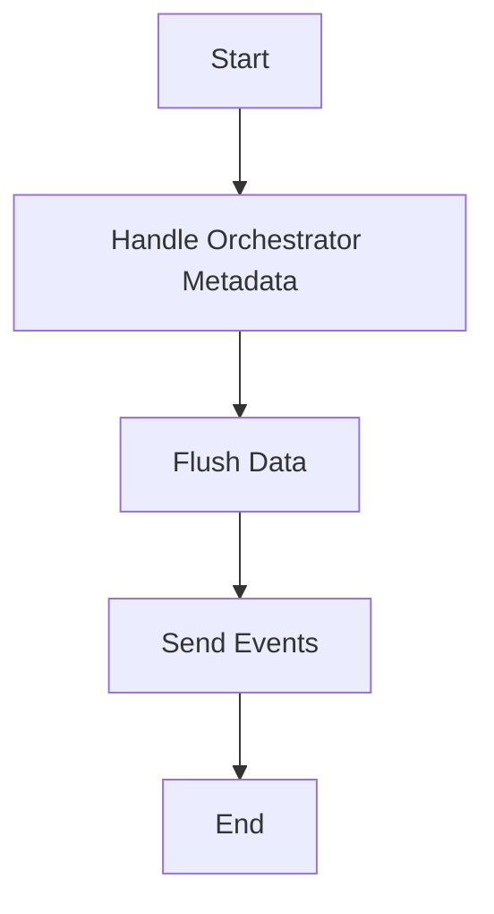

This document will cover the process of running the Datadog Agent, which includes:

1. Handling Orchestrator Metadata
2. Flushing Data
3. Sending Events.

Technical document: <SwmLink doc-title="Running the Datadog Agent">[Running the Datadog Agent](/.swm/running-the-datadog-agent.8b2dfdi1.sw.md)</SwmLink>

# [Handling Orchestrator Metadata](https://app.swimm.io/repos/Z2l0aHViJTNBJTNBZGF0YWRvZy1hZ2VudCUzQSUzQVN3aW1tLURlbW8=/docs/8b2dfdi1#handling-orchestrator-metadata)

The Datadog Agent begins by handling orchestrator metadata. This involves receiving metadata from various orchestrators and processing it to ensure it is ready for submission. The metadata is received through a specific channel and is then processed in a non-blocking manner to avoid delays in the aggregator. This step is crucial for ensuring that orchestrator data is promptly and efficiently sent to the Datadog platform for monitoring.

# [Flushing Data](https://app.swimm.io/repos/Z2l0aHViJTNBJTNBZGF0YWRvZy1hZ2VudCUzQSUzQVN3aW1tLURlbW8=/docs/8b2dfdi1#flush)

The next step involves flushing the data contained in the BufferedAggregator into the Forwarder. This process ensures that all collected data, including series, sketches, service checks, events, and orchestrator manifests, are sent to the Datadog platform. The flush operation is performed in a thread-safe manner by locking the flush mutex. This step is essential for maintaining data integrity and ensuring that all collected metrics are accurately reported.

# [Sending Events](https://app.swimm.io/repos/Z2l0aHViJTNBJTNBZGF0YWRvZy1hZ2VudCUzQSUzQVN3aW1tLURlbW8=/docs/8b2dfdi1#flushevents)

The final step in running the Datadog Agent is sending events. This involves serializing and forwarding events to the Datadog platform. The events are first retrieved and, if there are any, they are logged for debugging purposes. Depending on the configuration, the events are either sent synchronously or asynchronously. This step ensures that all events are promptly reported to the Datadog platform, providing real-time insights into the system's performance and health.

&nbsp;

*This is an auto-generated document by Swimm AI 🌊 and has not yet been verified by a human*

<SwmMeta version="3.0.0" repo-id="Z2l0aHViJTNBJTNBZGF0YWRvZy1hZ2VudCUzQSUzQVN3aW1tLURlbW8=" repo-name="datadog-agent">Powered by [Swimm](/)</SwmMeta>
