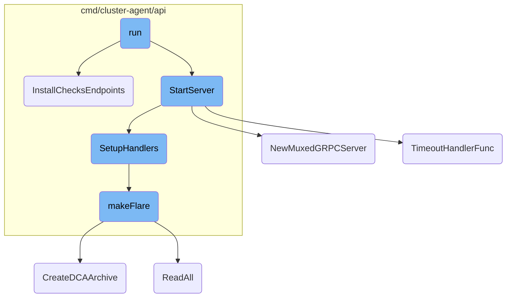
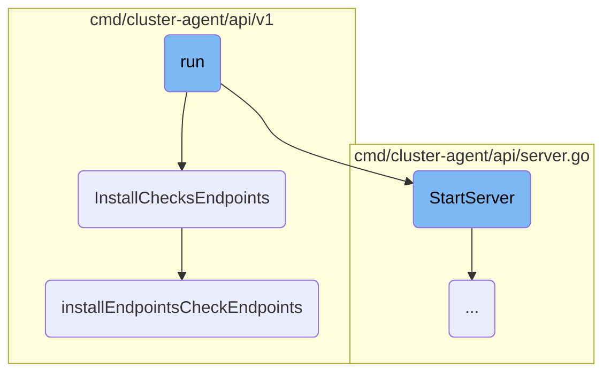
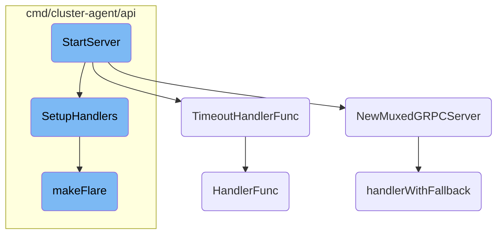

This document explains the process of running the Datadog Cluster Agent. It covers the initialization steps, setting up necessary components, and starting the server to handle incoming requests.

Running the Datadog Cluster Agent involves several steps. First, it checks for an API key and obtains the hostname. Then, it initializes various caches and components needed for operation. After that, it sets up the check collector and starts the autoconfig. Finally, it sets up the server and registers the necessary endpoints for cluster checks, ensuring the agent is ready to handle incoming requests.

Here is a high level diagram of the flow, showing only the most important functions:



# Flow drill down

First, we'll zoom into this section of the flow:



<SwmSnippet path="/cmd/cluster-agent-cloudfoundry/subcommands/run/command.go" line="133">

---

## Running the Agent

The <SwmToken path="cmd/cluster-agent-cloudfoundry/subcommands/run/command.go" pos="133:2:2" line-data="func run(">`run`</SwmToken> function is responsible for initializing and starting the Datadog Cluster Agent. It performs several critical tasks such as checking for the API key, obtaining the hostname, initializing caches, loading components, setting up the check collector, and starting the autoconfig. It also sets up the server and registers the necessary endpoints for cluster checks.

```go
func run(
	config config.Component,
	log log.Component,
	taggerComp tagger.Component,
	demultiplexer demultiplexer.Component,
	wmeta workloadmeta.Component,
	ac autodiscovery.Component,
	secretResolver secrets.Component,
	collector collector.Component,
	statusComponent status.Component,
	_ healthprobe.Component,
	settings settings.Component,
	logReceiver optional.Option[integrations.Component],
) error {
	mainCtx, mainCtxCancel := context.WithCancel(context.Background())
	defer mainCtxCancel() // Calling cancel twice is safe

	if !pkgconfig.Datadog().IsSet("api_key") {
		pkglog.Critical("no API key configured, exiting")
		return nil
	}
```

---

</SwmSnippet>

<SwmSnippet path="/cmd/cluster-agent/api/v1/install.go" line="31">

---

## Installing Check Endpoints

The <SwmToken path="cmd/cluster-agent/api/v1/install.go" pos="31:2:2" line-data="// InstallChecksEndpoints registers endpoints for cluster checks">`InstallChecksEndpoints`</SwmToken> function registers the endpoints required for cluster checks. It calls two helper functions: <SwmToken path="cmd/cluster-agent/api/v1/install.go" pos="34:1:1" line-data="	installClusterCheckEndpoints(r, sc)">`installClusterCheckEndpoints`</SwmToken> and <SwmToken path="cmd/cluster-agent/api/v1/install.go" pos="35:1:1" line-data="	installEndpointsCheckEndpoints(r, sc)">`installEndpointsCheckEndpoints`</SwmToken>, to set up the specific routes for these checks.

```go
// InstallChecksEndpoints registers endpoints for cluster checks
func InstallChecksEndpoints(r *mux.Router, sc clusteragent.ServerContext) {
	log.Debug("Registering checks endpoints")
	installClusterCheckEndpoints(r, sc)
	installEndpointsCheckEndpoints(r, sc)
}
```

---

</SwmSnippet>

<SwmSnippet path="/cmd/cluster-agent/api/v1/endpointschecks.go" line="19">

---

### Registering Endpoints Check Endpoints

The <SwmToken path="cmd/cluster-agent/api/v1/endpointschecks.go" pos="20:2:2" line-data="func installEndpointsCheckEndpoints(r *mux.Router, sc clusteragent.ServerContext) {">`installEndpointsCheckEndpoints`</SwmToken> function registers the API endpoints for endpoints checks. It sets up two routes: one for getting the endpoint configurations for a specific node and another for getting all endpoint configurations. These routes are wrapped with telemetry for monitoring purposes.

```go
// Install registers v1 API endpoints for endpoints checks
func installEndpointsCheckEndpoints(r *mux.Router, sc clusteragent.ServerContext) {
	r.HandleFunc("/endpointschecks/configs/{nodeName}", api.WithTelemetryWrapper("getEndpointsConfigs", getEndpointsCheckConfigs(sc))).Methods("GET")
	r.HandleFunc("/endpointschecks/configs", api.WithTelemetryWrapper("getAllEndpointsCheckConfigs", getAllEndpointsCheckConfigs(sc))).Methods("GET")
}
```

---

</SwmSnippet>

Now, lets zoom into this section of the flow:



<SwmSnippet path="/cmd/cluster-agent/api/server.go" line="55">

---

## <SwmToken path="cmd/cluster-agent/api/server.go" pos="55:2:2" line-data="// StartServer creates the router and starts the HTTP server">`StartServer`</SwmToken>

The <SwmToken path="cmd/cluster-agent/api/server.go" pos="55:2:2" line-data="// StartServer creates the router and starts the HTTP server">`StartServer`</SwmToken> function is responsible for creating the router and starting the HTTP server. It sets up various API endpoints, initializes authentication tokens, and configures TLS settings. The function also creates a <SwmToken path="pkg/util/grpc/server.go" pos="24:6:6" line-data="// between a gRPC server and an HTTP handler.">`gRPC`</SwmToken> server and multiplexes it with the HTTP server using <SwmToken path="pkg/util/grpc/server.go" pos="23:2:2" line-data="// NewMuxedGRPCServer returns an http.Server that multiplexes connections">`NewMuxedGRPCServer`</SwmToken>. Finally, it starts the server to listen for incoming requests.

```go
// StartServer creates the router and starts the HTTP server
func StartServer(ctx context.Context, w workloadmeta.Component, taggerComp tagger.Component, ac autodiscovery.Component, statusComponent status.Component, settings settings.Component, cfg config.Component) error {
	// create the root HTTP router
	router = mux.NewRouter()
	apiRouter = router.PathPrefix("/api/v1").Subrouter()

	// IPC REST API server
	agent.SetupHandlers(router, w, ac, statusComponent, settings)

	// API V1 Metadata APIs
	v1.InstallMetadataEndpoints(apiRouter, w)

	// API V1 Language Detection APIs
	languagedetection.InstallLanguageDetectionEndpoints(ctx, apiRouter, w, cfg)

	// Validate token for every request
	router.Use(validateToken)

	// get the transport we're going to use under HTTP
	var err error
	listener, err = getListener()
```

---

</SwmSnippet>

<SwmSnippet path="/pkg/util/grpc/server.go" line="23">

---

### <SwmToken path="pkg/util/grpc/server.go" pos="23:2:2" line-data="// NewMuxedGRPCServer returns an http.Server that multiplexes connections">`NewMuxedGRPCServer`</SwmToken>

The <SwmToken path="pkg/util/grpc/server.go" pos="23:2:2" line-data="// NewMuxedGRPCServer returns an http.Server that multiplexes connections">`NewMuxedGRPCServer`</SwmToken> function returns an <SwmToken path="pkg/util/grpc/server.go" pos="23:8:10" line-data="// NewMuxedGRPCServer returns an http.Server that multiplexes connections">`http.Server`</SwmToken> that multiplexes connections between a <SwmToken path="pkg/util/grpc/server.go" pos="24:6:6" line-data="// between a gRPC server and an HTTP handler.">`gRPC`</SwmToken> server and an HTTP handler. It ensures that <SwmToken path="pkg/util/grpc/server.go" pos="27:3:5" line-data="	// HTTP/2">`HTTP/2`</SwmToken> traffic is handled correctly and sets up the necessary handlers for <SwmToken path="pkg/util/grpc/server.go" pos="24:6:6" line-data="// between a gRPC server and an HTTP handler.">`gRPC`</SwmToken> and HTTP requests.

```go
// NewMuxedGRPCServer returns an http.Server that multiplexes connections
// between a gRPC server and an HTTP handler.
func NewMuxedGRPCServer(addr string, tlsConfig *tls.Config, grpcServer *grpc.Server, httpHandler http.Handler) *http.Server {
	// our gRPC clients do not handle protocol negotiation, so we need to force
	// HTTP/2
	var handler http.Handler
	// when HTTP/2 traffic that is not TLS being sent we need to create a new handler which
	// is able to handle the pre fix magic sent
	handler = h2c.NewHandler(handlerWithFallback(grpcServer, httpHandler), &http2.Server{})
	if tlsConfig != nil {
		tlsConfig.NextProtos = []string{"h2"}
		handler = handlerWithFallback(grpcServer, httpHandler)
	}

	return &http.Server{
		Addr:      addr,
		Handler:   handler,
		TLSConfig: tlsConfig,
		ConnContext: func(ctx context.Context, c net.Conn) context.Context {
			// Store the connection in the context so requests can reference it if needed
			return context.WithValue(ctx, grpccontext.ConnContextKey, c)
```

---

</SwmSnippet>

<SwmSnippet path="/pkg/util/grpc/server.go" line="48">

---

### <SwmToken path="pkg/util/grpc/server.go" pos="48:2:2" line-data="// TimeoutHandlerFunc returns an HTTP handler that times out after a duration.">`TimeoutHandlerFunc`</SwmToken>

The <SwmToken path="pkg/util/grpc/server.go" pos="48:2:2" line-data="// TimeoutHandlerFunc returns an HTTP handler that times out after a duration.">`TimeoutHandlerFunc`</SwmToken> function returns an HTTP handler that times out after a specified duration. This is useful for muxed <SwmToken path="pkg/util/grpc/server.go" pos="49:12:12" line-data="// This is useful for muxed gRPC servers where http.Server cannot have a">`gRPC`</SwmToken> servers where the <SwmToken path="pkg/util/grpc/server.go" pos="49:18:20" line-data="// This is useful for muxed gRPC servers where http.Server cannot have a">`http.Server`</SwmToken> cannot have a timeout when handling streaming or long-running connections.

```go
// TimeoutHandlerFunc returns an HTTP handler that times out after a duration.
// This is useful for muxed gRPC servers where http.Server cannot have a
// timeout when handling streaming, long running connections.
func TimeoutHandlerFunc(httpHandler http.Handler, timeout time.Duration) http.Handler {
	return http.HandlerFunc(func(w http.ResponseWriter, r *http.Request) {
		deadline := time.Now().Add(timeout)

		conn := r.Context().Value(grpccontext.ConnContextKey).(net.Conn)
		_ = conn.SetWriteDeadline(deadline)

		httpHandler.ServeHTTP(w, r)
	})
}
```

---

</SwmSnippet>

<SwmSnippet path="/cmd/cluster-agent/api/agent/agent.go" line="34">

---

### <SwmToken path="cmd/cluster-agent/api/agent/agent.go" pos="34:2:2" line-data="// SetupHandlers adds the specific handlers for cluster agent endpoints">`SetupHandlers`</SwmToken>

The <SwmToken path="cmd/cluster-agent/api/agent/agent.go" pos="34:2:2" line-data="// SetupHandlers adds the specific handlers for cluster agent endpoints">`SetupHandlers`</SwmToken> function adds specific handlers for cluster agent endpoints. It defines various routes and their corresponding handlers, such as <SwmPath>[cmd/agent/subcommands/version/](cmd/agent/subcommands/version/)</SwmPath>, <SwmPath>[cmd/agent/subcommands/hostname/](cmd/agent/subcommands/hostname/)</SwmPath>, <SwmPath>[cmd/agent/subcommands/flare/](cmd/agent/subcommands/flare/)</SwmPath>, and others. This function is crucial for setting up the REST API server.

```go
// SetupHandlers adds the specific handlers for cluster agent endpoints
func SetupHandlers(r *mux.Router, wmeta workloadmeta.Component, ac autodiscovery.Component, statusComponent status.Component, settings settings.Component) {
	r.HandleFunc("/version", getVersion).Methods("GET")
	r.HandleFunc("/hostname", getHostname).Methods("GET")
	r.HandleFunc("/flare", func(w http.ResponseWriter, r *http.Request) {
		makeFlare(w, r, statusComponent)
	}).Methods("POST")
	r.HandleFunc("/stop", stopAgent).Methods("POST")
	r.HandleFunc("/status", func(w http.ResponseWriter, r *http.Request) { getStatus(w, r, statusComponent) }).Methods("GET")
	r.HandleFunc("/status/health", getHealth).Methods("GET")
	r.HandleFunc("/config-check", func(w http.ResponseWriter, r *http.Request) {
		getConfigCheck(w, r, ac)
	}).Methods("GET")
	r.HandleFunc("/config", settings.GetFullConfig("")).Methods("GET")
	r.HandleFunc("/config/list-runtime", settings.ListConfigurable).Methods("GET")
	r.HandleFunc("/config/{setting}", settings.GetValue).Methods("GET")
	r.HandleFunc("/config/{setting}", settings.SetValue).Methods("POST")
	r.HandleFunc("/tagger-list", getTaggerList).Methods("GET")
	r.HandleFunc("/workload-list", func(w http.ResponseWriter, r *http.Request) {
		getWorkloadList(w, r, wmeta)
	}).Methods("GET")
```

---

</SwmSnippet>

<SwmSnippet path="/cmd/cluster-agent/api/agent/agent.go" line="128">

---

### <SwmToken path="cmd/cluster-agent/api/agent/agent.go" pos="128:2:2" line-data="func makeFlare(w http.ResponseWriter, r *http.Request, statusComponent status.Component) {">`makeFlare`</SwmToken>

The <SwmToken path="cmd/cluster-agent/api/agent/agent.go" pos="128:2:2" line-data="func makeFlare(w http.ResponseWriter, r *http.Request, statusComponent status.Component) {">`makeFlare`</SwmToken> function handles the creation of a flare, which is a diagnostic archive. It reads the request body, processes the data, and generates the flare archive. If successful, it returns the file path of the created flare.

```go
func makeFlare(w http.ResponseWriter, r *http.Request, statusComponent status.Component) {
	log.Infof("Making a flare")
	w.Header().Set("Content-Type", "application/json")

	var profile flare.ProfileData

	if r.Body != http.NoBody {
		body, err := io.ReadAll(r.Body)
		if err != nil {
			http.Error(w, log.Errorf("Error while reading HTTP request body: %s", err).Error(), 500)
			return
		}

		if err := json.Unmarshal(body, &profile); err != nil {
			http.Error(w, log.Errorf("Error while unmarshaling JSON from request body: %s", err).Error(), 500)
			return
		}
	}

	logFile := config.Datadog().GetString("log_file")
	if logFile == "" {
```

---

</SwmSnippet>

<SwmSnippet path="/comp/otelcol/otlp/testutil/testutil.go" line="204">

---

### <SwmToken path="comp/otelcol/otlp/testutil/testutil.go" pos="204:2:2" line-data="// HandlerFunc implements an HTTP handler">`HandlerFunc`</SwmToken>

The <SwmToken path="comp/otelcol/otlp/testutil/testutil.go" pos="204:2:2" line-data="// HandlerFunc implements an HTTP handler">`HandlerFunc`</SwmToken> method implements an HTTP handler that records HTTP requests. It captures the request headers and body, which can be useful for testing and debugging purposes.

```go
// HandlerFunc implements an HTTP handler
func (rec *HTTPRequestRecorder) HandlerFunc() (string, http.HandlerFunc) {
	return rec.Pattern, func(_ http.ResponseWriter, r *http.Request) {
		rec.Header = r.Header
		rec.ByteBody, _ = io.ReadAll(r.Body)
	}
}
```

---

</SwmSnippet>

<SwmSnippet path="/pkg/util/grpc/server.go" line="62">

---

### <SwmToken path="pkg/util/grpc/server.go" pos="62:2:2" line-data="// handlerWithFallback returns an http.Handler that delegates to grpcServer on">`handlerWithFallback`</SwmToken>

The <SwmToken path="pkg/util/grpc/server.go" pos="62:2:2" line-data="// handlerWithFallback returns an http.Handler that delegates to grpcServer on">`handlerWithFallback`</SwmToken> function returns an <SwmToken path="pkg/util/grpc/server.go" pos="62:8:10" line-data="// handlerWithFallback returns an http.Handler that delegates to grpcServer on">`http.Handler`</SwmToken> that delegates to the <SwmToken path="pkg/util/grpc/server.go" pos="63:4:4" line-data="// incoming gRPC connections or httpServer otherwise. Copied from">`gRPC`</SwmToken> server for incoming <SwmToken path="pkg/util/grpc/server.go" pos="63:4:4" line-data="// incoming gRPC connections or httpServer otherwise. Copied from">`gRPC`</SwmToken> connections or to the HTTP server otherwise. This ensures that the server can handle both <SwmToken path="pkg/util/grpc/server.go" pos="63:4:4" line-data="// incoming gRPC connections or httpServer otherwise. Copied from">`gRPC`</SwmToken> and HTTP requests appropriately.

```go
// handlerWithFallback returns an http.Handler that delegates to grpcServer on
// incoming gRPC connections or httpServer otherwise. Copied from
// cockroachdb.
func handlerWithFallback(grpcServer *grpc.Server, httpServer http.Handler) http.Handler {
	return http.HandlerFunc(func(w http.ResponseWriter, r *http.Request) {
		// This is a partial recreation of gRPC's internal checks
		// https://github.com/grpc/grpc-go/pull/514/files#diff-95e9a25b738459a2d3030e1e6fa2a718R61
		if r.ProtoMajor == 2 && strings.Contains(r.Header.Get("Content-Type"), "application/grpc") {
			grpcServer.ServeHTTP(w, r)
		} else {
			httpServer.ServeHTTP(w, r)
		}
	})
}
```

---

</SwmSnippet>

&nbsp;

*This is an auto-generated document by Swimm AI 🌊 and has not yet been verified by a human*

<SwmMeta version="3.0.0" repo-id="Z2l0aHViJTNBJTNBZGF0YWRvZy1hZ2VudCUzQSUzQVN3aW1tLURlbW8=" repo-name="datadog-agent"><sup>Powered by [Swimm](/)</sup></SwmMeta>
