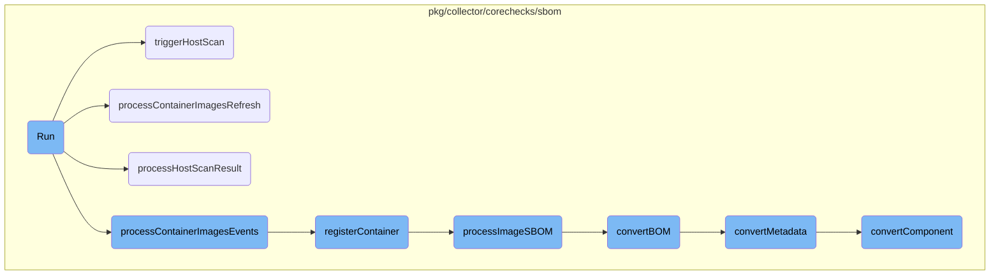
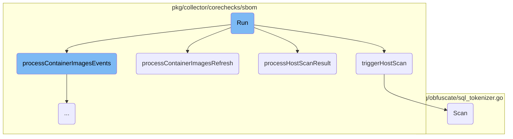

This document explains the <SwmToken path="pkg/collector/corechecks/sbom/check.go" pos="166:2:2" line-data="// Run starts the sbom check">`Run`</SwmToken> function, which initiates the SBOM check by setting up various channels and tickers for processing container image events, triggering host scans, and sending usage metrics. It subscribes to container image metadata events and triggers an initial host scan. The function then enters a loop where it processes events from these channels and tickers, ensuring continuous monitoring and scanning.

The <SwmToken path="pkg/collector/corechecks/sbom/check.go" pos="166:2:2" line-data="// Run starts the sbom check">`Run`</SwmToken> function starts by setting up channels to listen for container image events and host scan results. It triggers an initial scan of the host and subscribes to container image metadata events. The function then enters a loop where it continuously processes events from these channels, ensuring that the system is always monitoring and scanning for new data. This helps in maintaining up-to-date information about the container images and the host system.

Here is a high level diagram of the flow, showing only the most important functions:



# Flow drill down

First, we'll zoom into this section of the flow:



<SwmSnippet path="/pkg/collector/corechecks/sbom/check.go" line="166">

---

## Run

The <SwmToken path="pkg/collector/corechecks/sbom/check.go" pos="166:2:2" line-data="// Run starts the sbom check">`Run`</SwmToken> function initiates the SBOM check by setting up various channels and tickers for processing container image events, triggering host scans, and sending usage metrics. It subscribes to container image metadata events and triggers an initial host scan. The function then enters a loop where it processes events from these channels and tickers, ensuring continuous monitoring and scanning.

```go
// Run starts the sbom check
func (c *Check) Run() error {
	log.Infof("Starting long-running check %q", c.ID())
	defer log.Infof("Shutting down long-running check %q", c.ID())

	filter := workloadmeta.NewFilterBuilder().
		AddKind(workloadmeta.KindContainer).
		AddKind(workloadmeta.KindContainerImageMetadata).
		Build()

	imgEventsCh := c.workloadmetaStore.Subscribe(
		CheckName,
		workloadmeta.NormalPriority,
		filter,
	)

	// Trigger an initial scan on host. This channel is buffered to avoid blocking the scanner
	// if the processor is not ready to receive the result yet. This channel should not be closed,
	// it is sent as part of every scan request. When the main context terminates, both references will
	// be dropped and the scanner will be garbage collected.
	hostSbomChan := make(chan sbom.ScanResult) // default value to listen to nothing
```

---

</SwmSnippet>

<SwmSnippet path="/pkg/collector/corechecks/sbom/processor.go" line="246">

---

## <SwmToken path="pkg/collector/corechecks/sbom/processor.go" pos="246:9:9" line-data="func (p *processor) triggerHostScan() {">`triggerHostScan`</SwmToken>

The <SwmToken path="pkg/collector/corechecks/sbom/processor.go" pos="246:9:9" line-data="func (p *processor) triggerHostScan() {">`triggerHostScan`</SwmToken> function initiates a scan of the host's file system to generate an SBOM. It determines the scan path based on the environment and containerization status, creates a scan request, and calls the SBOM scanner to perform the scan.

```go
func (p *processor) triggerHostScan() {
	if !p.hostSBOM {
		return
	}
	log.Debugf("Triggering host SBOM refresh")

	scanPath := "/"
	if hostRoot := os.Getenv("HOST_ROOT"); ddConfig.IsContainerized() && hostRoot != "" {
		scanPath = hostRoot
	}
	scanRequest := host.NewScanRequest(scanPath, newFS("/"))

	if err := p.sbomScanner.Scan(scanRequest); err != nil {
		log.Errorf("Failed to trigger SBOM generation for host: %s", err)
		return
	}
}
```

---

</SwmSnippet>

<SwmSnippet path="/pkg/collector/corechecks/sbom/processor.go" line="172">

---

## <SwmToken path="pkg/collector/corechecks/sbom/processor.go" pos="172:9:9" line-data="func (p *processor) processContainerImagesRefresh(allImages []*workloadmeta.ContainerImageMetadata) {">`processContainerImagesRefresh`</SwmToken>

The <SwmToken path="pkg/collector/corechecks/sbom/processor.go" pos="172:9:9" line-data="func (p *processor) processContainerImagesRefresh(allImages []*workloadmeta.ContainerImageMetadata) {">`processContainerImagesRefresh`</SwmToken> function handles the periodic refresh of container images. It iterates over all container images and processes each one to generate an SBOM.

```go
func (p *processor) processContainerImagesRefresh(allImages []*workloadmeta.ContainerImageMetadata) {
	// So far, the check is refreshing all the images every 5 minutes all together.
	for _, img := range allImages {
		p.processImageSBOM(img)
	}
}
```

---

</SwmSnippet>

<SwmSnippet path="/pkg/collector/corechecks/sbom/processor.go" line="179">

---

## <SwmToken path="pkg/collector/corechecks/sbom/processor.go" pos="179:9:9" line-data="func (p *processor) processHostScanResult(result sbom.ScanResult) {">`processHostScanResult`</SwmToken>

The <SwmToken path="pkg/collector/corechecks/sbom/processor.go" pos="179:9:9" line-data="func (p *processor) processHostScanResult(result sbom.ScanResult) {">`processHostScanResult`</SwmToken> function processes the results of a host scan. It logs the result, creates an SBOM entity, and updates its status based on the scan outcome. If the scan is successful, it converts the report to <SwmToken path="pkg/collector/corechecks/sbom/convert.go" pos="127:7:7" line-data="func convertBOM(in *cyclonedx.BOM) *cyclonedx_v1_4.Bom {">`cyclonedx`</SwmToken> format and updates the cache. The SBOM entity is then queued for further processing.

```go
func (p *processor) processHostScanResult(result sbom.ScanResult) {
	log.Debugf("processing host scanresult: %v", result)
	sbom := &model.SBOMEntity{
		Status:             model.SBOMStatus_SUCCESS,
		Type:               model.SBOMSourceType_HOST_FILE_SYSTEM,
		Id:                 p.hostname,
		InUse:              true,
		GeneratedAt:        timestamppb.New(result.CreatedAt),
		GenerationDuration: convertDuration(result.Duration),
	}

	if result.Error != nil {
		log.Errorf("Scan error: %v", result.Error)
		sbom.Sbom = &model.SBOMEntity_Error{
			Error: result.Error.Error(),
		}
		sbom.Status = model.SBOMStatus_FAILED
	} else {
		log.Infof("Successfully generated SBOM for host: %v, %v", result.CreatedAt, result.Duration)

		if p.hostCache != "" && p.hostCache == result.Report.ID() && result.CreatedAt.Sub(p.hostLastFullSBOM) < p.hostHeartbeatValidity {
```

---

</SwmSnippet>

<SwmSnippet path="/pkg/obfuscate/sql_tokenizer.go" line="266">

---

## Scan

The <SwmToken path="pkg/obfuscate/sql_tokenizer.go" pos="266:2:2" line-data="// Scan scans the tokenizer for the next token and returns">`Scan`</SwmToken> function in the SQL tokenizer scans the input for the next token and returns its type and value. It handles various SQL syntax elements, including identifiers, numbers, operators, and comments, ensuring proper tokenization of SQL queries.

```go
// Scan scans the tokenizer for the next token and returns
// the token type and the token buffer.
func (tkn *SQLTokenizer) Scan() (TokenKind, []byte) {
	if tkn.lastChar == 0 {
		tkn.advance()
	}
	tkn.SkipBlank()

	switch ch := tkn.lastChar; {
	case isLeadingLetter(ch) &&
		!(tkn.cfg.DBMS == DBMSPostgres && ch == '@'):
		// The '@' symbol should not be considered part of an identifier in
		// postgres, so we skip this in the case where the DBMS is postgres
		// and ch is '@'.
		return tkn.scanIdentifier()
	case isDigit(ch):
		return tkn.scanNumber(false)
	default:
		tkn.advance()
		if tkn.lastChar == EndChar && tkn.err != nil {
			// advance discovered an invalid encoding. We should return early.
```

---

</SwmSnippet>

Now, lets zoom into this section of the flow:

```mermaid
graph TD;
      subgraph pkgcollectorcorecheckssbom["pkg/collector/corechecks/sbom"]
5b138a8e8a51baf999db2957e7680a09eefaa81af6ff9e3481de557a084f18d5(processContainerImagesEvents):::mainFlowStyle --> 9f2071749c9ed8872e073e4759c5cd592a0b53c2ed4010d9383459b9d2205bb8(registerContainer):::mainFlowStyle
end

subgraph pkgcollectorcorecheckssbom["pkg/collector/corechecks/sbom"]
9f2071749c9ed8872e073e4759c5cd592a0b53c2ed4010d9383459b9d2205bb8(registerContainer):::mainFlowStyle --> bdefc5d73c3cd337d1382db490cbf28615e01cea94e9a4aa70d98756d8aa67a3(processImageSBOM):::mainFlowStyle
end

subgraph pkgcollectorcorecheckssbom["pkg/collector/corechecks/sbom"]
bdefc5d73c3cd337d1382db490cbf28615e01cea94e9a4aa70d98756d8aa67a3(processImageSBOM):::mainFlowStyle --> 6c6ca6b99815e2b67e2369056728aa034bc67b9ecdf466a11374512a9f56b03d(convertBOM):::mainFlowStyle
end

subgraph pkgcollectorcorecheckssbom["pkg/collector/corechecks/sbom"]
6c6ca6b99815e2b67e2369056728aa034bc67b9ecdf466a11374512a9f56b03d(convertBOM):::mainFlowStyle --> c42cb2ad03316ec6e2c41a57062b0860c6ea156ba6e3c6a09c9163068c79bce3(convertMetadata):::mainFlowStyle
end

subgraph pkgcollectorcorecheckssbom["pkg/collector/corechecks/sbom"]
c42cb2ad03316ec6e2c41a57062b0860c6ea156ba6e3c6a09c9163068c79bce3(convertMetadata):::mainFlowStyle --> 241d9ef7ea4ffdee0707aeeda162e6e8ed636e7bf981402fb9aaa71f3a685043(convertComponent):::mainFlowStyle
end


      classDef mainFlowStyle color:#000000,fill:#7CB9F4
classDef rootsStyle color:#000000,fill:#00FFF4
classDef Style1 color:#000000,fill:#00FFAA
classDef Style2 color:#000000,fill:#FFFF00
classDef Style3 color:#000000,fill:#AA7CB9
```



<SwmSnippet path="/pkg/collector/corechecks/sbom/processor.go" line="93">

---

## Handling Container Image Events

The <SwmToken path="pkg/collector/corechecks/sbom/processor.go" pos="93:9:9" line-data="func (p *processor) processContainerImagesEvents(evBundle workloadmeta.EventBundle) {">`processContainerImagesEvents`</SwmToken> function is responsible for handling events related to container images. It acknowledges the event bundle and iterates through each event to determine its type and entity kind. Depending on the event type, it either registers or unregisters container images and processes their SBOM (Software Bill of Materials) data.

```go
func (p *processor) processContainerImagesEvents(evBundle workloadmeta.EventBundle) {
	evBundle.Acknowledge()

	log.Tracef("Processing %d events", len(evBundle.Events))

	for _, event := range evBundle.Events {
		switch event.Entity.GetID().Kind {
		case workloadmeta.KindContainerImageMetadata:
			switch event.Type {
			case workloadmeta.EventTypeSet:
				p.registerImage(event.Entity.(*workloadmeta.ContainerImageMetadata))
				p.processImageSBOM(event.Entity.(*workloadmeta.ContainerImageMetadata))
			case workloadmeta.EventTypeUnset:
				p.unregisterImage(event.Entity.(*workloadmeta.ContainerImageMetadata))
				// Let the SBOM expire on back-end side
			}
		case workloadmeta.KindContainer:
			switch event.Type {
			case workloadmeta.EventTypeSet:
				p.registerContainer(event.Entity.(*workloadmeta.Container))
			case workloadmeta.EventTypeUnset:
```

---

</SwmSnippet>

<SwmSnippet path="/pkg/collector/corechecks/sbom/processor.go" line="135">

---

## Registering Containers

The <SwmToken path="pkg/collector/corechecks/sbom/processor.go" pos="135:9:9" line-data="func (p *processor) registerContainer(ctr *workloadmeta.Container) {">`registerContainer`</SwmToken> function registers a container by adding it to the <SwmToken path="pkg/collector/corechecks/sbom/processor.go" pos="143:12:12" line-data="	if _, found := p.imageUsers[imgID]; found {">`imageUsers`</SwmToken> map. If the container is running, it checks if the image is already in use and processes its SBOM data if found.

```go
func (p *processor) registerContainer(ctr *workloadmeta.Container) {
	imgID := ctr.Image.ID
	ctrID := ctr.ID

	if !ctr.State.Running {
		return
	}

	if _, found := p.imageUsers[imgID]; found {
		p.imageUsers[imgID][ctrID] = struct{}{}
	} else {
		p.imageUsers[imgID] = map[string]struct{}{
			ctrID: {},
		}

		if realImgID, found := p.imageRepoDigests[imgID]; found {
			imgID = realImgID
		}

		if img, err := p.workloadmetaStore.GetImage(imgID); err != nil {
			log.Infof("Couldn’t find image %s in workloadmeta whereas it’s used by container %s: %v", imgID, ctrID, err)
```

---

</SwmSnippet>

<SwmSnippet path="/pkg/collector/corechecks/sbom/processor.go" line="264">

---

## Processing Image SBOM

The <SwmToken path="pkg/collector/corechecks/sbom/processor.go" pos="264:9:9" line-data="func (p *processor) processImageSBOM(img *workloadmeta.ContainerImageMetadata) {">`processImageSBOM`</SwmToken> function processes the SBOM data of a container image. It verifies the SBOM status and retrieves tags for the image. It then constructs a <SwmToken path="pkg/collector/corechecks/sbom/processor.go" pos="181:8:8" line-data="	sbom := &amp;model.SBOMEntity{">`SBOMEntity`</SwmToken> with relevant information such as tags, repo digests, and status, and queues it for further processing.

```go
func (p *processor) processImageSBOM(img *workloadmeta.ContainerImageMetadata) {
	if img.SBOM == nil {
		return
	}

	if img.SBOM.Status == workloadmeta.Success && img.SBOM.CycloneDXBOM == nil {
		log.Debug("received a sbom with incorrect status")
		return
	}

	ddTags, err := tagger.Tag("container_image_metadata://"+img.ID, types.HighCardinality)
	if err != nil {
		log.Errorf("Could not retrieve tags for container image %s: %v", img.ID, err)
	}

	// In containerd some images are created without a repo digest, and it's
	// also possible to remove repo digests manually.
	// This means that the set of repos that we need to handle is the union of
	// the repos present in the repo digests and the ones present in the repo
	// tags.
	repos := make(map[string]struct{})
```

---

</SwmSnippet>

<SwmSnippet path="/pkg/collector/corechecks/sbom/convert.go" line="127">

---

## Converting BOM

The <SwmToken path="pkg/collector/corechecks/sbom/convert.go" pos="127:2:2" line-data="func convertBOM(in *cyclonedx.BOM) *cyclonedx_v1_4.Bom {">`convertBOM`</SwmToken> function converts a <SwmToken path="pkg/collector/corechecks/sbom/convert.go" pos="127:7:7" line-data="func convertBOM(in *cyclonedx.BOM) *cyclonedx_v1_4.Bom {">`cyclonedx`</SwmToken> BOM (Bill of Materials) to a different format. It maps various fields such as spec version, metadata, components, and external references to the new format.

```go
func convertBOM(in *cyclonedx.BOM) *cyclonedx_v1_4.Bom {
	if in == nil {
		return nil
	}

	return &cyclonedx_v1_4.Bom{
		SpecVersion:        in.SpecVersion.String(),
		Version:            pointer.Ptr(int32(in.Version)),
		SerialNumber:       stringPtr(in.SerialNumber),
		Metadata:           convertMetadata(in.Metadata),
		Components:         convertArray(in.Components, convertComponent),
		Services:           convertArray(in.Services, convertService),
		ExternalReferences: convertArray(in.ExternalReferences, convertExternalReference),
		Dependencies:       convertArray(in.Dependencies, convertDependency),
		Compositions:       convertArray(in.Compositions, convertComposition),
		Vulnerabilities:    convertArray(in.Vulnerabilities, convertVulnerability),
	}
}
```

---

</SwmSnippet>

<SwmSnippet path="/pkg/collector/corechecks/sbom/convert.go" line="598">

---

## Converting Metadata

The <SwmToken path="pkg/collector/corechecks/sbom/convert.go" pos="598:2:2" line-data="func convertMetadata(in *cyclonedx.Metadata) *cyclonedx_v1_4.Metadata {">`convertMetadata`</SwmToken> function converts metadata from the <SwmToken path="pkg/collector/corechecks/sbom/convert.go" pos="598:7:7" line-data="func convertMetadata(in *cyclonedx.Metadata) *cyclonedx_v1_4.Metadata {">`cyclonedx`</SwmToken> format to another format. It handles fields such as timestamp, tools, authors, component, and licenses.

```go
func convertMetadata(in *cyclonedx.Metadata) *cyclonedx_v1_4.Metadata {
	if in == nil {
		return nil
	}

	var licenses *cyclonedx_v1_4.LicenseChoice
	if in.Licenses != nil && len(*in.Licenses) > 0 {
		licenses = convertLicenseChoice(&(*in.Licenses)[0])
	}

	return &cyclonedx_v1_4.Metadata{
		Timestamp:   convertTimestamp(in.Timestamp),
		Tools:       convertArray(in.Tools.Tools, convertTool),
		Authors:     convertArray(in.Authors, convertOrganizationalContact),
		Component:   convertComponent(in.Component),
		Manufacture: convertOrganizationalEntity(in.Manufacture),
		Supplier:    convertOrganizationalEntity(in.Supplier),
		Licenses:    licenses,
		Properties:  convertArray(in.Properties, convertProperty),
	}
}
```

---

</SwmSnippet>

<SwmSnippet path="/pkg/collector/corechecks/sbom/convert.go" line="160">

---

## Converting Component

The <SwmToken path="pkg/collector/corechecks/sbom/convert.go" pos="160:2:2" line-data="func convertComponent(in *cyclonedx.Component) *cyclonedx_v1_4.Component {">`convertComponent`</SwmToken> function converts a component from the <SwmToken path="pkg/collector/corechecks/sbom/convert.go" pos="160:7:7" line-data="func convertComponent(in *cyclonedx.Component) *cyclonedx_v1_4.Component {">`cyclonedx`</SwmToken> format to another format. It includes fields such as type, MIME type, supplier, author, name, version, and various other properties.

```go
func convertComponent(in *cyclonedx.Component) *cyclonedx_v1_4.Component {
	if in == nil {
		return nil
	}

	var evidence []*cyclonedx_v1_4.Evidence
	if in.Evidence != nil {
		evidence = []*cyclonedx_v1_4.Evidence{convertEvidence(in.Evidence)}
	}

	return &cyclonedx_v1_4.Component{
		Type:               convertComponentType(in.Type),
		MimeType:           stringPtr(in.MIMEType),
		BomRef:             stringPtr(in.BOMRef),
		Supplier:           convertOrganizationalEntity(in.Supplier),
		Author:             stringPtr(in.Author),
		Publisher:          stringPtr(in.Publisher),
		Group:              stringPtr(in.Group),
		Name:               in.Name,
		Version:            in.Version,
		Description:        stringPtr(in.Description),
```

---

</SwmSnippet>

&nbsp;

*This is an auto-generated document by Swimm AI 🌊 and has not yet been verified by a human*

<SwmMeta version="3.0.0" repo-id="Z2l0aHViJTNBJTNBZGF0YWRvZy1hZ2VudCUzQSUzQVN3aW1tLURlbW8=" repo-name="datadog-agent"><sup>Powered by [Swimm](/)</sup></SwmMeta>
