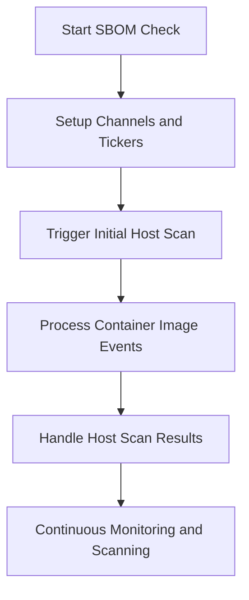

This document will cover the SBOM Check Run Function, which includes:

1. Setting up channels and tickers
2. Triggering initial host scan
3. Processing container image events
4. Handling host scan results
5. Continuous monitoring and scanning.

Technical document: <SwmLink doc-title="SBOM Check Run Function">[SBOM Check Run Function](/.swm/sbom-check-run-function.8y2014xz.sw.md)</SwmLink>

# [Setting up channels and tickers](https://app.swimm.io/repos/Z2l0aHViJTNBJTNBZGF0YWRvZy1hZ2VudCUzQSUzQVN3aW1tLURlbW8=/docs/8y2014xz#run)

The SBOM Check Run function begins by setting up various channels and tickers. These channels are used to listen for container image events and host scan results. This setup ensures that the system is prepared to handle incoming data and events related to container images and host scans.

# [Triggering initial host scan](https://app.swimm.io/repos/Z2l0aHViJTNBJTNBZGF0YWRvZy1hZ2VudCUzQSUzQVN3aW1tLURlbW8=/docs/8y2014xz#run)

An initial scan of the host is triggered to generate an SBOM (Software Bill of Materials). This scan helps in creating a baseline of the host's file system, which is essential for continuous monitoring. The scan path is determined based on the environment and containerization status.

# [Processing container image events](https://app.swimm.io/repos/Z2l0aHViJTNBJTNBZGF0YWRvZy1hZ2VudCUzQSUzQVN3aW1tLURlbW8=/docs/8y2014xz#handling-container-image-events)

The function processes events related to container images. It acknowledges the event bundle and iterates through each event to determine its type and entity kind. Depending on the event type, it either registers or unregisters container images and processes their SBOM data. This step ensures that all container images are monitored and their SBOM data is up-to-date.

# [Handling host scan results](https://app.swimm.io/repos/Z2l0aHViJTNBJTNBZGF0YWRvZy1hZ2VudCUzQSUzQVN3aW1tLURlbW8=/docs/8y2014xz#processhostscanresult)

The results of the host scan are processed to update the SBOM entity. If the scan is successful, the report is converted to CycloneDX format and the cache is updated. If there is an error, the SBOM entity's status is updated accordingly. This step ensures that the host's SBOM data is accurate and reflects the latest scan results.

# [Continuous monitoring and scanning](https://app.swimm.io/repos/Z2l0aHViJTNBJTNBZGF0YWRvZy1hZ2VudCUzQSUzQVN3aW1tLURlbW8=/docs/8y2014xz#run)

The function enters a loop where it continuously processes events from the channels and tickers. This ensures that the system is always monitoring and scanning for new data. Continuous monitoring helps in maintaining up-to-date information about the container images and the host system, providing real-time insights and alerts.

&nbsp;

*This is an auto-generated document by Swimm AI 🌊 and has not yet been verified by a human*

<SwmMeta version="3.0.0" repo-id="Z2l0aHViJTNBJTNBZGF0YWRvZy1hZ2VudCUzQSUzQVN3aW1tLURlbW8=" repo-name="datadog-agent">Powered by [Swimm](/)</SwmMeta>
