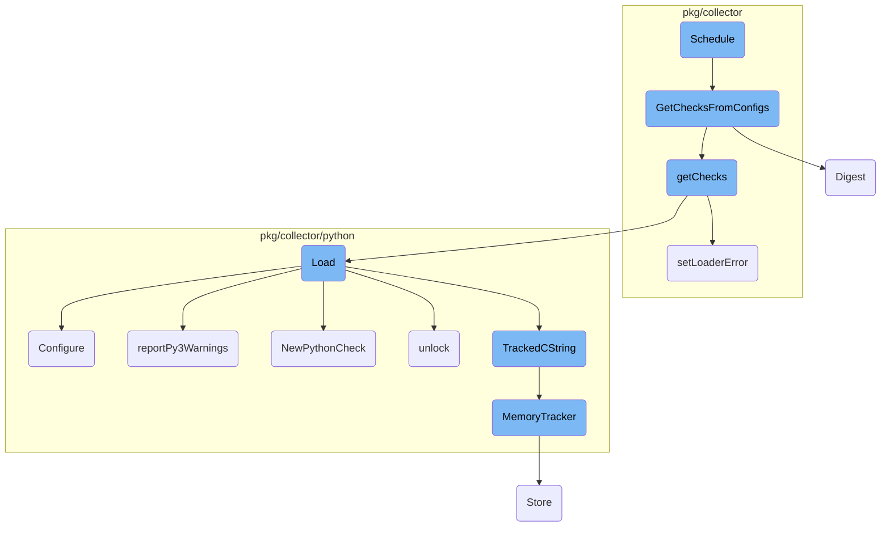
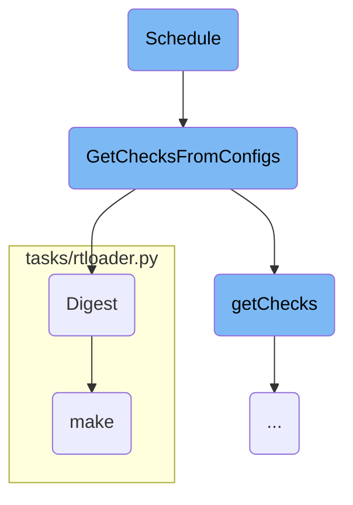
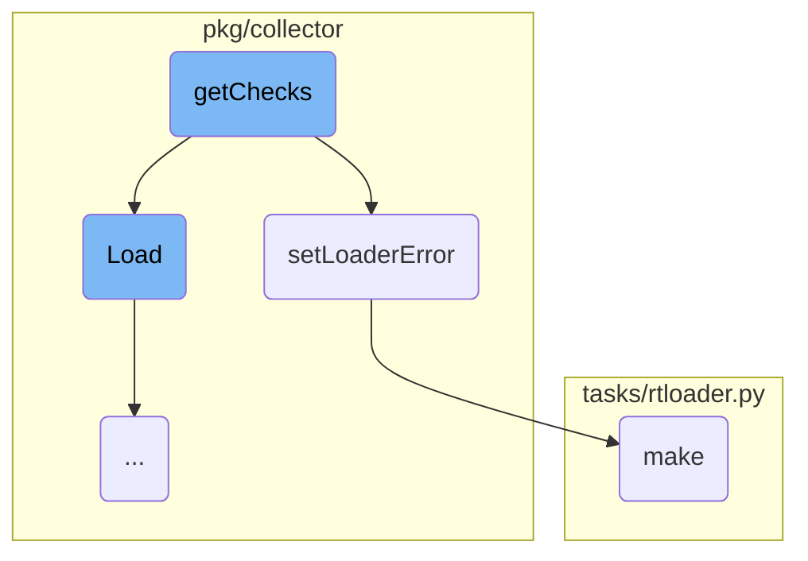
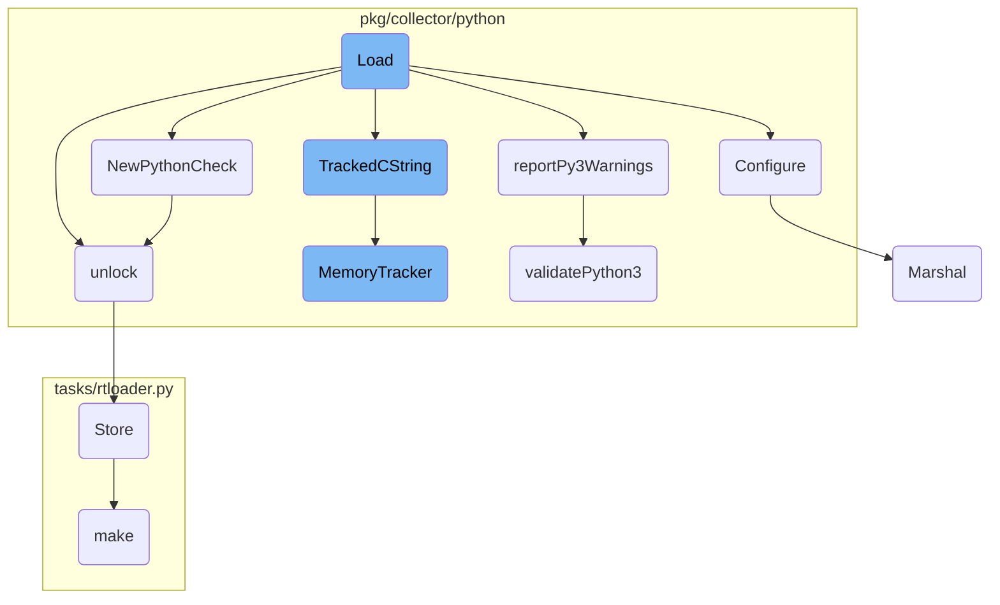

This document provides an overview of the scheduling process within the Datadog Agent. It explains how configurations are scheduled to checks, how checks are retrieved from configurations, and the overall flow of scheduling checks.

The scheduling process starts by retrieving the collector instance. It then gets all the check instances for the given configurations using the <SwmToken path="pkg/collector/scheduler.go" pos="85:7:7" line-data="		checks := s.GetChecksFromConfigs(configs, true)">`GetChecksFromConfigs`</SwmToken> function. Each check is then attempted to be run using the collector's <SwmToken path="pkg/collector/scheduler.go" pos="87:10:10" line-data="			_, err := coll.RunCheck(c)">`RunCheck`</SwmToken> method. If the collector is not available, an error is logged. The <SwmToken path="pkg/collector/scheduler.go" pos="85:7:7" line-data="		checks := s.GetChecksFromConfigs(configs, true)">`GetChecksFromConfigs`</SwmToken> function ensures thread safety by locking the scheduler and iterates over each configuration to retrieve the checks. The <SwmToken path="pkg/collector/scheduler.go" pos="258:7:7" line-data="		configDigest := config.Digest()">`Digest`</SwmToken> function calculates a hash value representing the data stored in a configuration, which helps in identifying unique configurations.

Here is a high level diagram of the flow, showing only the most important functions:



# Flow drill down

First, we'll zoom into this section of the flow:



<SwmSnippet path="/pkg/collector/scheduler.go" line="81">

---

## Scheduling Checks

The <SwmToken path="pkg/collector/scheduler.go" pos="81:2:2" line-data="// Schedule schedules configs to checks">`Schedule`</SwmToken> function is responsible for scheduling configurations to checks. It retrieves the collector instance and uses the <SwmToken path="pkg/collector/scheduler.go" pos="85:7:7" line-data="		checks := s.GetChecksFromConfigs(configs, true)">`GetChecksFromConfigs`</SwmToken> function to get all the check instances for the given configurations. It then iterates over these checks and attempts to run each one using the collector's <SwmToken path="pkg/collector/scheduler.go" pos="87:10:10" line-data="			_, err := coll.RunCheck(c)">`RunCheck`</SwmToken> method. If the collector is not available, it logs an error.

```go
// Schedule schedules configs to checks
func (s *CheckScheduler) Schedule(configs []integration.Config) {

	if coll, ok := s.collector.Get(); ok {
		checks := s.GetChecksFromConfigs(configs, true)
		for _, c := range checks {
			_, err := coll.RunCheck(c)
			if err != nil {
				log.Errorf("Unable to run Check %s: %v", c, err)
				errorStats.setRunError(c.ID(), err.Error())
				continue
			}
		}
	} else {
		log.Errorf("Collector not available, unable to schedule checks")
	}
}
```

---

</SwmSnippet>

<SwmSnippet path="/pkg/collector/scheduler.go" line="242">

---

## Getting Checks from Configurations

The <SwmToken path="pkg/collector/scheduler.go" pos="242:2:2" line-data="// GetChecksFromConfigs gets all the check instances for given configurations">`GetChecksFromConfigs`</SwmToken> function retrieves all the check instances for the given configurations. It locks the scheduler to ensure thread safety and iterates over each configuration. If a configuration is valid and not filtered out, it calculates a digest for the configuration and retrieves the checks using the <SwmToken path="pkg/collector/scheduler.go" pos="259:10:10" line-data="		checks, err := s.getChecks(config)">`getChecks`</SwmToken> method. It then optionally populates a cache with the checks and returns the list of all checks.

```go
// GetChecksFromConfigs gets all the check instances for given configurations
// optionally can populate the configToChecks cache
func (s *CheckScheduler) GetChecksFromConfigs(configs []integration.Config, populateCache bool) []check.Check {
	s.m.Lock()
	defer s.m.Unlock()

	var allChecks []check.Check
	for _, config := range configs {
		if !config.IsCheckConfig() {
			// skip non check configs.
			continue
		}
		if config.HasFilter(containers.MetricsFilter) {
			log.Debugf("Config %s is filtered out for metrics collection, ignoring it", config.Name)
			continue
		}
		configDigest := config.Digest()
		checks, err := s.getChecks(config)
		if err != nil {
			log.Errorf("Unable to load the check: %v", err)
			continue
```

---

</SwmSnippet>

<SwmSnippet path="/pkg/snmp/snmp.go" line="197">

---

### Calculating Configuration Digest

The <SwmToken path="pkg/snmp/snmp.go" pos="197:2:2" line-data="// Digest returns an hash value representing the data stored in this configuration, minus the network address">`Digest`</SwmToken> function calculates a hash value representing the data stored in a configuration, excluding the network address. It uses the FNV-1a hash function to generate a stable digest by hashing various configuration fields and sorting the ignored IP addresses.

```go
// Digest returns an hash value representing the data stored in this configuration, minus the network address
func (c *Config) Digest(address string) string {
	h := fnv.New64()
	// Hash write never returns an error
	h.Write([]byte(address))                   //nolint:errcheck
	h.Write([]byte(fmt.Sprintf("%d", c.Port))) //nolint:errcheck
	h.Write([]byte(c.Version))                 //nolint:errcheck
	h.Write([]byte(c.Community))               //nolint:errcheck
	h.Write([]byte(c.User))                    //nolint:errcheck
	h.Write([]byte(c.AuthKey))                 //nolint:errcheck
	h.Write([]byte(c.AuthProtocol))            //nolint:errcheck
	h.Write([]byte(c.PrivKey))                 //nolint:errcheck
	h.Write([]byte(c.PrivProtocol))            //nolint:errcheck
	h.Write([]byte(c.ContextEngineID))         //nolint:errcheck
	h.Write([]byte(c.ContextName))             //nolint:errcheck
	h.Write([]byte(c.Loader))                  //nolint:errcheck
	h.Write([]byte(c.Namespace))               //nolint:errcheck

	// Sort the addresses to get a stable digest
	addresses := make([]string, 0, len(c.IgnoredIPAddresses))
	for ip := range c.IgnoredIPAddresses {
```

---

</SwmSnippet>

<SwmSnippet path="/tasks/rtloader.py" line="60">

---

## Building the Runtime Loader

The <SwmToken path="tasks/rtloader.py" pos="60:2:2" line-data="def make(ctx, install_prefix=None, python_runtimes=&#39;3&#39;, cmake_options=&#39;&#39;):">`make`</SwmToken> function in <SwmPath>[tasks/rtloader.py](tasks/rtloader.py)</SwmPath> is used to build the runtime loader. It sets up the necessary <SwmToken path="tasks/rtloader.py" pos="40:1:1" line-data="    CMake is not regenerated when we change an option. This function detect the">`CMake`</SwmToken> options and settings based on the provided Python runtimes. It ensures the build path exists and runs the <SwmToken path="tasks/rtloader.py" pos="40:1:1" line-data="    CMake is not regenerated when we change an option. This function detect the">`CMake`</SwmToken> and make commands to build the runtime loader.

```python
def make(ctx, install_prefix=None, python_runtimes='3', cmake_options=''):
    dev_path = get_dev_path()

    if cmake_options.find("-G") == -1:
        cmake_options += " -G \"Unix Makefiles\""

    cmake_args = cmake_options + f" -DBUILD_DEMO:BOOL=OFF -DCMAKE_INSTALL_PREFIX:PATH={install_prefix or dev_path}"

    python_runtimes = python_runtimes.split(',')

    settings = {
        "DISABLE_PYTHON2:BOOL": "OFF",
        "DISABLE_PYTHON3:BOOL": "OFF",
    }
    if '2' not in python_runtimes:
        settings["DISABLE_PYTHON2:BOOL"] = "ON"
    if '3' not in python_runtimes:
        settings["DISABLE_PYTHON3:BOOL"] = "ON"

    rtloader_build_path = get_rtloader_build_path()

```

---

</SwmSnippet>

Now, lets zoom into this section of the flow:



<SwmSnippet path="/pkg/collector/scheduler.go" line="160">

---

## Loading Checks

The <SwmToken path="pkg/collector/scheduler.go" pos="259:10:10" line-data="		checks, err := s.getChecks(config)">`getChecks`</SwmToken> function is responsible for loading check instances from a given configuration. It iterates through the instances in the configuration, attempts to load each instance using available loaders, and collects any successfully loaded checks. If a loader fails to load a check, the error is logged and stored.

```go
	checks := []check.Check{}
	numLoaders := len(s.loaders)

	initConfig := commonInitConfig{}
	err := yaml.Unmarshal(config.InitConfig, &initConfig)
	if err != nil {
		return nil, err
	}
	selectedLoader := initConfig.LoaderName

	for _, instance := range config.Instances {
		if check.IsJMXInstance(config.Name, instance, config.InitConfig) {
			log.Debugf("skip loading jmx check '%s', it is handled elsewhere", config.Name)
			continue
		}

		errors := []string{}
		selectedInstanceLoader := selectedLoader
		instanceConfig := commonInstanceConfig{}

		err := yaml.Unmarshal(instance, &instanceConfig)
```

---

</SwmSnippet>

<SwmSnippet path="/pkg/collector/stats.go" line="30">

---

## Handling Loader Errors

The <SwmToken path="pkg/collector/stats.go" pos="30:9:9" line-data="func (ce *collectorErrors) setLoaderError(checkName string, loaderName string, err string) {">`setLoaderError`</SwmToken> function records errors encountered during the loading of checks. It updates the <SwmToken path="pkg/collector/stats.go" pos="29:28:28" line-data="// setLoaderError will safely set the error for that check and loader to the LoaderErrorStats">`LoaderErrorStats`</SwmToken> with the error details for the specific check and loader, ensuring that these errors can be tracked and reported.

```go
func (ce *collectorErrors) setLoaderError(checkName string, loaderName string, err string) {
	_, found := ce.loader[checkName]
	if !found {
		ce.loader[checkName] = make(map[string]string)
	}

	ce.loader[checkName][loaderName] = err
}
```

---

</SwmSnippet>

Now, lets zoom into this section of the flow:



<SwmSnippet path="/pkg/collector/python/loader.go" line="110">

---

## Loading Python Checks

The <SwmToken path="pkg/collector/python/loader.go" pos="110:2:2" line-data="// Load tries to import a Python module with the same name found in config.Name, searches for">`Load`</SwmToken> function is responsible for importing a Python module based on the configuration name, searching for subclasses of the <SwmToken path="pkg/collector/python/loader.go" pos="111:8:8" line-data="// subclasses of the AgentCheck class and returns the corresponding Check">`AgentCheck`</SwmToken> class, and returning the corresponding check. It handles <SwmToken path="pkg/collector/python/loader.go" pos="127:3:5" line-data="	// Platform-specific preparation">`Platform-specific`</SwmToken> preparations, checks for Python wheel modules, and validates Python 3 compatibility if necessary. The function also ensures proper memory management and error handling throughout the loading process.

```go
// Load tries to import a Python module with the same name found in config.Name, searches for
// subclasses of the AgentCheck class and returns the corresponding Check
func (cl *PythonCheckLoader) Load(senderManager sender.SenderManager, config integration.Config, instance integration.Data) (check.Check, error) {
	if rtloader == nil {
		return nil, fmt.Errorf("python is not initialized")
	}
	moduleName := config.Name
	// FastDigest is used as check id calculation does not account for tags order
	configDigest := config.FastDigest()

	// Lock the GIL
	glock, err := newStickyLock()
	if err != nil {
		return nil, err
	}
	defer glock.unlock()

	// Platform-specific preparation
	if !agentConfig.Datadog().GetBool("win_skip_com_init") {
		log.Debugf("Performing platform loading prep")
		err = platformLoaderPrep()
```

---

</SwmSnippet>

<SwmSnippet path="/pkg/collector/python/check.go" line="236">

---

## Configuring Python Checks

The <SwmToken path="pkg/collector/python/check.go" pos="236:2:2" line-data="// Configure the Python check from YAML data">`Configure`</SwmToken> function sets up the Python check using YAML data. It generates a unique check ID, parses global and instance-specific configurations, and sets various options such as collection intervals and service tags. The function also handles the instantiation of the check using either the new or deprecated API, ensuring compatibility and proper error handling.

```go
// Configure the Python check from YAML data
//
//nolint:revive // TODO(AML) Fix revive linter
func (c *PythonCheck) Configure(senderManager sender.SenderManager, integrationConfigDigest uint64, data integration.Data, initConfig integration.Data, source string) error {
	// Generate check ID
	c.id = checkid.BuildID(c.String(), integrationConfigDigest, data, initConfig)

	commonGlobalOptions := integration.CommonGlobalConfig{}
	if err := yaml.Unmarshal(initConfig, &commonGlobalOptions); err != nil {
		log.Errorf("invalid init_config section for check %s: %s", string(c.id), err)
		return err
	}

	// Set service for this check
	if len(commonGlobalOptions.Service) > 0 {
		s, err := c.senderManager.GetSender(c.id)
		if err != nil {
			log.Errorf("failed to retrieve a sender for check %s: %s", string(c.id), err)
		} else {
			s.SetCheckService(commonGlobalOptions.Service)
		}
```

---

</SwmSnippet>

<SwmSnippet path="/pkg/collector/python/loader.go" line="262">

---

## Reporting Python 3 Warnings

The <SwmToken path="pkg/collector/python/loader.go" pos="262:2:2" line-data="// reportPy3Warnings runs the a7 linter and exports the result in both expvar">`reportPy3Warnings`</SwmToken> function runs a linter to check for Python 3 compatibility issues in the check's code. It records the results in both expvar and the aggregator, ensuring that any warnings are logged and tracked for further analysis.

```go
// reportPy3Warnings runs the a7 linter and exports the result in both expvar
// and the aggregator (as extra series)
func reportPy3Warnings(checkName string, checkFilePath string) {
	// check if the check has already been linted
	py3LintedLock.Lock()
	_, found := py3Linted[checkName]
	if found {
		py3LintedLock.Unlock()
		return
	}
	py3Linted[checkName] = struct{}{}
	py3LintedLock.Unlock()

	status := a7TagUnknown
	metricValue := 0.0
	if checkFilePath != "" {
		// __file__ return the .pyc file path
		if strings.HasSuffix(checkFilePath, ".pyc") {
			checkFilePath = checkFilePath[:len(checkFilePath)-1]
		}

```

---

</SwmSnippet>

<SwmSnippet path="/pkg/collector/python/check.go" line="68">

---

## Creating a New Python Check

The <SwmToken path="pkg/collector/python/check.go" pos="68:2:2" line-data="// NewPythonCheck conveniently creates a PythonCheck instance">`NewPythonCheck`</SwmToken> function creates a new instance of a Python check. It initializes the check with the necessary attributes, including the sender manager, module name, and class reference. The function also sets up telemetry and memory tracking for the check.

```go
// NewPythonCheck conveniently creates a PythonCheck instance
func NewPythonCheck(senderManager sender.SenderManager, name string, class *C.rtloader_pyobject_t) (*PythonCheck, error) {
	glock, err := newStickyLock()
	if err != nil {
		return nil, err
	}

	C.rtloader_incref(rtloader, class) // own the ref
	glock.unlock()

	pyCheck := &PythonCheck{
		senderManager: senderManager,
		ModuleName:    name,
		class:         class,
		interval:      defaults.DefaultCheckInterval,
		lastWarnings:  []error{},
		telemetry:     utils.IsCheckTelemetryEnabled(name, config.Datadog()),
	}
	runtime.SetFinalizer(pyCheck, pythonCheckFinalizer)

	return pyCheck, nil
```

---

</SwmSnippet>

<SwmSnippet path="/pkg/collector/python/helpers.go" line="109">

---

## Unlocking the GIL

The <SwmToken path="pkg/collector/python/helpers.go" pos="109:2:2" line-data="// unlock deregisters the current thread from the interpreter, unlocks the GIL">`unlock`</SwmToken> function releases the Global Interpreter Lock (GIL) and detaches the current goroutine from the thread. This ensures that the Python interpreter can be used by other threads, preventing potential deadlocks.

```go
// unlock deregisters the current thread from the interpreter, unlocks the GIL
// and detaches the goroutine from the current thread.
// Thread safe ; noop when called on an already-unlocked stickylock.
func (sl *stickyLock) unlock() {
	sl.locked.Store(false)

	pyDestroyLock.RLock()
	if rtloader != nil {
		C.release_gil(rtloader, sl.gstate)
	}
	pyDestroyLock.RUnlock()

	runtime.UnlockOSThread()
}
```

---

</SwmSnippet>

<SwmSnippet path="/pkg/collector/python/memory.go" line="116">

---

## Tracking C Strings

The <SwmToken path="pkg/collector/python/memory.go" pos="117:2:2" line-data="func TrackedCString(str string) *C.char {">`TrackedCString`</SwmToken> function converts a Go string to a C string and tracks its memory allocation. This helps in monitoring and managing memory usage within the Python interpreter.

```go
//nolint:revive // TODO(AML) Fix revive linter
func TrackedCString(str string) *C.char {
	cstr := C.CString(str)

	// TODO(memory-tracking): track the origin of the string (for example check name)
	if config.Datadog().GetBool("memtrack_enabled") {
		MemoryTracker(unsafe.Pointer(cstr), C.size_t(len(str)+1), C.DATADOG_AGENT_RTLOADER_ALLOCATION)
	}

	return cstr
}
```

---

</SwmSnippet>

<SwmSnippet path="/pkg/collector/python/memory.go" line="69">

---

## Memory Tracking

The <SwmToken path="pkg/collector/python/memory.go" pos="69:2:2" line-data="// MemoryTracker is the method exposed to the RTLoader for memory tracking">`MemoryTracker`</SwmToken> function is used to track memory allocations and deallocations within the Python interpreter. It maintains statistics on memory usage, helping to identify potential memory leaks and optimize performance.

```go
// MemoryTracker is the method exposed to the RTLoader for memory tracking
//
//export MemoryTracker
func MemoryTracker(ptr unsafe.Pointer, sz C.size_t, op C.rtloader_mem_ops_t) {
	// run sync for reliability reasons

	// This check looks redundant since the log level is also checked in pkg/util/log,
	// but from profiling, even passing these vars through as arguments allocates to the heap.
	// This is an optimization to avoid even evaluating the `Tracef` call if the trace log
	// level is not enabled.
	if log.ShouldLog(seelog.TraceLvl) {
		log.Tracef("Memory Tracker - ptr: %v, sz: %v, op: %v", ptr, sz, op)
	}
	switch op {
	case C.DATADOG_AGENT_RTLOADER_ALLOCATION:
		pointerCache.Store(ptr, sz)
		allocations.Add(1)
		tlmAllocations.Inc()
		allocatedBytes.Add(int64(sz))
		tlmAllocatedBytes.Add(float64(sz))
		inuseBytes.Add(int64(sz))
```

---

</SwmSnippet>

<SwmSnippet path="/pkg/trace/api/container_linux.go" line="346">

---

## Storing Data in Cache

The <SwmToken path="pkg/trace/api/container_linux.go" pos="346:2:2" line-data="// Store sets data in the cache, it also clears the cache if the gcInterval has passed">`Store`</SwmToken> function sets data in the cache and clears the cache if the garbage collection interval has passed. This ensures efficient memory usage and prevents stale data from accumulating in the cache.

```go
// Store sets data in the cache, it also clears the cache if the gcInterval has passed
func (c *Cache) Store(currentTime time.Time, key string, value interface{}, err error) {
	c.cacheLock.Lock()
	defer c.cacheLock.Unlock()

	if currentTime.Sub(c.gcTimestamp) > c.gcInterval {
		c.cache = make(map[string]cacheEntry, len(c.cache))
		c.gcTimestamp = currentTime
	}

	c.cache[key] = cacheEntry{value: value, timestamp: currentTime, err: err}
}
```

---

</SwmSnippet>

<SwmSnippet path="/pkg/collector/python/py3_checker.go" line="35">

---

## Validating Python 3 Compatibility

The <SwmToken path="pkg/collector/python/py3_checker.go" pos="35:2:2" line-data="// validatePython3 checks that a check can run on python 3.">`validatePython3`</SwmToken> function checks if a Python module can run on Python 3. It uses the pylint tool to perform the validation and returns any warnings or errors encountered during the process.

```go
// validatePython3 checks that a check can run on python 3.
//
//nolint:revive // TODO(AML) Fix revive linter
func validatePython3(moduleName string, modulePath string) ([]string, error) {
	ctx, cancel := context.WithTimeout(context.Background(), linterTimeout)
	defer cancel()

	cmd := exec.CommandContext(ctx, pythonBinPath, "-m", "pylint", "-f", "json", "--py3k", "-d", "W1618", "--persistent", "no", "--exit-zero", modulePath)

	stdout := bytes.Buffer{}
	stderr := bytes.Buffer{}
	cmd.Stdout = &stdout
	cmd.Stderr = &stderr

	if err := cmd.Run(); err != nil {
		return nil, fmt.Errorf("error running the linter on (%s): %s", err, stderr.String())
	}

	res := []string{}
	if stdout.Len() == 0 {
		// No warning
```

---

</SwmSnippet>

<SwmSnippet path="/pkg/process/encoding/protobuf.go" line="21">

---

## Marshaling Process Stats

The <SwmToken path="pkg/process/encoding/protobuf.go" pos="21:2:2" line-data="// Marshal serializes stats by PID into bytes">`Marshal`</SwmToken> function serializes process statistics by PID into bytes. It prepares the data for transmission or storage, ensuring that the statistics are efficiently encoded and ready for further processing.

```go
// Marshal serializes stats by PID into bytes
func (protoSerializer) Marshal(stats map[int32]*procutil.StatsWithPerm) ([]byte, error) {
	payload := &model.ProcStatsWithPermByPID{
		StatsByPID: make(map[int32]*model.ProcStatsWithPerm),
	}
	for pid, s := range stats {
		stat := statPool.Get()
		stat.OpenFDCount = s.OpenFdCount
		stat.ReadCount = s.IOStat.ReadCount
		stat.WriteCount = s.IOStat.WriteCount
		stat.ReadBytes = s.IOStat.ReadBytes
		stat.WriteBytes = s.IOStat.WriteBytes
		payload.StatsByPID[pid] = stat
	}

	buf, err := proto.Marshal(payload)
	returnToPool(payload.StatsByPID)
	return buf, err
}
```

---

</SwmSnippet>

&nbsp;

*This is an auto-generated document by Swimm AI 🌊 and has not yet been verified by a human*

<SwmMeta version="3.0.0" repo-id="Z2l0aHViJTNBJTNBZGF0YWRvZy1hZ2VudCUzQSUzQVN3aW1tLURlbW8=" repo-name="datadog-agent"><sup>Powered by [Swimm](/)</sup></SwmMeta>
