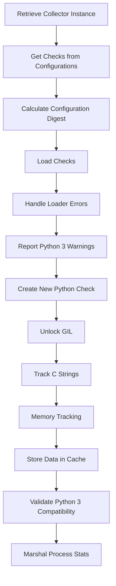

This document will cover the Scheduling Process Overview, which includes:

 1. Scheduling Checks
 2. Getting Checks from Configurations
 3. Calculating Configuration Digest
 4. Loading Checks
 5. Handling Loader Errors
 6. Reporting Python 3 Warnings
 7. Creating a New Python Check
 8. Unlocking the GIL
 9. Tracking C Strings
10. Memory Tracking
11. Storing Data in Cache
12. Validating Python 3 Compatibility
13. Marshaling Process Stats.

Technical document: <SwmLink doc-title="Scheduling Process Overview">[Scheduling Process Overview](/.swm/scheduling-process-overview.6ugiywfr.sw.md)</SwmLink>

# [Scheduling Checks](https://app.swimm.io/repos/Z2l0aHViJTNBJTNBZGF0YWRvZy1hZ2VudCUzQSUzQVN3aW1tLURlbW8=/docs/6ugiywfr#scheduling-checks)

The scheduling process begins by retrieving the collector instance. This is essential because the collector is responsible for running the checks. If the collector is not available, an error is logged, and the process cannot proceed. Once the collector is retrieved, the system gets all the check instances for the given configurations. Each check is then attempted to be run using the collector's `RunCheck` method.

# [Getting Checks from Configurations](https://app.swimm.io/repos/Z2l0aHViJTNBJTNBZGF0YWRvZy1hZ2VudCUzQSUzQVN3aW1tLURlbW8=/docs/6ugiywfr#getting-checks-from-configurations)

The `GetChecksFromConfigs` function retrieves all the check instances for the given configurations. It ensures thread safety by locking the scheduler and iterates over each configuration. If a configuration is valid and not filtered out, it calculates a digest for the configuration and retrieves the checks using the `getChecks` method. This function also optionally populates a cache with the checks and returns the list of all checks.

# [Calculating Configuration Digest](https://app.swimm.io/repos/Z2l0aHViJTNBJTNBZGF0YWRvZy1hZ2VudCUzQSUzQVN3aW1tLURlbW8=/docs/6ugiywfr#calculating-configuration-digest)

The <SwmToken path="Dockerfiles/agent/test_image_contents.py" pos="42:6:6" line-data="        for file, digest in iteritems(EXPECTED_CHECKSUMS):">`digest`</SwmToken> function calculates a hash value representing the data stored in a configuration, excluding the network address. This hash value helps in identifying unique configurations. The function uses the FNV-1a hash function to generate a stable digest by hashing various configuration fields and sorting the ignored IP addresses.

# [Loading Checks](https://app.swimm.io/repos/Z2l0aHViJTNBJTNBZGF0YWRvZy1hZ2VudCUzQSUzQVN3aW1tLURlbW8=/docs/6ugiywfr#loading-checks)

The `getChecks` function is responsible for loading check instances from a given configuration. It iterates through the instances in the configuration, attempts to load each instance using available loaders, and collects any successfully loaded checks. If a loader fails to load a check, the error is logged and stored.

# [Handling Loader Errors](https://app.swimm.io/repos/Z2l0aHViJTNBJTNBZGF0YWRvZy1hZ2VudCUzQSUzQVN3aW1tLURlbW8=/docs/6ugiywfr#handling-loader-errors)

The `setLoaderError` function records errors encountered during the loading of checks. It updates the `LoaderErrorStats` with the error details for the specific check and loader, ensuring that these errors can be tracked and reported.

# [Reporting Python 3 Warnings](https://app.swimm.io/repos/Z2l0aHViJTNBJTNBZGF0YWRvZy1hZ2VudCUzQSUzQVN3aW1tLURlbW8=/docs/6ugiywfr#reporting-python-3-warnings)

The `reportPy3Warnings` function runs a linter to check for Python 3 compatibility issues in the check's code. It records the results in both expvar and the aggregator, ensuring that any warnings are logged and tracked for further analysis.

# [Creating a New Python Check](https://app.swimm.io/repos/Z2l0aHViJTNBJTNBZGF0YWRvZy1hZ2VudCUzQSUzQVN3aW1tLURlbW8=/docs/6ugiywfr#creating-a-new-python-check)

The `NewPythonCheck` function creates a new instance of a Python check. It initializes the check with the necessary attributes, including the sender manager, module name, and class reference. The function also sets up telemetry and memory tracking for the check.

# [Unlocking the GIL](https://app.swimm.io/repos/Z2l0aHViJTNBJTNBZGF0YWRvZy1hZ2VudCUzQSUzQVN3aW1tLURlbW8=/docs/6ugiywfr#unlocking-the-gil)

The `unlock` function releases the Global Interpreter Lock (GIL) and detaches the current goroutine from the thread. This ensures that the Python interpreter can be used by other threads, preventing potential deadlocks.

# [Tracking C Strings](https://app.swimm.io/repos/Z2l0aHViJTNBJTNBZGF0YWRvZy1hZ2VudCUzQSUzQVN3aW1tLURlbW8=/docs/6ugiywfr#tracking-c-strings)

The `TrackedCString` function converts a Go string to a C string and tracks its memory allocation. This helps in monitoring and managing memory usage within the Python interpreter.

# [Memory Tracking](https://app.swimm.io/repos/Z2l0aHViJTNBJTNBZGF0YWRvZy1hZ2VudCUzQSUzQVN3aW1tLURlbW8=/docs/6ugiywfr#memory-tracking)

The `MemoryTracker` function is used to track memory allocations and deallocations within the Python interpreter. It maintains statistics on memory usage, helping to identify potential memory leaks and optimize performance.

# [Storing Data in Cache](https://app.swimm.io/repos/Z2l0aHViJTNBJTNBZGF0YWRvZy1hZ2VudCUzQSUzQVN3aW1tLURlbW8=/docs/6ugiywfr#storing-data-in-cache)

The `Store` function sets data in the cache and clears the cache if the garbage collection interval has passed. This ensures efficient memory usage and prevents stale data from accumulating in the cache.

# [Validating Python 3 Compatibility](https://app.swimm.io/repos/Z2l0aHViJTNBJTNBZGF0YWRvZy1hZ2VudCUzQSUzQVN3aW1tLURlbW8=/docs/6ugiywfr#validating-python-3-compatibility)

The `validatePython3` function checks if a Python module can run on Python 3. It uses the pylint tool to perform the validation and returns any warnings or errors encountered during the process.

# [Marshaling Process Stats](https://app.swimm.io/repos/Z2l0aHViJTNBJTNBZGF0YWRvZy1hZ2VudCUzQSUzQVN3aW1tLURlbW8=/docs/6ugiywfr#marshaling-process-stats)

The `Marshal` function serializes process statistics by PID into bytes. It prepares the data for transmission or storage, ensuring that the statistics are efficiently encoded and ready for further processing.

&nbsp;

*This is an auto-generated document by Swimm AI 🌊 and has not yet been verified by a human*

<SwmMeta version="3.0.0" repo-id="Z2l0aHViJTNBJTNBZGF0YWRvZy1hZ2VudCUzQSUzQVN3aW1tLURlbW8=" repo-name="datadog-agent">Powered by [Swimm](/)</SwmMeta>
