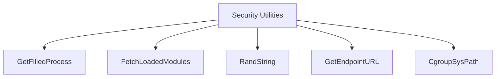

# Overview

The Security Utilities package is a collection of utility functions and helpers designed to support various security-related operations. These utilities include functions for handling system paths, reading and parsing cgroup files, generating random strings and cookies, and managing process <SwmToken path="tasks/gitlab_helpers.py" pos="90:10:10" line-data="def print_gitlab_object(get_object, ctx, ids, repo=&#39;DataDog/datadog-agent&#39;, jq: str | None = None, jq_colors=True):">`ids`</SwmToken>. By centralizing these helper functions, the codebase remains cleaner and more maintainable, reducing redundancy and potential errors.

# Internal Use Only

The utils module is intended for internal use and should never be imported directly. Checks should use the methods exposed by the <SwmToken path="rtloader/test/python/datadog_checks/base/checks/__init__.py" pos="2:2:2" line-data="class AgentCheck(object):  # noqa: UP004">`AgentCheck`</SwmToken> class instead.

# Main Functions

Several main functions are provided in this package, including <SwmToken path="pkg/security/utils/proc_common.go" pos="47:2:2" line-data="func GetFilledProcess(p *process.Process) (*FilledProcess, error) {">`GetFilledProcess`</SwmToken>, <SwmToken path="pkg/security/utils/proc_linux.go" pos="320:2:2" line-data="// FetchLoadedModules returns a map of loaded modules">`FetchLoadedModules`</SwmToken>, and <SwmToken path="pkg/security/utils/rand.go" pos="17:2:2" line-data="func RandString(n int) string {">`RandString`</SwmToken>. Below, we will dive into these functions.

<SwmSnippet path="/pkg/security/utils/proc_common.go" line="47">

---

## <SwmToken path="pkg/security/utils/proc_common.go" pos="47:2:2" line-data="func GetFilledProcess(p *process.Process) (*FilledProcess, error) {">`GetFilledProcess`</SwmToken>

The <SwmToken path="pkg/security/utils/proc_common.go" pos="47:2:2" line-data="func GetFilledProcess(p *process.Process) (*FilledProcess, error) {">`GetFilledProcess`</SwmToken> function returns a <SwmToken path="pkg/security/utils/proc_common.go" pos="47:14:14" line-data="func GetFilledProcess(p *process.Process) (*FilledProcess, error) {">`FilledProcess`</SwmToken> from a <SwmToken path="pkg/security/utils/proc_common.go" pos="47:7:7" line-data="func GetFilledProcess(p *process.Process) (*FilledProcess, error) {">`process`</SwmToken> input. It extracts various details such as Ppid, <SwmToken path="pkg/security/utils/proc_common.go" pos="53:1:1" line-data="	createTime, err := p.CreateTime()">`createTime`</SwmToken>, Uids, and Gids from the given process.

```go
func GetFilledProcess(p *process.Process) (*FilledProcess, error) {
	ppid, err := p.Ppid()
	if err != nil {
		return nil, err
	}

	createTime, err := p.CreateTime()
	if err != nil {
		return nil, err
	}

	uids, err := p.Uids()
	if err != nil {
		return nil, err
	}
```

---

</SwmSnippet>

<SwmSnippet path="/pkg/security/utils/proc_linux.go" line="320">

---

## <SwmToken path="pkg/security/utils/proc_linux.go" pos="320:2:2" line-data="// FetchLoadedModules returns a map of loaded modules">`FetchLoadedModules`</SwmToken>

The <SwmToken path="pkg/security/utils/proc_linux.go" pos="320:2:2" line-data="// FetchLoadedModules returns a map of loaded modules">`FetchLoadedModules`</SwmToken> function returns a map of loaded modules by reading and parsing the <SwmPath>[cmd/system-probe/modules/](cmd/system-probe/modules/)</SwmPath> file. It helps in identifying the state and address of kernel modules.

```go
// FetchLoadedModules returns a map of loaded modules
func FetchLoadedModules() (map[string]ProcFSModule, error) {
	procModules, err := os.ReadFile(ModulesPath())
	if err != nil {
		return nil, err
	}

	output := make(map[string]ProcFSModule)
	lines := strings.Split(string(procModules), "\n")
	for _, line := range lines {
		split := strings.Split(line, " ")
		if len(split) < 6 {
			continue
		}
```

---

</SwmSnippet>

<SwmSnippet path="/pkg/security/utils/rand.go" line="17">

---

## <SwmToken path="pkg/security/utils/rand.go" pos="17:2:2" line-data="func RandString(n int) string {">`RandString`</SwmToken>

The <SwmToken path="pkg/security/utils/rand.go" pos="17:2:2" line-data="func RandString(n int) string {">`RandString`</SwmToken> function generates a random string of a given length. It is useful for creating random identifiers or tokens.

```go
func RandString(n int) string {
	b := make([]rune, n)
	for i := range b {
		b[i] = letterRunes[rand.Intn(len(letterRunes))]
	}
	return string(b)
```

---

</SwmSnippet>

# Utils Endpoints

The utils package also provides functions for constructing URLs and accessing cgroup files.

<SwmSnippet path="/pkg/security/utils/endpoint.go" line="16">

---

## <SwmToken path="pkg/security/utils/endpoint.go" pos="16:2:2" line-data="func GetEndpointURL(endpoint logsconfig.Endpoint, uri string) string {">`GetEndpointURL`</SwmToken>

The <SwmToken path="pkg/security/utils/endpoint.go" pos="16:2:2" line-data="func GetEndpointURL(endpoint logsconfig.Endpoint, uri string) string {">`GetEndpointURL`</SwmToken> function constructs a URL for a given endpoint. It takes an endpoint configuration and a URI, determines the appropriate protocol (HTTP or HTTPS) based on whether SSL is used, and formats the URL accordingly. This function ensures that the correct port is used, defaulting to 443 for HTTPS and 80 for HTTP if no port is specified.

```go
func GetEndpointURL(endpoint logsconfig.Endpoint, uri string) string {
	port := endpoint.Port
	var protocol string
	if endpoint.UseSSL() {
		protocol = "https"
		if port == 0 {
			port = 443 // use default port
		}
	} else {
		protocol = "http"
		if port == 0 {
			port = 80 // use default port
		}
	}
	return fmt.Sprintf("%s://%s:%v/%s", protocol, endpoint.Host, port, uri)
}
```

---

</SwmSnippet>

<SwmSnippet path="/pkg/security/utils/sys.go" line="22">

---

## <SwmToken path="pkg/security/utils/sys.go" pos="22:2:2" line-data="func CgroupSysPath(controller string, path string, file string) string {">`CgroupSysPath`</SwmToken>

The <SwmToken path="pkg/security/utils/sys.go" pos="22:2:2" line-data="func CgroupSysPath(controller string, path string, file string) string {">`CgroupSysPath`</SwmToken> function generates the path to a specific file within a cgroup. It takes the cgroup controller, path, and file name as inputs and constructs the full path using the system's cgroup filesystem root. This function is useful for accessing cgroup files in a consistent manner.

```go
func CgroupSysPath(controller string, path string, file string) string {
	return filepath.Join(kernel.SysFSRoot(), "fs/cgroup/", controller, path, file)
}
```

---

</SwmSnippet>

&nbsp;

*This is an auto-generated document by Swimm AI 🌊 and has not yet been verified by a human*

<SwmMeta version="3.0.0" repo-id="Z2l0aHViJTNBJTNBZGF0YWRvZy1hZ2VudCUzQSUzQVN3aW1tLURlbW8=" repo-name="datadog-agent"><sup>Powered by [Swimm](/)</sup></SwmMeta>
