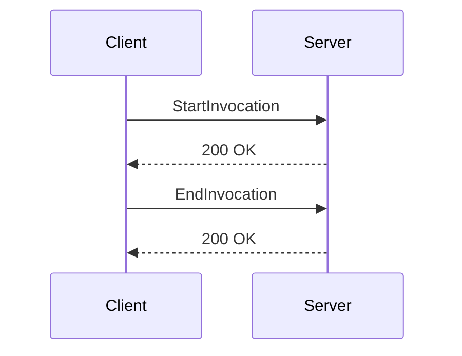

# What is Serverless in Packages

Serverless refers to the capability of running the Datadog Agent in a serverless environment, such as AWS Lambda. This allows the agent to collect metrics, logs, and traces without the need for managing server infrastructure.

## Building the Serverless Agent

The Serverless Agent can be built using specific build tags. This process ensures that the agent is optimized for serverless environments.

## Configuration

The Serverless Agent requires certain environment variables for configuration, such as <SwmToken path="tasks/libs/common/omnibus.py" pos="320:1:1" line-data="    dd_api_key = ctx.run(">`dd_api_key`</SwmToken> for the API key and `DD_SITE` for the Datadog site. Additionally, a configuration file named <SwmPath>[pkg/util/scrubber/test/datadog.yaml](pkg/util/scrubber/test/datadog.yaml)</SwmPath> can be used to set various parameters. This file should be placed in the root of the lambda function. Note that environment variables will override these settings.

### Logs Filtering and Scrubbing

The Serverless Agent supports logs filtering and scrubbing features, which can be configured using the `processing_rules` in the `logs_config` field of the configuration file.

## Serverless Endpoints

The Serverless Agent provides specific endpoints to manage the invocation lifecycle without the use of a proxy.

<SwmSnippet path="/pkg/serverless/daemon/routes.go" line="50">

---

### <SwmToken path="pkg/serverless/daemon/routes.go" pos="50:2:2" line-data="// StartInvocation is a route that can be called at the beginning of an invocation to enable">`StartInvocation`</SwmToken> Endpoint

The <SwmToken path="pkg/serverless/daemon/routes.go" pos="50:2:2" line-data="// StartInvocation is a route that can be called at the beginning of an invocation to enable">`StartInvocation`</SwmToken> endpoint is called at the beginning of an invocation to enable the invocation lifecycle feature without the use of the proxy. It sets the execution span as incomplete and initializes the invocation start details, including the start time, raw payload, and headers.

```go
// StartInvocation is a route that can be called at the beginning of an invocation to enable
// the invocation lifecyle feature without the use of the proxy.
type StartInvocation struct {
	daemon *Daemon
}

func (s *StartInvocation) ServeHTTP(w http.ResponseWriter, r *http.Request) {
	log.Debug("Hit on the serverless.StartInvocation route.")
	s.daemon.SetExecutionSpanIncomplete(true)
	startTime := time.Now()
	reqBody, err := io.ReadAll(r.Body)
	if err != nil {
		log.Error("Could not read StartInvocation request body")
		http.Error(w, "Could not read StartInvocation request body", 400)
		return
	}
	startDetails := &invocationlifecycle.InvocationStartDetails{
		StartTime:             startTime,
		InvokeEventRawPayload: reqBody,
		InvokeEventHeaders:    r.Header,
		InvokedFunctionARN:    s.daemon.ExecutionContext.GetCurrentState().ARN,
```

---

</SwmSnippet>

<SwmSnippet path="/pkg/serverless/daemon/routes.go" line="84">

---

### <SwmToken path="pkg/serverless/daemon/routes.go" pos="84:2:2" line-data="// EndInvocation is a route that can be called at the end of an invocation to enable">`EndInvocation`</SwmToken> Endpoint

The <SwmToken path="pkg/serverless/daemon/routes.go" pos="84:2:2" line-data="// EndInvocation is a route that can be called at the end of an invocation to enable">`EndInvocation`</SwmToken> endpoint is called at the end of an invocation to enable the invocation lifecycle feature without the use of the proxy. It marks the execution span as complete, processes the response payload, and handles any error metadata received.

```go
// EndInvocation is a route that can be called at the end of an invocation to enable
// the invocation lifecycle feature without the use of the proxy.
type EndInvocation struct {
	daemon *Daemon
}

func (e *EndInvocation) ServeHTTP(w http.ResponseWriter, r *http.Request) {
	log.Debug("Hit on the serverless.EndInvocation route.")
	e.daemon.SetExecutionSpanIncomplete(false)
	endTime := time.Now()
	ecs := e.daemon.ExecutionContext.GetCurrentState()
	coldStartTags := e.daemon.ExecutionContext.GetColdStartTagsForRequestID(ecs.LastRequestID)
	responseBody, err := io.ReadAll(r.Body)
	if err != nil {
		err := log.Error("Could not read EndInvocation request body")
		http.Error(w, err.Error(), 400)
		return
	}

	errorMsg := r.Header.Get(invocationlifecycle.InvocationErrorMsgHeader)
	errorType := r.Header.Get(invocationlifecycle.InvocationErrorTypeHeader)
```

---

</SwmSnippet>

&nbsp;

*This is an auto-generated document by Swimm AI 🌊 and has not yet been verified by a human*

<SwmMeta version="3.0.0" repo-id="Z2l0aHViJTNBJTNBZGF0YWRvZy1hZ2VudCUzQSUzQVN3aW1tLURlbW8=" repo-name="datadog-agent"><sup>Powered by [Swimm](/)</sup></SwmMeta>
