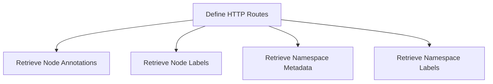

This document will cover the process of setting up Kubernetes metadata endpoints, which includes:

1. Defining HTTP routes for Kubernetes metadata
2. Retrieving node annotations
3. Retrieving node labels
4. Retrieving namespace metadata
5. Retrieving namespace labels

Technical document: <SwmLink doc-title="Setting Up Kubernetes Metadata Endpoints">[Setting Up Kubernetes Metadata Endpoints](/.swm/setting-up-kubernetes-metadata-endpoints.umede2do.sw.md)</SwmLink>

# [Defining HTTP Routes](https://app.swimm.io/repos/Z2l0aHViJTNBJTNBZGF0YWRvZy1hZ2VudCUzQSUzQVN3aW1tLURlbW8=/docs/umede2do#installkubernetesmetadataendpoints)

The process begins by defining HTTP routes that will be used to fetch various types of Kubernetes metadata. These routes are essential for enabling the retrieval of metadata such as node annotations, node labels, namespace labels, and namespace metadata. Each route is wrapped with telemetry for monitoring purposes, ensuring that all requests and responses are tracked and logged for performance and debugging purposes.

# [Retrieving Node Annotations](https://app.swimm.io/repos/Z2l0aHViJTNBJTNBZGF0YWRvZy1hZ2VudCUzQSUzQVN3aW1tLURlbW8=/docs/umede2do#getnodeannotations)

When a request is made to the node annotations route, the system retrieves the annotations for a specific Kubernetes node. This involves calling a function that extracts the annotations from the node's metadata. The annotations provide additional information about the node, which can be useful for various monitoring and management tasks.

# [Retrieving Node Labels](https://app.swimm.io/repos/Z2l0aHViJTNBJTNBZGF0YWRvZy1hZ2VudCUzQSUzQVN3aW1tLURlbW8=/docs/umede2do#getnodelabels)

Similarly, when a request is made to the node labels route, the system retrieves the labels for a specific Kubernetes node. Labels are key-value pairs that provide metadata about the node, such as its role or environment. This information is crucial for organizing and managing nodes within a Kubernetes cluster.

# [Retrieving Namespace Metadata](https://app.swimm.io/repos/Z2l0aHViJTNBJTNBZGF0YWRvZy1hZ2VudCUzQSUzQVN3aW1tLURlbW8=/docs/umede2do#getnamespacemetadata)

For namespace metadata, the system retrieves comprehensive metadata for a specific Kubernetes namespace. This includes labels, annotations, and other relevant information. The metadata is then returned as a JSON response, which can be used for various purposes such as monitoring, auditing, and compliance.

# [Retrieving Namespace Labels](https://app.swimm.io/repos/Z2l0aHViJTNBJTNBZGF0YWRvZy1hZ2VudCUzQSUzQVN3aW1tLURlbW8=/docs/umede2do#getnamespacelabels)

When a request is made to the namespace labels route, the system retrieves the labels for a specific Kubernetes namespace. These labels provide metadata about the namespace, which can be used for organizing and managing resources within the namespace. The labels are returned as a JSON response, making it easy to integrate with other systems and tools.

&nbsp;

*This is an auto-generated document by Swimm AI 🌊 and has not yet been verified by a human*

<SwmMeta version="3.0.0" repo-id="Z2l0aHViJTNBJTNBZGF0YWRvZy1hZ2VudCUzQSUzQVN3aW1tLURlbW8=" repo-name="datadog-agent">Powered by [Swimm](/)</SwmMeta>
