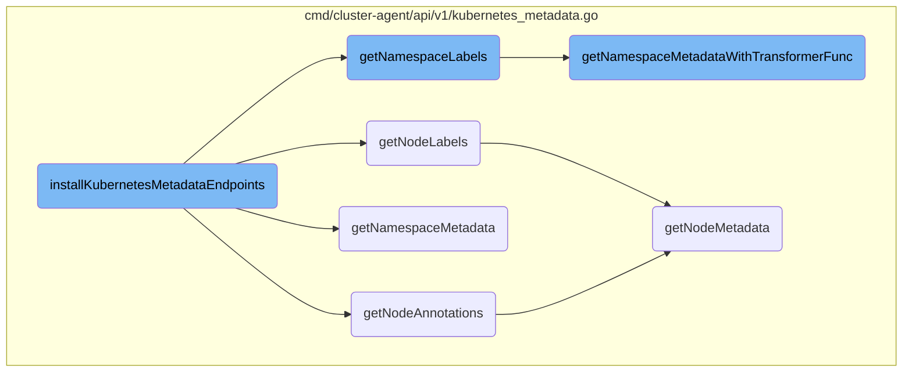

This document explains the purpose and flow of the <SwmToken path="cmd/cluster-agent/api/v1/kubernetes_metadata.go" pos="28:2:2" line-data="func installKubernetesMetadataEndpoints(r *mux.Router, wmeta workloadmeta.Component) {">`installKubernetesMetadataEndpoints`</SwmToken> function. The function is responsible for setting up HTTP routes to fetch various Kubernetes metadata, such as node annotations, node labels, namespace labels, and namespace metadata. Each route is wrapped with telemetry for monitoring purposes.

The <SwmToken path="cmd/cluster-agent/api/v1/kubernetes_metadata.go" pos="28:2:2" line-data="func installKubernetesMetadataEndpoints(r *mux.Router, wmeta workloadmeta.Component) {">`installKubernetesMetadataEndpoints`</SwmToken> function sets up different routes to fetch metadata from Kubernetes nodes and namespaces. It defines routes for getting node annotations, node labels, namespace labels, and namespace metadata. Each route is monitored using telemetry to ensure proper tracking and logging. When a request is made to one of these routes, the corresponding function retrieves the required metadata and returns it as a JSON response.

# Flow drill down



<SwmSnippet path="/cmd/cluster-agent/api/v1/kubernetes_metadata.go" line="28">

---

## <SwmToken path="cmd/cluster-agent/api/v1/kubernetes_metadata.go" pos="28:2:2" line-data="func installKubernetesMetadataEndpoints(r *mux.Router, wmeta workloadmeta.Component) {">`installKubernetesMetadataEndpoints`</SwmToken>

The <SwmToken path="cmd/cluster-agent/api/v1/kubernetes_metadata.go" pos="28:2:2" line-data="func installKubernetesMetadataEndpoints(r *mux.Router, wmeta workloadmeta.Component) {">`installKubernetesMetadataEndpoints`</SwmToken> function sets up the HTTP routes for various Kubernetes metadata endpoints. It uses the <SwmToken path="cmd/cluster-agent/api/v1/kubernetes_metadata.go" pos="28:7:9" line-data="func installKubernetesMetadataEndpoints(r *mux.Router, wmeta workloadmeta.Component) {">`mux.Router`</SwmToken> to define routes for fetching node annotations, node labels, namespace labels, and namespace metadata. Each route is wrapped with telemetry for monitoring purposes.

```go
func installKubernetesMetadataEndpoints(r *mux.Router, wmeta workloadmeta.Component) {
	r.HandleFunc("/annotations/node/{nodeName}", api.WithTelemetryWrapper(
		"getNodeAnnotations",
		func(w http.ResponseWriter, r *http.Request) { getNodeAnnotations(w, r, wmeta) },
	)).Methods("GET")
	r.HandleFunc("/tags/pod/{nodeName}/{ns}/{podName}", api.WithTelemetryWrapper("getPodMetadata", getPodMetadata)).Methods("GET")
	r.HandleFunc("/tags/pod/{nodeName}", api.WithTelemetryWrapper("getPodMetadataForNode", getPodMetadataForNode)).Methods("GET")
	r.HandleFunc("/tags/pod", api.WithTelemetryWrapper("getAllMetadata", getAllMetadata)).Methods("GET")
	r.HandleFunc("/tags/node/{nodeName}", api.WithTelemetryWrapper(
		"getNodeLabels",
		func(w http.ResponseWriter, r *http.Request) { getNodeLabels(w, r, wmeta) },
	)).Methods("GET")
	r.HandleFunc("/tags/namespace/{ns}", api.WithTelemetryWrapper("getNamespaceLabels", func(w http.ResponseWriter, r *http.Request) { getNamespaceLabels(w, r, wmeta) })).Methods("GET")
	r.HandleFunc("/metadata/namespace/{ns}", api.WithTelemetryWrapper("getNamespaceMetadata", func(w http.ResponseWriter, r *http.Request) { getNamespaceMetadata(w, r, wmeta) })).Methods("GET")
	r.HandleFunc("/cluster/id", api.WithTelemetryWrapper("getClusterID", getClusterID)).Methods("GET")
}
```

---

</SwmSnippet>

<SwmSnippet path="/cmd/cluster-agent/api/v1/kubernetes_metadata.go" line="111">

---

## <SwmToken path="cmd/cluster-agent/api/v1/kubernetes_metadata.go" pos="111:2:2" line-data="func getNodeAnnotations(w http.ResponseWriter, r *http.Request, wmeta workloadmeta.Component) {">`getNodeAnnotations`</SwmToken>

The <SwmToken path="cmd/cluster-agent/api/v1/kubernetes_metadata.go" pos="111:2:2" line-data="func getNodeAnnotations(w http.ResponseWriter, r *http.Request, wmeta workloadmeta.Component) {">`getNodeAnnotations`</SwmToken> function retrieves the annotations for a specific Kubernetes node. It calls <SwmToken path="cmd/cluster-agent/api/v1/kubernetes_metadata.go" pos="112:1:1" line-data="	getNodeMetadata(w, r, wmeta, func(km *workloadmeta.KubernetesMetadata) map[string]string { return km.Annotations }, &quot;annotations&quot;, config.Datadog().GetStringSlice(&quot;kubernetes_node_annotations_as_host_aliases&quot;))">`getNodeMetadata`</SwmToken> with a transformer function that extracts annotations from the node's metadata.

```go
func getNodeAnnotations(w http.ResponseWriter, r *http.Request, wmeta workloadmeta.Component) {
	getNodeMetadata(w, r, wmeta, func(km *workloadmeta.KubernetesMetadata) map[string]string { return km.Annotations }, "annotations", config.Datadog().GetStringSlice("kubernetes_node_annotations_as_host_aliases"))
}
```

---

</SwmSnippet>

<SwmSnippet path="/cmd/cluster-agent/api/v1/kubernetes_metadata.go" line="107">

---

## <SwmToken path="cmd/cluster-agent/api/v1/kubernetes_metadata.go" pos="107:2:2" line-data="func getNodeLabels(w http.ResponseWriter, r *http.Request, wmeta workloadmeta.Component) {">`getNodeLabels`</SwmToken>

The <SwmToken path="cmd/cluster-agent/api/v1/kubernetes_metadata.go" pos="107:2:2" line-data="func getNodeLabels(w http.ResponseWriter, r *http.Request, wmeta workloadmeta.Component) {">`getNodeLabels`</SwmToken> function retrieves the labels for a specific Kubernetes node. It calls <SwmToken path="cmd/cluster-agent/api/v1/kubernetes_metadata.go" pos="108:1:1" line-data="	getNodeMetadata(w, r, wmeta, func(km *workloadmeta.KubernetesMetadata) map[string]string { return km.Labels }, &quot;labels&quot;, nil)">`getNodeMetadata`</SwmToken> with a transformer function that extracts labels from the node's metadata.

```go
func getNodeLabels(w http.ResponseWriter, r *http.Request, wmeta workloadmeta.Component) {
	getNodeMetadata(w, r, wmeta, func(km *workloadmeta.KubernetesMetadata) map[string]string { return km.Labels }, "labels", nil)
}
```

---

</SwmSnippet>

<SwmSnippet path="/cmd/cluster-agent/api/v1/kubernetes_metadata.go" line="167">

---

## <SwmToken path="cmd/cluster-agent/api/v1/kubernetes_metadata.go" pos="167:2:2" line-data="// getNamespaceMetadata is used when the node agent hits the DCA metadata (annotations and labels) of a specific namespace">`getNamespaceMetadata`</SwmToken>

The <SwmToken path="cmd/cluster-agent/api/v1/kubernetes_metadata.go" pos="167:2:2" line-data="// getNamespaceMetadata is used when the node agent hits the DCA metadata (annotations and labels) of a specific namespace">`getNamespaceMetadata`</SwmToken> function retrieves metadata for a specific Kubernetes namespace. It calls <SwmToken path="cmd/cluster-agent/api/v1/kubernetes_metadata.go" pos="185:1:1" line-data="	getNamespaceMetadataWithTransformerFunc(w, r, wmeta, func(namespaceMetadata *workloadmeta.KubernetesMetadata) workloadmeta.EntityMeta {">`getNamespaceMetadataWithTransformerFunc`</SwmToken> with a transformer function that extracts the entire metadata object.

```go
// getNamespaceMetadata is used when the node agent hits the DCA metadata (annotations and labels) of a specific namespace
func getNamespaceMetadata(w http.ResponseWriter, r *http.Request, wmeta workloadmeta.Component) {
	/*
		Input
			localhost:5001/api/v1/metadata/namespace/default
		Outputs
			Status: 200
			Returns: []string
			Example: { labels { "key": "value" }, annotations { "key": "value" }, name "default", namespace ""}

			Status: 404
			Returns: string
			Example: 404 page not found

			Status: 500
			Returns: string
			Example: "no cached metadata found for the namespace default"
	*/
	getNamespaceMetadataWithTransformerFunc(w, r, wmeta, func(namespaceMetadata *workloadmeta.KubernetesMetadata) workloadmeta.EntityMeta {
		return namespaceMetadata.EntityMeta
	}, "metadata")
```

---

</SwmSnippet>

<SwmSnippet path="/cmd/cluster-agent/api/v1/kubernetes_metadata.go" line="144">

---

## <SwmToken path="cmd/cluster-agent/api/v1/kubernetes_metadata.go" pos="144:2:2" line-data="// getNamespaceLabels is only used when the node agent hits the DCA for the list of labels">`getNamespaceLabels`</SwmToken>

The <SwmToken path="cmd/cluster-agent/api/v1/kubernetes_metadata.go" pos="144:2:2" line-data="// getNamespaceLabels is only used when the node agent hits the DCA for the list of labels">`getNamespaceLabels`</SwmToken> function retrieves the labels for a specific Kubernetes namespace. It calls <SwmToken path="cmd/cluster-agent/api/v1/kubernetes_metadata.go" pos="162:1:1" line-data="	getNamespaceMetadataWithTransformerFunc(w, r, wmeta, func(namespaceMetadata *workloadmeta.KubernetesMetadata) map[string]string {">`getNamespaceMetadataWithTransformerFunc`</SwmToken> with a transformer function that extracts labels from the namespace's metadata.

```go
// getNamespaceLabels is only used when the node agent hits the DCA for the list of labels
func getNamespaceLabels(w http.ResponseWriter, r *http.Request, wmeta workloadmeta.Component) {
	/*
		Input
			localhost:5001/api/v1/tags/namespace/default
		Outputs
			Status: 200
			Returns: []string
			Example: ["label1:value1", "label2:value2"]

			Status: 404
			Returns: string
			Example: 404 page not found

			Status: 500
			Returns: string
			Example: "no cached labels found for the namespace default"
	*/
	getNamespaceMetadataWithTransformerFunc(w, r, wmeta, func(namespaceMetadata *workloadmeta.KubernetesMetadata) map[string]string {
		return namespaceMetadata.Labels
	}, "labels")
```

---

</SwmSnippet>

<SwmSnippet path="/cmd/cluster-agent/api/v1/kubernetes_metadata.go" line="115">

---

## <SwmToken path="cmd/cluster-agent/api/v1/kubernetes_metadata.go" pos="115:2:2" line-data="// getNamespaceMetadataWithTransformerFunc is used when the node agent hits the DCA for some (or all) metadata of a specific namespace">`getNamespaceMetadataWithTransformerFunc`</SwmToken>

The <SwmToken path="cmd/cluster-agent/api/v1/kubernetes_metadata.go" pos="115:2:2" line-data="// getNamespaceMetadataWithTransformerFunc is used when the node agent hits the DCA for some (or all) metadata of a specific namespace">`getNamespaceMetadataWithTransformerFunc`</SwmToken> function is a generic function that retrieves metadata for a specific Kubernetes namespace and transforms it using a provided function. It handles errors and returns the transformed metadata as a JSON response.

```go
// getNamespaceMetadataWithTransformerFunc is used when the node agent hits the DCA for some (or all) metadata of a specific namespace
// ATTENTION: T should be marshable to json
func getNamespaceMetadataWithTransformerFunc[T any](w http.ResponseWriter, r *http.Request, wmeta workloadmeta.Component, f func(*workloadmeta.KubernetesMetadata) T, what string) {
	vars := mux.Vars(r)
	var metadataBytes []byte
	nsName := vars["ns"]
	namespaceMetadata, err := wmeta.GetKubernetesMetadata(util.GenerateKubeMetadataEntityID("", "namespaces", "", nsName))
	if err != nil {
		log.Debugf("Could not retrieve the %s of namespace %s: %v", what, nsName, err.Error()) //nolint:errcheck
		http.Error(w, err.Error(), http.StatusInternalServerError)
		return
	}

	metadata := f(namespaceMetadata)
	metadataBytes, err = json.Marshal(metadata)
	if err != nil {
		log.Errorf("Failed to marshal %s %+v of namespace %s from the workload metadata store: %v", what, metadata, nsName, err.Error()) //nolint:errcheck
		http.Error(w, err.Error(), http.StatusInternalServerError)
		return
	}
	if len(metadataBytes) > 0 {
```

---

</SwmSnippet>

<SwmSnippet path="/cmd/cluster-agent/api/v1/kubernetes_metadata.go" line="48">

---

## <SwmToken path="cmd/cluster-agent/api/v1/kubernetes_metadata.go" pos="48:2:2" line-data="// getNodeMetadata is only used when the node agent hits the DCA for the list of labels or annotations">`getNodeMetadata`</SwmToken>

The <SwmToken path="cmd/cluster-agent/api/v1/kubernetes_metadata.go" pos="48:2:2" line-data="// getNodeMetadata is only used when the node agent hits the DCA for the list of labels or annotations">`getNodeMetadata`</SwmToken> function retrieves metadata for a specific Kubernetes node and transforms it using a provided function. It handles errors, filters the metadata if necessary, and returns the transformed metadata as a JSON response.

```go
// getNodeMetadata is only used when the node agent hits the DCA for the list of labels or annotations
func getNodeMetadata(w http.ResponseWriter, r *http.Request, wmeta workloadmeta.Component, f func(*workloadmeta.KubernetesMetadata) map[string]string, what string, filterList []string) {
	/*
		Input
			localhost:5001/api/v1/tags/node/localhost
		Outputs
			Status: 200
			Returns: []string
			Example: ["key1:value1", "key2:value2"]

			Status: 404
			Returns: string
			Example: 404 page not found

			Status: 500
			Returns: string
			Example: "no cached metadata found for the node localhost"
	*/

	vars := mux.Vars(r)
	var dataBytes []byte
```

---

</SwmSnippet>

&nbsp;

*This is an auto-generated document by Swimm AI 🌊 and has not yet been verified by a human*

<SwmMeta version="3.0.0" repo-id="Z2l0aHViJTNBJTNBZGF0YWRvZy1hZ2VudCUzQSUzQVN3aW1tLURlbW8=" repo-name="datadog-agent"><sup>Powered by [Swimm](/)</sup></SwmMeta>
