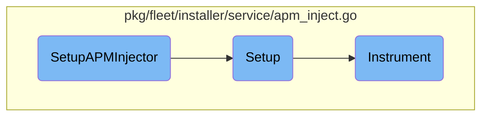

This document explains the process of setting up the APM injector. The setup involves initializing the injector, configuring the environment, and performing the necessary instrumentation.

The setup process starts by initializing the APM injector, which involves starting a new span for tracing and creating an instance of the installer. The installer then configures the environment by setting up default agent sockets, creating necessary symlinks, checking if systemd is running, and creating mandatory directories. Finally, the installer performs the actual instrumentation by verifying the shared library, checking if the host and Docker should be instrumented, and performing the necessary steps for each.

# Flow drill down



<SwmSnippet path="/pkg/fleet/installer/service/apm_inject.go" line="34">

---

## <SwmToken path="pkg/fleet/installer/service/apm_inject.go" pos="34:2:2" line-data="// SetupAPMInjector sets up the injector at bootstrap">`SetupAPMInjector`</SwmToken>

The function <SwmToken path="pkg/fleet/installer/service/apm_inject.go" pos="34:2:2" line-data="// SetupAPMInjector sets up the injector at bootstrap">`SetupAPMInjector`</SwmToken> initializes the APM injector by starting a new span for tracing and creating an instance of <SwmToken path="pkg/fleet/installer/service/apm_inject.go" pos="121:6:6" line-data="func (a *apmInjectorInstaller) Setup(ctx context.Context) error {">`apmInjectorInstaller`</SwmToken>. It then calls the <SwmToken path="pkg/fleet/installer/service/apm_inject.go" pos="40:5:5" line-data="	return installer.Setup(ctx)">`Setup`</SwmToken> method on the installer to configure the environment.

```go
// SetupAPMInjector sets up the injector at bootstrap
func SetupAPMInjector(ctx context.Context) (err error) {
	span, ctx := tracer.StartSpanFromContext(ctx, "setup_injector")
	defer func() { span.Finish(tracer.WithError(err)) }()
	installer := newAPMInjectorInstaller(injectorPath)
	defer func() { installer.Finish(err) }()
	return installer.Setup(ctx)
}
```

---

</SwmSnippet>

<SwmSnippet path="/pkg/fleet/installer/service/apm_inject.go" line="120">

---

## Setup

The <SwmToken path="pkg/fleet/installer/service/apm_inject.go" pos="120:2:2" line-data="// Setup sets up the APM injector">`Setup`</SwmToken> method configures the environment for the APM injector. It sets up default agent sockets, creates necessary symlinks, checks if systemd is running, and creates mandatory directories. It also adds instrument scripts and finally calls the <SwmToken path="pkg/fleet/installer/service/apm_inject.go" pos="192:2:2" line-data="// Instrument instruments the APM injector">`Instrument`</SwmToken> method.

```go
// Setup sets up the APM injector
func (a *apmInjectorInstaller) Setup(ctx context.Context) error {
	var err error

	// Set up defaults for agent sockets
	if err := a.configureSocketsEnv(ctx); err != nil {
		return err
	}
	// Symlinks for sysvinit
	if err := os.Symlink(envFilePath, "/etc/default/datadog-agent-trace"); err != nil && !os.IsExist(err) {
		return fmt.Errorf("failed to symlink %s to /etc/default/datadog-agent-trace: %w", envFilePath, err)
	}
	if err := os.Symlink(envFilePath, "/etc/default/datadog-agent"); err != nil && !os.IsExist(err) {
		return fmt.Errorf("failed to symlink %s to /etc/default/datadog-agent: %w", envFilePath, err)
	}
	systemdRunning, err := isSystemdRunning()
	if err != nil {
		return fmt.Errorf("failed to check if systemd is running: %w", err)
	}
	if systemdRunning {
		if err := addSystemDEnvOverrides(ctx, agentUnit); err != nil {
```

---

</SwmSnippet>

<SwmSnippet path="/pkg/fleet/installer/service/apm_inject.go" line="128">

---

### Creating Symlinks

The <SwmToken path="pkg/fleet/installer/service/apm_inject.go" pos="40:5:5" line-data="	return installer.Setup(ctx)">`Setup`</SwmToken> method creates symlinks for sysvinit to ensure that the environment variables are correctly set for the Datadog agent and trace agent.

```go
	// Symlinks for sysvinit
	if err := os.Symlink(envFilePath, "/etc/default/datadog-agent-trace"); err != nil && !os.IsExist(err) {
		return fmt.Errorf("failed to symlink %s to /etc/default/datadog-agent-trace: %w", envFilePath, err)
	}
	if err := os.Symlink(envFilePath, "/etc/default/datadog-agent"); err != nil && !os.IsExist(err) {
		return fmt.Errorf("failed to symlink %s to /etc/default/datadog-agent: %w", envFilePath, err)
	}
```

---

</SwmSnippet>

<SwmSnippet path="/pkg/fleet/installer/service/apm_inject.go" line="135">

---

### Systemd Configuration

If systemd is running, the <SwmToken path="pkg/fleet/installer/service/apm_inject.go" pos="40:5:5" line-data="	return installer.Setup(ctx)">`Setup`</SwmToken> method adds environment overrides for various systemd units and reloads the systemd configuration.

```go
	systemdRunning, err := isSystemdRunning()
	if err != nil {
		return fmt.Errorf("failed to check if systemd is running: %w", err)
	}
	if systemdRunning {
		if err := addSystemDEnvOverrides(ctx, agentUnit); err != nil {
			return err
		}
		if err := addSystemDEnvOverrides(ctx, agentExp); err != nil {
			return err
		}
		if err := addSystemDEnvOverrides(ctx, traceAgentUnit); err != nil {
			return err
		}
		if err := addSystemDEnvOverrides(ctx, traceAgentExp); err != nil {
			return err
		}
		if err := systemdReload(ctx); err != nil {
			return err
		}
	}
```

---

</SwmSnippet>

<SwmSnippet path="/pkg/fleet/installer/service/apm_inject.go" line="192">

---

## Instrument

The <SwmToken path="pkg/fleet/installer/service/apm_inject.go" pos="192:2:2" line-data="// Instrument instruments the APM injector">`Instrument`</SwmToken> method performs the actual instrumentation of the APM injector. It verifies the shared library, checks if the host and Docker should be instrumented, and performs the necessary steps for each. It also verifies the Docker runtime if Docker instrumentation is enabled.

```go
// Instrument instruments the APM injector
func (a *apmInjectorInstaller) Instrument(ctx context.Context) (retErr error) {
	// Check if the shared library is working before any instrumentation
	if err := a.verifySharedLib(ctx, path.Join(a.installPath, "inject", "launcher.preload.so")); err != nil {
		return err
	}

	if shouldInstrumentHost(a.envs) {
		a.cleanups = append(a.cleanups, a.ldPreloadFileInstrument.cleanup)
		rollbackLDPreload, err := a.ldPreloadFileInstrument.mutate(ctx)
		if err != nil {
			return err
		}
		a.rollbacks = append(a.rollbacks, rollbackLDPreload)
	}

	dockerIsInstalled := isDockerInstalled(ctx)
	if mustInstrumentDocker(a.envs) && !dockerIsInstalled {
		return fmt.Errorf("DD_APM_INSTRUMENTATION_ENABLED is set to docker but docker is not installed")
	}
	if shouldInstrumentDocker(a.envs) && dockerIsInstalled {
```

---

</SwmSnippet>

<SwmSnippet path="/pkg/fleet/installer/service/apm_inject.go" line="194">

---

### Verifying Shared Library

The <SwmToken path="pkg/fleet/installer/service/apm_inject.go" pos="192:2:2" line-data="// Instrument instruments the APM injector">`Instrument`</SwmToken> method first verifies that the shared library is working correctly before proceeding with any instrumentation.

```go
	// Check if the shared library is working before any instrumentation
	if err := a.verifySharedLib(ctx, path.Join(a.installPath, "inject", "launcher.preload.so")); err != nil {
		return err
```

---

</SwmSnippet>

<SwmSnippet path="/pkg/fleet/installer/service/apm_inject.go" line="208">

---

### Docker Instrumentation

The <SwmToken path="pkg/fleet/installer/service/apm_inject.go" pos="192:2:2" line-data="// Instrument instruments the APM injector">`Instrument`</SwmToken> method checks if Docker should be instrumented and performs the necessary steps, including verifying the Docker runtime.

```go
	dockerIsInstalled := isDockerInstalled(ctx)
	if mustInstrumentDocker(a.envs) && !dockerIsInstalled {
		return fmt.Errorf("DD_APM_INSTRUMENTATION_ENABLED is set to docker but docker is not installed")
	}
	if shouldInstrumentDocker(a.envs) && dockerIsInstalled {
		a.cleanups = append(a.cleanups, a.dockerConfigInstrument.cleanup)
		rollbackDocker, err := a.instrumentDocker(ctx)
		if err != nil {
			return err
		}
		a.rollbacks = append(a.rollbacks, rollbackDocker)

		// Verify that the docker runtime is as expected
		if err := a.verifyDockerRuntime(ctx); err != nil {
			return err
		}
	}
```

---

</SwmSnippet>

&nbsp;

*This is an auto-generated document by Swimm AI 🌊 and has not yet been verified by a human*

<SwmMeta version="3.0.0" repo-id="Z2l0aHViJTNBJTNBZGF0YWRvZy1hZ2VudCUzQSUzQVN3aW1tLURlbW8=" repo-name="datadog-agent"><sup>Powered by [Swimm](/)</sup></SwmMeta>
