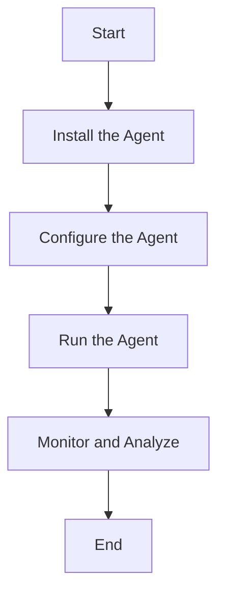

This document will cover the flow of setting up the Datadog Agent, which includes:

1. Installing the Agent
2. Configuring the Agent
3. Running the Agent
4. Monitoring and Analysis.

Technical document: <SwmLink doc-title="" repo-id="Z2l0aHViJTNBJTNBZGF0YWRvZy1hZ2VudCUzQSUzQVN3aW1tLURlbW8=" path="/.swm/.7dzld5bl.sw.md"></SwmLink>

# [Installing the Agent](https://app.swimm.io/repos/Z2l0aHViJTNBJTNBZGF0YWRvZy1hZ2VudCUzQSUzQVN3aW1tLURlbW8=/docs/7dzld5bl#installation)

The first step in setting up the Datadog Agent is to install it on the desired system. This involves downloading the appropriate version of the Agent for your operating system and following the installation instructions. The installation process ensures that the Agent is correctly placed and ready to be configured. This step is crucial as it lays the foundation for the Agent to collect data from various sources.

# [Configuring the Agent](https://app.swimm.io/repos/Z2l0aHViJTNBJTNBZGF0YWRvZy1hZ2VudCUzQSUzQVN3aW1tLURlbW8=/docs/7dzld5bl#configuration)

Once the Agent is installed, it needs to be configured to collect the right metrics, logs, and traces. This involves setting up configuration files where you specify what data sources the Agent should monitor, any specific metrics to collect, and how often to collect them. Proper configuration ensures that the Agent gathers relevant data that is critical for monitoring and analysis. This step allows customization to fit the specific needs of the user, ensuring that the data collected is both useful and actionable.

# [Running the Agent](https://app.swimm.io/repos/Z2l0aHViJTNBJTNBZGF0YWRvZy1hZ2VudCUzQSUzQVN3aW1tLURlbW8=/docs/7dzld5bl#running)

After configuration, the Agent needs to be started. Running the Agent involves executing the command that initiates the data collection process. This step is essential as it activates the Agent, allowing it to begin collecting and sending data to the Datadog platform. Ensuring the Agent runs smoothly is vital for continuous monitoring and real-time data analysis.

# [Monitoring and Analysis](https://app.swimm.io/repos/Z2l0aHViJTNBJTNBZGF0YWRvZy1hZ2VudCUzQSUzQVN3aW1tLURlbW8=/docs/7dzld5bl#monitoring)

The final step is to monitor and analyze the data collected by the Agent. This involves using the Datadog platform to visualize metrics, logs, and traces, set up alerts, and generate reports. Effective monitoring and analysis help in identifying issues, understanding system performance, and making informed decisions. This step is where the value of the Datadog Agent is realized, as it provides insights that drive operational efficiency and reliability.

&nbsp;

*This is an auto-generated document by Swimm AI 🌊 and has not yet been verified by a human*

<SwmMeta version="3.0.0" repo-id="Z2l0aHViJTNBJTNBZGF0YWRvZy1hZ2VudCUzQSUzQVN3aW1tLURlbW8=" repo-name="datadog-agent">Powered by [Swimm](/)</SwmMeta>
