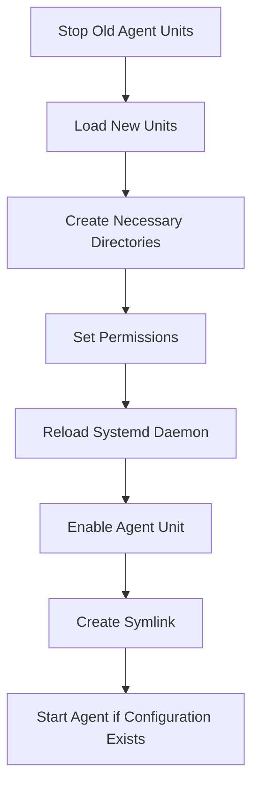

This document will cover the process of setting up the Datadog Agent, which includes:

1. Stopping any old agent units
2. Loading new units
3. Creating necessary directories
4. Setting permissions
5. Reloading the systemd daemon
6. Enabling the agent unit
7. Creating a symlink
8. Starting the agent if the configuration file exists.

Technical document: <SwmLink doc-title="Setting Up the Datadog Agent">[Setting Up the Datadog Agent](/.swm/setting-up-the-datadog-agent.kmuc1pzj.sw.md)</SwmLink>

# [Stopping Old Agent Units](https://app.swimm.io/repos/Z2l0aHViJTNBJTNBZGF0YWRvZy1hZ2VudCUzQSUzQVN3aW1tLURlbW8=/docs/kmuc1pzj#stopoldagentunits)

The first step in setting up the Datadog Agent is to stop any old versions of the agent that might be running. This ensures that there are no conflicts or issues caused by multiple instances of the agent running simultaneously. For the end user, this means a smoother and more reliable setup process, as old configurations or processes won't interfere with the new setup.

# [Loading New Units](https://app.swimm.io/repos/Z2l0aHViJTNBJTNBZGF0YWRvZy1hZ2VudCUzQSUzQVN3aW1tLURlbW8=/docs/kmuc1pzj#loadunit)

Next, the system loads both stable and experimental units of the Datadog Agent. Stable units are the tested and reliable versions, while experimental units may contain new features that are still being tested. This step ensures that the agent is up-to-date with the latest features and improvements. For the end user, this means access to the latest functionalities and enhancements in the Datadog Agent.

# [Creating Necessary Directories](https://app.swimm.io/repos/Z2l0aHViJTNBJTNBZGF0YWRvZy1hZ2VudCUzQSUzQVN3aW1tLURlbW8=/docs/kmuc1pzj#createdirectories)

The setup process then creates the directories needed for the agent to run. These directories are essential for storing configuration files, logs, and other necessary data. For the end user, this step ensures that the agent has the required structure to operate correctly and efficiently.

# [Setting Permissions](https://app.swimm.io/repos/Z2l0aHViJTNBJTNBZGF0YWRvZy1hZ2VudCUzQSUzQVN3aW1tLURlbW8=/docs/kmuc1pzj#setpermissions)

After creating the directories, the system sets the appropriate permissions for these directories. This step is crucial to ensure that the Datadog Agent has the necessary access rights to read and write data. For the end user, this means that the agent will function correctly without permission-related issues.

# [Reloading the Systemd Daemon](https://app.swimm.io/repos/Z2l0aHViJTNBJTNBZGF0YWRvZy1hZ2VudCUzQSUzQVN3aW1tLURlbW8=/docs/kmuc1pzj#reloadsystemddaemon)

The systemd daemon is then reloaded to recognize the new units. Systemd is a system and service manager for Linux operating systems. Reloading it ensures that the changes made (such as loading new units) are recognized and applied. For the end user, this step ensures that the system is aware of the new agent setup and can manage it properly.

# [Enabling the Agent Unit](https://app.swimm.io/repos/Z2l0aHViJTNBJTNBZGF0YWRvZy1hZ2VudCUzQSUzQVN3aW1tLURlbW8=/docs/kmuc1pzj#enableagentunit)

The agent unit is then enabled, which means it is set to start automatically when the system boots. This step ensures that the Datadog Agent will always be running and collecting data without requiring manual intervention. For the end user, this means continuous monitoring and data collection without needing to start the agent manually each time.

# [Creating a Symlink](https://app.swimm.io/repos/Z2l0aHViJTNBJTNBZGF0YWRvZy1hZ2VudCUzQSUzQVN3aW1tLURlbW8=/docs/kmuc1pzj#createsymlink)

A symlink (symbolic link) is created to make it easier to manage the agent. A symlink is a type of file that points to another file or directory. This step simplifies the management of the agent by providing a consistent path to its executable. For the end user, this means easier access and management of the Datadog Agent.

# [Starting the Agent if Configuration Exists](https://app.swimm.io/repos/Z2l0aHViJTNBJTNBZGF0YWRvZy1hZ2VudCUzQSUzQVN3aW1tLURlbW8=/docs/kmuc1pzj#startagent)

Finally, if the configuration file for the agent exists, the agent is started. The configuration file contains the necessary settings and parameters for the agent to operate. For the end user, this step ensures that the agent starts with the correct settings and begins collecting data immediately.

&nbsp;

*This is an auto-generated document by Swimm AI 🌊 and has not yet been verified by a human*

<SwmMeta version="3.0.0" repo-id="Z2l0aHViJTNBJTNBZGF0YWRvZy1hZ2VudCUzQSUzQVN3aW1tLURlbW8=" repo-name="datadog-agent">Powered by [Swimm](/)</SwmMeta>
