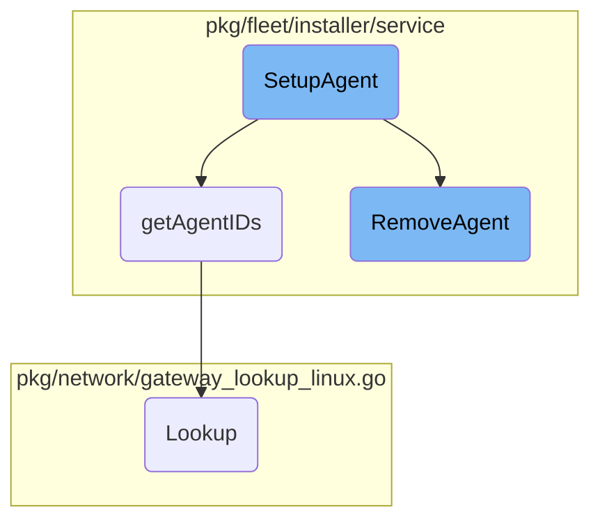

In this document, we will explain the process of setting up the Datadog Agent. The process involves stopping any old agent units, loading new units, creating necessary directories, setting permissions, reloading the systemd daemon, enabling the agent unit, creating a symlink, and finally starting the agent if the configuration file exists.

The flow starts by stopping any old versions of the agent that might be running. Then, it loads both stable and experimental units of the agent. After that, it creates the directories needed for the agent to run and sets the right permissions for these directories. The systemd daemon is then reloaded to recognize the new units, and the agent unit is enabled. A symlink is created to make it easier to manage the agent. Finally, if the configuration file for the agent exists, the agent is started.

# Flow drill down



<SwmSnippet path="/pkg/fleet/installer/service/datadog_agent.go" line="55">

---

## <SwmToken path="pkg/fleet/installer/service/datadog_agent.go" pos="55:2:2" line-data="// SetupAgent installs and starts the agent">`SetupAgent`</SwmToken>

The <SwmToken path="pkg/fleet/installer/service/datadog_agent.go" pos="55:2:2" line-data="// SetupAgent installs and starts the agent">`SetupAgent`</SwmToken> function is responsible for installing and starting the Datadog Agent. It begins by stopping any old agent units and then loads the stable and experimental units. It creates the necessary directories and sets the appropriate permissions. The function also reloads the systemd daemon, enables the agent unit, and creates a symlink for the agent. Finally, it writes the installation information and starts the agent if the configuration file exists.

```go
// SetupAgent installs and starts the agent
func SetupAgent(ctx context.Context, _ []string) (err error) {
	span, ctx := tracer.StartSpanFromContext(ctx, "setup_agent")
	defer func() {
		if err != nil {
			log.Errorf("Failed to setup agent: %s, reverting", err)
			err = errors.Join(err, RemoveAgent(ctx))
		}
		span.Finish(tracer.WithError(err))
	}()

	if err = stopOldAgentUnits(ctx); err != nil {
		return err
	}

	for _, unit := range stableUnits {
		if err = loadUnit(ctx, unit); err != nil {
			return fmt.Errorf("failed to load %s: %v", unit, err)
		}
	}
	for _, unit := range experimentalUnits {
```

---

</SwmSnippet>

<SwmSnippet path="/pkg/fleet/installer/service/datadog_installer.go" line="170">

---

## <SwmToken path="pkg/fleet/installer/service/datadog_installer.go" pos="170:2:2" line-data="// getAgentIDs returns the UID and GID of the dd-agent user and group.">`getAgentIDs`</SwmToken>

The <SwmToken path="pkg/fleet/installer/service/datadog_installer.go" pos="170:2:2" line-data="// getAgentIDs returns the UID and GID of the dd-agent user and group.">`getAgentIDs`</SwmToken> function retrieves the UID and GID of the <SwmToken path="pkg/fleet/installer/service/datadog_installer.go" pos="170:18:20" line-data="// getAgentIDs returns the UID and GID of the dd-agent user and group.">`dd-agent`</SwmToken> user and group. It looks up the user and group, converts their <SwmToken path="tasks/gitlab_helpers.py" pos="90:10:10" line-data="def print_gitlab_object(get_object, ctx, ids, repo=&#39;DataDog/datadog-agent&#39;, jq: str | None = None, jq_colors=True):">`ids`</SwmToken> to integers, and returns them. This is crucial for setting the correct permissions for the Datadog Agent directories.

```go
// getAgentIDs returns the UID and GID of the dd-agent user and group.
func getAgentIDs() (uid, gid int, err error) {
	ddAgentUser, err := user.Lookup("dd-agent")
	if err != nil {
		return -1, -1, fmt.Errorf("dd-agent user not found: %w", err)
	}
	ddAgentGroup, err := user.LookupGroup("dd-agent")
	if err != nil {
		return -1, -1, fmt.Errorf("dd-agent group not found: %w", err)
	}
	ddAgentUID, err := strconv.Atoi(ddAgentUser.Uid)
	if err != nil {
		return -1, -1, fmt.Errorf("error converting dd-agent UID to int: %w", err)
	}
	ddAgentGID, err := strconv.Atoi(ddAgentGroup.Gid)
	if err != nil {
		return -1, -1, fmt.Errorf("error converting dd-agent GID to int: %w", err)
	}
	return ddAgentUID, ddAgentGID, nil
}
```

---

</SwmSnippet>

<SwmSnippet path="/pkg/fleet/installer/service/datadog_agent.go" line="124">

---

## <SwmToken path="pkg/fleet/installer/service/datadog_agent.go" pos="124:2:2" line-data="// RemoveAgent stops and removes the agent">`RemoveAgent`</SwmToken>

The <SwmToken path="pkg/fleet/installer/service/datadog_agent.go" pos="124:2:2" line-data="// RemoveAgent stops and removes the agent">`RemoveAgent`</SwmToken> function stops and removes the Datadog Agent. It stops both experimental and stable units, disables the agent unit, removes the units from disk, and deletes the agent symlink. It also removes the installation information.

```go
// RemoveAgent stops and removes the agent
func RemoveAgent(ctx context.Context) error {
	span, ctx := tracer.StartSpanFromContext(ctx, "remove_agent_units")
	defer span.Finish()
	// stop experiments, they can restart stable agent
	for _, unit := range experimentalUnits {
		if err := stopUnit(ctx, unit); err != nil {
			log.Warnf("Failed to stop %s: %s", unit, err)
		}
	}
	// stop stable agents
	for _, unit := range stableUnits {
		if err := stopUnit(ctx, unit); err != nil {
			log.Warnf("Failed to stop %s: %s", unit, err)
		}
	}

	if err := disableUnit(ctx, agentUnit); err != nil {
		log.Warnf("Failed to disable %s: %s", agentUnit, err)
	}

```

---

</SwmSnippet>

<SwmSnippet path="/pkg/network/gateway_lookup_linux.go" line="114">

---

## Lookup

The <SwmToken path="pkg/network/gateway_lookup_linux.go" pos="114:2:2" line-data="// Lookup performs a gateway lookup for connection stats">`Lookup`</SwmToken> function performs a gateway lookup for connection stats. It determines the destination IP address and calls <SwmToken path="pkg/network/gateway_lookup_linux.go" pos="121:5:5" line-data="	return g.LookupWithIPs(cs.Source, dest, cs.NetNS)">`LookupWithIPs`</SwmToken> to perform the actual lookup. This is used for network-related functionalities within the Datadog Agent.

```go
// Lookup performs a gateway lookup for connection stats
func (g *gatewayLookup) Lookup(cs *ConnectionStats) *Via {
	dest := cs.Dest
	if cs.IPTranslation != nil {
		dest = cs.IPTranslation.ReplSrcIP
	}

	return g.LookupWithIPs(cs.Source, dest, cs.NetNS)
}
```

---

</SwmSnippet>

&nbsp;

*This is an auto-generated document by Swimm AI 🌊 and has not yet been verified by a human*

<SwmMeta version="3.0.0" repo-id="Z2l0aHViJTNBJTNBZGF0YWRvZy1hZ2VudCUzQSUzQVN3aW1tLURlbW8=" repo-name="datadog-agent"><sup>Powered by [Swimm](/)</sup></SwmMeta>
