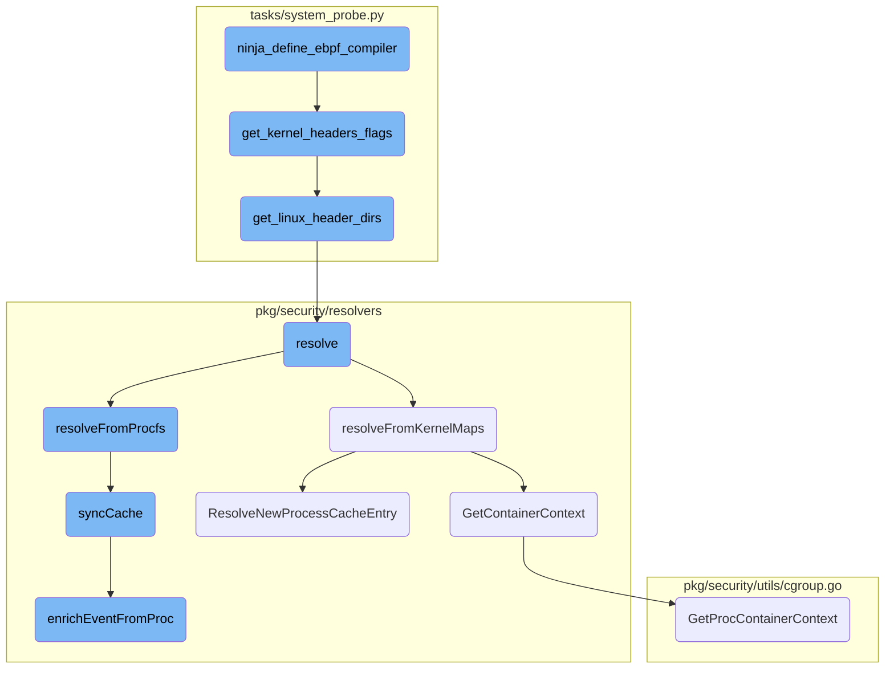

This document explains the process of setting up the <SwmToken path="tasks/system_probe.py" pos="52:5:5" line-data="    &quot;./pkg/ebpf/...&quot;,">`ebpf`</SwmToken> compiler. The process involves defining necessary variables and rules for the Ninja build system, configuring the target architecture, <SwmToken path="tasks/system_probe.py" pos="52:5:5" line-data="    &quot;./pkg/ebpf/...&quot;,">`ebpf`</SwmToken> build flags, and kernel headers, and defining the compilation rules for clang and llc.

The flow starts with defining the <SwmToken path="tasks/system_probe.py" pos="52:5:5" line-data="    &quot;./pkg/ebpf/...&quot;,">`ebpf`</SwmToken> compiler by setting up the necessary variables and rules. It configures the target architecture and <SwmToken path="tasks/system_probe.py" pos="52:5:5" line-data="    &quot;./pkg/ebpf/...&quot;,">`ebpf`</SwmToken> build flags, and retrieves the kernel headers. The process then defines the compilation rules for clang and llc, ensuring that the <SwmToken path="tasks/system_probe.py" pos="52:5:5" line-data="    &quot;./pkg/ebpf/...&quot;,">`ebpf`</SwmToken> programs are compiled correctly. The flow also includes resolving process information using kernel maps and <SwmPath>[pkg/process/procutil/resources/test_procfs/proc/](pkg/process/procutil/resources/test_procfs/proc/)</SwmPath>, synchronizing the process cache, and enriching events with additional metadata.

# Flow drill down



<SwmSnippet path="/tasks/system_probe.py" line="109">

---

## Defining the <SwmToken path="tasks/system_probe.py" pos="52:5:5" line-data="    &quot;./pkg/ebpf/...&quot;,">`ebpf`</SwmToken> Compiler

The function <SwmToken path="tasks/system_probe.py" pos="109:2:2" line-data="def ninja_define_ebpf_compiler(">`ninja_define_ebpf_compiler`</SwmToken> sets up the <SwmToken path="tasks/system_probe.py" pos="52:5:5" line-data="    &quot;./pkg/ebpf/...&quot;,">`ebpf`</SwmToken> compiler by defining necessary variables and rules for the Ninja build system. It configures the target architecture, <SwmToken path="tasks/system_probe.py" pos="52:5:5" line-data="    &quot;./pkg/ebpf/...&quot;,">`ebpf`</SwmToken> build flags, and kernel headers, and defines the compilation rules for clang and llc.

```python
def ninja_define_ebpf_compiler(
    nw: NinjaWriter, strip_object_files=False, kernel_release=None, with_unit_test=False, arch: Arch | None = None
):
    if arch is not None and arch.is_cross_compiling():
        # -target ARCH is important even if we're just emitting LLVM. If we're cross-compiling, clang
        # might fail to interpret cross-arch assembly code (e.g, the headers with arm64-specific ASM code
        # of the linux kernel will fail compilation in x64 hosts due to unknown register names).
        nw.variable("target", f"-target {arch.gcc_arch} -emit-llvm")
    else:
        nw.variable("target", "-emit-llvm")
    nw.variable("ebpfflags", get_ebpf_build_flags(with_unit_test, arch=arch))
    nw.variable("kheaders", get_kernel_headers_flags(kernel_release, arch=arch))
    nw.rule(
        name="ebpfclang",
        command="clang -MD -MF $out.d $target $ebpfflags $kheaders $flags -c $in -o $out",
        depfile="$out.d",
    )
    strip = "&& llvm-strip -g $out" if strip_object_files else ""
    nw.rule(
        name="llc",
        command=f"llc -march=bpf -filetype=obj -o $out $in {strip}",
```

---

</SwmSnippet>

<SwmSnippet path="/tasks/system_probe.py" line="1192">

---

## Getting Kernel Header Flags

The function <SwmToken path="tasks/system_probe.py" pos="1192:2:2" line-data="def get_kernel_headers_flags(kernel_release=None, minimal_kernel_release=None, arch: Arch | None = None):">`get_kernel_headers_flags`</SwmToken> generates a list of flags for the kernel headers by calling <SwmToken path="tasks/system_probe.py" pos="1195:7:7" line-data="        for d in get_linux_header_dirs(">`get_linux_header_dirs`</SwmToken> and formatting the directories into <SwmToken path="tasks/system_probe.py" pos="1194:3:4" line-data="        f&quot;-isystem{d}&quot;">`-isystem`</SwmToken> flags.

```python
def get_kernel_headers_flags(kernel_release=None, minimal_kernel_release=None, arch: Arch | None = None):
    return [
        f"-isystem{d}"
        for d in get_linux_header_dirs(
            kernel_release=kernel_release, minimal_kernel_release=minimal_kernel_release, arch=arch
        )
    ]
```

---

</SwmSnippet>

<SwmSnippet path="/tasks/system_probe.py" line="989">

---

## Getting Linux Header Directories

The function <SwmToken path="tasks/system_probe.py" pos="989:2:2" line-data="def get_linux_header_dirs(">`get_linux_header_dirs`</SwmToken> returns a list of paths to the Linux header directories based on the provided kernel release, minimal kernel release, and architecture. It searches common directories and filters them based on the criteria.

```python
def get_linux_header_dirs(
    kernel_release: str | None = None,
    minimal_kernel_release: tuple[int, int, int] | None = None,
    arch: Arch | None = None,
) -> list[Path]:
    """Return a list of paths to the linux header directories for the given parameters.

    Raises ValueError if no kernel paths can be found

    :param kernel_release: The kernel release to use. If not provided, the current kernel release is used.
        If no headers are found for the given kernel release, the function will try to find the headers for
        some common kernel releases.
    :param minimal_kernel_release: The minimal kernel release to use. If provided, the function will discard
        any headers that are older than the minimal kernel release.
    :param arch: The architecture to use. If not provided, the current architecture is used. If no headers are
        found for the given architecture, the function will try to find the headers for any architecture.
    """
    if not kernel_release:
        os_info = os.uname()
        kernel_release = os_info.release
    kernel_release_vers = parse_kernel_version(kernel_release)
```

---

</SwmSnippet>

<SwmSnippet path="/pkg/security/resolvers/process/resolver_ebpf.go" line="606">

---

## Resolving Process Information

The method <SwmToken path="pkg/security/resolvers/process/resolver_ebpf.go" pos="606:9:9" line-data="func (p *EBPFResolver) resolve(pid, tid uint32, inode uint64, useProcFS bool) *model.ProcessCacheEntry {">`resolve`</SwmToken> attempts to resolve a process cache entry by first checking the cache, then falling back to kernel maps, and finally using <SwmPath>[pkg/process/procutil/resources/test_procfs/proc/](pkg/process/procutil/resources/test_procfs/proc/)</SwmPath> if necessary. It updates hit and miss statistics accordingly.

```go
func (p *EBPFResolver) resolve(pid, tid uint32, inode uint64, useProcFS bool) *model.ProcessCacheEntry {
	if entry := p.resolveFromCache(pid, tid, inode); entry != nil {
		p.hitsStats[metrics.CacheTag].Inc()
		return entry
	}

	if p.state.Load() != Snapshotted {
		return nil
	}

	// fallback to the kernel maps directly, the perf event may be delayed / may have been lost
	if entry := p.resolveFromKernelMaps(pid, tid, inode); entry != nil {
		p.hitsStats[metrics.KernelMapsTag].Inc()
		return entry
	}

	if !useProcFS {
		p.missStats.Inc()
		return nil
	}

```

---

</SwmSnippet>

<SwmSnippet path="/pkg/security/resolvers/process/resolver_ebpf.go" line="787">

---

### Resolving from Kernel Maps

The method <SwmToken path="pkg/security/resolvers/process/resolver_ebpf.go" pos="787:9:9" line-data="func (p *EBPFResolver) resolveFromKernelMaps(pid, tid uint32, inode uint64) *model.ProcessCacheEntry {">`resolveFromKernelMaps`</SwmToken> attempts to resolve a process cache entry using kernel maps. It retrieves the process and container context, verifies the entry, and inserts it into the cache if valid.

```go
func (p *EBPFResolver) resolveFromKernelMaps(pid, tid uint32, inode uint64) *model.ProcessCacheEntry {
	if pid == 0 {
		return nil
	}

	pidb := make([]byte, 4)
	binary.NativeEndian.PutUint32(pidb, pid)

	pidCache, err := p.pidCacheMap.LookupBytes(pidb)
	if err != nil {
		// LookupBytes doesn't return an error if the key is not found thus it is a critical error
		seclog.Errorf("kernel map lookup error: %v", err)
	}
	if pidCache == nil {
		return nil
	}

	// first 4 bytes are the actual cookie
	procCache, err := p.procCacheMap.LookupBytes(pidCache[0:model.SizeOfCookie])
	if err != nil {
		// LookupBytes doesn't return an error if the key is not found thus it is a critical error
```

---

</SwmSnippet>

<SwmSnippet path="/pkg/security/resolvers/process/resolver_ebpf.go" line="875">

---

### Resolving from Procfs

The method <SwmToken path="pkg/security/resolvers/process/resolver_ebpf.go" pos="875:9:9" line-data="func (p *EBPFResolver) resolveFromProcfs(pid uint32, maxDepth int) *model.ProcessCacheEntry {">`resolveFromProcfs`</SwmToken> attempts to resolve a process cache entry using <SwmPath>[pkg/process/procutil/resources/test_procfs/proc/](pkg/process/procutil/resources/test_procfs/proc/)</SwmPath>. It recursively resolves parent processes and updates the cache.

```go
func (p *EBPFResolver) resolveFromProcfs(pid uint32, maxDepth int) *model.ProcessCacheEntry {
	if maxDepth < 1 {
		seclog.Tracef("max depth reached during procfs resolution: %d", pid)
		return nil
	}

	if pid == 0 {
		seclog.Tracef("no pid: %d", pid)
		return nil
	}

	var ppid uint32
	proc, err := process.NewProcess(int32(pid))
	if err != nil {
		seclog.Tracef("unable to find pid: %d", pid)
		return nil
	}

	filledProc, err := utils.GetFilledProcess(proc)
	if err != nil {
		seclog.Tracef("unable to get a filled process for pid %d: %d", pid, err)
```

---

</SwmSnippet>

<SwmSnippet path="/pkg/security/resolvers/process/resolver_ebpf.go" line="1218">

---

## Synchronizing Cache

The method <SwmToken path="pkg/security/resolvers/process/resolver_ebpf.go" pos="1218:2:2" line-data="// syncCache snapshots /proc for the provided pid. This method returns true if it updated the process cache.">`syncCache`</SwmToken> snapshots <SwmPath>[pkg/process/procutil/resources/test_procfs/proc/](pkg/process/procutil/resources/test_procfs/proc/)</SwmPath> for the provided pid and updates the process cache. It marshals the process information and pushes it to kernel space.

```go
// syncCache snapshots /proc for the provided pid. This method returns true if it updated the process cache.
func (p *EBPFResolver) syncCache(proc *process.Process, filledProc *utils.FilledProcess, source uint64) (*model.ProcessCacheEntry, bool) {
	pid := uint32(proc.Pid)

	// Check if an entry is already in cache for the given pid.
	entry := p.entryCache[pid]
	if entry != nil {
		p.setAncestor(entry)

		return entry, false
	}

	entry = p.NewProcessCacheEntry(model.PIDContext{Pid: pid, Tid: pid})
	entry.IsThread = true

	// update the cache entry
	if err := p.enrichEventFromProc(entry, proc, filledProc); err != nil {
		entry.Release()

		seclog.Trace(err)
		return nil, false
```

---

</SwmSnippet>

<SwmSnippet path="/pkg/security/resolvers/process/resolver_ebpf.go" line="752">

---

## Resolving New Process Cache Entry

The method <SwmToken path="pkg/security/resolvers/process/resolver_ebpf.go" pos="752:2:2" line-data="// ResolveNewProcessCacheEntry resolves the context fields of a new process cache entry parsed from kernel data">`ResolveNewProcessCacheEntry`</SwmToken> resolves the context fields of a new process cache entry parsed from kernel data. It sets various process attributes and ensures the entry is correctly populated.

```go
// ResolveNewProcessCacheEntry resolves the context fields of a new process cache entry parsed from kernel data
func (p *EBPFResolver) ResolveNewProcessCacheEntry(entry *model.ProcessCacheEntry, ctrCtx *model.ContainerContext) error {
	if _, err := p.SetProcessPath(&entry.FileEvent, entry, ctrCtx); err != nil {
		return &spath.ErrPathResolution{Err: fmt.Errorf("failed to resolve exec path: %w", err)}
	}

	if entry.HasInterpreter() {
		if _, err := p.SetProcessPath(&entry.LinuxBinprm.FileEvent, entry, ctrCtx); err != nil {
			return &spath.ErrPathResolution{Err: fmt.Errorf("failed to resolve interpreter path: %w", err)}
		}
	} else {
		// mark it as resolved to avoid abnormal path later in the call flow
		entry.LinuxBinprm.FileEvent.SetPathnameStr("")
		entry.LinuxBinprm.FileEvent.SetBasenameStr("")
	}

	p.SetProcessArgs(entry)
	p.SetProcessEnvs(entry)
	p.SetProcessTTY(entry)
	p.SetProcessUsersGroups(entry)
	p.ApplyBootTime(entry)
```

---

</SwmSnippet>

<SwmSnippet path="/pkg/security/resolvers/container/resolver.go" line="19">

---

## Getting Container Context

The method <SwmToken path="pkg/security/resolvers/container/resolver.go" pos="19:2:2" line-data="// GetContainerContext returns the container id of the given pid along with its flags">`GetContainerContext`</SwmToken> returns the container ID and flags for a given pid by parsing the cgroup information from <SwmPath>[pkg/process/procutil/resources/test_procfs/proc/](pkg/process/procutil/resources/test_procfs/proc/)</SwmPath>.

```go
// GetContainerContext returns the container id of the given pid along with its flags
func (cr *Resolver) GetContainerContext(pid uint32) (containerutils.ContainerID, containerutils.CGroupFlags, error) {
	// Parse /proc/[pid]/task/[pid]/cgroup
	return utils.GetProcContainerContext(pid, pid)
}
```

---

</SwmSnippet>

<SwmSnippet path="/pkg/security/utils/cgroup.go" line="83">

---

## Getting Process Container Context

The function <SwmToken path="pkg/security/utils/cgroup.go" pos="83:2:2" line-data="// GetProcContainerContext returns the container ID which the process belongs to along with its manager. Returns &quot;&quot; if the process does not belong">`GetProcContainerContext`</SwmToken> returns the container ID and flags for a process by parsing its cgroup information. It iterates over the control groups to find the container context.

```go
// GetProcContainerContext returns the container ID which the process belongs to along with its manager. Returns "" if the process does not belong
// to a container.
func GetProcContainerContext(tgid, pid uint32) (containerutils.ContainerID, containerutils.CGroupFlags, error) {
	cgroups, err := GetProcControlGroups(tgid, pid)
	if err != nil {
		return "", 0, err
	}

	for _, cgroup := range cgroups {
		if containerID, runtime := cgroup.GetContainerContext(); containerID != "" {
			return containerID, runtime, nil
		}
	}
	return "", 0, nil
}
```

---

</SwmSnippet>

<SwmSnippet path="/pkg/security/resolvers/process/resolver_ebpf.go" line="317">

---

## Enriching Event from Proc

The method <SwmToken path="pkg/security/resolvers/process/resolver_ebpf.go" pos="317:2:2" line-data="// enrichEventFromProc uses /proc to enrich a ProcessCacheEntry with additional metadata">`enrichEventFromProc`</SwmToken> enriches a <SwmToken path="pkg/security/resolvers/process/resolver_ebpf.go" pos="317:15:15" line-data="// enrichEventFromProc uses /proc to enrich a ProcessCacheEntry with additional metadata">`ProcessCacheEntry`</SwmToken> with additional metadata using <SwmPath>[pkg/process/procutil/resources/test_procfs/proc/](pkg/process/procutil/resources/test_procfs/proc/)</SwmPath>. It retrieves process details, container context, and other attributes to populate the cache entry.

```go
// enrichEventFromProc uses /proc to enrich a ProcessCacheEntry with additional metadata
func (p *EBPFResolver) enrichEventFromProc(entry *model.ProcessCacheEntry, proc *process.Process, filledProc *utils.FilledProcess) error {
	// the provided process is a kernel process if its virtual memory size is null
	if filledProc.MemInfo.VMS == 0 {
		return fmt.Errorf("cannot snapshot kernel threads")
	}
	pid := uint32(proc.Pid)

	// Get process filename and pre-fill the cache
	procExecPath := utils.ProcExePath(pid)
	pathnameStr, err := os.Readlink(procExecPath)
	if err != nil {
		return fmt.Errorf("snapshot failed for %d: couldn't readlink binary: %w", proc.Pid, err)
	}
	if pathnameStr == "/ (deleted)" {
		return fmt.Errorf("snapshot failed for %d: binary was deleted", proc.Pid)
	}

	// Get the file fields of the process binary
	info, err := p.retrieveExecFileFields(procExecPath)
	if err != nil {
```

---

</SwmSnippet>

&nbsp;

*This is an auto-generated document by Swimm AI 🌊 and has not yet been verified by a human*

<SwmMeta version="3.0.0" repo-id="Z2l0aHViJTNBJTNBZGF0YWRvZy1hZ2VudCUzQSUzQVN3aW1tLURlbW8=" repo-name="datadog-agent"><sup>Powered by [Swimm](/)</sup></SwmMeta>
