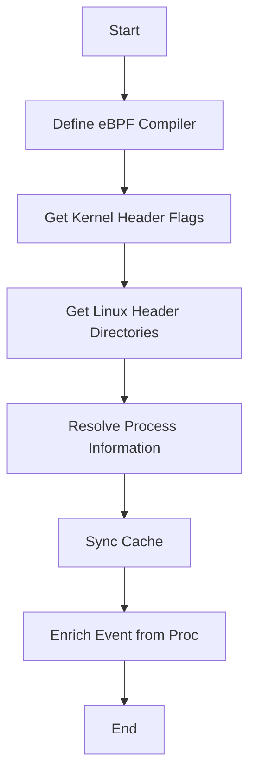

This document will cover the process of setting up the eBPF compiler, which includes:

1. Defining the eBPF Compiler
2. Getting Kernel Header Flags
3. Getting Linux Header Directories
4. Resolving Process Information
5. Synchronizing Cache
6. Enriching Event from Proc

Technical document: <SwmLink doc-title="Setting Up the eBPF Compiler">[Setting Up the eBPF Compiler](/.swm/setting-up-the-ebpf-compiler.kkpdtulq.sw.md)</SwmLink>

# [Defining the eBPF Compiler](https://app.swimm.io/repos/Z2l0aHViJTNBJTNBZGF0YWRvZy1hZ2VudCUzQSUzQVN3aW1tLURlbW8=/docs/kkpdtulq#defining-the-ebpf-compiler)

The first step in setting up the eBPF compiler involves defining the necessary variables and rules. This includes configuring the target architecture and eBPF build flags, and retrieving the kernel headers. The goal is to ensure that the eBPF programs are compiled correctly. This step is crucial for setting up the environment in which the eBPF programs will be built, ensuring compatibility with the target architecture and kernel version.

# [Getting Kernel Header Flags](https://app.swimm.io/repos/Z2l0aHViJTNBJTNBZGF0YWRvZy1hZ2VudCUzQSUzQVN3aW1tLURlbW8=/docs/kkpdtulq#getting-kernel-header-flags)

The next step is to generate a list of flags for the kernel headers. This involves calling a function to retrieve the directories of the Linux headers and formatting them into flags. These flags are essential for the compiler to locate the necessary kernel headers during the build process.

# [Getting Linux Header Directories](https://app.swimm.io/repos/Z2l0aHViJTNBJTNBZGF0YWRvZy1hZ2VudCUzQSUzQVN3aW1tLURlbW8=/docs/kkpdtulq#getting-linux-header-directories)

This step involves retrieving the paths to the Linux header directories based on the provided kernel release, minimal kernel release, and architecture. The function searches common directories and filters them based on the criteria. This ensures that the correct headers are used for the target kernel version and architecture.

&nbsp;

*This is an auto-generated document by Swimm AI 🌊 and has not yet been verified by a human*

<SwmMeta version="3.0.0" repo-id="Z2l0aHViJTNBJTNBZGF0YWRvZy1hZ2VudCUzQSUzQVN3aW1tLURlbW8=" repo-name="datadog-agent">Powered by [Swimm](/)</SwmMeta>
