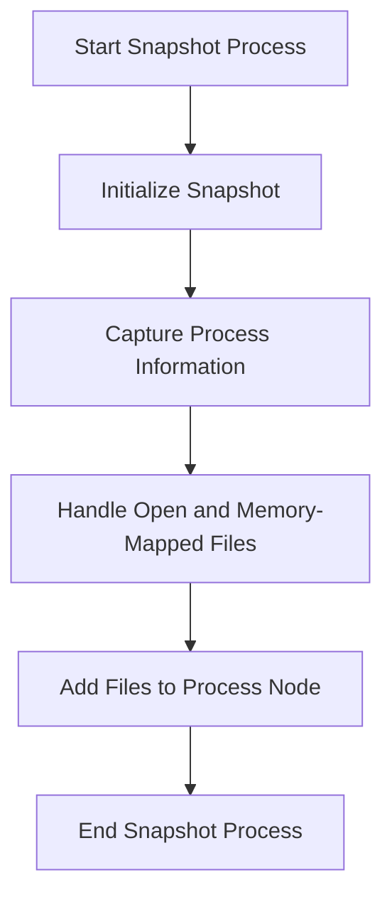

This document will cover the Snapshot Process Overview, which includes:

1. Initializing the snapshot
2. Capturing process information
3. Handling open and memory-mapped files
4. Adding files to the process node

Technical document: <SwmLink doc-title="Snapshot Process Overview">[Snapshot Process Overview](/.swm/snapshot-process-overview.9nzlfa9d.sw.md)</SwmLink>

# [Initializing the snapshot](https://app.swimm.io/repos/Z2l0aHViJTNBJTNBZGF0YWRvZy1hZ2VudCUzQSUzQVN3aW1tLURlbW8=/docs/9nzlfa9d#snapshot-initialization)

The snapshot process begins by initializing the snapshot for each process node in the activity tree. This involves iterating over all process nodes and setting the stage for capturing the state of each process. This step ensures that every process node is prepared for the subsequent data collection.

# [Capturing process information](https://app.swimm.io/repos/Z2l0aHViJTNBJTNBZGF0YWRvZy1hZ2VudCUzQSUzQVN3aW1tLURlbW8=/docs/9nzlfa9d#process-node-snapshot)

In this step, the system retrieves information about the current process and its children. This includes capturing various aspects of the process, such as open files and sockets. The information is gathered by calling specific snapshot methods like `snapshotAllFiles` and `snapshotMemoryMappedFiles`. This step is crucial for understanding the behavior and state of each process at the time of the snapshot.

# [Handling open and memory-mapped files](https://app.swimm.io/repos/Z2l0aHViJTNBJTNBZGF0YWRvZy1hZ2VudCUzQSUzQVN3aW1tLURlbW8=/docs/9nzlfa9d#handling-open-and-memory-mapped-files)

This step involves listing the files opened by the process and the memory-mapped files. The system first lists the open files and logs any errors encountered during this process. It then iterates over the list of file descriptors, sampling the files if their number exceeds a predefined limit. The selected file paths are added to a list. Next, the system lists the memory-mapped files of the process and logs any errors. The lists of open and memory-mapped files are then combined for further processing.

# [Adding files to the process node](https://app.swimm.io/repos/Z2l0aHViJTNBJTNBZGF0YWRvZy1hZ2VudCUzQSUzQVN3aW1tLURlbW8=/docs/9nzlfa9d#adding-files)

In this final step, the system adds the collected files to the process node. It sorts and compacts the list of files, iterates over them, and gathers various file statistics. The system resolves the file paths and package names and versions before inserting the file event into the process node. This step ensures that all relevant file information is accurately captured and associated with the correct process node for further analysis.

&nbsp;

*This is an auto-generated document by Swimm AI 🌊 and has not yet been verified by a human*

<SwmMeta version="3.0.0" repo-id="Z2l0aHViJTNBJTNBZGF0YWRvZy1hZ2VudCUzQSUzQVN3aW1tLURlbW8=" repo-name="datadog-agent">Powered by [Swimm](/)</SwmMeta>
