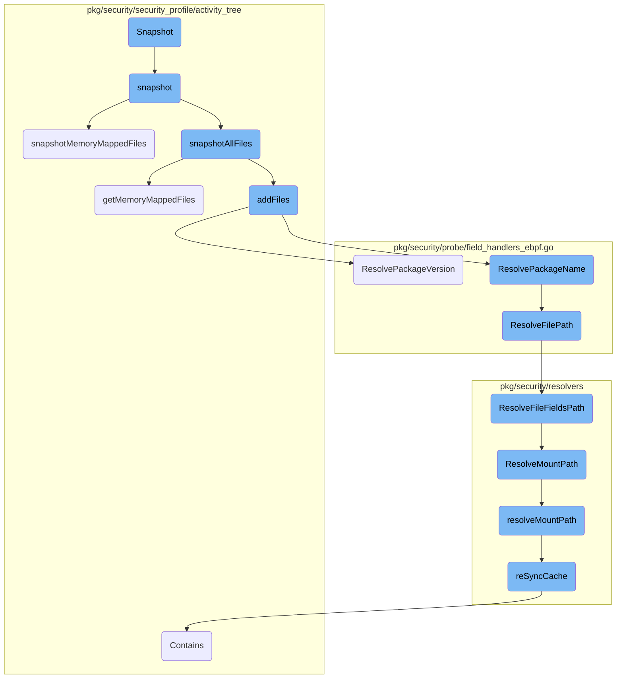
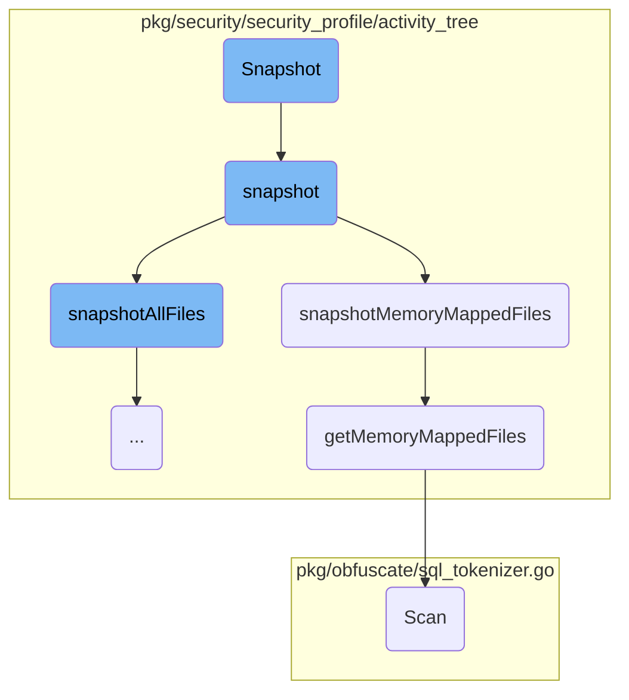
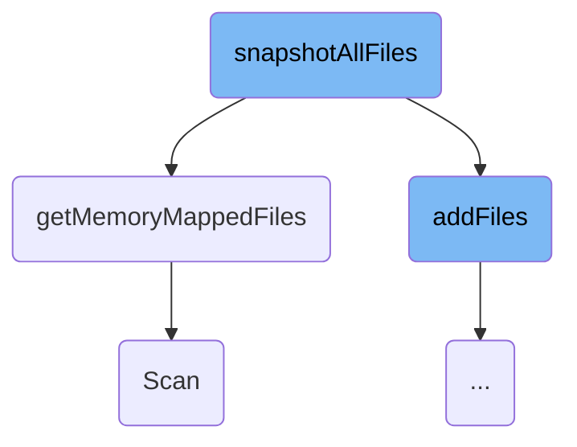
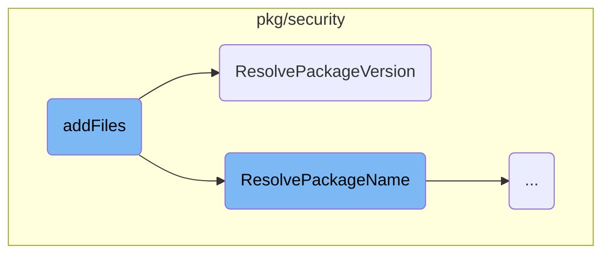
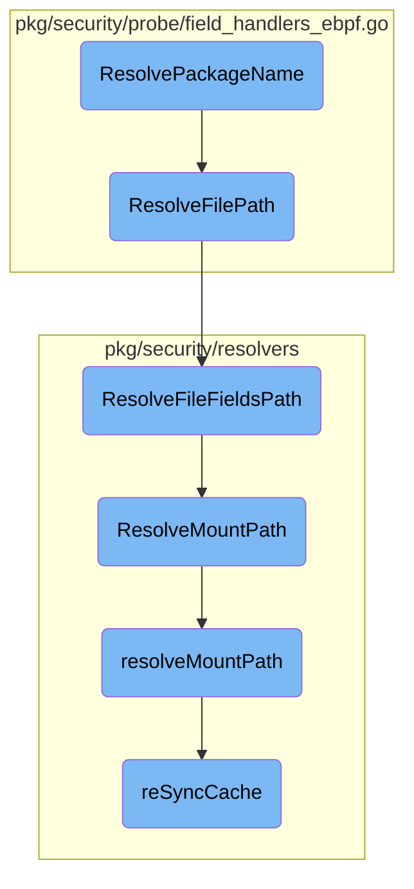

This document explains the snapshot process, which involves capturing the state of processes and their associated files. The snapshot process is crucial for monitoring and analyzing the behavior of processes over time.

The snapshot process starts by initializing the snapshot for each process node in the activity tree. It then captures information about the current process and its children, including open files and memory-mapped files. This information is gathered and added to the process node for further analysis.

Here is a high level diagram of the flow, showing only the most important functions:



# Flow drill down

First, we'll zoom into this section of the flow:



<SwmSnippet path="/pkg/security/security_profile/activity_tree/activity_tree.go" line="822">

---

## Snapshot Initialization

The <SwmToken path="pkg/security/security_profile/activity_tree/activity_tree.go" pos="822:2:2" line-data="// Snapshot uses procfs to snapshot the nodes of the tree">`Snapshot`</SwmToken> method initializes the snapshot process by iterating over all process nodes in the activity tree and calling the <SwmToken path="pkg/security/security_profile/activity_tree/activity_tree.go" pos="822:2:2" line-data="// Snapshot uses procfs to snapshot the nodes of the tree">`Snapshot`</SwmToken> method on each node. This sets the stage for capturing the state of each process.

```go
// Snapshot uses procfs to snapshot the nodes of the tree
func (at *ActivityTree) Snapshot(newEvent func() *model.Event) {
	for _, pn := range at.ProcessNodes {
		pn.snapshot(at.validator, at.Stats, newEvent, at.pathsReducer)
	}
}
```

---

</SwmSnippet>

<SwmSnippet path="/pkg/security/security_profile/activity_tree/process_node_snapshot.go" line="36">

---

## Process Node Snapshot

The <SwmToken path="pkg/security/security_profile/activity_tree/process_node_snapshot.go" pos="36:2:2" line-data="// snapshot uses procfs to retrieve information about the current process">`snapshot`</SwmToken> method in <SwmToken path="pkg/security/security_profile/activity_tree/process_node_snapshot.go" pos="37:6:6" line-data="func (pn *ProcessNode) snapshot(owner Owner, stats *Stats, newEvent func() *model.Event, reducer *PathsReducer) {">`ProcessNode`</SwmToken> retrieves information about the current process and its children. It captures various aspects of the process, such as open files and sockets, by calling specific snapshot methods like <SwmToken path="pkg/security/security_profile/activity_tree/process_node_snapshot.go" pos="52:3:3" line-data="		pn.snapshotAllFiles(p, stats, newEvent, reducer)">`snapshotAllFiles`</SwmToken> and <SwmToken path="pkg/security/security_profile/activity_tree/process_node_snapshot.go" pos="54:3:3" line-data="		pn.snapshotMemoryMappedFiles(p, stats, newEvent, reducer)">`snapshotMemoryMappedFiles`</SwmToken>.

```go
// snapshot uses procfs to retrieve information about the current process
func (pn *ProcessNode) snapshot(owner Owner, stats *Stats, newEvent func() *model.Event, reducer *PathsReducer) {
	// call snapshot for all the children of the current node
	for _, child := range pn.Children {
		child.snapshot(owner, stats, newEvent, reducer)
	}

	// snapshot the current process
	p, err := process.NewProcess(int32(pn.Process.Pid))
	if err != nil {
		// the process doesn't exist anymore, ignore
		return
	}

	// snapshot files
	if owner.IsEventTypeValid(model.FileOpenEventType) {
		pn.snapshotAllFiles(p, stats, newEvent, reducer)
	} else {
		pn.snapshotMemoryMappedFiles(p, stats, newEvent, reducer)
	}

```

---

</SwmSnippet>

<SwmSnippet path="/pkg/security/security_profile/activity_tree/process_node_snapshot.go" line="112">

---

### Memory-Mapped Files Snapshot

The <SwmToken path="pkg/security/security_profile/activity_tree/process_node_snapshot.go" pos="112:9:9" line-data="func (pn *ProcessNode) snapshotMemoryMappedFiles(p *process.Process, stats *Stats, newEvent func() *model.Event, reducer *PathsReducer) {">`snapshotMemoryMappedFiles`</SwmToken> method lists the memory-mapped files of the process and adds them to the process node. This is crucial for understanding the memory usage and file interactions of the process.

```go
func (pn *ProcessNode) snapshotMemoryMappedFiles(p *process.Process, stats *Stats, newEvent func() *model.Event, reducer *PathsReducer) {
	// list the mmaped files of the process
	mmapedFiles, err := getMemoryMappedFiles(p.Pid, pn.Process.FileEvent.PathnameStr)
	if err != nil {
		seclog.Warnf("error while listing memory maps (pid: %v): %s", p.Pid, err)
	}

	pn.addFiles(mmapedFiles, stats, newEvent, reducer)
}
```

---

</SwmSnippet>

<SwmSnippet path="/pkg/security/security_profile/activity_tree/process_node_snapshot.go" line="213">

---

### Retrieving Memory-Mapped Files

The <SwmToken path="pkg/security/security_profile/activity_tree/process_node_snapshot.go" pos="213:2:2" line-data="func getMemoryMappedFiles(pid int32, processEventPath string) (files []string, _ error) {">`getMemoryMappedFiles`</SwmToken> function reads the `/proc/[pid]/smaps` file to list all memory-mapped files for a given process. It filters and returns these files, which are then used by the <SwmToken path="pkg/security/security_profile/activity_tree/process_node_snapshot.go" pos="54:3:3" line-data="		pn.snapshotMemoryMappedFiles(p, stats, newEvent, reducer)">`snapshotMemoryMappedFiles`</SwmToken> method.

```go
func getMemoryMappedFiles(pid int32, processEventPath string) (files []string, _ error) {
	smapsPath := kernel.HostProc(strconv.Itoa(int(pid)), "smaps")
	smapsFile, err := os.Open(smapsPath)
	if err != nil {
		return nil, err
	}
	defer smapsFile.Close()

	files = make([]string, 0, MaxMmapedFiles)
	scanner := bufio.NewScanner(smapsFile)

	for scanner.Scan() && len(files) < MaxMmapedFiles {
		line := scanner.Text()
		fields := strings.Fields(line)

		if len(fields) < 6 || strings.HasSuffix(fields[0], ":") {
			continue
		}

		path := strings.Join(fields[5:], " ")
		if len(path) != 0 && path != processEventPath {
```

---

</SwmSnippet>

<SwmSnippet path="/pkg/obfuscate/sql_tokenizer.go" line="266">

---

## SQL Tokenizer Scan

The <SwmToken path="pkg/obfuscate/sql_tokenizer.go" pos="266:2:2" line-data="// Scan scans the tokenizer for the next token and returns">`Scan`</SwmToken> method in <SwmToken path="pkg/obfuscate/sql_tokenizer.go" pos="268:6:6" line-data="func (tkn *SQLTokenizer) Scan() (TokenKind, []byte) {">`SQLTokenizer`</SwmToken> scans the SQL input for the next token and returns its type and buffer. This method handles various SQL syntax elements, making it essential for SQL parsing and obfuscation.

```go
// Scan scans the tokenizer for the next token and returns
// the token type and the token buffer.
func (tkn *SQLTokenizer) Scan() (TokenKind, []byte) {
	if tkn.lastChar == 0 {
		tkn.advance()
	}
	tkn.SkipBlank()

	switch ch := tkn.lastChar; {
	case isLeadingLetter(ch) &&
		!(tkn.cfg.DBMS == DBMSPostgres && ch == '@'):
		// The '@' symbol should not be considered part of an identifier in
		// postgres, so we skip this in the case where the DBMS is postgres
		// and ch is '@'.
		return tkn.scanIdentifier()
	case isDigit(ch):
		return tkn.scanNumber(false)
	default:
		tkn.advance()
		if tkn.lastChar == EndChar && tkn.err != nil {
			// advance discovered an invalid encoding. We should return early.
```

---

</SwmSnippet>

Now, lets zoom into this section of the flow:



<SwmSnippet path="/pkg/security/security_profile/activity_tree/process_node_snapshot.go" line="68">

---

## Handling open and memory-mapped files

The function <SwmToken path="pkg/security/security_profile/activity_tree/process_node_snapshot.go" pos="52:3:3" line-data="		pn.snapshotAllFiles(p, stats, newEvent, reducer)">`snapshotAllFiles`</SwmToken> begins by listing the files opened by the process using <SwmToken path="pkg/security/security_profile/activity_tree/process_node_snapshot.go" pos="69:8:12" line-data="	fileFDs, err := p.OpenFiles()">`p.OpenFiles()`</SwmToken>. If an error occurs during this process, it logs a warning message.

```go
	// list the files opened by the process
	fileFDs, err := p.OpenFiles()
	if err != nil {
		seclog.Warnf("error while listing files (pid: %v): %s", p.Pid, err)
	}
```

---

</SwmSnippet>

<SwmSnippet path="/pkg/security/security_profile/activity_tree/process_node_snapshot.go" line="84">

---

The function then iterates over the list of file descriptors. If the number of file descriptors exceeds a predefined limit (<SwmToken path="pkg/security/security_profile/activity_tree/process_node_snapshot.go" pos="86:10:10" line-data="		if len(files) &gt;= maxFDsPerProcessSnapshot {">`maxFDsPerProcessSnapshot`</SwmToken>), it samples the files to avoid processing too many at once. The selected file paths are added to the <SwmToken path="pkg/security/security_profile/activity_tree/process_node_snapshot.go" pos="84:1:1" line-data="	files := make([]string, 0, preAlloc)">`files`</SwmToken> slice.

```go
	files := make([]string, 0, preAlloc)
	for _, fd := range fileFDs {
		if len(files) >= maxFDsPerProcessSnapshot {
			break
		}

		if !isSampling || rand.Int63n(int64(len(fileFDs))) < maxFDsPerProcessSnapshot {
			files = append(files, fd.Path)
		}
	}
```

---

</SwmSnippet>

<SwmSnippet path="/pkg/security/security_profile/activity_tree/process_node_snapshot.go" line="98">

---

Next, the function lists the memory-mapped files of the process using <SwmToken path="pkg/security/security_profile/activity_tree/process_node_snapshot.go" pos="99:8:8" line-data="	mmapedFiles, err := getMemoryMappedFiles(p.Pid, pn.Process.FileEvent.PathnameStr)">`getMemoryMappedFiles`</SwmToken>. If an error occurs, it logs a warning message.

```go
	// list the mmaped files of the process
	mmapedFiles, err := getMemoryMappedFiles(p.Pid, pn.Process.FileEvent.PathnameStr)
	if err != nil {
		seclog.Warnf("error while listing memory maps (pid: %v): %s", p.Pid, err)
	}
```

---

</SwmSnippet>

<SwmSnippet path="/pkg/security/security_profile/activity_tree/process_node_snapshot.go" line="104">

---

Finally, the function combines the lists of open and memory-mapped files. If there are any files to process, it calls <SwmToken path="pkg/security/security_profile/activity_tree/process_node_snapshot.go" pos="109:1:3" line-data="	pn.addFiles(files, stats, newEvent, reducer)">`pn.addFiles`</SwmToken> to add these files to the process node.

```go
	files = append(files, mmapedFiles...)
	if len(files) == 0 {
		return
	}

	pn.addFiles(files, stats, newEvent, reducer)
}
```

---

</SwmSnippet>

Now, lets zoom into this section of the flow:



<SwmSnippet path="/pkg/security/security_profile/activity_tree/process_node_snapshot.go" line="122">

---

## Adding Files

The <SwmToken path="pkg/security/security_profile/activity_tree/process_node_snapshot.go" pos="122:9:9" line-data="func (pn *ProcessNode) addFiles(files []string, stats *Stats, newEvent func() *model.Event, reducer *PathsReducer) {">`addFiles`</SwmToken> function is responsible for adding files to the process node. It sorts and compacts the list of files, iterates over them, and gathers various file statistics. It then resolves the file paths and package names and versions before inserting the file event into the process node.

```go
func (pn *ProcessNode) addFiles(files []string, stats *Stats, newEvent func() *model.Event, reducer *PathsReducer) {
	// list the mmaped files of the process
	slices.Sort(files)
	files = slices.Compact(files)

	// insert files
	var (
		err          error
		resolvedPath string
	)
	for _, f := range files {
		if len(f) == 0 {
			continue
		}

		evt := newEvent()
		fullPath := filepath.Join(utils.ProcRootPath(pn.Process.Pid), f)
		if evt.ProcessContext == nil {
			evt.ProcessContext = &model.ProcessContext{}
		}
		if evt.ContainerContext == nil {
```

---

</SwmSnippet>

<SwmSnippet path="/pkg/security/probe/field_handlers_ebpf.go" line="435">

---

### Resolving Package Version

The <SwmToken path="pkg/security/probe/field_handlers_ebpf.go" pos="435:2:2" line-data="// ResolvePackageVersion resolves the version of the package providing this file">`ResolvePackageVersion`</SwmToken> function resolves the version of the package providing the file. It ensures the file path is resolved and uses the SBOM resolver to map the file to its package version.

```go
// ResolvePackageVersion resolves the version of the package providing this file
func (fh *EBPFFieldHandlers) ResolvePackageVersion(ev *model.Event, f *model.FileEvent) string {
	if f.PkgVersion == "" {
		// Force the resolution of file path to be able to map to a package provided file
		if fh.ResolveFilePath(ev, f) == "" {
			return ""
		}

		if fh.resolvers.SBOMResolver == nil {
			return ""
		}

		if pkg := fh.resolvers.SBOMResolver.ResolvePackage(string(ev.ContainerContext.ContainerID), f); pkg != nil {
			f.PkgVersion = pkg.Version
		}
	}
	return f.PkgVersion
}
```

---

</SwmSnippet>

Now, lets zoom into this section of the flow:



<SwmSnippet path="/pkg/security/probe/field_handlers_ebpf.go" line="416">

---

## Resolving Package Name

The <SwmToken path="pkg/security/probe/field_handlers_ebpf.go" pos="416:2:2" line-data="// ResolvePackageName resolves the name of the package providing this file">`ResolvePackageName`</SwmToken> function is responsible for determining the package name that provides a specific file. It first ensures that the file path is resolved using <SwmToken path="pkg/security/probe/field_handlers_ebpf.go" pos="420:5:5" line-data="		if fh.ResolveFilePath(ev, f) == &quot;&quot; {">`ResolveFilePath`</SwmToken>. If the <SwmToken path="pkg/security/probe/field_handlers_ebpf.go" pos="424:7:7" line-data="		if fh.resolvers.SBOMResolver == nil {">`SBOMResolver`</SwmToken> is available, it uses it to map the file to its package, storing the result in <SwmToken path="pkg/security/probe/field_handlers_ebpf.go" pos="418:3:5" line-data="	if f.PkgName == &quot;&quot; {">`f.PkgName`</SwmToken>.

```go
// ResolvePackageName resolves the name of the package providing this file
func (fh *EBPFFieldHandlers) ResolvePackageName(ev *model.Event, f *model.FileEvent) string {
	if f.PkgName == "" {
		// Force the resolution of file path to be able to map to a package provided file
		if fh.ResolveFilePath(ev, f) == "" {
			return ""
		}

		if fh.resolvers.SBOMResolver == nil {
			return ""
		}

		if pkg := fh.resolvers.SBOMResolver.ResolvePackage(string(ev.ContainerContext.ContainerID), f); pkg != nil {
			f.PkgName = pkg.Name
		}
	}
	return f.PkgName
}
```

---

</SwmSnippet>

<SwmSnippet path="/pkg/security/probe/field_handlers_ebpf.go" line="54">

---

## Resolving File Path

The <SwmToken path="pkg/security/probe/field_handlers_ebpf.go" pos="54:2:2" line-data="// ResolveFilePath resolves the inode to a full path">`ResolveFilePath`</SwmToken> function resolves the inode to a full path. It checks if the pathname string is already resolved; if not, it uses the <SwmToken path="pkg/security/probe/field_handlers_ebpf.go" pos="57:21:21" line-data="		path, mountPath, source, origin, err := fh.resolvers.PathResolver.ResolveFileFieldsPath(&amp;f.FileFields, &amp;ev.PIDContext, ev.ContainerContext)">`PathResolver`</SwmToken> to get the full path, mount path, source, and origin. These values are then set in the <SwmToken path="pkg/security/probe/field_handlers_ebpf.go" pos="55:24:24" line-data="func (fh *EBPFFieldHandlers) ResolveFilePath(ev *model.Event, f *model.FileEvent) string {">`FileEvent`</SwmToken> object.

```go
// ResolveFilePath resolves the inode to a full path
func (fh *EBPFFieldHandlers) ResolveFilePath(ev *model.Event, f *model.FileEvent) string {
	if !f.IsPathnameStrResolved && len(f.PathnameStr) == 0 {
		path, mountPath, source, origin, err := fh.resolvers.PathResolver.ResolveFileFieldsPath(&f.FileFields, &ev.PIDContext, ev.ContainerContext)
		if err != nil {
			ev.SetPathResolutionError(f, err)
		}
		f.SetPathnameStr(path)
		f.MountPath = mountPath
		f.MountSource = source
		f.MountOrigin = origin
	}

	return f.PathnameStr
}
```

---

</SwmSnippet>

<SwmSnippet path="/pkg/security/resolvers/path/resolver.go" line="37">

---

## Resolving File Fields Path

The <SwmToken path="pkg/security/resolvers/path/resolver.go" pos="37:2:2" line-data="// ResolveFileFieldsPath resolves an inode/mount ID pair to a full path">`ResolveFileFieldsPath`</SwmToken> function resolves an inode and mount ID pair to a full path. It uses the <SwmToken path="pkg/security/resolvers/path/resolver.go" pos="39:10:10" line-data="	pathStr, err := r.dentryResolver.Resolve(e.PathKey, !e.HasHardLinks())">`dentryResolver`</SwmToken> and <SwmToken path="pkg/security/resolvers/path/resolver.go" pos="41:12:12" line-data="		if _, err := r.mountResolver.IsMountIDValid(e.MountID); errors.Is(err, mount.ErrMountKernelID) {">`mountResolver`</SwmToken> to get the path string, mount path, source, and origin. This function handles various scenarios, including fileless entries and bind mounts.

```go
// ResolveFileFieldsPath resolves an inode/mount ID pair to a full path
func (r *Resolver) ResolveFileFieldsPath(e *model.FileFields, pidCtx *model.PIDContext, ctrCtx *model.ContainerContext) (string, string, model.MountSource, model.MountOrigin, error) {
	pathStr, err := r.dentryResolver.Resolve(e.PathKey, !e.HasHardLinks())
	if err != nil {
		if _, err := r.mountResolver.IsMountIDValid(e.MountID); errors.Is(err, mount.ErrMountKernelID) {
			return pathStr, "", model.MountSourceUnknown, model.MountOriginUnknown, &ErrPathResolutionNotCritical{Err: err}
		}
		return pathStr, "", model.MountSourceUnknown, model.MountOriginUnknown, &ErrPathResolution{Err: err}
	}

	if e.IsFileless() {
		return pathStr, "", model.MountSourceUnknown, model.MountOriginUnknown, nil
	}

	mountPath, source, origin, err := r.mountResolver.ResolveMountPath(e.MountID, e.Device, pidCtx.Pid, string(ctrCtx.ContainerID))
	if err != nil {
		if _, err := r.mountResolver.IsMountIDValid(e.MountID); errors.Is(err, mount.ErrMountKernelID) {
			return pathStr, "", origin, source, &ErrPathResolutionNotCritical{Err: fmt.Errorf("mount ID(%d) invalid: %w", e.MountID, err)}
		}
		return pathStr, "", source, origin, &ErrPathResolution{Err: err}
	}
```

---

</SwmSnippet>

<SwmSnippet path="/pkg/security/resolvers/mount/resolver.go" line="418">

---

## Resolving Mount Path

The <SwmToken path="pkg/security/resolvers/mount/resolver.go" pos="418:2:2" line-data="// ResolveMountPath returns the path of a mount identified by its mount ID.">`ResolveMountPath`</SwmToken> function returns the path of a mount identified by its mount ID. It locks the resolver to ensure thread safety and then calls the <SwmToken path="pkg/security/resolvers/mount/resolver.go" pos="418:2:2" line-data="// ResolveMountPath returns the path of a mount identified by its mount ID.">`ResolveMountPath`</SwmToken> function to perform the actual resolution.

```go
// ResolveMountPath returns the path of a mount identified by its mount ID.
func (mr *Resolver) ResolveMountPath(mountID uint32, device uint32, pid uint32, containerID string) (string, model.MountSource, model.MountOrigin, error) {
	mr.lock.Lock()
	defer mr.lock.Unlock()

	return mr.resolveMountPath(mountID, device, pid, containerID)
}
```

---

</SwmSnippet>

<SwmSnippet path="/pkg/security/resolvers/mount/resolver.go" line="445">

---

### Internal Mount Path Resolution

The <SwmToken path="pkg/security/resolvers/mount/resolver.go" pos="445:9:9" line-data="func (mr *Resolver) resolveMountPath(mountID uint32, device uint32, pid uint32, containerID string) (string, model.MountSource, model.MountOrigin, error) {">`resolveMountPath`</SwmToken> function performs the internal logic for resolving the mount path. It validates the mount ID, attempts to get the mount path, and if necessary, re-syncs the cache to ensure the path is correctly resolved.

```go
func (mr *Resolver) resolveMountPath(mountID uint32, device uint32, pid uint32, containerID string) (string, model.MountSource, model.MountOrigin, error) {
	if _, err := mr.IsMountIDValid(mountID); err != nil {
		return "", model.MountSourceUnknown, model.MountOriginUnknown, err
	}

	// force a resolution here to make sure the LRU keeps doing its job and doesn't evict important entries
	workload, _ := mr.cgroupsResolver.GetWorkload(containerID)

	path, source, origin, err := mr.getMountPath(mountID, device, pid)
	if err == nil {
		mr.cacheHitsStats.Inc()
		return path, source, origin, nil
	}
	mr.cacheMissStats.Inc()

	if !mr.opts.UseProcFS {
		return "", model.MountSourceUnknown, model.MountOriginUnknown, &ErrMountNotFound{MountID: mountID}
	}

	if err := mr.reSyncCache(mountID, []uint32{pid}, containerID, workload); err != nil {
		return "", model.MountSourceUnknown, model.MountOriginUnknown, err
```

---

</SwmSnippet>

<SwmSnippet path="/pkg/security/resolvers/mount/resolver.go" line="430">

---

## Re-Syncing Cache

The <SwmToken path="pkg/security/resolvers/mount/resolver.go" pos="430:9:9" line-data="func (mr *Resolver) reSyncCache(mountID uint32, pids []uint32, containerID string, workload *cmodel.CacheEntry) error {">`reSyncCache`</SwmToken> function updates the cache with the latest mount information. It collects the <SwmToken path="pkg/security/resolvers/mount/resolver.go" pos="430:16:16" line-data="func (mr *Resolver) reSyncCache(mountID uint32, pids []uint32, containerID string, workload *cmodel.CacheEntry) error {">`pids`</SwmToken> associated with the mount and calls <SwmToken path="pkg/security/resolvers/mount/resolver.go" pos="437:9:9" line-data="	if err := mr.syncCache(mountID, pids); err != nil {">`syncCache`</SwmToken> to refresh the cache entries, ensuring accurate path resolution.

```go
func (mr *Resolver) reSyncCache(mountID uint32, pids []uint32, containerID string, workload *cmodel.CacheEntry) error {
	if workload != nil {
		pids = append(pids, workload.GetPIDs()...)
	} else if len(containerID) == 0 && !slices.Contains(pids, 1) {
		pids = append(pids, 1)
	}

	if err := mr.syncCache(mountID, pids); err != nil {
		mr.syncCacheMiss()
		return err
	}

	return nil
}
```

---

</SwmSnippet>

&nbsp;

*This is an auto-generated document by Swimm AI 🌊 and has not yet been verified by a human*

<SwmMeta version="3.0.0" repo-id="Z2l0aHViJTNBJTNBZGF0YWRvZy1hZ2VudCUzQSUzQVN3aW1tLURlbW8=" repo-name="datadog-agent"><sup>Powered by [Swimm](/)</sup></SwmMeta>
