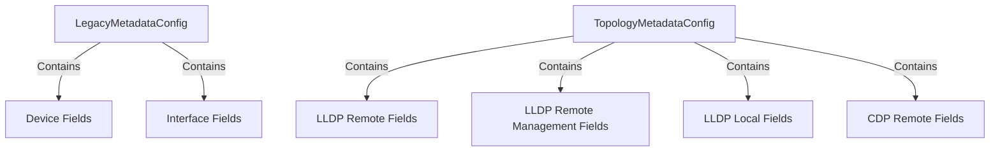

## Overview

SNMP Check Config refers to the configuration settings used for SNMP checks within the Datadog Agent. These configurations are defined in YAML files and include both global settings and instance-specific settings.

## Global Settings

The global settings are specified under the `init_config` section, which contains options that apply to all instances of the SNMP check. These settings are accessed via the `self.init_config` dictionary in Python checks.

## Instance-Specific Settings

Instance-specific settings are defined under the `instances` section, where each item represents a single instance of the SNMP check. These settings include details such as the IP address, SNMP version, and other SNMP-related parameters.

## Building and Validating Configuration

The function <SwmToken path="pkg/collector/corechecks/snmp/internal/checkconfig/config.go" pos="344:2:2" line-data="// NewCheckConfig builds a new check config">`NewCheckConfig`</SwmToken> is responsible for building a new check configuration by unmarshalling the raw instance and init configuration data. It sets default values and validates the configuration, ensuring that either an IP address or network is provided, but not both simultaneously.

<SwmSnippet path="/pkg/collector/corechecks/snmp/internal/checkconfig/config.go" line="344">

---

The function <SwmToken path="pkg/collector/corechecks/snmp/internal/checkconfig/config.go" pos="344:2:2" line-data="// NewCheckConfig builds a new check config">`NewCheckConfig`</SwmToken> builds a new check configuration by setting default values and unmarshalling the raw instance and init configuration data.

```go
// NewCheckConfig builds a new check config
func NewCheckConfig(rawInstance integration.Data, rawInitConfig integration.Data) (*CheckConfig, error) {
	instance := InstanceConfig{}
	initConfig := InitConfig{}

	// Set defaults before unmarshalling
	instance.UseGlobalMetrics = true
	initConfig.CollectDeviceMetadata = true
	initConfig.CollectTopology = true

	err := yaml.Unmarshal(rawInitConfig, &initConfig)
	if err != nil {
		return nil, err
	}

	err = yaml.Unmarshal(rawInstance, &instance)
	if err != nil {
		return nil, err
	}

	c := &CheckConfig{}
```

---

</SwmSnippet>

## Configuration Parameters

The <SwmToken path="pkg/collector/corechecks/snmp/internal/checkconfig/config.go" pos="345:20:20" line-data="func NewCheckConfig(rawInstance integration.Data, rawInitConfig integration.Data) (*CheckConfig, error) {">`CheckConfig`</SwmToken> struct holds various configuration parameters, including SNMP version, IP address, port, and other SNMP-specific settings. It also includes options for collecting device metadata and topology information.

<SwmSnippet path="/pkg/collector/corechecks/snmp/internal/checkconfig/config.go" line="164">

---

The <SwmToken path="pkg/collector/corechecks/snmp/internal/checkconfig/config.go" pos="345:20:20" line-data="func NewCheckConfig(rawInstance integration.Data, rawInitConfig integration.Data) (*CheckConfig, error) {">`CheckConfig`</SwmToken> struct includes parameters such as IP address, port, SNMP version, and options for collecting device metadata and topology information.

```go
	IPAddress       string
	Port            uint16
	CommunityString string
	SnmpVersion     string
	Timeout         int
	Retries         int
	User            string
	AuthProtocol    string
	AuthKey         string
	PrivProtocol    string
	PrivKey         string
	ContextName     string
	OidConfig       OidConfig
	// RequestedMetrics are the metrics explicitly requested by config.
	RequestedMetrics []profiledefinition.MetricsConfig
	// RequestedMetricTags are the tags explicitly requested by config.
	RequestedMetricTags []profiledefinition.MetricTagConfig
	// Metrics combines RequestedMetrics with profile metrics.
	Metrics  []profiledefinition.MetricsConfig
	Metadata profiledefinition.MetadataConfig
	// MetricTags combines RequestedMetricTags with profile metric tags.
```

---

</SwmSnippet>

## Managing <SwmToken path="pkg/collector/corechecks/snmp/internal/checkconfig/config_oid.go" pos="10:10:10" line-data="// OidConfig holds configs for OIDs to fetch">`OIDs`</SwmToken>

The <SwmToken path="pkg/collector/corechecks/snmp/internal/checkconfig/config.go" pos="176:1:1" line-data="	OidConfig       OidConfig">`OidConfig`</SwmToken> struct within <SwmToken path="pkg/collector/corechecks/snmp/internal/checkconfig/config.go" pos="345:20:20" line-data="func NewCheckConfig(rawInstance integration.Data, rawInitConfig integration.Data) (*CheckConfig, error) {">`CheckConfig`</SwmToken> manages the <SwmToken path="pkg/collector/corechecks/snmp/internal/checkconfig/config_oid.go" pos="10:10:10" line-data="// OidConfig holds configs for OIDs to fetch">`OIDs`</SwmToken> (Object Identifiers) to fetch, including scalar and column <SwmToken path="pkg/collector/corechecks/snmp/internal/checkconfig/config_oid.go" pos="10:10:10" line-data="// OidConfig holds configs for OIDs to fetch">`OIDs`</SwmToken>. This struct ensures that <SwmToken path="pkg/collector/corechecks/snmp/internal/checkconfig/config_oid.go" pos="10:10:10" line-data="// OidConfig holds configs for OIDs to fetch">`OIDs`</SwmToken> are added only if they are not already present and sorts them for efficient retrieval.

<SwmSnippet path="/pkg/collector/corechecks/snmp/internal/checkconfig/config_oid.go" line="10">

---

The <SwmToken path="pkg/collector/corechecks/snmp/internal/checkconfig/config_oid.go" pos="10:2:2" line-data="// OidConfig holds configs for OIDs to fetch">`OidConfig`</SwmToken> struct holds configurations for scalar and column <SwmToken path="pkg/collector/corechecks/snmp/internal/checkconfig/config_oid.go" pos="10:10:10" line-data="// OidConfig holds configs for OIDs to fetch">`OIDs`</SwmToken> to fetch.

```go
// OidConfig holds configs for OIDs to fetch
type OidConfig struct {
	// ScalarOids are all scalar oids to fetch
	ScalarOids []string
	// ColumnOids are all column oids to fetch
	ColumnOids []string
}
```

---

</SwmSnippet>

## SNMP Check Config Endpoints

SNMP Check Config Endpoints include <SwmToken path="pkg/collector/corechecks/snmp/internal/checkconfig/config_metadata.go" pos="12:2:2" line-data="// LegacyMetadataConfig contains metadata config used for backward compatibility">`LegacyMetadataConfig`</SwmToken> and <SwmToken path="pkg/collector/corechecks/snmp/internal/checkconfig/config_metadata.go" pos="107:2:2" line-data="// TopologyMetadataConfig represent the metadata needed for topology">`TopologyMetadataConfig`</SwmToken> which provide metadata configurations for device and interface resources.

### <SwmToken path="pkg/collector/corechecks/snmp/internal/checkconfig/config_metadata.go" pos="12:2:2" line-data="// LegacyMetadataConfig contains metadata config used for backward compatibility">`LegacyMetadataConfig`</SwmToken>

The <SwmToken path="pkg/collector/corechecks/snmp/internal/checkconfig/config_metadata.go" pos="12:2:2" line-data="// LegacyMetadataConfig contains metadata config used for backward compatibility">`LegacyMetadataConfig`</SwmToken> contains metadata configurations used for backward compatibility. It provides metadata definitions for device and interface resources when users have their own copies of <SwmPath>[pkg/collector/corechecks/snmp/internal/test/conf.d/snmp.d/profiles/\_base.yaml](pkg/collector/corechecks/snmp/internal/test/conf.d/snmp.d/profiles/_base.yaml)</SwmPath> and <SwmToken path="pkg/collector/corechecks/snmp/internal/checkconfig/config_metadata.go" pos="13:22:24" line-data="// When users have their own copy of _base.yaml and _generic_if.yaml files">`_generic_if.yaml`</SwmToken> files.

<SwmSnippet path="/pkg/collector/corechecks/snmp/internal/checkconfig/config_metadata.go" line="12">

---

The <SwmToken path="pkg/collector/corechecks/snmp/internal/checkconfig/config_metadata.go" pos="12:2:2" line-data="// LegacyMetadataConfig contains metadata config used for backward compatibility">`LegacyMetadataConfig`</SwmToken> is used as a fallback to provide metadata definitions for device and interface resources when users have their own copies of <SwmPath>[pkg/collector/corechecks/snmp/internal/test/conf.d/snmp.d/profiles/\_base.yaml](pkg/collector/corechecks/snmp/internal/test/conf.d/snmp.d/profiles/_base.yaml)</SwmPath> and <SwmToken path="pkg/collector/corechecks/snmp/internal/checkconfig/config_metadata.go" pos="13:22:24" line-data="// When users have their own copy of _base.yaml and _generic_if.yaml files">`_generic_if.yaml`</SwmToken> files.

```go
// LegacyMetadataConfig contains metadata config used for backward compatibility
// When users have their own copy of _base.yaml and _generic_if.yaml files
// they won't have the new profile based metadata definitions for device and interface resources
// The LegacyMetadataConfig is used as fallback to provide metadata definitions for those resources.
```

---

</SwmSnippet>

<SwmSnippet path="/pkg/collector/corechecks/snmp/internal/checkconfig/config_metadata.go" line="16">

---

The <SwmToken path="pkg/collector/corechecks/snmp/internal/checkconfig/config_metadata.go" pos="16:2:2" line-data="var LegacyMetadataConfig = profiledefinition.MetadataConfig{">`LegacyMetadataConfig`</SwmToken> is defined with various fields for devices and interfaces, such as <SwmToken path="pkg/collector/corechecks/snmp/internal/checkconfig/config_metadata.go" pos="19:2:2" line-data="			&quot;description&quot;: {">`description`</SwmToken>, <SwmToken path="pkg/collector/corechecks/snmp/internal/checkconfig/config_metadata.go" pos="22:1:1" line-data="					Name: &quot;sysDescr&quot;,">`Name`</SwmToken>, <SwmToken path="pkg/collector/corechecks/snmp/internal/checkconfig/config_metadata.go" pos="31:2:2" line-data="			&quot;sys_object_id&quot;: {">`sys_object_id`</SwmToken>, and more.

```go
var LegacyMetadataConfig = profiledefinition.MetadataConfig{
	"device": {
		Fields: map[string]profiledefinition.MetadataField{
			"description": {
				Symbol: profiledefinition.SymbolConfig{
					OID:  "1.3.6.1.2.1.1.1.0",
					Name: "sysDescr",
				},
			},
			"name": {
				Symbol: profiledefinition.SymbolConfig{
					OID:  "1.3.6.1.2.1.1.5.0",
					Name: "sysName",
				},
			},
			"sys_object_id": {
				Symbol: profiledefinition.SymbolConfig{
					OID:  "1.3.6.1.2.1.1.2.0",
					Name: "sysObjectID",
				},
			},
```

---

</SwmSnippet>

### <SwmToken path="pkg/collector/corechecks/snmp/internal/checkconfig/config_metadata.go" pos="107:2:2" line-data="// TopologyMetadataConfig represent the metadata needed for topology">`TopologyMetadataConfig`</SwmToken>

The <SwmToken path="pkg/collector/corechecks/snmp/internal/checkconfig/config_metadata.go" pos="107:2:2" line-data="// TopologyMetadataConfig represent the metadata needed for topology">`TopologyMetadataConfig`</SwmToken> represents the metadata needed for topology. It includes fields for LLDP remote, LLDP remote management, LLDP local, and CDP remote, each with specific <SwmToken path="pkg/collector/corechecks/snmp/internal/checkconfig/config_oid.go" pos="10:10:10" line-data="// OidConfig holds configs for OIDs to fetch">`OIDs`</SwmToken> and names to fetch the relevant SNMP data.

<SwmSnippet path="/pkg/collector/corechecks/snmp/internal/checkconfig/config_metadata.go" line="107">

---

The <SwmToken path="pkg/collector/corechecks/snmp/internal/checkconfig/config_metadata.go" pos="107:2:2" line-data="// TopologyMetadataConfig represent the metadata needed for topology">`TopologyMetadataConfig`</SwmToken> includes fields for LLDP remote, LLDP remote management, LLDP local, and CDP remote, each with specific <SwmToken path="pkg/collector/corechecks/snmp/internal/checkconfig/config_oid.go" pos="10:10:10" line-data="// OidConfig holds configs for OIDs to fetch">`OIDs`</SwmToken> and names.

```go
// TopologyMetadataConfig represent the metadata needed for topology
var TopologyMetadataConfig = profiledefinition.MetadataConfig{
	"lldp_remote": {
		Fields: map[string]profiledefinition.MetadataField{
			"chassis_id_type": {
				Symbol: profiledefinition.SymbolConfig{
					OID:  "1.0.8802.1.1.2.1.4.1.1.4",
					Name: "lldpRemChassisIdSubtype",
				},
			},
			"chassis_id": {
				Symbol: profiledefinition.SymbolConfig{
					OID:  "1.0.8802.1.1.2.1.4.1.1.5",
					Name: "lldpRemChassisId",
				},
			},
			"interface_id_type": {
				Symbol: profiledefinition.SymbolConfig{
					OID:  "1.0.8802.1.1.2.1.4.1.1.6",
					Name: "lldpRemPortIdSubtype",
				},
```

---

</SwmSnippet>

&nbsp;

*This is an auto-generated document by Swimm AI 🌊 and has not yet been verified by a human*

<SwmMeta version="3.0.0" repo-id="Z2l0aHViJTNBJTNBZGF0YWRvZy1hZ2VudCUzQSUzQVN3aW1tLURlbW8=" repo-name="datadog-agent"><sup>Powered by [Swimm](/)</sup></SwmMeta>
