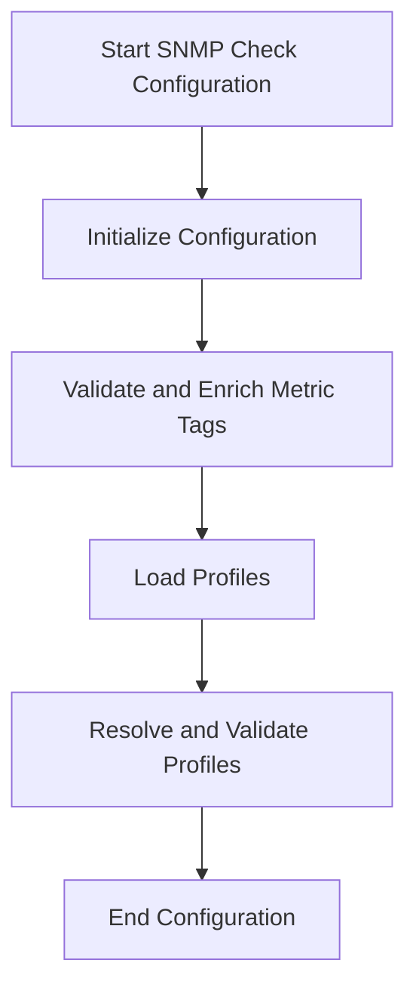

This document will cover the SNMP Check Configuration Process, which includes:

1. Initializing and setting up the SNMP check configuration
2. Validating and enriching metric tags
3. Loading profiles from various sources.

Technical document: <SwmLink doc-title="SNMP Check Configuration Process">[SNMP Check Configuration Process](/.swm/snmp-check-configuration-process.kg77hnnq.sw.md)</SwmLink>

# [Initializing Configuration](https://app.swimm.io/repos/Z2l0aHViJTNBJTNBZGF0YWRvZy1hZ2VudCUzQSUzQVN3aW1tLURlbW8=/docs/kg77hnnq#configure-function)

The SNMP check configuration process begins by initializing a new check configuration. If the configuration name is not set, it assigns a name based on the discovery status. This step ensures that each SNMP check has a unique identifier, which is crucial for tracking and managing the checks. The process also involves setting up common configuration parameters, such as SNMP connection details and requested metrics.

# [Validating and Enriching Metric Tags](https://app.swimm.io/repos/Z2l0aHViJTNBJTNBZGF0YWRvZy1hZ2VudCUzQSUzQVN3aW1tLURlbW8=/docs/kg77hnnq#validateenrichmetrictags-function)

Once the configuration is initialized, the next step is to validate and enrich the metric tags. This involves checking that each metric tag is correctly defined and enriched with additional information. The validation process ensures that the tags are accurate and can be used effectively in monitoring. Enrichment adds extra details to the tags, making them more informative and useful for analysis.

# [Loading Profiles](https://app.swimm.io/repos/Z2l0aHViJTNBJTNBZGF0YWRvZy1hZ2VudCUzQSUzQVN3aW1tLURlbW8=/docs/kg77hnnq#getprofiles)

The final step in the SNMP check configuration process is loading profiles from various sources. Profiles can be loaded from initial configuration profiles, YAML profiles, or downloaded JSON gzip profiles. This step ensures that the SNMP check has access to all the necessary profiles, which contain predefined sets of metrics and tags. These profiles are then resolved and validated to ensure they are ready for use.

&nbsp;

*This is an auto-generated document by Swimm AI 🌊 and has not yet been verified by a human*

<SwmMeta version="3.0.0" repo-id="Z2l0aHViJTNBJTNBZGF0YWRvZy1hZ2VudCUzQSUzQVN3aW1tLURlbW8=" repo-name="datadog-agent">Powered by [Swimm](/)</SwmMeta>
