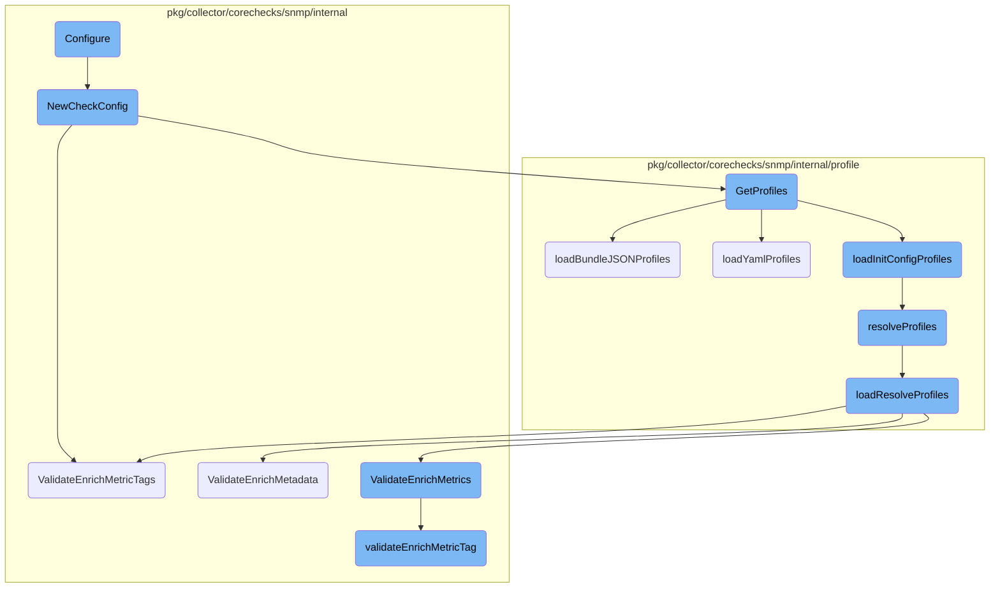
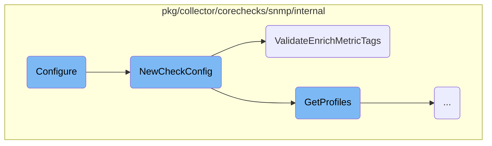
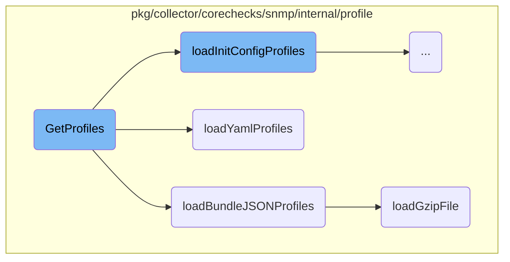
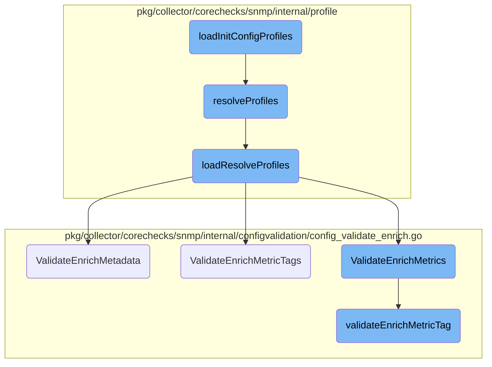

This document explains the configuration process for SNMP checks. The configuration process involves initializing and setting up the SNMP check configuration, validating and enriching metric tags, and loading profiles from various sources.

The configuration process starts by creating a new check configuration. If the configuration name is not set, it assigns a name based on the discovery status. It then builds the check ID and performs common setup tasks. Depending on whether discovery is enabled, it either starts a new discovery process or creates a device check. The process also involves validating and enriching metric tags, which ensures that the tags are correctly defined and enriched. Additionally, profiles are loaded from various sources such as init config profiles, YAML profiles, and downloaded JSON gzip profiles. These profiles are then resolved and validated to ensure they are ready for use.

Here is a high level diagram of the flow, showing only the most important functions:



# Flow drill down

First, we'll zoom into this section of the flow:



<SwmSnippet path="/pkg/collector/corechecks/snmp/snmp.go" line="123">

---

## Configure Function

The <SwmToken path="pkg/collector/corechecks/snmp/snmp.go" pos="123:2:2" line-data="// Configure configures the snmp checks">`Configure`</SwmToken> function initializes and sets up the SNMP check configuration. It starts by creating a new check configuration using <SwmToken path="pkg/collector/corechecks/snmp/snmp.go" pos="127:12:12" line-data="	c.config, err = checkconfig.NewCheckConfig(rawInstance, rawInitConfig)">`NewCheckConfig`</SwmToken>. If the configuration name is not set, it assigns a name based on the discovery status. It then builds the check ID and calls <SwmToken path="pkg/collector/corechecks/snmp/snmp.go" pos="149:13:13" line-data="	// Must be called before c.CommonConfigure">`CommonConfigure`</SwmToken> for common setup tasks. Depending on whether discovery is enabled, it either starts a new discovery process or creates a device check.

```go
// Configure configures the snmp checks
func (c *Check) Configure(senderManager sender.SenderManager, integrationConfigDigest uint64, rawInstance integration.Data, rawInitConfig integration.Data, source string) error {
	var err error

	c.config, err = checkconfig.NewCheckConfig(rawInstance, rawInitConfig)
	if err != nil {
		return fmt.Errorf("build config failed: %s", err)
	}
	log.Debugf("SNMP configuration: %s", c.config.ToString())

	if c.config.Name == "" {
		var CheckName string
		// Set 'name' field of the instance if not already defined in rawInstance config.
		// The name/device_id will be used by Check.BuildID for building the check id.
		// Example of check id: `snmp:<DEVICE_ID>:a3ec59dfb03e4457`
		if c.config.IsDiscovery() {
			CheckName = fmt.Sprintf("%s:%s", c.config.Namespace, c.config.Network)
		} else {
			CheckName = c.config.DeviceID
		}
		setNameErr := rawInstance.SetNameForInstance(CheckName)
```

---

</SwmSnippet>

<SwmSnippet path="/pkg/collector/corechecks/snmp/internal/checkconfig/config.go" line="344">

---

## <SwmToken path="pkg/collector/corechecks/snmp/internal/checkconfig/config.go" pos="344:2:2" line-data="// NewCheckConfig builds a new check config">`NewCheckConfig`</SwmToken> Function

The <SwmToken path="pkg/collector/corechecks/snmp/internal/checkconfig/config.go" pos="344:2:2" line-data="// NewCheckConfig builds a new check config">`NewCheckConfig`</SwmToken> function builds a new check configuration by parsing the raw instance and initialization data. It sets default values, unmarshals the configuration data, and validates the configuration. It also sets up various configuration parameters such as SNMP connection details, requested metrics, and ping configuration. Finally, it updates the device ID and tags and returns the constructed check configuration.

```go
// NewCheckConfig builds a new check config
func NewCheckConfig(rawInstance integration.Data, rawInitConfig integration.Data) (*CheckConfig, error) {
	instance := InstanceConfig{}
	initConfig := InitConfig{}

	// Set defaults before unmarshalling
	instance.UseGlobalMetrics = true
	initConfig.CollectDeviceMetadata = true
	initConfig.CollectTopology = true

	err := yaml.Unmarshal(rawInitConfig, &initConfig)
	if err != nil {
		return nil, err
	}

	err = yaml.Unmarshal(rawInstance, &instance)
	if err != nil {
		return nil, err
	}

	c := &CheckConfig{}
```

---

</SwmSnippet>

<SwmSnippet path="/pkg/collector/corechecks/snmp/internal/configvalidation/config_validate_enrich.go" line="55">

---

## <SwmToken path="pkg/collector/corechecks/snmp/internal/configvalidation/config_validate_enrich.go" pos="55:2:2" line-data="// ValidateEnrichMetricTags validates and enrich metric tags">`ValidateEnrichMetricTags`</SwmToken> Function

The <SwmToken path="pkg/collector/corechecks/snmp/internal/configvalidation/config_validate_enrich.go" pos="55:2:2" line-data="// ValidateEnrichMetricTags validates and enrich metric tags">`ValidateEnrichMetricTags`</SwmToken> function validates and enriches metric tags. It iterates over the provided metric tags and calls <SwmToken path="pkg/collector/corechecks/snmp/internal/configvalidation/config_validate_enrich.go" pos="59:10:10" line-data="		errors = append(errors, validateEnrichMetricTag(&amp;metricTags[i])...)">`validateEnrichMetricTag`</SwmToken> for each tag to perform the validation and enrichment. It collects any validation errors and returns them as a list of error messages.

```go
// ValidateEnrichMetricTags validates and enrich metric tags
func ValidateEnrichMetricTags(metricTags []profiledefinition.MetricTagConfig) []string {
	var errors []string
	for i := range metricTags {
		errors = append(errors, validateEnrichMetricTag(&metricTags[i])...)
	}
	return errors
}
```

---

</SwmSnippet>

Now, lets zoom into this section of the flow:



<SwmSnippet path="/pkg/collector/corechecks/snmp/internal/profile/profile.go" line="18">

---

## <SwmToken path="pkg/collector/corechecks/snmp/internal/profile/profile.go" pos="18:2:2" line-data="// GetProfiles returns profiles depending on various sources:">`GetProfiles`</SwmToken>

The <SwmToken path="pkg/collector/corechecks/snmp/internal/profile/profile.go" pos="18:2:2" line-data="// GetProfiles returns profiles depending on various sources:">`GetProfiles`</SwmToken> function is responsible for returning profiles from various sources such as init config profiles, YAML profiles, and downloaded JSON gzip profiles. It first checks if there are any init config profiles and loads them using <SwmToken path="pkg/collector/corechecks/snmp/internal/profile/profile.go" pos="28:8:8" line-data="		customProfiles, err := loadInitConfigProfiles(initConfigProfiles)">`loadInitConfigProfiles`</SwmToken>. If not, it attempts to load profiles from a JSON bundle using <SwmToken path="pkg/collector/corechecks/snmp/internal/profile/profile.go" pos="34:8:8" line-data="		defaultProfiles, err := loadBundleJSONProfiles(bundlePath)">`loadBundleJSONProfiles`</SwmToken>. If neither of these sources is available, it falls back to loading YAML profiles using <SwmToken path="pkg/collector/corechecks/snmp/internal/profile/profile_yaml.go" pos="30:2:2" line-data="// loadYamlProfiles will load the profiles from disk only once and store it">`loadYamlProfiles`</SwmToken>. Finally, it normalizes the metrics in the profiles before returning them.

```go
// GetProfiles returns profiles depending on various sources:
//   - init config profiles
//   - yaml profiles
//   - downloaded json gzip profiles
//   - remote config profiles
func GetProfiles(initConfigProfiles ProfileConfigMap) (ProfileConfigMap, error) {
	var profiles ProfileConfigMap
	if len(initConfigProfiles) > 0 {
		// TODO: [PERFORMANCE] Load init config custom profiles once for all integrations
		//   There are possibly multiple init configs
		customProfiles, err := loadInitConfigProfiles(initConfigProfiles)
		if err != nil {
			return nil, fmt.Errorf("failed to load profiles from initConfig: %w", err)
		}
		profiles = customProfiles
	} else if bundlePath := findProfileBundleFilePath(); bundlePath != "" {
		defaultProfiles, err := loadBundleJSONProfiles(bundlePath)
		if err != nil {
			return nil, fmt.Errorf("failed to load profiles from json bundle %q: %w", bundlePath, err)
		}
		profiles = defaultProfiles
```

---

</SwmSnippet>

<SwmSnippet path="/pkg/collector/corechecks/snmp/internal/profile/profile_json_bundle.go" line="20">

---

## <SwmToken path="pkg/collector/corechecks/snmp/internal/profile/profile_json_bundle.go" pos="20:2:2" line-data="// loadBundleJSONProfiles finds the gzipped profile bundle and loads profiles from it.">`loadBundleJSONProfiles`</SwmToken>

The <SwmToken path="pkg/collector/corechecks/snmp/internal/profile/profile_json_bundle.go" pos="20:2:2" line-data="// loadBundleJSONProfiles finds the gzipped profile bundle and loads profiles from it.">`loadBundleJSONProfiles`</SwmToken> function finds the gzipped profile bundle and loads profiles from it. It first extracts the JSON string from the gzip file using <SwmToken path="pkg/collector/corechecks/snmp/internal/profile/profile_json_bundle.go" pos="22:8:8" line-data="	jsonStr, err := loadGzipFile(gzipFilePath)">`loadGzipFile`</SwmToken>. Then, it unmarshalls the profiles from the JSON string and resolves them with default profiles. If successful, it returns the resolved profiles.

```go
// loadBundleJSONProfiles finds the gzipped profile bundle and loads profiles from it.
func loadBundleJSONProfiles(gzipFilePath string) (ProfileConfigMap, error) {
	jsonStr, err := loadGzipFile(gzipFilePath)
	if err != nil {
		return nil, err
	}

	userProfiles, err := unmarshallProfilesBundleJSON(jsonStr, gzipFilePath)
	if err != nil {
		return nil, err
	}
	// TODO (separate PR): Use default profiles from json Bundle in priority once it's implemented.
	//       We fallback on Yaml Default Profiles if default profiles are not present in json Bundle.
	defaultProfiles := getYamlDefaultProfiles()

	resolvedProfiles, err := resolveProfiles(userProfiles, defaultProfiles)
	if err != nil {
		return nil, err
	}

	return resolvedProfiles, nil
```

---

</SwmSnippet>

<SwmSnippet path="/pkg/collector/corechecks/snmp/internal/profile/profile_yaml.go" line="30">

---

## <SwmToken path="pkg/collector/corechecks/snmp/internal/profile/profile_yaml.go" pos="30:2:2" line-data="// loadYamlProfiles will load the profiles from disk only once and store it">`loadYamlProfiles`</SwmToken>

The <SwmToken path="pkg/collector/corechecks/snmp/internal/profile/profile_yaml.go" pos="30:2:2" line-data="// loadYamlProfiles will load the profiles from disk only once and store it">`loadYamlProfiles`</SwmToken> function loads profiles from YAML files on disk. It ensures that the profiles are loaded only once and stored in a global configuration map. If the profiles are already cached, it returns them from the cache; otherwise, it builds the profiles by resolving user and default profiles and then caches them for future use.

```go
// loadYamlProfiles will load the profiles from disk only once and store it
// in globalProfileConfigMap. The subsequent call to it will return profiles stored in
// globalProfileConfigMap. The mutex will help loading once when `loadYamlProfiles`
// is called by multiple check instances.
func loadYamlProfiles() (ProfileConfigMap, error) {
	defaultProfilesMu.Lock()
	defer defaultProfilesMu.Unlock()

	profileConfigMap := GetGlobalProfileConfigMap()
	if profileConfigMap != nil {
		log.Debugf("load yaml profiles from cache")
		return profileConfigMap, nil
	}
	log.Debugf("build yaml profiles")

	profiles, err := resolveProfiles(getYamlUserProfiles(), getYamlDefaultProfiles())
	if err != nil {
		return nil, err
	}

	SetGlobalProfileConfigMap(profiles)
```

---

</SwmSnippet>

<SwmSnippet path="/pkg/collector/corechecks/snmp/internal/profile/profile_json_bundle.go" line="73">

---

### Extracting Gzip File

The <SwmToken path="pkg/collector/corechecks/snmp/internal/profile/profile_json_bundle.go" pos="73:2:2" line-data="// loadGzipFile extracts the contents of a gzip file.">`loadGzipFile`</SwmToken> function extracts the contents of a gzip file. It opens the gzip file, creates a new gzip reader, and reads all the contents into a byte slice. This byte slice is then used by <SwmToken path="pkg/collector/corechecks/snmp/internal/profile/profile.go" pos="34:8:8" line-data="		defaultProfiles, err := loadBundleJSONProfiles(bundlePath)">`loadBundleJSONProfiles`</SwmToken> to unmarshal the profiles.

```go
// loadGzipFile extracts the contents of a gzip file.
func loadGzipFile(filePath string) ([]byte, error) {
	gzipFile, err := os.Open(filePath)
	if err != nil {
		return nil, err
	}
	defer gzipFile.Close()
	gzipReader, err := gzip.NewReader(gzipFile)
	if err != nil {
		return nil, err
	}
	defer gzipReader.Close()
	return io.ReadAll(gzipReader)
}
```

---

</SwmSnippet>

Now, lets zoom into this section of the flow:



<SwmSnippet path="/pkg/collector/corechecks/snmp/internal/profile/profile_initconfig.go" line="10">

---

## Loading Initial Configuration Profiles

The function <SwmToken path="pkg/collector/corechecks/snmp/internal/profile/profile_initconfig.go" pos="10:2:2" line-data="func loadInitConfigProfiles(rawInitConfigProfiles ProfileConfigMap) (ProfileConfigMap, error) {">`loadInitConfigProfiles`</SwmToken> is responsible for loading the initial configuration profiles. It iterates over the raw profiles, reads their definitions if available, and merges them with user profiles. It then resolves these profiles and filters them to return only those listed in the initial configuration.

```go
func loadInitConfigProfiles(rawInitConfigProfiles ProfileConfigMap) (ProfileConfigMap, error) {
	initConfigProfiles := make(ProfileConfigMap, len(rawInitConfigProfiles))

	for name, profConfig := range rawInitConfigProfiles {
		if profConfig.DefinitionFile != "" {
			profDefinition, err := readProfileDefinition(profConfig.DefinitionFile)
			if err != nil {
				log.Warnf("unable to load profile %q: %s", name, err)
				continue
			}
			profConfig.Definition = *profDefinition
		}
		initConfigProfiles[name] = profConfig
	}

	userProfiles := mergeProfiles(getYamlUserProfiles(), initConfigProfiles)
	resolvedProfiles, err := resolveProfiles(userProfiles, getYamlDefaultProfiles())
	if err != nil {
		return nil, err
	}

```

---

</SwmSnippet>

<SwmSnippet path="/pkg/collector/corechecks/snmp/internal/profile/profile_resolver.go" line="26">

---

## Resolving Profiles

The function <SwmToken path="pkg/collector/corechecks/snmp/internal/profile/profile_resolver.go" pos="26:2:2" line-data="func resolveProfiles(userProfiles, defaultProfiles ProfileConfigMap) (ProfileConfigMap, error) {">`resolveProfiles`</SwmToken> merges user and default profiles, then calls <SwmToken path="pkg/collector/corechecks/snmp/internal/profile/profile_resolver.go" pos="28:8:8" line-data="	userExpandedProfiles, err := loadResolveProfiles(rawProfiles, defaultProfiles)">`loadResolveProfiles`</SwmToken> to expand and validate them. This step ensures that all profiles are correctly resolved and ready for use.

```go
func resolveProfiles(userProfiles, defaultProfiles ProfileConfigMap) (ProfileConfigMap, error) {
	rawProfiles := mergeProfiles(defaultProfiles, userProfiles)
	userExpandedProfiles, err := loadResolveProfiles(rawProfiles, defaultProfiles)
	if err != nil {
		return nil, fmt.Errorf("failed to load profiles: %w", err)
	}
	return userExpandedProfiles, nil
}
```

---

</SwmSnippet>

<SwmSnippet path="/pkg/collector/corechecks/snmp/internal/profile/profile_resolver.go" line="35">

---

### Loading and Resolving Profiles

The function <SwmToken path="pkg/collector/corechecks/snmp/internal/profile/profile_resolver.go" pos="35:2:2" line-data="func loadResolveProfiles(pConfig ProfileConfigMap, defaultProfiles ProfileConfigMap) (ProfileConfigMap, error) {">`loadResolveProfiles`</SwmToken> performs the actual loading and resolving of profiles. It expands base profiles recursively, normalizes metrics, and validates metadata, metrics, and metric tags. This function ensures that all profiles are fully expanded and validated before being used.

```go
func loadResolveProfiles(pConfig ProfileConfigMap, defaultProfiles ProfileConfigMap) (ProfileConfigMap, error) {
	profiles := make(ProfileConfigMap, len(pConfig))

	for name := range pConfig {
		// No need to resolve abstract profile
		if strings.HasPrefix(name, "_") {
			continue
		}

		newProfileConfig := deepcopy.Copy(pConfig[name]).(ProfileConfig)
		err := recursivelyExpandBaseProfiles(name, &newProfileConfig.Definition, newProfileConfig.Definition.Extends, []string{}, pConfig, defaultProfiles)
		if err != nil {
			log.Warnf("failed to expand profile %q: %v", name, err)
			continue
		}
		profiledefinition.NormalizeMetrics(newProfileConfig.Definition.Metrics)
		errors := configvalidation.ValidateEnrichMetadata(newProfileConfig.Definition.Metadata)
		errors = append(errors, configvalidation.ValidateEnrichMetrics(newProfileConfig.Definition.Metrics)...)
		errors = append(errors, configvalidation.ValidateEnrichMetricTags(newProfileConfig.Definition.MetricTags)...)
		if len(errors) > 0 {
			log.Warnf("validation errors in profile %q: %s", name, strings.Join(errors, "\n"))
```

---

</SwmSnippet>

<SwmSnippet path="/pkg/collector/corechecks/snmp/internal/configvalidation/config_validate_enrich.go" line="104">

---

## Validating and Enriching Metadata

The function <SwmToken path="pkg/collector/corechecks/snmp/internal/configvalidation/config_validate_enrich.go" pos="104:2:2" line-data="// ValidateEnrichMetadata will validate MetadataConfig and enrich it.">`ValidateEnrichMetadata`</SwmToken> validates and enriches the metadata configuration. It checks for valid resources and fields, enriches symbols, and ensures that device resources do not have custom ID tags.

```go
// ValidateEnrichMetadata will validate MetadataConfig and enrich it.
func ValidateEnrichMetadata(metadata profiledefinition.MetadataConfig) []string {
	var errors []string
	for resName := range metadata {
		_, isValidRes := validMetadataResources[resName]
		if !isValidRes {
			errors = append(errors, fmt.Sprintf("invalid resource: %s", resName))
		} else {
			res := metadata[resName]
			for fieldName := range res.Fields {
				_, isValidField := validMetadataResources[resName][fieldName]
				if !isValidField {
					errors = append(errors, fmt.Sprintf("invalid resource (%s) field: %s", resName, fieldName))
					continue
				}
				field := res.Fields[fieldName]
				for i := range field.Symbols {
					errors = append(errors, validateEnrichSymbol(&field.Symbols[i], MetadataSymbol)...)
				}
				if field.Symbol.OID != "" {
					errors = append(errors, validateEnrichSymbol(&field.Symbol, MetadataSymbol)...)
```

---

</SwmSnippet>

<SwmSnippet path="/pkg/collector/corechecks/snmp/internal/configvalidation/config_validate_enrich.go" line="64">

---

## Validating and Enriching Metrics

The function <SwmToken path="pkg/collector/corechecks/snmp/internal/configvalidation/config_validate_enrich.go" pos="64:2:2" line-data="// ValidateEnrichMetrics will validate MetricsConfig and enrich it.">`ValidateEnrichMetrics`</SwmToken> validates and enriches the metrics configuration. It ensures that either a scalar or column symbol is provided, enriches symbols, and checks for the presence of metric tags.

```go
// ValidateEnrichMetrics will validate MetricsConfig and enrich it.
// Example of enrichment:
// - storage of compiled regex pattern
func ValidateEnrichMetrics(metrics []profiledefinition.MetricsConfig) []string {
	var errors []string
	for i := range metrics {
		metricConfig := &metrics[i]
		if !metricConfig.IsScalar() && !metricConfig.IsColumn() {
			errors = append(errors, fmt.Sprintf("either a table symbol or a scalar symbol must be provided: %#v", metricConfig))
		}
		if metricConfig.IsScalar() && metricConfig.IsColumn() {
			errors = append(errors, fmt.Sprintf("table symbol and scalar symbol cannot be both provided: %#v", metricConfig))
		}
		if metricConfig.IsScalar() {
			errors = append(errors, validateEnrichSymbol(&metricConfig.Symbol, ScalarSymbol)...)
		}
		if metricConfig.IsColumn() {
			for j := range metricConfig.Symbols {
				errors = append(errors, validateEnrichSymbol(&metricConfig.Symbols[j], ColumnSymbol)...)
			}
			if len(metricConfig.MetricTags) == 0 {
```

---

</SwmSnippet>

<SwmSnippet path="/pkg/collector/corechecks/snmp/internal/configvalidation/config_validate_enrich.go" line="177">

---

## Validating and Enriching Metric Tags

The function <SwmToken path="pkg/collector/corechecks/snmp/internal/configvalidation/config_validate_enrich.go" pos="177:2:2" line-data="func validateEnrichMetricTag(metricTag *profiledefinition.MetricTagConfig) []string {">`validateEnrichMetricTag`</SwmToken> validates and enriches metric tags. It harmonizes OID and symbol declarations, compiles regex patterns for matching, and ensures that tags and mappings are correctly defined.

```go
func validateEnrichMetricTag(metricTag *profiledefinition.MetricTagConfig) []string {
	var errors []string
	if (metricTag.Column.OID != "" || metricTag.Column.Name != "") && (metricTag.Symbol.OID != "" || metricTag.Symbol.Name != "") {
		errors = append(errors, fmt.Sprintf("metric tag symbol and column cannot be both declared: symbol=%v, column=%v", metricTag.Symbol, metricTag.Column))
	}

	// Move deprecated metricTag.Column to metricTag.Symbol
	if metricTag.Column.OID != "" || metricTag.Column.Name != "" {
		metricTag.Symbol = profiledefinition.SymbolConfigCompat(metricTag.Column)
		metricTag.Column = profiledefinition.SymbolConfig{}
	}

	// OID/Name to Symbol harmonization:
	// When users declare metric tag like:
	//   metric_tags:
	//     - OID: 1.2.3
	//       symbol: aSymbol
	// this will lead to OID stored as MetricTagConfig.OID  and name stored as MetricTagConfig.Symbol.Name
	// When this happens, we harmonize by moving MetricTagConfig.OID to MetricTagConfig.Symbol.OID.
	if metricTag.OID != "" && metricTag.Symbol.OID != "" {
		errors = append(errors, fmt.Sprintf("metric tag OID and symbol.OID cannot be both declared: OID=%s, symbol.OID=%s", metricTag.OID, metricTag.Symbol.OID))
```

---

</SwmSnippet>

&nbsp;

*This is an auto-generated document by Swimm AI 🌊 and has not yet been verified by a human*

<SwmMeta version="3.0.0" repo-id="Z2l0aHViJTNBJTNBZGF0YWRvZy1hZ2VudCUzQSUzQVN3aW1tLURlbW8=" repo-name="datadog-agent"><sup>Powered by [Swimm](/)</sup></SwmMeta>
