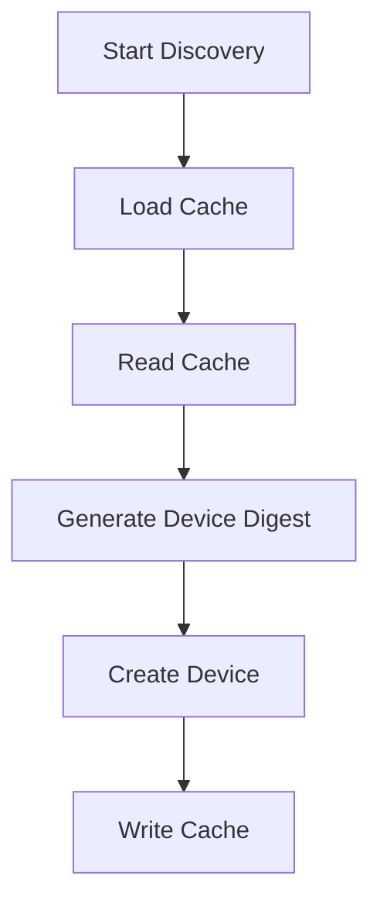

# SNMP Discovery Process

SNMP Discovery is a process used to identify and catalog devices within a network. It involves scanning a subnet to find devices that respond to SNMP queries.

<SwmSnippet path="/pkg/collector/corechecks/snmp/internal/discovery/discovery.go" line="68">

---

# Starting the Discovery Process

The <SwmToken path="pkg/collector/corechecks/snmp/internal/discovery/discovery.go" pos="71:5:5" line-data="	go d.discoverDevices()">`discoverDevices`</SwmToken> method initiates the discovery process by calling <SwmToken path="pkg/collector/corechecks/snmp/internal/discovery/discovery.go" pos="280:9:9" line-data="func (d *Discovery) loadCache(subnet *snmpSubnet) {">`loadCache`</SwmToken> to retrieve previously discovered devices from the cache.

```go
// Start discovery
func (d *Discovery) Start() {
	log.Debugf("subnet %s: Start discovery", d.config.Network)
	go d.discoverDevices()
}
```

---

</SwmSnippet>

<SwmSnippet path="/pkg/collector/corechecks/snmp/internal/discovery/discovery.go" line="280">

---

# Loading Cached Devices

The <SwmToken path="pkg/collector/corechecks/snmp/internal/discovery/discovery.go" pos="280:9:9" line-data="func (d *Discovery) loadCache(subnet *snmpSubnet) {">`loadCache`</SwmToken> method reads the cache using <SwmToken path="pkg/collector/corechecks/snmp/internal/discovery/discovery.go" pos="281:10:10" line-data="	devices, err := d.readCache(subnet)">`readCache`</SwmToken>, which retrieves cached device <SwmToken path="tasks/kernel_matrix_testing/ci.py" pos="126:1:1" line-data="        ips: set[str] = set()">`ips`</SwmToken> and unmarshals them into a list. For each device IP, it generates a device digest and calls <SwmToken path="pkg/collector/corechecks/snmp/internal/discovery/discovery.go" pos="288:3:3" line-data="		d.createDevice(deviceDigest, subnet, deviceIP.String(), false)">`createDevice`</SwmToken> to add the device to the discovery list.

```go
func (d *Discovery) loadCache(subnet *snmpSubnet) {
	devices, err := d.readCache(subnet)
	if err != nil {
		log.Errorf("subnet %s: error reading cache: %s", d.config.Network, err)
		return
	}
	for _, deviceIP := range devices {
		deviceDigest := subnet.config.DeviceDigest(deviceIP.String())
		d.createDevice(deviceDigest, subnet, deviceIP.String(), false)
	}
}
```

---

</SwmSnippet>

<SwmSnippet path="/pkg/collector/corechecks/snmp/internal/checkconfig/config.go" line="623">

---

# Generating Device Digest

For each device IP, <SwmToken path="pkg/collector/corechecks/snmp/internal/discovery/discovery.go" pos="280:9:9" line-data="func (d *Discovery) loadCache(subnet *snmpSubnet) {">`loadCache`</SwmToken> generates a device digest using the <SwmToken path="pkg/collector/corechecks/snmp/internal/checkconfig/config.go" pos="623:2:2" line-data="// DeviceDigest returns a hash value representing the minimal configs used to connect to the device.">`DeviceDigest`</SwmToken> method and then calls <SwmToken path="pkg/collector/corechecks/snmp/internal/discovery/discovery.go" pos="212:9:9" line-data="func (d *Discovery) createDevice(deviceDigest checkconfig.DeviceDigest, subnet *snmpSubnet, deviceIP string, writeCache bool) {">`createDevice`</SwmToken> to add the device to the discovery list.

```go
// DeviceDigest returns a hash value representing the minimal configs used to connect to the device.
// DeviceDigest is used for device discovery.
func (c *CheckConfig) DeviceDigest(address string) DeviceDigest {
	h := fnv.New64()
	// Hash write never returns an error
	h.Write([]byte(address))                   //nolint:errcheck
	h.Write([]byte(fmt.Sprintf("%d", c.Port))) //nolint:errcheck
	h.Write([]byte(c.SnmpVersion))             //nolint:errcheck
	h.Write([]byte(c.CommunityString))         //nolint:errcheck
	h.Write([]byte(c.User))                    //nolint:errcheck
	h.Write([]byte(c.AuthKey))                 //nolint:errcheck
	h.Write([]byte(c.AuthProtocol))            //nolint:errcheck
	h.Write([]byte(c.PrivKey))                 //nolint:errcheck
	h.Write([]byte(c.PrivProtocol))            //nolint:errcheck
	h.Write([]byte(c.ContextName))             //nolint:errcheck

	// Sort the addresses to get a stable digest
	addresses := make([]string, 0, len(c.IgnoredIPAddresses))
	for ip := range c.IgnoredIPAddresses {
		addresses = append(addresses, ip)
	}
```

---

</SwmSnippet>

<SwmSnippet path="/pkg/collector/corechecks/snmp/internal/discovery/discovery.go" line="292">

---

# Storing Discovered Devices

The <SwmToken path="pkg/collector/corechecks/snmp/internal/discovery/discovery.go" pos="292:9:9" line-data="func (d *Discovery) writeCache(subnet *snmpSubnet) {">`writeCache`</SwmToken> method is used to store discovered devices back into the cache, ensuring that future discovery processes can quickly access previously found devices.

```go
func (d *Discovery) writeCache(subnet *snmpSubnet) {
	// We don't lock the subnet for now, because the discovery ought to be already locked
	devices := make([]string, 0, len(subnet.devices))
	for _, v := range subnet.devices {
		devices = append(devices, v)
	}

	cacheValue, err := json.Marshal(devices)
	if err != nil {
		log.Errorf("subnet %s: Couldn't marshal cache: %s", d.config.Network, err)
		return
	}

	if err = persistentcache.Write(subnet.cacheKey, string(cacheValue)); err != nil {
		log.Errorf("subnet %s: Couldn't write cache: %s", d.config.Network, err)
	}
}
```

---

</SwmSnippet>

# Main Functions

There are several main functions in this folder. Some of them are Start, Stop, <SwmToken path="pkg/collector/corechecks/snmp/internal/discovery/discovery.go" pos="71:5:5" line-data="	go d.discoverDevices()">`discoverDevices`</SwmToken>, <SwmToken path="pkg/collector/corechecks/snmp/internal/discovery/discovery.go" pos="280:9:9" line-data="func (d *Discovery) loadCache(subnet *snmpSubnet) {">`loadCache`</SwmToken>, <SwmToken path="pkg/collector/corechecks/snmp/internal/discovery/discovery.go" pos="212:9:9" line-data="func (d *Discovery) createDevice(deviceDigest checkconfig.DeviceDigest, subnet *snmpSubnet, deviceIP string, writeCache bool) {">`createDevice`</SwmToken>, <SwmToken path="pkg/collector/corechecks/snmp/internal/discovery/discovery.go" pos="241:2:2" line-data="// deleteDevice removes a device from discovered devices list and cache">`deleteDevice`</SwmToken>. We will dive a little into <SwmToken path="pkg/collector/corechecks/snmp/internal/discovery/discovery.go" pos="71:5:5" line-data="	go d.discoverDevices()">`discoverDevices`</SwmToken> and <SwmToken path="pkg/collector/corechecks/snmp/internal/discovery/discovery.go" pos="280:9:9" line-data="func (d *Discovery) loadCache(subnet *snmpSubnet) {">`loadCache`</SwmToken>.

<SwmSnippet path="/pkg/collector/corechecks/snmp/internal/discovery/discovery.go" line="110">

---

# Discover Devices

The <SwmToken path="pkg/collector/corechecks/snmp/internal/discovery/discovery.go" pos="110:9:9" line-data="func (d *Discovery) discoverDevices() {">`discoverDevices`</SwmToken> method initiates the discovery process by parsing the network configuration and creating a <SwmToken path="pkg/collector/corechecks/snmp/internal/discovery/discovery.go" pos="122:5:5" line-data="	subnet := snmpSubnet{">`snmpSubnet`</SwmToken> instance. It then loads the cache and starts worker goroutines to handle device discovery jobs.

```go
func (d *Discovery) discoverDevices() {
	ipAddr, ipNet, err := net.ParseCIDR(d.config.Network)
	if err != nil {
		log.Errorf("subnet %s: Couldn't parse SNMP network: %s", d.config.Network, err)
		return
	}

	startingIP := ipAddr.Mask(ipNet.Mask)

	configHash := d.config.DeviceDigest(d.config.Network)
	cacheKey := fmt.Sprintf("%s:%s", cacheKeyPrefix, configHash)

	subnet := snmpSubnet{
		config:     d.config,
		startingIP: startingIP,
		network:    *ipNet,
		cacheKey:   cacheKey,

		// Since subnet devices fields (`devices` and `deviceFailures`) are changed at the same time
		// as Discovery.discoveredDevices, we rely on Discovery.discDevMu mutex to protect against concurrent changes.
		devices:        map[checkconfig.DeviceDigest]string{},
```

---

</SwmSnippet>

<SwmSnippet path="/pkg/collector/corechecks/snmp/internal/discovery/discovery.go" line="212">

---

# Create Device

The <SwmToken path="pkg/collector/corechecks/snmp/internal/discovery/discovery.go" pos="212:9:9" line-data="func (d *Discovery) createDevice(deviceDigest checkconfig.DeviceDigest, subnet *snmpSubnet, deviceIP string, writeCache bool) {">`createDevice`</SwmToken> method creates a new device check and adds the device to the discovered devices list. It also updates the subnet's device map and writes the cache if necessary.

```go
func (d *Discovery) createDevice(deviceDigest checkconfig.DeviceDigest, subnet *snmpSubnet, deviceIP string, writeCache bool) {
	deviceCk, err := devicecheck.NewDeviceCheck(subnet.config, deviceIP, d.sessionFactory)
	if err != nil {
		// should not happen since the deviceCheck is expected to be valid at this point
		// and are only changing the device ip
		log.Warnf("subnet %s: failed to create new device check `%s`: %s", d.config.Network, deviceIP, err)
		return
	}

	d.discDevMu.Lock()
	defer d.discDevMu.Unlock()

	if _, present := d.discoveredDevices[deviceDigest]; present {
		return
	}
	device := Device{
		deviceDigest: deviceDigest,
		deviceIP:     deviceIP,
		deviceCheck:  deviceCk,
	}
	d.discoveredDevices[deviceDigest] = device
```

---

</SwmSnippet>

<SwmSnippet path="/pkg/collector/corechecks/snmp/internal/discovery/discovery.go" line="241">

---

# Delete Device

The <SwmToken path="pkg/collector/corechecks/snmp/internal/discovery/discovery.go" pos="241:2:2" line-data="// deleteDevice removes a device from discovered devices list and cache">`deleteDevice`</SwmToken> method removes a device from the discovered devices list and cache if the allowed device failures count is reached. It updates the subnet's device failures map and writes the cache.

```go
// deleteDevice removes a device from discovered devices list and cache
// if the allowed device failures count is reached
func (d *Discovery) deleteDevice(deviceDigest checkconfig.DeviceDigest, subnet *snmpSubnet) {
	d.discDevMu.Lock()
	defer d.discDevMu.Unlock()
	if _, present := d.discoveredDevices[deviceDigest]; present {
		failure, present := subnet.deviceFailures[deviceDigest]
		if !present {
			subnet.deviceFailures[deviceDigest] = 1
			failure = 1
		} else {
			subnet.deviceFailures[deviceDigest]++
			failure++
		}

		if d.config.DiscoveryAllowedFailures != -1 && failure >= d.config.DiscoveryAllowedFailures {
			delete(d.discoveredDevices, deviceDigest)
			delete(subnet.devices, deviceDigest)
			delete(subnet.deviceFailures, deviceDigest)
			d.writeCache(subnet)
		}
```

---

</SwmSnippet>

&nbsp;

*This is an auto-generated document by Swimm AI 🌊 and has not yet been verified by a human*

<SwmMeta version="3.0.0" repo-id="Z2l0aHViJTNBJTNBZGF0YWRvZy1hZ2VudCUzQSUzQVN3aW1tLURlbW8=" repo-name="datadog-agent"><sup>Powered by [Swimm](/)</sup></SwmMeta>
