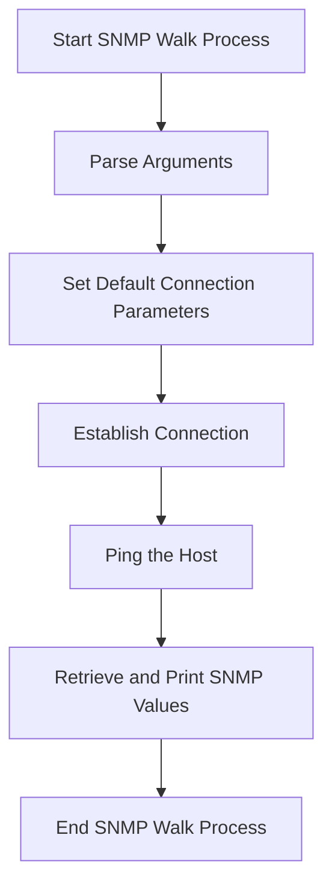

This document will cover the SNMP Walk Process, which includes:

1. Parsing Arguments
2. Setting Default Connection Parameters
3. Establishing Connection
4. Pinging the Host
5. Retrieving and Printing SNMP Values.

Technical document: <SwmLink doc-title="SNMP Walk Process">[SNMP Walk Process](/.swm/snmp-walk-process.uyc25v4r.sw.md)</SwmLink>

# [Parsing Arguments](https://app.swimm.io/repos/Z2l0aHViJTNBJTNBZGF0YWRvZy1hZ2VudCUzQSUzQVN3aW1tLURlbW8=/docs/uyc25v4r#snmpwalk-function)

The process begins by parsing the provided arguments to obtain the IP address and an optional Object Identifier (OID). This step ensures that the necessary information is available to initiate the SNMP walk. If the arguments are not provided correctly, the process will not proceed.

# [Setting Default Connection Parameters](https://app.swimm.io/repos/Z2l0aHViJTNBJTNBZGF0YWRvZy1hZ2VudCUzQSUzQVN3aW1tLURlbW8=/docs/uyc25v4r#setting-defaults-from-agent)

Default connection parameters are set from the agent configuration. This includes parameters such as version, port, community string, username, authentication protocol, and keys. This step ensures that the connection parameters are correctly configured, which is essential for establishing a successful connection to the SNMP agent.

# [Establishing Connection](https://app.swimm.io/repos/Z2l0aHViJTNBJTNBZGF0YWRvZy1hZ2VudCUzQSUzQVN3aW1tLURlbW8=/docs/uyc25v4r#establishing-connection)

A connection to the SNMP agent is established. This step involves setting up the connection parameters and ensuring that the connection is successfully established before any SNMP operations are performed. If the connection cannot be established, the process will not proceed.

# [Pinging the Host](https://app.swimm.io/repos/Z2l0aHViJTNBJTNBZGF0YWRvZy1hZ2VudCUzQSUzQVN3aW1tLURlbW8=/docs/uyc25v4r#pinging-the-host)

The host is pinged to verify connectivity to the SNMP agent. This step ensures that the SNMP agent is reachable and responsive. If the ping fails, it indicates that the SNMP agent is not reachable, and the process will not proceed.

# [Retrieving and Printing SNMP Values](https://app.swimm.io/repos/Z2l0aHViJTNBJTNBZGF0YWRvZy1hZ2VudCUzQSUzQVN3aW1tLURlbW8=/docs/uyc25v4r#snmpwalk-function)

Finally, the SNMP values are retrieved and printed. This step involves performing an SNMP walk to gather all the SNMP values from the agent and printing them in a readable format. This is the final step in the process, providing the user with the requested SNMP data.

&nbsp;

*This is an auto-generated document by Swimm AI 🌊 and has not yet been verified by a human*

<SwmMeta version="3.0.0" repo-id="Z2l0aHViJTNBJTNBZGF0YWRvZy1hZ2VudCUzQSUzQVN3aW1tLURlbW8=" repo-name="datadog-agent">Powered by [Swimm](/)</SwmMeta>
