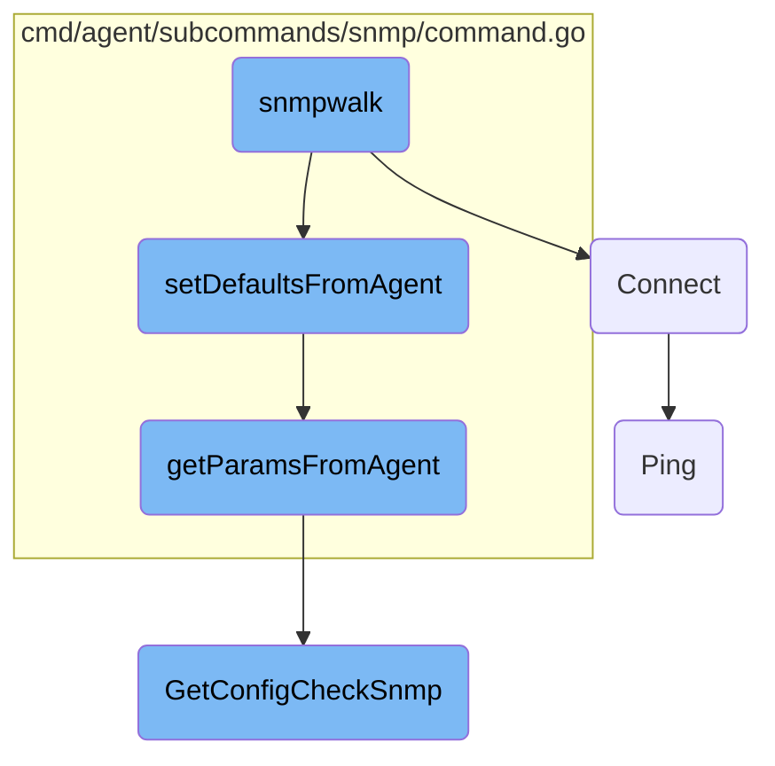

This document explains the <SwmToken path="cmd/agent/subcommands/snmp/command.go" pos="471:2:2" line-data="// snmpwalk prints every SNMP value, in the style of the unix snmpwalk command.">`snmpwalk`</SwmToken> function, which is responsible for printing every SNMP value, similar to the Unix <SwmToken path="cmd/agent/subcommands/snmp/command.go" pos="471:2:2" line-data="// snmpwalk prints every SNMP value, in the style of the unix snmpwalk command.">`snmpwalk`</SwmToken> command. The function parses arguments, sets default connection parameters, establishes a connection to the SNMP agent, and performs an SNMP walk to retrieve and print values.

The <SwmToken path="cmd/agent/subcommands/snmp/command.go" pos="471:2:2" line-data="// snmpwalk prints every SNMP value, in the style of the unix snmpwalk command.">`snmpwalk`</SwmToken> function starts by parsing the provided arguments to get the IP address and optional OID. It then sets default connection parameters from the agent configuration. Next, it establishes a connection to the SNMP agent and performs a ping to verify connectivity. Finally, it retrieves and prints the SNMP values.

# Flow drill down



<SwmSnippet path="/cmd/agent/subcommands/snmp/command.go" line="471">

---

## snmpwalk Function

The <SwmToken path="cmd/agent/subcommands/snmp/command.go" pos="471:2:2" line-data="// snmpwalk prints every SNMP value, in the style of the unix snmpwalk command.">`snmpwalk`</SwmToken> function is responsible for printing every SNMP value, similar to the Unix <SwmToken path="cmd/agent/subcommands/snmp/command.go" pos="471:2:2" line-data="// snmpwalk prints every SNMP value, in the style of the unix snmpwalk command.">`snmpwalk`</SwmToken> command. It parses the arguments, sets default connection parameters, establishes a connection to the SNMP agent, and performs an SNMP walk to retrieve and print values.

```go
// snmpwalk prints every SNMP value, in the style of the unix snmpwalk command.
func snmpwalk(connParams *connectionParams, args argsType, conf config.Component, logger log.Component) error {
	// Parse args
	if len(args) == 0 {
		return confErrf("missing argument: IP address")
	}
	deviceAddr := args[0]
	oid := ""
	if len(args) > 1 {
		oid = args[1]
	}
	if len(args) > 2 {
		return confErrf("the number of arguments must be between 1 and 2. %d arguments were given.", len(args))
	}
	// Parse port from IP address
	connParams.IPAddress, connParams.Port, _ = maybeSplitIP(deviceAddr)
	agentErr := setDefaultsFromAgent(connParams, conf)
	if agentErr != nil {
		// Warn that we couldn't contact the agent, but keep going in case the
		// user provided enough arguments to do this anyway.
		fmt.Fprintf(os.Stderr, "Warning: %v\n", agentErr)
```

---

</SwmSnippet>

<SwmSnippet path="/pkg/collector/corechecks/oracle/connection_handling.go" line="29">

---

### Establishing Connection

The <SwmToken path="pkg/collector/corechecks/oracle/connection_handling.go" pos="29:2:2" line-data="// Connect establishes a connection to an Oracle instance and returns an open connection to the database.">`Connect`</SwmToken> function establishes a connection to an Oracle instance and returns an open connection to the database. This function is crucial for setting up the connection parameters and ensuring that the connection is successfully established before any SNMP operations are performed.

```go
// Connect establishes a connection to an Oracle instance and returns an open connection to the database.
func (c *Check) Connect() (*sqlx.DB, error) {
	var connStr string
	var oracleDriver string
	if c.config.TnsAlias != "" {
		connStr = fmt.Sprintf(`user="%s" password="%s" connectString="%s"`, c.config.Username, c.config.Password, c.config.TnsAlias)
		oracleDriver = "godror"
	} else {
		// godror ezconnect string
		if c.config.InstanceConfig.OracleClient {
			oracleDriver = "godror"
			protocolString := ""
			walletString := ""
			if c.config.Protocol == "TCPS" {
				protocolString = "tcps://"
				if c.config.Wallet != "" {
					walletString = fmt.Sprintf("?wallet_location=%s", c.config.Wallet)
				}
			}
			connStr = fmt.Sprintf(`user="%s" password="%s" connectString="%s%s:%d/%s%s"`, c.config.Username, c.config.Password, protocolString, c.config.Server, c.config.Port, c.config.ServiceName, walletString)
		} else {
```

---

</SwmSnippet>

<SwmSnippet path="/cmd/agent/subcommands/snmp/command.go" line="269">

---

## Setting Defaults from Agent

The <SwmToken path="cmd/agent/subcommands/snmp/command.go" pos="269:2:2" line-data="func setDefaultsFromAgent(connParams *connectionParams, conf config.Component) error {">`setDefaultsFromAgent`</SwmToken> function sets default connection parameters from the agent configuration. It retrieves parameters such as version, port, community string, username, authentication protocol, and keys, ensuring that the connection parameters are correctly configured.

```go
func setDefaultsFromAgent(connParams *connectionParams, conf config.Component) error {
	agentParams, agentError := getParamsFromAgent(connParams.IPAddress, conf)
	if agentError != nil {
		return agentError
	}
	if connParams.Version == "" {
		connParams.Version = agentParams.Version
	}
	if connParams.Port == 0 {
		connParams.Port = agentParams.Port
	}
	if connParams.CommunityString == "" {
		connParams.CommunityString = agentParams.CommunityString
	}
	if connParams.Username == "" {
		connParams.Username = agentParams.Username
	}
	if connParams.AuthProtocol == "" {
		connParams.AuthProtocol = agentParams.AuthProtocol
	}
	if connParams.AuthKey == "" {
```

---

</SwmSnippet>

<SwmSnippet path="/cmd/agent/subcommands/snmp/command.go" line="256">

---

## Getting Parameters from Agent

The <SwmToken path="cmd/agent/subcommands/snmp/command.go" pos="256:2:2" line-data="func getParamsFromAgent(deviceIP string, conf config.Component) (*parse.SNMPConfig, error) {">`getParamsFromAgent`</SwmToken> function retrieves SNMP configuration parameters from the agent based on the device IP address. It loads the SNMP configuration and returns the relevant parameters for the specified device.

```go
func getParamsFromAgent(deviceIP string, conf config.Component) (*parse.SNMPConfig, error) {
	snmpConfigList, err := parse.GetConfigCheckSnmp(conf)
	if err != nil {
		return nil, fmt.Errorf("unable to load SNMP config from agent: %w", err)
	}
	instance := parse.GetIPConfig(deviceIP, snmpConfigList)
	if instance.IPAddress != "" {
		instance.IPAddress = deviceIP
		return &instance, nil
	}
	return nil, fmt.Errorf("agent has no SNMP config for IP %s", deviceIP)
}
```

---

</SwmSnippet>

<SwmSnippet path="/pkg/networkdevice/pinger/pinger_linux.go" line="36">

---

### Pinging the Host

The <SwmToken path="pkg/networkdevice/pinger/pinger_linux.go" pos="36:2:2" line-data="// Ping takes a host and depending on the config will either">`Ping`</SwmToken> function pings a host and returns the result. Depending on the configuration, it either sends packets over a UDP socket or a raw socket. This function is used to verify the connectivity to the SNMP agent.

```go
// Ping takes a host and depending on the config will either
// directly ping the host sending packets over a UDP socket
// or a raw socket
func (p *LinuxPinger) Ping(host string) (*Result, error) {
	if !p.cfg.UseRawSocket {
		return RunPing(&p.cfg, host)
	}

	tu, err := net.GetRemoteSystemProbeUtil(
		dd_config.SystemProbe.GetString("system_probe_config.sysprobe_socket"))
	if err != nil {
		log.Warnf("could not initialize system-probe connection: %s", err.Error())
		return nil, err
	}
	resp, err := tu.GetPing(clientID, host, p.cfg.Count, p.cfg.Interval, p.cfg.Timeout)
	if err != nil {
		return nil, err
	}

	var result Result
	if err := json.Unmarshal(resp, &result); err != nil {
```

---

</SwmSnippet>

<SwmSnippet path="/pkg/snmp/snmpparse/config_snmp.go" line="142">

---

## Getting SNMP Config Check

The <SwmToken path="pkg/snmp/snmpparse/config_snmp.go" pos="142:2:2" line-data="// GetConfigCheckSnmp returns each SNMPConfig for all running config checks, by querying the local agent.">`GetConfigCheckSnmp`</SwmToken> function returns the SNMP configuration for all running config checks by querying the local agent. It retrieves the configuration and parses it to return an array of SNMP configurations.

```go
// GetConfigCheckSnmp returns each SNMPConfig for all running config checks, by querying the local agent.
// If the agent isn't running or is unreachable, this will fail.
func GetConfigCheckSnmp(conf config.Component) ([]SNMPConfig, error) {
	// TODO: change the URL if the snmp check is a cluster check
	// add /agent/config-check to cluster agent API
	// Copy the code from comp/core/autodiscovery/autodiscoveryimpl/autoconfig.go#writeConfigCheck
	endpoint, err := apiutil.NewIPCEndpoint(conf, "/agent/config-check")
	if err != nil {
		return nil, err
	}
	urlValues := url.Values{}
	urlValues.Set("raw", "true")

	res, err := endpoint.DoGet(apiutil.WithValues(urlValues))
	if err != nil {
		return nil, err
	}

	cr := integration.ConfigCheckResponse{}
	err = json.Unmarshal(res, &cr)
	if err != nil {
```

---

</SwmSnippet>

&nbsp;

*This is an auto-generated document by Swimm AI 🌊 and has not yet been verified by a human*

<SwmMeta version="3.0.0" repo-id="Z2l0aHViJTNBJTNBZGF0YWRvZy1hZ2VudCUzQSUzQVN3aW1tLURlbW8=" repo-name="datadog-agent"><sup>Powered by [Swimm](/)</sup></SwmMeta>
