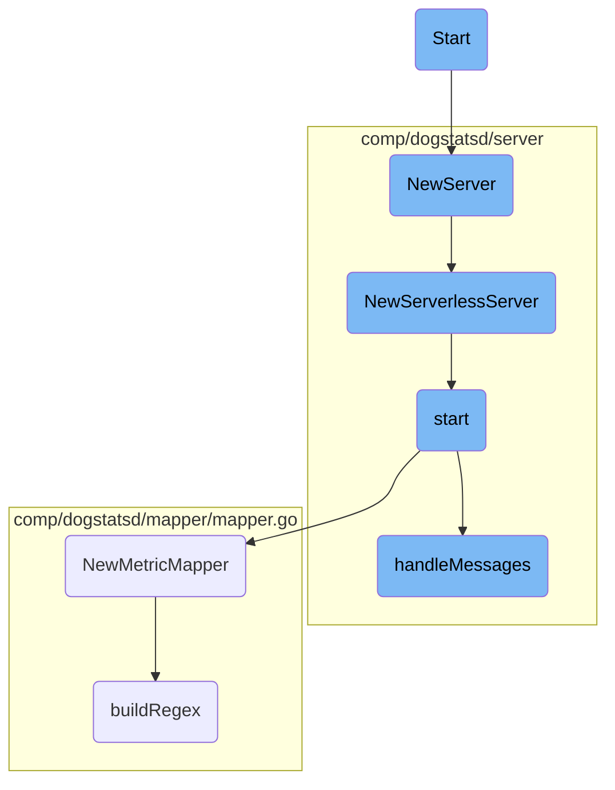

This document explains the process of starting different components and servers within the Datadog Agent. The process involves initializing configurations, setting up servers, and handling incoming messages.

The flow begins with initializing configurations and setting up the necessary servers. Once the servers are set up, they start listening for incoming connections. The process also includes handling incoming messages and processing them accordingly.

# Flow drill down



<SwmSnippet path="/pkg/trace/api/otlp.go" line="70">

---

## Initialization

The <SwmToken path="pkg/trace/api/otlp.go" pos="70:2:2" line-data="// Start starts the OTLPReceiver, if any of the servers were configured as active.">`Start`</SwmToken> function initializes the <SwmToken path="pkg/trace/api/otlp.go" pos="70:8:8" line-data="// Start starts the OTLPReceiver, if any of the servers were configured as active.">`OTLPReceiver`</SwmToken> by configuring and starting the <SwmToken path="pkg/trace/api/otlp.go" pos="76:12:12" line-data="			log.Criticalf(&quot;Error starting OpenTelemetry gRPC server: %v&quot;, err)">`gRPC`</SwmToken> server if it is set to be active. This involves setting up the server, registering it, and starting it to listen for incoming connections.

```go
// Start starts the OTLPReceiver, if any of the servers were configured as active.
func (o *OTLPReceiver) Start() {
	cfg := o.conf.OTLPReceiver
	if cfg.GRPCPort != 0 {
		ln, err := net.Listen("tcp", fmt.Sprintf("%s:%d", cfg.BindHost, cfg.GRPCPort))
		if err != nil {
			log.Criticalf("Error starting OpenTelemetry gRPC server: %v", err)
		} else {
			o.grpcsrv = grpc.NewServer(
				grpc.MaxRecvMsgSize(10*1024*1024),
				grpc.MaxConcurrentStreams(1), // Each payload must be sent to processing stage before we decode the next.
			)
			ptraceotlp.RegisterGRPCServer(o.grpcsrv, o)
			o.wg.Add(1)
			go func() {
				defer o.wg.Done()
				if err := o.grpcsrv.Serve(ln); err != nil {
					log.Criticalf("Error starting OpenTelemetry gRPC server: %v", err)
				}
			}()
			log.Debugf("Listening to core Agent for OTLP traces on internal gRPC port (http://%s:%d, internal use only). Check core Agent logs for information on the OTLP ingest status.", cfg.BindHost, cfg.GRPCPort)
```

---

</SwmSnippet>

<SwmSnippet path="/pkg/serverless/metrics/metric.go" line="58">

---

The <SwmToken path="pkg/serverless/metrics/metric.go" pos="58:2:2" line-data="// NewServer returns a running DogStatsD server">`NewServer`</SwmToken> function creates and returns a new <SwmToken path="pkg/serverless/metrics/metric.go" pos="58:10:10" line-data="// NewServer returns a running DogStatsD server">`DogStatsD`</SwmToken> server by calling <SwmToken path="pkg/serverless/metrics/metric.go" pos="60:5:5" line-data="	return dogstatsdServer.NewServerlessServer(demux)">`NewServerlessServer`</SwmToken>, which sets up the server with the necessary configurations and starts it.

```go
// NewServer returns a running DogStatsD server
func (m *MetricDogStatsD) NewServer(demux aggregator.Demultiplexer) (dogstatsdServer.ServerlessDogstatsd, error) {
	return dogstatsdServer.NewServerlessServer(demux)
}
```

---

</SwmSnippet>

<SwmSnippet path="/comp/dogstatsd/server/serverless.go" line="31">

---

The <SwmToken path="comp/dogstatsd/server/serverless.go" pos="32:2:2" line-data="func NewServerlessServer(demux aggregator.Demultiplexer) (ServerlessDogstatsd, error) {">`NewServerlessServer`</SwmToken> function initializes a serverless <SwmToken path="pkg/serverless/metrics/metric.go" pos="58:10:10" line-data="// NewServer returns a running DogStatsD server">`DogStatsD`</SwmToken> server with various components and starts it. If the start process encounters an error, it returns the error.

```go
//nolint:revive // TODO(AML) Fix revive linter
func NewServerlessServer(demux aggregator.Demultiplexer) (ServerlessDogstatsd, error) {
	wmeta := optional.NewNoneOption[workloadmeta.Component]()
	s := newServerCompat(config.Datadog(), logComponentImpl.NewTemporaryLoggerWithoutInit(), replay.NewNoopTrafficCapture(), serverdebugimpl.NewServerlessServerDebug(), true, demux, wmeta, pidmapimpl.NewServerlessPidMap(), telemetry.GetCompatComponent())

	err := s.start(context.TODO())
	if err != nil {
		return nil, err
	}

	return s, nil
}
```

---

</SwmSnippet>

<SwmSnippet path="/comp/dogstatsd/server/server.go" line="339">

---

The <SwmToken path="comp/dogstatsd/server/server.go" pos="339:9:9" line-data="func (s *server) start(context.Context) error {">`start`</SwmToken> function sets up various listeners (UDP, UDS, named pipes) based on the configuration and initializes packet handling. It also registers health checks and starts the message handling process.

```go
func (s *server) start(context.Context) error {
	packetsChannel := make(chan packets.Packets, s.config.GetInt("dogstatsd_queue_size"))
	tmpListeners := make([]listeners.StatsdListener, 0, 2)

	if err := s.tCapture.GetStartUpError(); err != nil {
		return err
	}

	// sharedPacketPool is used by the packet assembler to retrieve already allocated
	// buffer in order to avoid allocation. The packets are pushed back by the server.
	sharedPacketPool := packets.NewPool(s.config.GetInt("dogstatsd_buffer_size"), s.packetsTelemetry)
	sharedPacketPoolManager := packets.NewPoolManager[packets.Packet](sharedPacketPool)

	udsListenerRunning := false

	socketPath := s.config.GetString("dogstatsd_socket")
	socketStreamPath := s.config.GetString("dogstatsd_stream_socket")
	originDetection := s.config.GetBool("dogstatsd_origin_detection")
	var sharedUDSOobPoolManager *packets.PoolManager[[]byte]
	if originDetection {
		sharedUDSOobPoolManager = listeners.NewUDSOobPoolManager()
```

---

</SwmSnippet>

<SwmSnippet path="/comp/dogstatsd/server/server.go" line="504">

---

## Message Handling

The <SwmToken path="comp/dogstatsd/server/server.go" pos="504:9:9" line-data="func (s *server) handleMessages() {">`handleMessages`</SwmToken> function is responsible for processing incoming packets. It starts the statistics processing, initializes listeners, and spawns worker goroutines to handle the packets.

```go
func (s *server) handleMessages() {
	if s.Statistics != nil {
		go s.Statistics.Process()
		go s.Statistics.Update(&dogstatsdPacketsLastSec)
	}

	for _, l := range s.listeners {
		l.Listen()
	}

	workersCount, _ := aggregator.GetDogStatsDWorkerAndPipelineCount()

	// undocumented configuration field to force the amount of dogstatsd workers
	// mainly used for benchmarks or some very specific use-case.
	if configWC := s.config.GetInt("dogstatsd_workers_count"); configWC != 0 {
		s.log.Debug("Forcing the amount of DogStatsD workers to:", configWC)
		workersCount = configWC
	}

	s.log.Debug("DogStatsD will run", workersCount, "workers")

```

---

</SwmSnippet>

<SwmSnippet path="/comp/dogstatsd/mapper/mapper.go" line="55">

---

The <SwmToken path="comp/dogstatsd/mapper/mapper.go" pos="55:2:2" line-data="// NewMetricMapper creates, validates, prepares a new MetricMapper">`NewMetricMapper`</SwmToken> function creates and validates a new <SwmToken path="comp/dogstatsd/mapper/mapper.go" pos="55:16:16" line-data="// NewMetricMapper creates, validates, prepares a new MetricMapper">`MetricMapper`</SwmToken> based on the provided configuration profiles. It prepares the mapper by compiling regex patterns for metric matching.

```go
// NewMetricMapper creates, validates, prepares a new MetricMapper
func NewMetricMapper(configProfiles []config.MappingProfile, cacheSize int) (*MetricMapper, error) {
	profiles := make([]MappingProfile, 0, len(configProfiles))
	for profileIndex, configProfile := range configProfiles {
		if configProfile.Name == "" {
			return nil, fmt.Errorf("missing profile name %d", profileIndex)
		}
		if configProfile.Prefix == "" {
			return nil, fmt.Errorf("missing prefix for profile: %s", configProfile.Name)
		}
		profile := MappingProfile{
			Name:     configProfile.Name,
			Prefix:   configProfile.Prefix,
			Mappings: make([]*MetricMapping, 0, len(configProfile.Mappings)),
		}
		for i, currentMapping := range configProfile.Mappings {
			matchType := currentMapping.MatchType
			if matchType == "" {
				matchType = matchTypeWildcard
			}
			if matchType != matchTypeWildcard && matchType != matchTypeRegex {
```

---

</SwmSnippet>

<SwmSnippet path="/comp/dogstatsd/mapper/mapper.go" line="99">

---

The <SwmToken path="comp/dogstatsd/mapper/mapper.go" pos="99:2:2" line-data="func buildRegex(matchRe string, matchType string) (*regexp.Regexp, error) {">`buildRegex`</SwmToken> function compiles a regex pattern based on the match type (wildcard or regex). It ensures the pattern is valid and returns the compiled regex.

```go
func buildRegex(matchRe string, matchType string) (*regexp.Regexp, error) {
	if matchType == matchTypeWildcard {
		if !allowedWildcardMatchPattern.MatchString(matchRe) {
			return nil, fmt.Errorf("invalid wildcard match pattern `%s`, it does not match allowed match regex `%s`", matchRe, allowedWildcardMatchPattern)
		}
		if strings.Contains(matchRe, "**") {
			return nil, fmt.Errorf("invalid wildcard match pattern `%s`, it should not contain consecutive `*`", matchRe)
		}
		matchRe = strings.Replace(matchRe, ".", "\\.", -1)
		matchRe = strings.Replace(matchRe, "*", "([^.]*)", -1)
	}
	regex, err := regexp.Compile("^" + matchRe + "$")
	if err != nil {
		return nil, fmt.Errorf("invalid match `%s`. cannot compile regex: %v", matchRe, err)
	}
	return regex, nil
}
```

---

</SwmSnippet>

&nbsp;

*This is an auto-generated document by Swimm AI 🌊 and has not yet been verified by a human*

<SwmMeta version="3.0.0" repo-id="Z2l0aHViJTNBJTNBZGF0YWRvZy1hZ2VudCUzQSUzQVN3aW1tLURlbW8=" repo-name="datadog-agent"><sup>Powered by [Swimm](/)</sup></SwmMeta>
