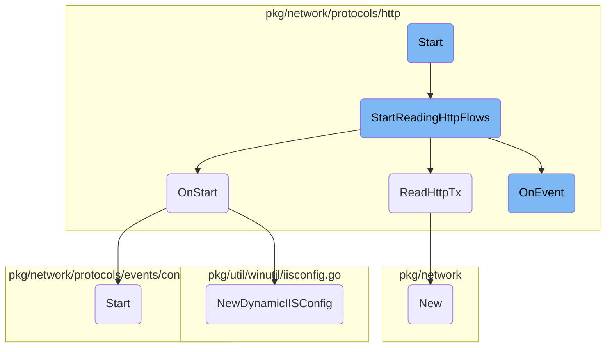

This document explains the process of starting the HTTP event consumption. It covers the initialization of the driver monitor, the reading of HTTP flows, and the handling of various HTTP events.

The process begins with initializing the driver monitor and starting the reading of HTTP flows. It then enters an event loop where it processes transaction batches received from data channels. The reading of HTTP flows involves initializing the ETW HTTP service subscription and starting goroutines for ETW tracing and reading HTTP transactions. Various HTTP events are handled based on their event descriptor <SwmToken path="tasks/gitlab_helpers.py" pos="90:10:10" line-data="def print_gitlab_object(get_object, ctx, ids, repo=&#39;DataDog/datadog-agent&#39;, jq: str | None = None, jq_colors=True):">`ids`</SwmToken>, updating the total bytes transferred and processing different types of HTTP events.

# Flow drill down



<SwmSnippet path="/pkg/network/usm/monitor_windows.go" line="65">

---

## Initialization

The <SwmToken path="pkg/network/usm/monitor_windows.go" pos="65:2:2" line-data="// Start consuming HTTP events">`Start`</SwmToken> function initializes the HTTP event consumption process. It begins by logging the start of the driver monitor and then calls <SwmToken path="pkg/network/usm/monitor_windows.go" pos="68:5:5" line-data="	m.di.StartReadingBuffers()">`StartReadingBuffers`</SwmToken> and <SwmToken path="pkg/network/usm/monitor_windows.go" pos="69:5:5" line-data="	m.hei.StartReadingHttpFlows()">`StartReadingHttpFlows`</SwmToken> to initiate the reading of HTTP flows. The function then enters an event loop where it processes transaction batches received from data channels.

```go
// Start consuming HTTP events
func (m *WindowsMonitor) Start() {
	log.Infof("Driver Monitor: starting")
	m.di.StartReadingBuffers()
	m.hei.StartReadingHttpFlows()

	m.eventLoopWG.Add(1)
	go func() {
		defer m.eventLoopWG.Done()
		for {
			select {
			case transactionBatch, ok := <-m.di.DataChannel:
				if !ok {
					return
				}
				// dbtodo
				// the linux side has an error code potentially, that
				// gets aggregated under the hood.  Do we need somthing
				// analogous
				m.process(transactionBatch)
			case transactions, ok := <-m.hei.DataChannel:
```

---

</SwmSnippet>

<SwmSnippet path="/pkg/network/protocols/http/etw_interface.go" line="95">

---

## Reading HTTP Flows

The <SwmToken path="pkg/network/protocols/http/etw_interface.go" pos="96:9:9" line-data="func (hei *EtwInterface) StartReadingHttpFlows() {">`StartReadingHttpFlows`</SwmToken> function is responsible for starting the reading of HTTP flows. It first calls <SwmToken path="pkg/network/protocols/http/etw_interface.go" pos="97:3:3" line-data="	hei.OnStart()">`OnStart`</SwmToken> to initialize the ETW HTTP service subscription and then starts two goroutines: one for starting ETW tracing and another for reading accumulated HTTP transactions. The function ensures that HTTP transactions are read and sent to the data channel for further processing.

```go
//nolint:revive // TODO(WKIT) Fix revive linter
func (hei *EtwInterface) StartReadingHttpFlows() {
	hei.OnStart()
	hei.eventLoopWG.Add(2)

	startingEtwChan := make(chan struct{})

	// Currently ETW needs be started on a separate thread
	// because it is blocked until subscription is stopped
	go func() {
		defer hei.eventLoopWG.Done()
		startingEtwChan <- struct{}{}
		err := hei.session.StartTracing(func(e *etw.DDEventRecord) {
			// By default this function call never exits and its callbacks or rather events
			// will be returned on the very the same thread until ETW is canceled via
			// etw.StopEtw(). There is asynchronous flag which implicitly will create a real
			// (Windows API) thread but it is not tested yet.
			hei.OnEvent(e)
		})

		if err == nil {
```

---

</SwmSnippet>

<SwmSnippet path="/pkg/network/protocols/http/etw_http_service.go" line="1425">

---

### <SwmToken path="pkg/network/protocols/http/etw_http_service.go" pos="1426:9:9" line-data="func (hei *EtwInterface) OnStart() {">`OnStart`</SwmToken>

The <SwmToken path="pkg/network/protocols/http/etw_http_service.go" pos="1426:9:9" line-data="func (hei *EtwInterface) OnStart() {">`OnStart`</SwmToken> function initializes the ETW HTTP service subscription and creates a new dynamic IIS configuration. If the IIS configuration is successfully created, it is started; otherwise, a warning is logged.

```go
//nolint:revive // TODO(WKIT) Fix revive linter
func (hei *EtwInterface) OnStart() {
	initializeEtwHttpServiceSubscription()
	httpServiceSubscribed = true
	var err error
	iisConfig, err = winutil.NewDynamicIISConfig()
	if err != nil {
		log.Warnf("Failed to create iis config %v", err)
		iisConfig = nil
	} else {
		err = iisConfig.Start()
		if err != nil {
			log.Warnf("Failed to start iis config %v", err)
			iisConfig = nil
		}
	}
}
```

---

</SwmSnippet>

<SwmSnippet path="/pkg/network/protocols/http/etw_http_service.go" line="1390">

---

### <SwmToken path="pkg/network/protocols/http/etw_http_service.go" pos="1391:2:2" line-data="func ReadHttpTx() (httpTxs []WinHttpTransaction, err error) {">`ReadHttpTx`</SwmToken>

The <SwmToken path="pkg/network/protocols/http/etw_http_service.go" pos="1391:2:2" line-data="func ReadHttpTx() (httpTxs []WinHttpTransaction, err error) {">`ReadHttpTx`</SwmToken> function reads accumulated HTTP transactions. It first checks if the ETW HTTP service is subscribed, then locks the completed HTTP transactions mutex, retrieves the accumulated transactions, and resets the array before returning the transactions.

```go
//nolint:revive // TODO(WKIT) Fix revive linter
func ReadHttpTx() (httpTxs []WinHttpTransaction, err error) {
	if !httpServiceSubscribed {
		return nil, errors.New("ETW HttpService is not currently subscribed")
	}

	completedHttpTxMux.Lock()
	defer completedHttpTxMux.Unlock()

	// Return accumulated httpTx and reset array
	//
	//nolint:revive // TODO(WKIT) Fix revive linter
	readHttpTx := completedHttpTx

	completedHttpTx = make([]WinHttpTransaction, 0, 100)

	return readHttpTx, nil
}
```

---

</SwmSnippet>

<SwmSnippet path="/pkg/network/protocols/http/etw_http_service.go" line="1266">

---

## Event Handling

The <SwmToken path="pkg/network/protocols/http/etw_http_service.go" pos="1267:9:9" line-data="func (hei *EtwInterface) OnEvent(eventInfo *etw.DDEventRecord) {">`OnEvent`</SwmToken> function handles various HTTP events based on their event descriptor <SwmToken path="tasks/gitlab_helpers.py" pos="90:10:10" line-data="def print_gitlab_object(get_object, ctx, ids, repo=&#39;DataDog/datadog-agent&#39;, jq: str | None = None, jq_colors=True):">`ids`</SwmToken>. It updates the total bytes transferred and processes different types of HTTP events, such as connection traces, request traces, and cache traces. The function also outputs a summary of the events every 40 seconds if logging verbosity is enabled.

```go
//nolint:revive // TODO(WKIT) Fix revive linter
func (hei *EtwInterface) OnEvent(eventInfo *etw.DDEventRecord) {

	// Total number of bytes transferred to kernel from HTTP.sys driver. 0x68 is ETW header size
	transferedETWBytesTotal += (uint64(eventInfo.UserDataLength) + 0x68)
	transferedETWBytesPayload += uint64(eventInfo.UserDataLength)

	eventCount++

	switch eventInfo.EventHeader.EventDescriptor.ID {
	// #21
	case EVENT_ID_HttpService_HTTPConnectionTraceTaskConnConn:
		httpCallbackOnHTTPConnectionTraceTaskConnConn(eventInfo)

	// #23
	//case EVENT_ID_HttpService_HTTPConnectionTraceTaskConnClose:
	//	httpCallbackOnHTTPConnectionTraceTaskConnClose(eventInfo)

	// NOTE originally the cleanup function was done on (23) ConnClose. However it was discovered
	// (the hard way) that every once in a while ConnCLose comes in out of order (in the test case)
	// prior to (12) EVENT_ID_HttpService_HTTPRequestTraceTaskFastSend.  This would cause
```

---

</SwmSnippet>

&nbsp;

*This is an auto-generated document by Swimm AI 🌊 and has not yet been verified by a human*

<SwmMeta version="3.0.0" repo-id="Z2l0aHViJTNBJTNBZGF0YWRvZy1hZ2VudCUzQSUzQVN3aW1tLURlbW8=" repo-name="datadog-agent"><sup>Powered by [Swimm](/)</sup></SwmMeta>
