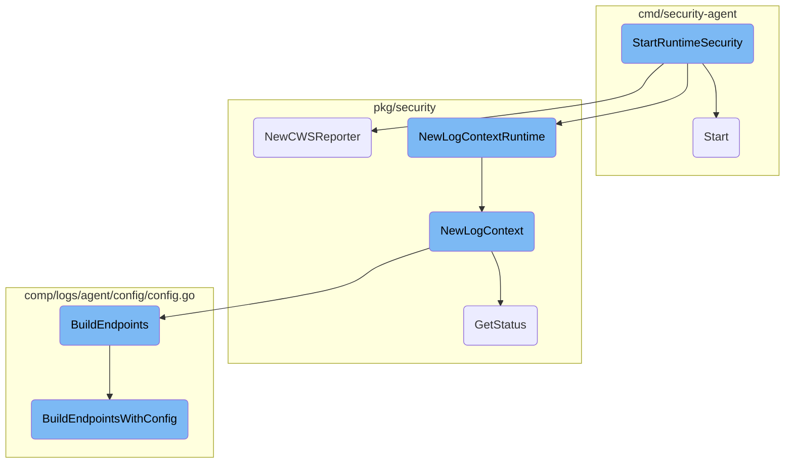
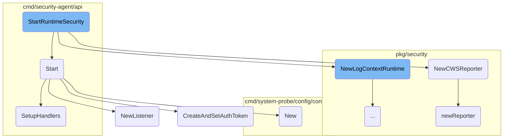
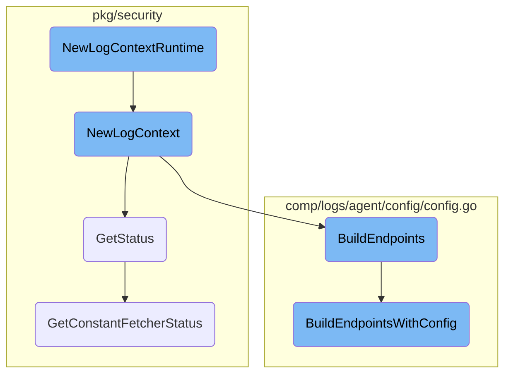

This document explains the process of initializing and starting the runtime security agent. The process involves checking the configuration, creating necessary components, setting up logging and endpoints, and starting the agent.

The flow starts by checking if the runtime security is enabled in the configuration. If it is, a new instance of the runtime security agent is created. The next step involves setting up the logging context and endpoints, followed by initializing the CWS reporter. Finally, the agent is started with the reporter and endpoints.

Here is a high level diagram of the flow, showing only the most important functions:



# Flow drill down

First, we'll zoom into this section of the flow:



<SwmSnippet path="/cmd/security-agent/subcommands/runtime/command.go" line="676">

---

## <SwmToken path="cmd/security-agent/subcommands/runtime/command.go" pos="676:2:2" line-data="// StartRuntimeSecurity starts runtime security">`StartRuntimeSecurity`</SwmToken>

The <SwmToken path="cmd/security-agent/subcommands/runtime/command.go" pos="676:2:2" line-data="// StartRuntimeSecurity starts runtime security">`StartRuntimeSecurity`</SwmToken> function initializes and starts the runtime security agent. It first checks if the runtime security is enabled in the configuration. If enabled, it creates a new instance of the runtime security agent and adds it to the stopper. It then sets up the logging context and endpoints, initializes the CWS reporter, and starts the agent with the reporter and endpoints.

```go
// StartRuntimeSecurity starts runtime security
func StartRuntimeSecurity(log log.Component, config config.Component, hostname string, stopper startstop.Stopper, statsdClient ddgostatsd.ClientInterface, wmeta workloadmeta.Component) (*secagent.RuntimeSecurityAgent, error) {
	enabled := config.GetBool("runtime_security_config.enabled")
	if !enabled {
		log.Info("Datadog runtime security agent disabled by config")
		return nil, nil
	}

	// start/stop order is important, agent need to be stopped first and started after all the others
	// components
	agent, err := secagent.NewRuntimeSecurityAgent(statsdClient, hostname, secagent.RSAOptions{
		LogProfiledWorkloads:    config.GetBool("runtime_security_config.log_profiled_workloads"),
		IgnoreDDAgentContainers: config.GetBool("runtime_security_config.telemetry.ignore_dd_agent_containers"),
	}, wmeta)
	if err != nil {
		return nil, fmt.Errorf("unable to create a runtime security agent instance: %w", err)
	}
	stopper.Add(agent)

	useSecRuntimeTrack := config.GetBool("runtime_security_config.use_secruntime_track")
	endpoints, ctx, err := common.NewLogContextRuntime(useSecRuntimeTrack)
```

---

</SwmSnippet>

<SwmSnippet path="/cmd/security-agent/api/server.go" line="53">

---

## Start

The <SwmToken path="cmd/security-agent/api/server.go" pos="53:2:2" line-data="// Start creates the router and starts the HTTP server">`Start`</SwmToken> function in <SwmPath>[cmd/security-agent/api/server.go](cmd/security-agent/api/server.go)</SwmPath> sets up the HTTP server for the security agent. It creates the router, sets up the IPC REST API server, validates tokens for every request, and starts the TLS server.

```go
// Start creates the router and starts the HTTP server
func (s *Server) Start() error {
	// create the root HTTP router
	r := mux.NewRouter()

	// IPC REST API server
	s.agent.SetupHandlers(r.PathPrefix("/agent").Subrouter())

	// Validate token for every request
	r.Use(validateToken)

	err := util.CreateAndSetAuthToken(config.Datadog())
	if err != nil {
		return err
	}

	hosts := []string{"127.0.0.1", "localhost"}
	_, rootCertPEM, rootKey, err := security.GenerateRootCert(hosts, 2048)
	if err != nil {
		return fmt.Errorf("unable to start TLS server")
	}
```

---

</SwmSnippet>

<SwmSnippet path="/pkg/security/reporter/reporter.go" line="43">

---

### <SwmToken path="pkg/security/reporter/reporter.go" pos="43:2:2" line-data="// NewCWSReporter returns a new CWS reported based on the fields necessary to communicate with the intake">`NewCWSReporter`</SwmToken>

The <SwmToken path="pkg/security/reporter/reporter.go" pos="43:2:2" line-data="// NewCWSReporter returns a new CWS reported based on the fields necessary to communicate with the intake">`NewCWSReporter`</SwmToken> function creates a new CWS reporter, which is responsible for communicating with the intake. It uses the <SwmToken path="pkg/security/reporter/reporter.go" pos="45:3:3" line-data="	return newReporter(hostname, stopper, &quot;runtime-security-agent&quot;, &quot;runtime-security&quot;, endpoints, context)">`newReporter`</SwmToken> function to set up the necessary components.

```go
// NewCWSReporter returns a new CWS reported based on the fields necessary to communicate with the intake
func NewCWSReporter(hostname string, stopper startstop.Stopper, endpoints *logsconfig.Endpoints, context *client.DestinationsContext) (seccommon.RawReporter, error) {
	return newReporter(hostname, stopper, "runtime-security-agent", "runtime-security", endpoints, context)
}
```

---

</SwmSnippet>

<SwmSnippet path="/pkg/security/reporter/reporter.go" line="48">

---

### <SwmToken path="pkg/security/reporter/reporter.go" pos="48:2:2" line-data="func newReporter(hostname string, stopper startstop.Stopper, sourceName, sourceType string, endpoints *logsconfig.Endpoints, context *client.DestinationsContext) (seccommon.RawReporter, error) {">`newReporter`</SwmToken>

The <SwmToken path="pkg/security/reporter/reporter.go" pos="48:2:2" line-data="func newReporter(hostname string, stopper startstop.Stopper, sourceName, sourceType string, endpoints *logsconfig.Endpoints, context *client.DestinationsContext) (seccommon.RawReporter, error) {">`newReporter`</SwmToken> function sets up the auditor and pipeline provider, which are essential for processing and sending logs. It creates a new log source and returns a <SwmToken path="pkg/security/reporter/reporter.go" pos="67:4:4" line-data="	return &amp;RuntimeReporter{">`RuntimeReporter`</SwmToken> instance.

```go
func newReporter(hostname string, stopper startstop.Stopper, sourceName, sourceType string, endpoints *logsconfig.Endpoints, context *client.DestinationsContext) (seccommon.RawReporter, error) {
	// setup the auditor
	auditor := auditor.NewNullAuditor()
	auditor.Start()
	stopper.Add(auditor)

	// setup the pipeline provider that provides pairs of processor and sender
	pipelineProvider := pipeline.NewProvider(logsconfig.NumberOfPipelines, auditor, &diagnostic.NoopMessageReceiver{}, nil, endpoints, context, agentimpl.NewStatusProvider(), hostnameimpl.NewHostnameService(), pkgconfig.Datadog())
	pipelineProvider.Start()
	stopper.Add(pipelineProvider)

	logSource := sources.NewLogSource(
		sourceName,
		&logsconfig.LogsConfig{
			Type:   sourceType,
			Source: sourceName,
		},
	)
	logChan := pipelineProvider.NextPipelineChan()
	return &RuntimeReporter{
		hostname:  hostname,
```

---

</SwmSnippet>

<SwmSnippet path="/pkg/process/events/listener_linux.go" line="46">

---

### <SwmToken path="pkg/process/events/listener_linux.go" pos="46:2:2" line-data="// NewListener returns a new SysProbeListener to listen for process events">`NewListener`</SwmToken>

The <SwmToken path="pkg/process/events/listener_linux.go" pos="46:2:2" line-data="// NewListener returns a new SysProbeListener to listen for process events">`NewListener`</SwmToken> function creates a new <SwmToken path="pkg/process/events/listener_linux.go" pos="46:10:10" line-data="// NewListener returns a new SysProbeListener to listen for process events">`SysProbeListener`</SwmToken> to listen for process events. It establishes a connection to the event monitoring socket and returns the listener.

```go
// NewListener returns a new SysProbeListener to listen for process events
func NewListener(handler EventHandler) (*SysProbeListener, error) {
	socketPath := ddconfig.SystemProbe.GetString("event_monitoring_config.socket")
	if socketPath == "" {
		return nil, errors.New("event_monitoring_config.socket must be set")
	}

	conn, err := grpc.Dial(socketPath, grpc.WithTransportCredentials(insecure.NewCredentials()), grpc.WithContextDialer(func(ctx context.Context, url string) (net.Conn, error) { //nolint:staticcheck // TODO (ASC) fix grpc.Dial is deprecated
		return net.Dial("unix", url)
	}))
	if err != nil {
		return nil, err
	}

	client := api.NewEventMonitoringModuleClient(conn)
	return NewSysProbeListener(conn, client, handler)
}
```

---

</SwmSnippet>

<SwmSnippet path="/cmd/system-probe/config/config.go" line="46">

---

### New

The <SwmToken path="cmd/system-probe/config/config.go" pos="46:2:2" line-data="// New creates a config object for system-probe. It assumes no configuration has been loaded as this point.">`New`</SwmToken> function creates a configuration object for the system probe. It assumes no configuration has been loaded at this point.

```go
// New creates a config object for system-probe. It assumes no configuration has been loaded as this point.
func New(configPath string) (*types.Config, error) {
	return newSysprobeConfig(configPath)
}
```

---

</SwmSnippet>

<SwmSnippet path="/cmd/security-agent/api/agent/agent.go" line="45">

---

### <SwmToken path="cmd/security-agent/api/agent/agent.go" pos="45:2:2" line-data="// SetupHandlers adds the specific handlers for /agent endpoints">`SetupHandlers`</SwmToken>

The <SwmToken path="cmd/security-agent/api/agent/agent.go" pos="45:2:2" line-data="// SetupHandlers adds the specific handlers for /agent endpoints">`SetupHandlers`</SwmToken> function adds specific handlers for the <SwmPath>[Dockerfiles/agent/](Dockerfiles/agent/)</SwmPath> endpoints. These handlers manage various functionalities such as retrieving the version, generating flares, getting the hostname, stopping the agent, and fetching the status and configuration.

```go
// SetupHandlers adds the specific handlers for /agent endpoints
func (a *Agent) SetupHandlers(r *mux.Router) {
	r.HandleFunc("/version", common.GetVersion).Methods("GET")
	r.HandleFunc("/flare", a.makeFlare).Methods("POST")
	r.HandleFunc("/hostname", a.getHostname).Methods("GET")
	r.HandleFunc("/stop", a.stopAgent).Methods("POST")
	r.HandleFunc("/status", a.getStatus).Methods("GET")
	r.HandleFunc("/status/health", a.getHealth).Methods("GET")
	r.HandleFunc("/config", a.settings.GetFullConfig("")).Methods("GET")
	// FIXME: this returns the entire datadog.yaml and not just security-agent.yaml config
	r.HandleFunc("/config/by-source", a.settings.GetFullConfigBySource()).Methods("GET")
	r.HandleFunc("/config/list-runtime", a.settings.ListConfigurable).Methods("GET")
	r.HandleFunc("/config/{setting}", a.settings.GetValue).Methods("GET")
	r.HandleFunc("/config/{setting}", a.settings.SetValue).Methods("POST")
	r.HandleFunc("/workload-list", func(w http.ResponseWriter, r *http.Request) {
		verbose := r.URL.Query().Get("verbose") == "true"
		workloadList(w, verbose, a.wmeta)
	}).Methods("GET")
}
```

---

</SwmSnippet>

<SwmSnippet path="/pkg/api/util/util.go" line="43">

---

### <SwmToken path="pkg/api/util/util.go" pos="43:2:2" line-data="// CreateAndSetAuthToken creates and sets the authorization token">`CreateAndSetAuthToken`</SwmToken>

The <SwmToken path="pkg/api/util/util.go" pos="43:2:2" line-data="// CreateAndSetAuthToken creates and sets the authorization token">`CreateAndSetAuthToken`</SwmToken> function creates and sets the authorization token. It ensures that the token is only created if it hasn't been set already.

```go
// CreateAndSetAuthToken creates and sets the authorization token
// Requires that the config has been set up before calling
func CreateAndSetAuthToken(config model.Reader) error {
	tokenLock.Lock()
	defer tokenLock.Unlock()

	// Noop if token is already set
	if token != "" {
		return nil
	}

	var err error
	token, err = security.CreateOrFetchToken(config)
	return err
}
```

---

</SwmSnippet>

Now, lets zoom into this section of the flow:



<SwmSnippet path="/pkg/security/common/logs_context.go" line="29">

---

## <SwmToken path="pkg/security/common/logs_context.go" pos="29:2:2" line-data="// NewLogContextRuntime returns the context fields to send runtime (CWS) events to the intake">`NewLogContextRuntime`</SwmToken>

The function <SwmToken path="pkg/security/common/logs_context.go" pos="29:2:2" line-data="// NewLogContextRuntime returns the context fields to send runtime (CWS) events to the intake">`NewLogContextRuntime`</SwmToken> determines the type of track to use based on the <SwmToken path="pkg/security/common/logs_context.go" pos="31:4:4" line-data="func NewLogContextRuntime(useSecRuntimeTrack bool) (*logsconfig.Endpoints, *client.DestinationsContext, error) {">`useSecRuntimeTrack`</SwmToken> flag and then calls <SwmToken path="pkg/security/common/logs_context.go" pos="43:3:3" line-data="	return NewLogContext(logsRuntimeConfigKeys, &quot;runtime-security-http-intake.logs.&quot;, trackType, cwsIntakeOrigin, logsconfig.DefaultIntakeProtocol)">`NewLogContext`</SwmToken> to set up the context fields for sending runtime events to the intake.

```go
// NewLogContextRuntime returns the context fields to send runtime (CWS) events to the intake
// This function will only be used on Linux. The only platforms where the runtime agent runs
func NewLogContextRuntime(useSecRuntimeTrack bool) (*logsconfig.Endpoints, *client.DestinationsContext, error) {
	var (
		trackType logsconfig.IntakeTrackType
	)

	if useSecRuntimeTrack {
		trackType = "secruntime"
	} else {
		trackType = "logs"
	}

	logsRuntimeConfigKeys := logsconfig.NewLogsConfigKeys("runtime_security_config.endpoints.", pkgconfig.Datadog())
	return NewLogContext(logsRuntimeConfigKeys, "runtime-security-http-intake.logs.", trackType, cwsIntakeOrigin, logsconfig.DefaultIntakeProtocol)
}
```

---

</SwmSnippet>

<SwmSnippet path="/pkg/security/common/logs_context.go" line="46">

---

## <SwmToken path="pkg/security/common/logs_context.go" pos="46:2:2" line-data="// NewLogContext returns the context fields to send events to the intake">`NewLogContext`</SwmToken>

The function <SwmToken path="pkg/security/common/logs_context.go" pos="46:2:2" line-data="// NewLogContext returns the context fields to send events to the intake">`NewLogContext`</SwmToken> builds the HTTP endpoints using the provided configuration and logs the status of these endpoints. It also initializes and starts a new <SwmToken path="pkg/security/common/logs_context.go" pos="47:48:48" line-data="func NewLogContext(logsConfig *logsconfig.LogsConfigKeys, endpointPrefix string, intakeTrackType logsconfig.IntakeTrackType, intakeOrigin logsconfig.IntakeOrigin, intakeProtocol logsconfig.IntakeProtocol) (*logsconfig.Endpoints, *client.DestinationsContext, error) {">`DestinationsContext`</SwmToken> for managing the destinations where logs will be sent.

```go
// NewLogContext returns the context fields to send events to the intake
func NewLogContext(logsConfig *logsconfig.LogsConfigKeys, endpointPrefix string, intakeTrackType logsconfig.IntakeTrackType, intakeOrigin logsconfig.IntakeOrigin, intakeProtocol logsconfig.IntakeProtocol) (*logsconfig.Endpoints, *client.DestinationsContext, error) {
	endpoints, err := logsconfig.BuildHTTPEndpointsWithConfig(pkgconfig.Datadog(), logsConfig, endpointPrefix, intakeTrackType, intakeProtocol, intakeOrigin)
	if err != nil {
		endpoints, err = logsconfig.BuildHTTPEndpoints(pkgconfig.Datadog(), intakeTrackType, intakeProtocol, intakeOrigin)
		if err == nil {
			httpConnectivity := logshttp.CheckConnectivity(endpoints.Main, pkgconfig.Datadog())
			endpoints, err = logsconfig.BuildEndpoints(pkgconfig.Datadog(), httpConnectivity, intakeTrackType, intakeProtocol, intakeOrigin)
		}
	}

	if err != nil {
		return nil, nil, fmt.Errorf("invalid endpoints: %w", err)
	}

	for _, status := range endpoints.GetStatus() {
		log.Info(status)
	}

	destinationsCtx := client.NewDestinationsContext()
	destinationsCtx.Start()
```

---

</SwmSnippet>

<SwmSnippet path="/pkg/security/module/server_linux.go" line="139">

---

## <SwmToken path="pkg/security/module/server_linux.go" pos="139:2:2" line-data="// GetStatus returns the status of the module">`GetStatus`</SwmToken>

The method <SwmToken path="pkg/security/module/server_linux.go" pos="139:2:2" line-data="// GetStatus returns the status of the module">`GetStatus`</SwmToken> retrieves the status of various components, including <SwmToken path="pkg/security/module/server_linux.go" pos="205:5:7" line-data="			Error: &quot;self-tests are disabled&quot;,">`self-tests`</SwmToken>, policies, and the constant fetcher status from the <SwmToken path="cmd/system-probe/config/config.go" pos="38:10:10" line-data="	EBPFModule                   types.ModuleName = &quot;ebpf&quot;">`ebpf`</SwmToken> probe. It compiles this information into an <SwmToken path="pkg/security/module/server_linux.go" pos="140:28:30" line-data="func (a *APIServer) GetStatus(_ context.Context, _ *api.GetStatusParams) (*api.Status, error) {">`api.Status`</SwmToken> object.

```go
// GetStatus returns the status of the module
func (a *APIServer) GetStatus(_ context.Context, _ *api.GetStatusParams) (*api.Status, error) {
	var apiStatus api.Status
	if a.selfTester != nil {
		apiStatus.SelfTests = a.selfTester.GetStatus()
	}

	apiStatus.PoliciesStatus = a.policiesStatus

	p, ok := a.probe.PlatformProbe.(*probe.EBPFProbe)
	if ok {
		status, err := p.GetConstantFetcherStatus()
		if err != nil {
			return nil, err
		}

		constants := make([]*api.ConstantValueAndSource, 0, len(status.Values))
		for _, v := range status.Values {
			constants = append(constants, &api.ConstantValueAndSource{
				ID:     v.ID,
				Value:  v.Value,
```

---

</SwmSnippet>

<SwmSnippet path="/comp/logs/agent/config/config.go" line="99">

---

## <SwmToken path="comp/logs/agent/config/config.go" pos="99:2:2" line-data="// BuildEndpoints returns the endpoints to send logs.">`BuildEndpoints`</SwmToken>

The function <SwmToken path="comp/logs/agent/config/config.go" pos="99:2:2" line-data="// BuildEndpoints returns the endpoints to send logs.">`BuildEndpoints`</SwmToken> is a wrapper that calls <SwmToken path="comp/logs/agent/config/config.go" pos="101:3:3" line-data="	return BuildEndpointsWithConfig(coreConfig, defaultLogsConfigKeys(coreConfig), httpEndpointPrefix, httpConnectivity, intakeTrackType, intakeProtocol, intakeOrigin)">`BuildEndpointsWithConfig`</SwmToken> with default log configuration keys to set up the endpoints for sending logs.

```go
// BuildEndpoints returns the endpoints to send logs.
func BuildEndpoints(coreConfig pkgconfigmodel.Reader, httpConnectivity HTTPConnectivity, intakeTrackType IntakeTrackType, intakeProtocol IntakeProtocol, intakeOrigin IntakeOrigin) (*Endpoints, error) {
	return BuildEndpointsWithConfig(coreConfig, defaultLogsConfigKeys(coreConfig), httpEndpointPrefix, httpConnectivity, intakeTrackType, intakeProtocol, intakeOrigin)
}
```

---

</SwmSnippet>

<SwmSnippet path="/comp/logs/agent/config/config.go" line="109">

---

## <SwmToken path="comp/logs/agent/config/config.go" pos="109:2:2" line-data="// BuildEndpointsWithConfig returns the endpoints to send logs.">`BuildEndpointsWithConfig`</SwmToken>

The function <SwmToken path="comp/logs/agent/config/config.go" pos="109:2:2" line-data="// BuildEndpointsWithConfig returns the endpoints to send logs.">`BuildEndpointsWithConfig`</SwmToken> decides whether to use HTTP or TCP for sending logs based on the configuration and connectivity status. It builds the appropriate endpoints accordingly.

```go
// BuildEndpointsWithConfig returns the endpoints to send logs.
func BuildEndpointsWithConfig(coreConfig pkgconfigmodel.Reader, logsConfig *LogsConfigKeys, endpointPrefix string, httpConnectivity HTTPConnectivity, intakeTrackType IntakeTrackType, intakeProtocol IntakeProtocol, intakeOrigin IntakeOrigin) (*Endpoints, error) {
	if logsConfig.devModeNoSSL() {
		log.Warnf("Use of illegal configuration parameter, if you need to send your logs to a proxy, "+
			"please use '%s' and '%s' instead", logsConfig.getConfigKey("logs_dd_url"), logsConfig.getConfigKey("logs_no_ssl"))
	}

	mrfEnabled := coreConfig.GetBool("multi_region_failover.enabled")
	if logsConfig.isForceHTTPUse() || logsConfig.obsPipelineWorkerEnabled() || mrfEnabled || (bool(httpConnectivity) && !(logsConfig.isForceTCPUse() || logsConfig.isSocks5ProxySet() || logsConfig.hasAdditionalEndpoints())) {
		return BuildHTTPEndpointsWithConfig(coreConfig, logsConfig, endpointPrefix, intakeTrackType, intakeProtocol, intakeOrigin)
	}
	log.Warnf("You are currently sending Logs to Datadog through TCP (either because %s or %s is set or the HTTP connectivity test has failed) "+
		"To benefit from increased reliability and better network performances, "+
		"we strongly encourage switching over to compressed HTTPS which is now the default protocol.",
		logsConfig.getConfigKey("force_use_tcp"), logsConfig.getConfigKey("socks5_proxy_address"))
	return buildTCPEndpoints(coreConfig, logsConfig)
}
```

---

</SwmSnippet>

<SwmSnippet path="/pkg/security/probe/probe_ebpf.go" line="2020">

---

## <SwmToken path="pkg/security/probe/probe_ebpf.go" pos="2020:2:2" line-data="// GetConstantFetcherStatus returns the status of the constant fetcher associated with this probe">`GetConstantFetcherStatus`</SwmToken>

The method <SwmToken path="pkg/security/probe/probe_ebpf.go" pos="2020:2:2" line-data="// GetConstantFetcherStatus returns the status of the constant fetcher associated with this probe">`GetConstantFetcherStatus`</SwmToken> composes and finalizes the constant fetchers for the <SwmToken path="cmd/system-probe/config/config.go" pos="38:10:10" line-data="	EBPFModule                   types.ModuleName = &quot;ebpf&quot;">`ebpf`</SwmToken> probe, returning their status.

```go
// GetConstantFetcherStatus returns the status of the constant fetcher associated with this probe
func (p *EBPFProbe) GetConstantFetcherStatus() (*constantfetch.ConstantFetcherStatus, error) {
	constantFetcher := constantfetch.ComposeConstantFetchers(constantfetch.GetAvailableConstantFetchers(p.config.Probe, p.kernelVersion, p.statsdClient))
	AppendProbeRequestsToFetcher(constantFetcher, p.kernelVersion)
	return constantFetcher.FinishAndGetStatus()
}
```

---

</SwmSnippet>

&nbsp;

*This is an auto-generated document by Swimm AI 🌊 and has not yet been verified by a human*

<SwmMeta version="3.0.0" repo-id="Z2l0aHViJTNBJTNBZGF0YWRvZy1hZ2VudCUzQSUzQVN3aW1tLURlbW8=" repo-name="datadog-agent"><sup>Powered by [Swimm](/)</sup></SwmMeta>
