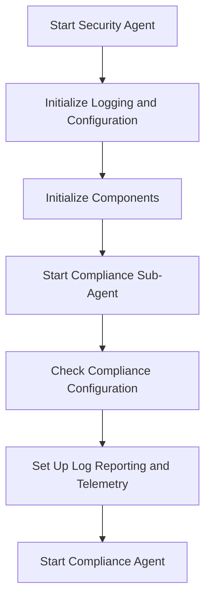

This document will cover the process of starting the Security Agent and its Compliance Sub-Agent, which includes:

1. Setting up the Security Agent
2. Initializing the Compliance Sub-Agent

Technical document: <SwmLink doc-title="Commands to Start Security Agent and Compliance Sub-Agent">[Commands to Start Security Agent and Compliance Sub-Agent](/.swm/commands-to-start-security-agent-and-compliance-sub-agent.v1bhr796.sw.md)</SwmLink>

# [Setting up the Security Agent](https://app.swimm.io/repos/Z2l0aHViJTNBJTNBZGF0YWRvZy1hZ2VudCUzQSUzQVN3aW1tLURlbW8=/docs/v1bhr796#commands)

The process begins with setting up the Security Agent. This involves configuring various parameters and dependencies required to run the agent. The setup includes initializing logging and configuration settings, which are essential for tracking the agent's activities and ensuring it operates correctly. Additionally, components such as workloadmeta, tagger, and statsd are initialized. These components are crucial for collecting and managing metadata, tagging resources, and gathering statistics, respectively.

# [Initializing the Compliance Sub-Agent](https://app.swimm.io/repos/Z2l0aHViJTNBJTNBZGF0YWRvZy1hZ2VudCUzQSUzQVN3aW1tLURlbW8=/docs/v1bhr796#startcompliance)

Once the Security Agent is set up, the next step is to initialize and start the Compliance Sub-Agent. This process begins by checking if compliance is enabled in the configuration. If compliance is enabled, the system sets up the necessary context and options for the compliance agent. This includes setting up log reporting and telemetry to monitor the agent's performance and activities. Various resolver options are also configured to ensure the agent can resolve and process compliance checks accurately. Finally, the compliance agent is started and runs periodically to send compliance metrics, ensuring continuous monitoring and reporting of compliance status.

&nbsp;

*This is an auto-generated document by Swimm AI 🌊 and has not yet been verified by a human*

<SwmMeta version="3.0.0" repo-id="Z2l0aHViJTNBJTNBZGF0YWRvZy1hZ2VudCUzQSUzQVN3aW1tLURlbW8=" repo-name="datadog-agent">Powered by [Swimm](/)</SwmMeta>
