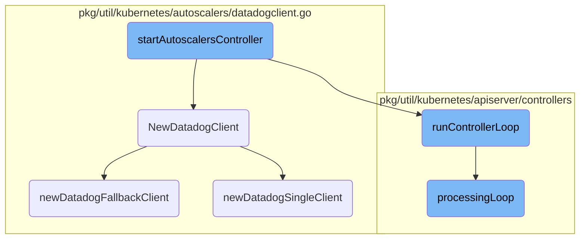

This document explains the process of starting the autoscalers controller. The process involves initializing the Datadog client, creating the autoscalers controller, running the WPA and HPA controllers, and starting the main controller loop.

The flow starts by setting up the Datadog client, which is essential for collecting metrics. Next, it creates the autoscalers controller using various components like the client and event recorder. If the WPA controller is enabled, it runs in a separate thread, and the HPA controller is also started. Finally, the main controller loop is initiated to handle the lifecycle of the external metrics store.

# Flow drill down



<SwmSnippet path="/pkg/util/kubernetes/apiserver/controllers/controllers.go" line="141">

---

## Initializing Datadog Client

The <SwmToken path="pkg/util/kubernetes/apiserver/controllers/controllers.go" pos="51:1:1" line-data="		startAutoscalersController,">`startAutoscalersController`</SwmToken> function begins by initializing the Datadog client using <SwmToken path="pkg/util/kubernetes/apiserver/controllers/controllers.go" pos="141:12:12" line-data="	apiserver.DogCl, err = autoscalers.NewDatadogClient()">`NewDatadogClient`</SwmToken>. If the client initialization fails, it sends an error to the provided channel and returns.

```go
	apiserver.DogCl, err = autoscalers.NewDatadogClient()
	if err != nil {
		c <- err
		return
	}
```

---

</SwmSnippet>

<SwmSnippet path="/pkg/util/kubernetes/apiserver/controllers/controllers.go" line="146">

---

## Creating Autoscalers Controller

Next, the function creates an instance of the autoscalers controller using the context's client, event recorder, leader function, and the initialized Datadog client. If this creation fails, it sends an error to the provided channel and returns.

```go
	autoscalersController, err := newAutoscalersController(
		ctx.Client,
		ctx.EventRecorder,
		ctx.IsLeaderFunc,
		apiserver.DogCl,
	)
	if err != nil {
		c <- err
		return
	}
```

---

</SwmSnippet>

<SwmSnippet path="/pkg/util/kubernetes/apiserver/controllers/controllers.go" line="157">

---

## Running WPA and HPA Controllers

If the WPA controller is enabled in the configuration, it starts the WPA controller in a separate goroutine. It also enables and starts the HPA controller.

```go
	if config.Datadog().GetBool("external_metrics_provider.wpa_controller") {
		go autoscalersController.runWPA(ctx.StopCh, ctx.DynamicClient, ctx.DynamicInformerFactory)
	}

	autoscalersController.enableHPA(ctx.Client, ctx.InformerFactory)
	go autoscalersController.runHPA(ctx.StopCh)
```

---

</SwmSnippet>

<SwmSnippet path="/pkg/util/kubernetes/apiserver/controllers/controllers.go" line="164">

---

## Starting Controller Loop

Finally, the function starts the main controller loop by calling <SwmToken path="pkg/util/kubernetes/apiserver/controllers/controllers.go" pos="164:3:3" line-data="	autoscalersController.runControllerLoop(ctx.StopCh)">`runControllerLoop`</SwmToken>.

```go
	autoscalersController.runControllerLoop(ctx.StopCh)
}
```

---

</SwmSnippet>

<SwmSnippet path="/pkg/util/kubernetes/autoscalers/datadogclient.go" line="38">

---

## Configuring Datadog Client

The <SwmToken path="pkg/util/kubernetes/autoscalers/datadogclient.go" pos="38:2:2" line-data="// NewDatadogClient configures and returns a new DatadogClient">`NewDatadogClient`</SwmToken> function configures and returns a new Datadog client. It checks if redundant endpoints are set in the configuration and creates a fallback client if they are. Otherwise, it creates a single client.

```go
// NewDatadogClient configures and returns a new DatadogClient
func NewDatadogClient() (DatadogClient, error) {
	if config.Datadog().IsSet(metricsRedundantEndpointConfig) {
		var endpoints []endpoint
		if err := config.Datadog().UnmarshalKey(metricsRedundantEndpointConfig, &endpoints); err != nil {
			return nil, log.Errorf("could not parse %s: %v", metricsRedundantEndpointConfig, err)
		}

		return newDatadogFallbackClient(endpoints)
	}

	return newDatadogSingleClient()
}
```

---

</SwmSnippet>

<SwmSnippet path="/pkg/util/kubernetes/autoscalers/datadogclient.go" line="109">

---

### Creating Fallback Client

The <SwmToken path="pkg/util/kubernetes/autoscalers/datadogclient.go" pos="109:2:2" line-data="// NewDatadogFallbackClient generates a new client able to query metrics to a second Datadog endpoint if the first one fails">`NewDatadogFallbackClient`</SwmToken> function generates a client that can query metrics from a secondary Datadog endpoint if the primary one fails. It initializes the default client and adds additional clients for each endpoint.

```go
// NewDatadogFallbackClient generates a new client able to query metrics to a second Datadog endpoint if the first one fails
func newDatadogFallbackClient(endpoints []endpoint) (*datadogFallbackClient, error) {
	if len(endpoints) == 0 {
		return nil, log.Errorf("%s must be non-empty", metricsRedundantEndpointConfig)
	}

	defaultClient, err := newDatadogSingleClient()
	if err != nil {
		return nil, err
	}

	ddFallbackClient := &datadogFallbackClient{
		clients: []*datadogIndividualClient{
			{
				client:             defaultClient,
				lastQuerySucceeded: true,
				retryInterval:      minRetryInterval,
			},
		},
	}
	for _, e := range endpoints {
```

---

</SwmSnippet>

<SwmSnippet path="/pkg/util/kubernetes/autoscalers/datadogclient.go" line="52">

---

### Creating Single Client

The <SwmToken path="pkg/util/kubernetes/autoscalers/datadogclient.go" pos="52:2:2" line-data="// NewDatadogSingleClient generates a new client to query metrics from Datadog">`NewDatadogSingleClient`</SwmToken> function generates a client to query metrics from a single Datadog endpoint. It retrieves the API and APP keys from the configuration and sets up the client with the appropriate endpoint and headers.

```go
// NewDatadogSingleClient generates a new client to query metrics from Datadog
func newDatadogSingleClient() (*datadog.Client, error) {
	apiKey := utils.SanitizeAPIKey(config.Datadog().GetString("external_metrics_provider.api_key"))
	if apiKey == "" {
		apiKey = utils.SanitizeAPIKey(config.Datadog().GetString("api_key"))
	}

	appKey := utils.SanitizeAPIKey(config.Datadog().GetString("external_metrics_provider.app_key"))
	if appKey == "" {
		appKey = utils.SanitizeAPIKey(config.Datadog().GetString("app_key"))
	}

	// DATADOG_HOST used to be the only way to set the external metrics
	// endpoint, so we need to keep backwards compatibility. In order of
	// priority, we use:
	//   - DD_EXTERNAL_METRICS_PROVIDER_ENDPOINT
	//   - DATADOG_HOST
	//   - DD_SITE
	ddEndpoint := os.Getenv("DATADOG_HOST")
	if config.Datadog().GetString(metricsEndpointConfig) != "" || ddEndpoint == "" {
		ddEndpoint = utils.GetMainEndpoint(config.Datadog(), metricsEndpointPrefix, metricsEndpointConfig)
```

---

</SwmSnippet>

<SwmSnippet path="/pkg/util/kubernetes/apiserver/controllers/controller_util.go" line="85">

---

## Running Controller Loop

The <SwmToken path="pkg/util/kubernetes/apiserver/controllers/controller_util.go" pos="85:2:2" line-data="// runControllerLoop triggers the lifecycle loop of the External Metrics store">`runControllerLoop`</SwmToken> method triggers the lifecycle loop of the external metrics store by calling <SwmToken path="pkg/util/kubernetes/apiserver/controllers/controller_util.go" pos="87:3:3" line-data="	h.processingLoop(stopCh)">`processingLoop`</SwmToken>.

```go
// runControllerLoop triggers the lifecycle loop of the External Metrics store
func (h *autoscalersController) runControllerLoop(stopCh <-chan struct{}) {
	h.processingLoop(stopCh)
}
```

---

</SwmSnippet>

<SwmSnippet path="/pkg/util/kubernetes/apiserver/controllers/controller_util.go" line="224">

---

## Processing Loop

The <SwmToken path="pkg/util/kubernetes/apiserver/controllers/controller_util.go" pos="224:2:2" line-data="// processingLoop is a go routine that schedules the garbage collection and the refreshing of external metrics">`processingLoop`</SwmToken> method schedules the garbage collection and refreshing of external metrics in the <SwmToken path="pkg/util/kubernetes/apiserver/controllers/controller_util.go" pos="225:6:6" line-data="// in the GlobalStore.">`GlobalStore`</SwmToken>. It runs in a separate goroutine and periodically updates external metrics and performs garbage collection if the current instance is the leader.

```go
// processingLoop is a go routine that schedules the garbage collection and the refreshing of external metrics
// in the GlobalStore.
func (h *autoscalersController) processingLoop(stopCh <-chan struct{}) {
	tickerAutoscalerRefreshProcess := time.NewTicker(time.Duration(h.poller.refreshPeriod) * time.Second)
	gcPeriodSeconds := time.NewTicker(time.Duration(h.poller.gcPeriodSeconds) * time.Second)
	go func() {
		for {
			select {
			case <-stopCh:
				return
			case <-tickerAutoscalerRefreshProcess.C:
				if !h.isLeaderFunc() {
					continue
				}
				// Updating the metrics against Datadog should not affect the Ref pipeline.
				// If metrics are temporarily unavailable for too long, they will become `Valid=false` and won't be evaluated.
				h.updateExternalMetrics()
			case <-gcPeriodSeconds.C:
				if !h.isLeaderFunc() {
					continue
				}
```

---

</SwmSnippet>

&nbsp;

*This is an auto-generated document by Swimm AI 🌊 and has not yet been verified by a human*

<SwmMeta version="3.0.0" repo-id="Z2l0aHViJTNBJTNBZGF0YWRvZy1hZ2VudCUzQSUzQVN3aW1tLURlbW8=" repo-name="datadog-agent"><sup>Powered by [Swimm](/)</sup></SwmMeta>
