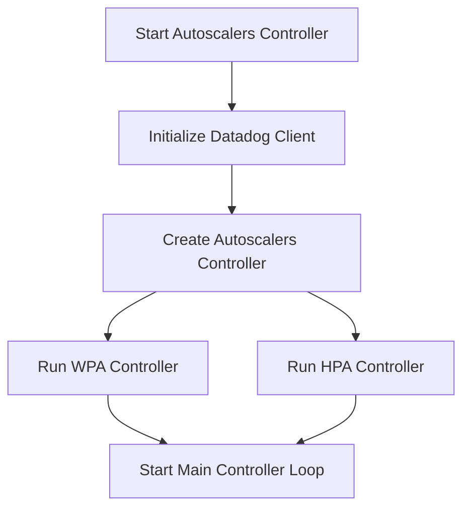

This document will cover the process of starting the autoscalers controller, which includes:

1. Initializing the Datadog client
2. Creating the autoscalers controller
3. Running the WPA and HPA controllers
4. Starting the main controller loop.

Technical document: <SwmLink doc-title="Starting the Autoscalers Controller">[Starting the Autoscalers Controller](/.swm/starting-the-autoscalers-controller.clbmmflr.sw.md)</SwmLink>

# [Initializing the Datadog Client](https://app.swimm.io/repos/Z2l0aHViJTNBJTNBZGF0YWRvZy1hZ2VudCUzQSUzQVN3aW1tLURlbW8=/docs/clbmmflr#initializing-datadog-client)

The process begins by setting up the Datadog client. This client is essential for collecting and sending metrics to the Datadog platform. If the client initialization fails, an error is sent to the provided channel, and the process is halted. This step ensures that the system can communicate with Datadog for metrics collection, which is crucial for monitoring and scaling decisions.

# [Creating the Autoscalers Controller](https://app.swimm.io/repos/Z2l0aHViJTNBJTNBZGF0YWRvZy1hZ2VudCUzQSUzQVN3aW1tLURlbW8=/docs/clbmmflr#creating-autoscalers-controller)

Next, an instance of the autoscalers controller is created using various components such as the context's client, event recorder, leader function, and the initialized Datadog client. This controller is responsible for managing the autoscaling logic. If the creation of this controller fails, an error is sent to the provided channel, and the process is halted. This step is critical as it sets up the main component that will handle autoscaling operations.

# [Running WPA and HPA Controllers](https://app.swimm.io/repos/Z2l0aHViJTNBJTNBZGF0YWRvZy1hZ2VudCUzQSUzQVN3aW1tLURlbW8=/docs/clbmmflr#running-wpa-and-hpa-controllers)

If the WPA (Watermark Pod Autoscaler) controller is enabled in the configuration, it starts in a separate thread. The HPA (Horizontal Pod Autoscaler) controller is also enabled and started. These controllers are responsible for adjusting the number of pods based on the metrics collected. Running these controllers ensures that the system can dynamically scale resources based on real-time data, improving efficiency and performance.

# [Starting the Main Controller Loop](https://app.swimm.io/repos/Z2l0aHViJTNBJTNBZGF0YWRvZy1hZ2VudCUzQSUzQVN3aW1tLURlbW8=/docs/clbmmflr#starting-controller-loop)

Finally, the main controller loop is initiated. This loop handles the lifecycle of the external metrics store, ensuring that metrics are continuously collected and processed. Starting this loop is essential for maintaining the ongoing operation of the autoscalers, allowing the system to adapt to changing workloads.

&nbsp;

*This is an auto-generated document by Swimm AI 🌊 and has not yet been verified by a human*

<SwmMeta version="3.0.0" repo-id="Z2l0aHViJTNBJTNBZGF0YWRvZy1hZ2VudCUzQSUzQVN3aW1tLURlbW8=" repo-name="datadog-agent">Powered by [Swimm](/)</SwmMeta>
