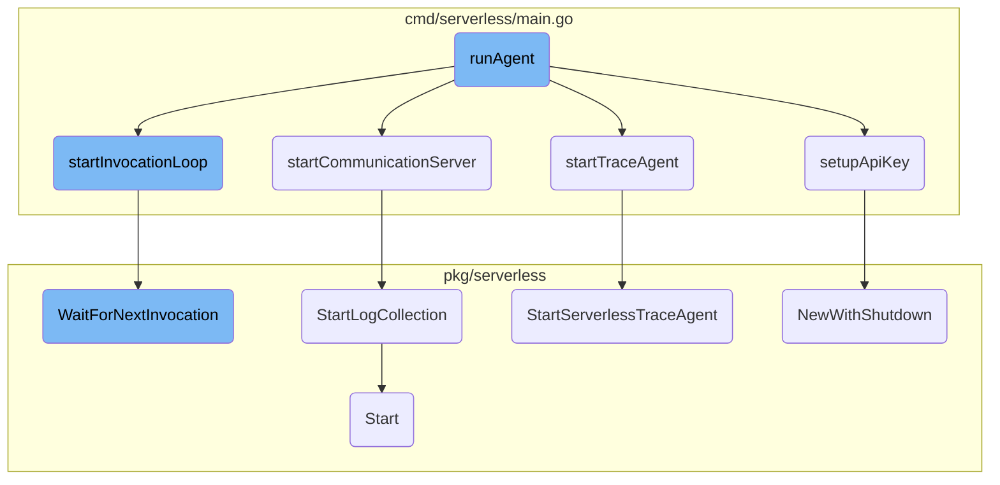

This document explains the process of starting the Datadog Agent using the <SwmToken path="cmd/serverless/main.go" pos="80:2:2" line-data="func runAgent() {">`runAgent`</SwmToken> function. The <SwmToken path="cmd/serverless/main.go" pos="80:2:2" line-data="func runAgent() {">`runAgent`</SwmToken> function is responsible for initializing various components such as the logger, configuration, and API key. It also starts the communication server, trace agent, and other necessary agents. Finally, it enters the invocation loop to handle incoming events.

The process starts with initializing the logger and loading the configuration. Next, it sets up the API key, which is essential for the agent to communicate with Datadog. If the API key setup fails, the process stops. If successful, it starts the communication server, which handles log collection and other tasks. The trace agent is then started to collect and send trace data. Finally, the process enters an invocation loop that waits for and processes incoming events, ensuring the agent remains responsive and functional.

# Flow drill down



<SwmSnippet path="/cmd/serverless/main.go" line="80">

---

## <SwmToken path="cmd/serverless/main.go" pos="80:2:2" line-data="func runAgent() {">`runAgent`</SwmToken>

The <SwmToken path="cmd/serverless/main.go" pos="80:2:2" line-data="func runAgent() {">`runAgent`</SwmToken> function is the entry point for starting the Datadog Agent. It initializes various components such as the logger, configuration, and API key. It also starts the communication server, trace agent, and other necessary agents. Finally, it enters the invocation loop to handle incoming events.

```go
func runAgent() {
	startTime := time.Now()

	setupLambdaAgentOverrides()
	setupLogger()
	debug.OutputDatadogEnvVariablesForDebugging()
	loadConfig()
	if !setupApiKey() {
		return
	}
	serverlessDaemon := startCommunicationServer(startTime)

	// serverless parts
	// ----------------

	serverlessID, done := registerExtension(serverlessDaemon)
	if !done {
		return
	}

	configureAdaptiveFlush(serverlessDaemon)
```

---

</SwmSnippet>

<SwmSnippet path="/cmd/serverless/main.go" line="337">

---

## <SwmToken path="cmd/serverless/main.go" pos="337:2:2" line-data="func setupApiKey() bool {">`setupApiKey`</SwmToken>

The <SwmToken path="cmd/serverless/main.go" pos="337:2:2" line-data="func setupApiKey() bool {">`setupApiKey`</SwmToken> function handles the retrieval and validation of the Datadog API key. If the API key is not found or cannot be decrypted, it logs an error and returns false, preventing the agent from starting.

```go
func setupApiKey() bool {
	if err := apikey.HandleEnv(); err != nil {
		log.Errorf("Can't start the Datadog extension as no API Key has been detected, or API Key could not be decrypted. Data will not be sent to Datadog.")
		ctx := context.Background()

		_, shutdownAppSec, err := appsec.NewWithShutdown(nil)
		if err != nil {
			log.Errorf("Can't start Lambda Runtime API Proxy for AppSec: %v", err)
		}
		if shutdownAppSec != nil {
			defer func() {
				if err := shutdownAppSec(ctx); err != nil {
					log.Warnf("Failed to shut down AppSec proxy: %v", err)
				}
			}()
		}

		// we still need to register the extension but let's return after (no-op)
		id, _, registrationError := registration.RegisterExtension(extensionRegistrationRoute, extensionRegistrationTimeout)
		if registrationError != nil {
			log.Errorf("Can't register as a serverless agent: %s", registrationError)
```

---

</SwmSnippet>

<SwmSnippet path="/cmd/serverless/main.go" line="331">

---

## <SwmToken path="cmd/serverless/main.go" pos="331:2:2" line-data="func startTraceAgent(wg *sync.WaitGroup, lambdaSpanChan chan *pb.Span, coldStartSpanId uint64, serverlessDaemon *daemon.Daemon) {">`startTraceAgent`</SwmToken>

The <SwmToken path="cmd/serverless/main.go" pos="331:2:2" line-data="func startTraceAgent(wg *sync.WaitGroup, lambdaSpanChan chan *pb.Span, coldStartSpanId uint64, serverlessDaemon *daemon.Daemon) {">`startTraceAgent`</SwmToken> function initializes and starts the trace agent, which is responsible for collecting and sending trace data to Datadog. It sets the trace agent in the serverless daemon.

```go
func startTraceAgent(wg *sync.WaitGroup, lambdaSpanChan chan *pb.Span, coldStartSpanId uint64, serverlessDaemon *daemon.Daemon) {
	defer wg.Done()
	traceAgent := trace.StartServerlessTraceAgent(config.Datadog().GetBool("apm_config.enabled"), &trace.LoadConfig{Path: datadogConfigPath}, lambdaSpanChan, coldStartSpanId)
	serverlessDaemon.SetTraceAgent(traceAgent)
}
```

---

</SwmSnippet>

<SwmSnippet path="/cmd/serverless/main.go" line="240">

---

## <SwmToken path="cmd/serverless/main.go" pos="240:2:2" line-data="func startCommunicationServer(startTime time.Time) *daemon.Daemon {">`startCommunicationServer`</SwmToken>

The <SwmToken path="cmd/serverless/main.go" pos="240:2:2" line-data="func startCommunicationServer(startTime time.Time) *daemon.Daemon {">`startCommunicationServer`</SwmToken> function initializes the serverless daemon and starts the log collection process. It also restores the current state from a file if available.

```go
func startCommunicationServer(startTime time.Time) *daemon.Daemon {
	serverlessDaemon := daemon.StartDaemon(httpServerAddr)
	serverlessDaemon.ExecutionContext.SetInitializationTime(startTime)
	err := serverlessDaemon.ExecutionContext.RestoreCurrentStateFromFile()
	if err != nil {
		log.Debug("Unable to restore the state from file %s", err)
	} else {
		serverlessDaemon.StartLogCollection()
	}
	return serverlessDaemon
}
```

---

</SwmSnippet>

<SwmSnippet path="/cmd/serverless/main.go" line="155">

---

## <SwmToken path="cmd/serverless/main.go" pos="155:2:2" line-data="func startInvocationLoop(serverlessDaemon *daemon.Daemon, serverlessID registration.ID) chan struct{} {">`startInvocationLoop`</SwmToken>

The <SwmToken path="cmd/serverless/main.go" pos="155:2:2" line-data="func startInvocationLoop(serverlessDaemon *daemon.Daemon, serverlessID registration.ID) chan struct{} {">`startInvocationLoop`</SwmToken> function starts the main loop that waits for and processes incoming invocation events. It runs in a separate goroutine and handles termination signals.

```go
func startInvocationLoop(serverlessDaemon *daemon.Daemon, serverlessID registration.ID) chan struct{} {
	// run the invocation loop in a routine
	// we don't want to start this mainloop before because once we're waiting on
	// the invocation route, we can't report init errors anymore.
	stopCh := make(chan struct{})
	go func() {
		for {
			if err := serverless.WaitForNextInvocation(stopCh, serverlessDaemon, serverlessID); err != nil {
				log.Error(err)
			}
		}
	}()
	go handleTerminationSignals(serverlessDaemon, stopCh, signal.Notify)

	return stopCh
}
```

---

</SwmSnippet>

<SwmSnippet path="/pkg/serverless/serverless.go" line="98">

---

## <SwmToken path="pkg/serverless/serverless.go" pos="98:2:2" line-data="// WaitForNextInvocation makes a blocking HTTP call to receive the next event from AWS.">`WaitForNextInvocation`</SwmToken>

The <SwmToken path="pkg/serverless/serverless.go" pos="98:2:2" line-data="// WaitForNextInvocation makes a blocking HTTP call to receive the next event from AWS.">`WaitForNextInvocation`</SwmToken> function makes a blocking HTTP call to receive the next event from AWS. It handles both INVOKE and SHUTDOWN events and processes them accordingly.

```go
// WaitForNextInvocation makes a blocking HTTP call to receive the next event from AWS.
// Note that for now, we only subscribe to INVOKE and SHUTDOWN events.
// Write into stopCh to stop the main thread of the running program.
func WaitForNextInvocation(stopCh chan struct{}, daemon *daemon.Daemon, id registration.ID) error {
	var err error
	var request *http.Request
	var response *http.Response

	if request, err = http.NewRequest(http.MethodGet, registration.NextUrl(), nil); err != nil {
		return fmt.Errorf("WaitForNextInvocation: can't create the GET request: %v", err)
	}
	request.Header.Set(headerExtID, id.String())

	// make a blocking HTTP call to wait for the next event from AWS
	client := &http.Client{Timeout: 0} // this one should never timeout
	if response, err = client.Do(request); err != nil {
		return fmt.Errorf("WaitForNextInvocation: while GET next route: %v", err)
	}
	// we received an INVOKE or SHUTDOWN event
	daemon.StoreInvocationTime(time.Now())

```

---

</SwmSnippet>

<SwmSnippet path="/pkg/serverless/daemon/daemon.go" line="432">

---

## <SwmToken path="pkg/serverless/daemon/daemon.go" pos="432:2:2" line-data="// StartLogCollection begins processing the logs we have already received from the Lambda Logs API.">`StartLogCollection`</SwmToken>

The <SwmToken path="pkg/serverless/daemon/daemon.go" pos="432:2:2" line-data="// StartLogCollection begins processing the logs we have already received from the Lambda Logs API.">`StartLogCollection`</SwmToken> function begins processing the logs received from the Lambda Logs API. It can be safely called multiple times.

```go
// StartLogCollection begins processing the logs we have already received from the Lambda Logs API.
// This should be called after an ARN and RequestId is available. Can safely be called multiple times.
func (d *Daemon) StartLogCollection() {
	d.logCollector.Start()
}
```

---

</SwmSnippet>

<SwmSnippet path="/pkg/serverless/metrics/metric.go" line="63">

---

## Start

The <SwmToken path="pkg/serverless/metrics/metric.go" pos="63:2:2" line-data="// Start starts the DogStatsD agent">`Start`</SwmToken> function starts the <SwmToken path="pkg/serverless/metrics/metric.go" pos="63:8:8" line-data="// Start starts the DogStatsD agent">`DogStatsD`</SwmToken> agent, which is responsible for collecting and sending metrics to Datadog. It configures various settings and initializes the <SwmToken path="pkg/serverless/metrics/metric.go" pos="63:8:8" line-data="// Start starts the DogStatsD agent">`DogStatsD`</SwmToken> server.

```go
// Start starts the DogStatsD agent
func (c *ServerlessMetricAgent) Start(forwarderTimeout time.Duration, multipleEndpointConfig MultipleEndpointConfig, dogstatFactory DogStatsDFactory) {
	// prevents any UDP packets from being stuck in the buffer and not parsed during the current invocation
	// by setting this option to 1ms, all packets received will directly be sent to the parser
	config.Datadog().Set("dogstatsd_packet_buffer_flush_timeout", 1*time.Millisecond, model.SourceAgentRuntime)

	// the invocation metric is also generated by Lambda Layers
	// we want to avoid duplicate metric
	customerList := config.Datadog().GetStringSlice(statsDMetricBlocklistKey)

	// if the proxy is enabled we need to also block the errorMetric
	if strings.ToLower(os.Getenv(proxyEnabledEnvVar)) == "true" {
		config.Datadog().Set(statsDMetricBlocklistKey, buildMetricBlocklistForProxy(customerList), model.SourceAgentRuntime)
	} else {
		config.Datadog().Set(statsDMetricBlocklistKey, buildMetricBlocklist(customerList), model.SourceAgentRuntime)
	}
	demux := buildDemultiplexer(multipleEndpointConfig, forwarderTimeout)

	if demux != nil {
		statsd, err := dogstatFactory.NewServer(demux)
		if err != nil {
```

---

</SwmSnippet>

<SwmSnippet path="/pkg/serverless/trace/trace.go" line="92">

---

## <SwmToken path="pkg/serverless/trace/trace.go" pos="95:2:2" line-data="func StartServerlessTraceAgent(enabled bool, loadConfig Load, lambdaSpanChan chan&lt;- *pb.Span, coldStartSpanId uint64) ServerlessTraceAgent {">`StartServerlessTraceAgent`</SwmToken>

The <SwmToken path="pkg/serverless/trace/trace.go" pos="95:2:2" line-data="func StartServerlessTraceAgent(enabled bool, loadConfig Load, lambdaSpanChan chan&lt;- *pb.Span, coldStartSpanId uint64) ServerlessTraceAgent {">`StartServerlessTraceAgent`</SwmToken> function starts the trace agent if it is enabled. It configures the trace agent and starts it in a separate goroutine.

```go
// Start starts the agent
//
//nolint:revive // TODO(SERV) Fix revive linter
func StartServerlessTraceAgent(enabled bool, loadConfig Load, lambdaSpanChan chan<- *pb.Span, coldStartSpanId uint64) ServerlessTraceAgent {
	if enabled {
		// Set the serverless config option which will be used to determine if
		// hostname should be resolved. Skipping hostname resolution saves >1s
		// in load time between gRPC calls and agent commands.
		ddConfig.Datadog().Set("serverless.enabled", true, model.SourceAgentRuntime)

		tc, confErr := loadConfig.Load()
		if confErr != nil {
			log.Errorf("Unable to load trace agent config: %s", confErr)
		} else {
			context, cancel := context.WithCancel(context.Background())
			tc.Hostname = ""
			tc.SynchronousFlushing = true
			var compressor compression.Component
			if tc.HasFeature("zstd-encoding") {
				compressor = zstd.NewComponent()
			} else {
```

---

</SwmSnippet>

<SwmSnippet path="/pkg/serverless/appsec/appsec.go" line="34">

---

## <SwmToken path="pkg/serverless/appsec/appsec.go" pos="34:2:2" line-data="// NewWithShutdown returns a new httpsec.ProxyLifecycleProcessor and a shutdown function that can be">`NewWithShutdown`</SwmToken>

The <SwmToken path="pkg/serverless/appsec/appsec.go" pos="34:2:2" line-data="// NewWithShutdown returns a new httpsec.ProxyLifecycleProcessor and a shutdown function that can be">`NewWithShutdown`</SwmToken> function initializes the <SwmToken path="pkg/serverless/appsec/appsec.go" pos="35:29:29" line-data="// called to terminate the started proxy (releasing the bound port and closing the AppSec instance).">`AppSec`</SwmToken> proxy and returns a shutdown function that can be used to terminate the proxy and release resources. This is useful for clean shutdowns in test code and other scenarios.

```go
// NewWithShutdown returns a new httpsec.ProxyLifecycleProcessor and a shutdown function that can be
// called to terminate the started proxy (releasing the bound port and closing the AppSec instance).
// This is mainly intended to be called in test code so that goroutines and ports are not leaked,
// but can be used in other code paths when it is useful to be able to perform a clean shut down.
func NewWithShutdown(demux aggregator.Demultiplexer) (lp *httpsec.ProxyLifecycleProcessor, shutdown func(context.Context) error, err error) {
	appsecInstance, err := newAppSec() // note that the assigned variable is in the parent scope
	if err != nil {
		return nil, nil, err
	}
	if appsecInstance == nil {
		return nil, nil, nil // appsec disabled
	}

	// AppSec monitors the invocations by acting as a proxy of the AWS Lambda Runtime API.
	lp = httpsec.NewProxyLifecycleProcessor(appsecInstance, demux)
	shutdownProxy := proxy.Start(
		"127.0.0.1:9000",
		"127.0.0.1:9001",
		lp,
	)
	log.Debug("appsec: started successfully using the runtime api proxy monitoring mode")
```

---

</SwmSnippet>

&nbsp;

*This is an auto-generated document by Swimm AI 🌊 and has not yet been verified by a human*

<SwmMeta version="3.0.0" repo-id="Z2l0aHViJTNBJTNBZGF0YWRvZy1hZ2VudCUzQSUzQVN3aW1tLURlbW8=" repo-name="datadog-agent"><sup>Powered by [Swimm](/)</sup></SwmMeta>
