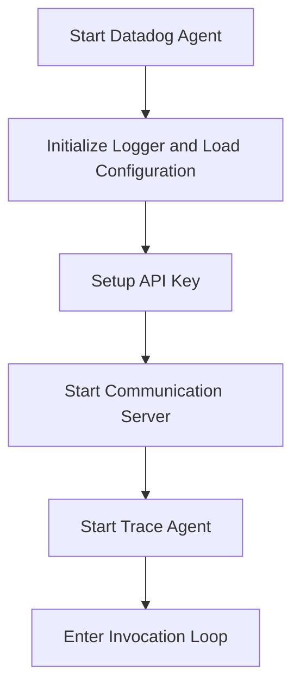

This document will cover the process of starting the Datadog Agent, which includes:

1. Initializing the logger and loading the configuration
2. Setting up the API key
3. Starting the communication server
4. Starting the trace agent
5. Entering the invocation loop to handle incoming events.

Technical document: <SwmLink doc-title="Starting the Datadog Agent">[Starting the Datadog Agent](/.swm/starting-the-datadog-agent.852maho3.sw.md)</SwmLink>

# [Initializing the logger and loading the configuration](https://app.swimm.io/repos/Z2l0aHViJTNBJTNBZGF0YWRvZy1hZ2VudCUzQSUzQVN3aW1tLURlbW8=/docs/852maho3#runagent)

The process begins by initializing the logger and loading the configuration. This step ensures that all subsequent actions are properly logged and that the agent has the necessary settings to operate. The logger helps in tracking the agent's activities, while the configuration provides the required parameters for its operation.

# [Setting up the API key](https://app.swimm.io/repos/Z2l0aHViJTNBJTNBZGF0YWRvZy1hZ2VudCUzQSUzQVN3aW1tLURlbW8=/docs/852maho3#setupapikey)

The API key is essential for the agent to communicate with the Datadog platform. This step involves retrieving and validating the API key. If the API key is not found or cannot be decrypted, the process stops, and an error is logged. This ensures that only authorized agents can send data to Datadog, maintaining the security and integrity of the data.

# [Starting the communication server](https://app.swimm.io/repos/Z2l0aHViJTNBJTNBZGF0YWRvZy1hZ2VudCUzQSUzQVN3aW1tLURlbW8=/docs/852maho3#startcommunicationserver)

The communication server is responsible for handling log collection and other tasks. This step initializes the serverless daemon and starts the log collection process. It also attempts to restore the current state from a file if available. This ensures that the agent can continue from where it left off in case of a restart, providing continuity and reliability.

# [Starting the trace agent](https://app.swimm.io/repos/Z2l0aHViJTNBJTNBZGF0YWRvZy1hZ2VudCUzQSUzQVN3aW1tLURlbW8=/docs/852maho3#starttraceagent)

The trace agent is responsible for collecting and sending trace data to Datadog. This step initializes and starts the trace agent, setting it in the serverless daemon. Trace data helps in monitoring the performance and behavior of applications, providing valuable insights for debugging and optimization.

# [Entering the invocation loop to handle incoming events](https://app.swimm.io/repos/Z2l0aHViJTNBJTNBZGF0YWRvZy1hZ2VudCUzQSUzQVN3aW1tLURlbW8=/docs/852maho3#startinvocationloop)

The invocation loop is the main loop that waits for and processes incoming invocation events. It runs in a separate goroutine and handles termination signals. This ensures that the agent remains responsive and can handle events as they come in, maintaining its functionality and reliability.

&nbsp;

*This is an auto-generated document by Swimm AI 🌊 and has not yet been verified by a human*

<SwmMeta version="3.0.0" repo-id="Z2l0aHViJTNBJTNBZGF0YWRvZy1hZ2VudCUzQSUzQVN3aW1tLURlbW8=" repo-name="datadog-agent">Powered by [Swimm](/)</SwmMeta>
