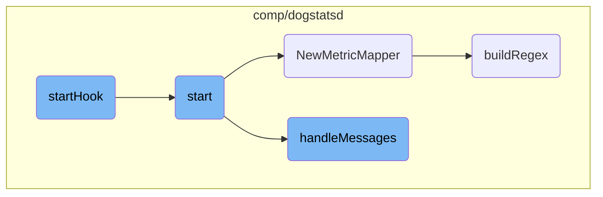

In this document, we will explain the process of starting the <SwmToken path="comp/dogstatsd/server/server.go" pos="332:14:14" line-data="		s.log.Errorf(&quot;Could not start dogstatsd: %s&quot;, err)">`dogstatsd`</SwmToken> server. The process involves initiating the server, setting up various listeners, handling packets, and processing incoming messages.

The flow starts with the <SwmToken path="comp/dogstatsd/server/server.go" pos="329:9:9" line-data="func (s *server) startHook(context context.Context) error {">`startHook`</SwmToken> function, which initiates the <SwmToken path="comp/dogstatsd/server/server.go" pos="332:14:14" line-data="		s.log.Errorf(&quot;Could not start dogstatsd: %s&quot;, err)">`dogstatsd`</SwmToken> server by calling the <SwmToken path="comp/dogstatsd/server/server.go" pos="330:7:7" line-data="	err := s.start(context)">`start`</SwmToken> function. The <SwmToken path="comp/dogstatsd/server/server.go" pos="330:7:7" line-data="	err := s.start(context)">`start`</SwmToken> function sets up different types of listeners based on the configuration, such as UDP and UDS listeners. It also handles packet forwarding if configured and starts the message handling process. The <SwmToken path="comp/dogstatsd/server/server.go" pos="504:9:9" line-data="func (s *server) handleMessages() {">`handleMessages`</SwmToken> function then processes incoming packets by initializing and running worker goroutines.

# Flow drill down



<SwmSnippet path="/comp/dogstatsd/server/server.go" line="329">

---

## <SwmToken path="comp/dogstatsd/server/server.go" pos="329:9:9" line-data="func (s *server) startHook(context context.Context) error {">`startHook`</SwmToken>

The <SwmToken path="comp/dogstatsd/server/server.go" pos="329:9:9" line-data="func (s *server) startHook(context context.Context) error {">`startHook`</SwmToken> function is responsible for initiating the <SwmToken path="comp/dogstatsd/server/server.go" pos="332:14:14" line-data="		s.log.Errorf(&quot;Could not start dogstatsd: %s&quot;, err)">`dogstatsd`</SwmToken> server. It calls the <SwmToken path="comp/dogstatsd/server/server.go" pos="330:7:7" line-data="	err := s.start(context)">`start`</SwmToken> function and logs whether the server started successfully or encountered an error.

```go
func (s *server) startHook(context context.Context) error {
	err := s.start(context)
	if err != nil {
		s.log.Errorf("Could not start dogstatsd: %s", err)
	} else {
		s.log.Debug("dogstatsd started")
	}
	return nil
}
```

---

</SwmSnippet>

<SwmSnippet path="/comp/dogstatsd/server/server.go" line="339">

---

## start

The <SwmToken path="comp/dogstatsd/server/server.go" pos="339:9:9" line-data="func (s *server) start(context.Context) error {">`start`</SwmToken> function initializes various listeners (UDP, UDS, named pipes) based on the configuration. It sets up packet channels, shared packet pools, and registers pool managers. It also handles packet forwarding if configured and starts the message handling process.

```go
func (s *server) start(context.Context) error {
	packetsChannel := make(chan packets.Packets, s.config.GetInt("dogstatsd_queue_size"))
	tmpListeners := make([]listeners.StatsdListener, 0, 2)

	if err := s.tCapture.GetStartUpError(); err != nil {
		return err
	}

	// sharedPacketPool is used by the packet assembler to retrieve already allocated
	// buffer in order to avoid allocation. The packets are pushed back by the server.
	sharedPacketPool := packets.NewPool(s.config.GetInt("dogstatsd_buffer_size"), s.packetsTelemetry)
	sharedPacketPoolManager := packets.NewPoolManager[packets.Packet](sharedPacketPool)

	udsListenerRunning := false

	socketPath := s.config.GetString("dogstatsd_socket")
	socketStreamPath := s.config.GetString("dogstatsd_stream_socket")
	originDetection := s.config.GetBool("dogstatsd_origin_detection")
	var sharedUDSOobPoolManager *packets.PoolManager[[]byte]
	if originDetection {
		sharedUDSOobPoolManager = listeners.NewUDSOobPoolManager()
```

---

</SwmSnippet>

<SwmSnippet path="/comp/dogstatsd/server/server.go" line="373">

---

### Initializing Listeners

This section of the <SwmToken path="comp/dogstatsd/server/server.go" pos="330:7:7" line-data="	err := s.start(context)">`start`</SwmToken> function initializes different types of listeners (UDS, UDP, named pipes) based on the configuration. Each listener is appended to the <SwmToken path="comp/dogstatsd/server/server.go" pos="378:1:1" line-data="			tmpListeners = append(tmpListeners, unixListener)">`tmpListeners`</SwmToken> slice if successfully initialized.

```go
	if len(socketPath) > 0 {
		unixListener, err := listeners.NewUDSDatagramListener(packetsChannel, sharedPacketPoolManager, sharedUDSOobPoolManager, s.config, s.tCapture, s.wmeta, s.pidMap, s.listernersTelemetry, s.packetsTelemetry, s.telemetry)
		if err != nil {
			s.log.Errorf("Can't init UDS listener on path %s: %s", socketPath, err.Error())
		} else {
			tmpListeners = append(tmpListeners, unixListener)
			udsListenerRunning = true
		}
	}

	if len(socketStreamPath) > 0 {
		s.log.Warnf("dogstatsd_stream_socket is not yet supported, run it at your own risk")
		unixListener, err := listeners.NewUDSStreamListener(packetsChannel, sharedPacketPoolManager, sharedUDSOobPoolManager, s.config, s.tCapture, s.wmeta, s.pidMap, s.listernersTelemetry, s.packetsTelemetry, s.telemetry)
		if err != nil {
			s.log.Errorf("Can't init listener: %s", err.Error())
		} else {
			tmpListeners = append(tmpListeners, unixListener)
		}
	}

	if s.config.GetString("dogstatsd_port") == listeners.RandomPortName || s.config.GetInt("dogstatsd_port") > 0 {
```

---

</SwmSnippet>

<SwmSnippet path="/comp/dogstatsd/server/server.go" line="427">

---

### Handling Packets

This part of the <SwmToken path="comp/dogstatsd/server/server.go" pos="330:7:7" line-data="	err := s.start(context)">`start`</SwmToken> function sets up packet forwarding if a forward host and port are configured. It creates a new channel for packets and starts a forwarder goroutine.

```go
	forwardHost := s.config.GetString("statsd_forward_host")
	forwardPort := s.config.GetInt("statsd_forward_port")
	if forwardHost != "" && forwardPort != 0 {
		forwardAddress := fmt.Sprintf("%s:%d", forwardHost, forwardPort)
		con, err := net.Dial("udp", forwardAddress)
		if err != nil {
			s.log.Warnf("Could not connect to statsd forward host : %s", err)
		} else {
			s.packetsIn = make(chan packets.Packets, s.config.GetInt("dogstatsd_queue_size"))
			go s.forwarder(con)
		}
	}
```

---

</SwmSnippet>

<SwmSnippet path="/comp/dogstatsd/mapper/mapper.go" line="55">

---

## <SwmToken path="comp/dogstatsd/mapper/mapper.go" pos="55:2:2" line-data="// NewMetricMapper creates, validates, prepares a new MetricMapper">`NewMetricMapper`</SwmToken>

The <SwmToken path="comp/dogstatsd/mapper/mapper.go" pos="55:2:2" line-data="// NewMetricMapper creates, validates, prepares a new MetricMapper">`NewMetricMapper`</SwmToken> function creates and validates a new <SwmToken path="comp/dogstatsd/mapper/mapper.go" pos="55:16:16" line-data="// NewMetricMapper creates, validates, prepares a new MetricMapper">`MetricMapper`</SwmToken> instance. It processes the mapping profiles, builds regex patterns for each mapping, and initializes a cache for the mapper.

```go
// NewMetricMapper creates, validates, prepares a new MetricMapper
func NewMetricMapper(configProfiles []config.MappingProfile, cacheSize int) (*MetricMapper, error) {
	profiles := make([]MappingProfile, 0, len(configProfiles))
	for profileIndex, configProfile := range configProfiles {
		if configProfile.Name == "" {
			return nil, fmt.Errorf("missing profile name %d", profileIndex)
		}
		if configProfile.Prefix == "" {
			return nil, fmt.Errorf("missing prefix for profile: %s", configProfile.Name)
		}
		profile := MappingProfile{
			Name:     configProfile.Name,
			Prefix:   configProfile.Prefix,
			Mappings: make([]*MetricMapping, 0, len(configProfile.Mappings)),
		}
		for i, currentMapping := range configProfile.Mappings {
			matchType := currentMapping.MatchType
			if matchType == "" {
				matchType = matchTypeWildcard
			}
			if matchType != matchTypeWildcard && matchType != matchTypeRegex {
```

---

</SwmSnippet>

<SwmSnippet path="/comp/dogstatsd/server/server.go" line="504">

---

## <SwmToken path="comp/dogstatsd/server/server.go" pos="504:9:9" line-data="func (s *server) handleMessages() {">`handleMessages`</SwmToken>

The <SwmToken path="comp/dogstatsd/server/server.go" pos="504:9:9" line-data="func (s *server) handleMessages() {">`handleMessages`</SwmToken> function starts the processing of incoming packets. It initializes and runs worker goroutines that handle the packets read from the listeners.

```go
func (s *server) handleMessages() {
	if s.Statistics != nil {
		go s.Statistics.Process()
		go s.Statistics.Update(&dogstatsdPacketsLastSec)
	}

	for _, l := range s.listeners {
		l.Listen()
	}

	workersCount, _ := aggregator.GetDogStatsDWorkerAndPipelineCount()

	// undocumented configuration field to force the amount of dogstatsd workers
	// mainly used for benchmarks or some very specific use-case.
	if configWC := s.config.GetInt("dogstatsd_workers_count"); configWC != 0 {
		s.log.Debug("Forcing the amount of DogStatsD workers to:", configWC)
		workersCount = configWC
	}

	s.log.Debug("DogStatsD will run", workersCount, "workers")

```

---

</SwmSnippet>

<SwmSnippet path="/comp/dogstatsd/mapper/mapper.go" line="99">

---

## <SwmToken path="comp/dogstatsd/mapper/mapper.go" pos="99:2:2" line-data="func buildRegex(matchRe string, matchType string) (*regexp.Regexp, error) {">`buildRegex`</SwmToken>

The <SwmToken path="comp/dogstatsd/mapper/mapper.go" pos="99:2:2" line-data="func buildRegex(matchRe string, matchType string) (*regexp.Regexp, error) {">`buildRegex`</SwmToken> function compiles a regex pattern based on the match type (wildcard or regex). It ensures the pattern is valid and returns the compiled regex.

```go
func buildRegex(matchRe string, matchType string) (*regexp.Regexp, error) {
	if matchType == matchTypeWildcard {
		if !allowedWildcardMatchPattern.MatchString(matchRe) {
			return nil, fmt.Errorf("invalid wildcard match pattern `%s`, it does not match allowed match regex `%s`", matchRe, allowedWildcardMatchPattern)
		}
		if strings.Contains(matchRe, "**") {
			return nil, fmt.Errorf("invalid wildcard match pattern `%s`, it should not contain consecutive `*`", matchRe)
		}
		matchRe = strings.Replace(matchRe, ".", "\\.", -1)
		matchRe = strings.Replace(matchRe, "*", "([^.]*)", -1)
	}
	regex, err := regexp.Compile("^" + matchRe + "$")
	if err != nil {
		return nil, fmt.Errorf("invalid match `%s`. cannot compile regex: %v", matchRe, err)
	}
	return regex, nil
}
```

---

</SwmSnippet>

&nbsp;

*This is an auto-generated document by Swimm AI 🌊 and has not yet been verified by a human*

<SwmMeta version="3.0.0" repo-id="Z2l0aHViJTNBJTNBZGF0YWRvZy1hZ2VudCUzQSUzQVN3aW1tLURlbW8=" repo-name="datadog-agent"><sup>Powered by [Swimm](/)</sup></SwmMeta>
