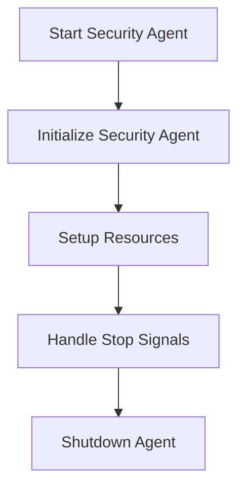

This document will cover the process of starting the Security Agent, which includes:

1. Initializing the Security Agent
2. Setting up necessary resources
3. Handling stop signals and shutting down the agent.

Technical document: <SwmLink doc-title="Starting the Security Agent">[Starting the Security Agent](/.swm/starting-the-security-agent.r1zyr5bf.sw.md)</SwmLink>

# [Initializing the Security Agent](https://app.swimm.io/repos/Z2l0aHViJTNBJTNBZGF0YWRvZy1hZ2VudCUzQSUzQVN3aW1tLURlbW8=/docs/r1zyr5bf#starting-the-security-agent)

The process begins with initializing the Security Agent. This involves calling the `RunAgent` function, which sets up core dumps and checks for enabled components. If no components are enabled or there are missing API keys, the agent exits gracefully. This ensures that the agent only runs when it is properly configured, preventing unnecessary resource usage and potential errors.

# [Setting up necessary resources](https://app.swimm.io/repos/Z2l0aHViJTNBJTNBZGF0YWRvZy1hZ2VudCUzQSUzQVN3aW1tLURlbW8=/docs/r1zyr5bf#runagent)

Once the agent is initialized, it sets up necessary resources. This includes starting the API server, which allows the agent to communicate with other components and services. The `RunAgent` function also sets up internal profiling if enabled, which helps in monitoring the agent's performance and diagnosing issues. This step ensures that the agent has all the required resources to function correctly and efficiently.

# [Handling stop signals and shutting down the agent](https://app.swimm.io/repos/Z2l0aHViJTNBJTNBZGF0YWRvZy1hZ2VudCUzQSUzQVN3aW1tLURlbW8=/docs/r1zyr5bf#stopping-the-security-agent)

After setting up resources, the agent sets up a signal handler to listen for stop signals. When a stop signal is received, the `StopAgent` function is called to clean up resources and shut down the agent. This involves retrieving the health status of components and stopping various services like `metaScheduler`, `statsd`, and `expvarServer`. This step ensures a clean and orderly shutdown of the agent, preventing potential data loss or corruption.

&nbsp;

*This is an auto-generated document by Swimm AI 🌊 and has not yet been verified by a human*

<SwmMeta version="3.0.0" repo-id="Z2l0aHViJTNBJTNBZGF0YWRvZy1hZ2VudCUzQSUzQVN3aW1tLURlbW8=" repo-name="datadog-agent">Powered by [Swimm](/)</SwmMeta>
