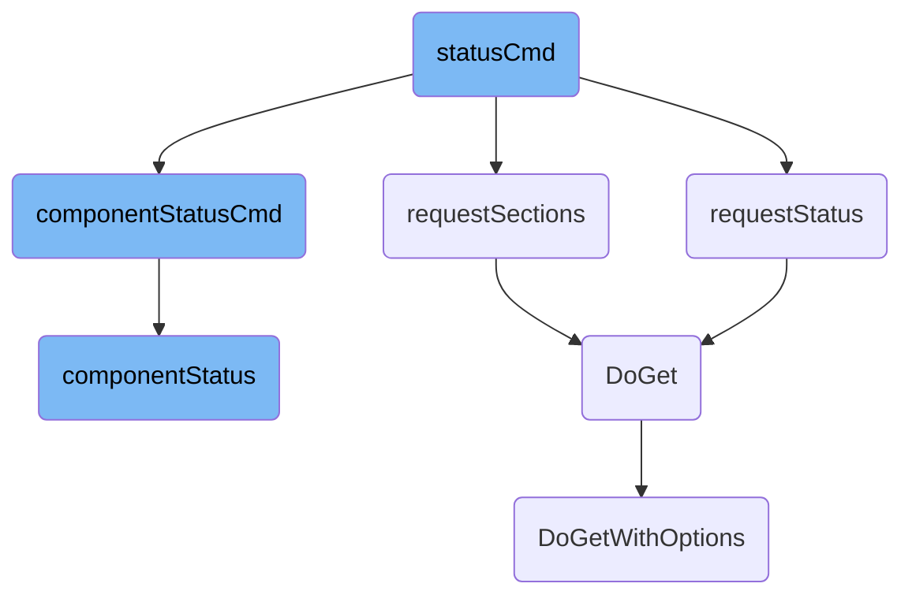

This document explains the flow and functionality of the <SwmToken path="cmd/agent/subcommands/status/command.go" pos="111:2:2" line-data="func statusCmd(logger log.Component, config config.Component, _ sysprobeconfig.Component, cliParams *cliParams) error {">`statusCmd`</SwmToken> command. The <SwmToken path="cmd/agent/subcommands/status/command.go" pos="111:2:2" line-data="func statusCmd(logger log.Component, config config.Component, _ sysprobeconfig.Component, cliParams *cliParams) error {">`statusCmd`</SwmToken> command is responsible for handling the status requests in the Datadog Agent. It determines the type of status information to fetch based on the <SwmToken path="cmd/agent/subcommands/status/command.go" pos="32:8:10" line-data="// cliParams are the command-line arguments for this subcommand">`command-line`</SwmToken> parameters and calls the appropriate functions to retrieve and display the status.

The flow starts with the <SwmToken path="cmd/agent/subcommands/status/command.go" pos="111:2:2" line-data="func statusCmd(logger log.Component, config config.Component, _ sysprobeconfig.Component, cliParams *cliParams) error {">`statusCmd`</SwmToken> command, which checks the <SwmToken path="cmd/agent/subcommands/status/command.go" pos="32:8:10" line-data="// cliParams are the command-line arguments for this subcommand">`command-line`</SwmToken> parameters to decide what type of status information is needed. If the parameters indicate a request for sections, it calls <SwmToken path="cmd/agent/subcommands/status/command.go" pos="113:5:5" line-data="		return redactError(requestSections(config))">`requestSections`</SwmToken> to get the list of available sections. If the parameters request the overall status, it calls <SwmToken path="cmd/agent/subcommands/status/command.go" pos="117:5:5" line-data="		return redactError(requestStatus(config, cliParams))">`requestStatus`</SwmToken> to fetch the agent's status. If a specific component's status is needed, it calls <SwmToken path="cmd/agent/subcommands/status/command.go" pos="120:3:3" line-data="	return componentStatusCmd(logger, config, cliParams)">`componentStatusCmd`</SwmToken>, which then calls <SwmToken path="cmd/agent/subcommands/status/command.go" pos="191:5:5" line-data="	return redactError(componentStatus(config, cliParams, cliParams.args[0]))">`componentStatus`</SwmToken> to get the status of that component. Each of these functions sets up an endpoint and performs a GET request to retrieve the necessary information, which is then displayed to the user.

# Flow drill down



<SwmSnippet path="/cmd/agent/subcommands/status/command.go" line="111">

---

## <SwmToken path="cmd/agent/subcommands/status/command.go" pos="111:2:2" line-data="func statusCmd(logger log.Component, config config.Component, _ sysprobeconfig.Component, cliParams *cliParams) error {">`statusCmd`</SwmToken>

The <SwmToken path="cmd/agent/subcommands/status/command.go" pos="111:2:2" line-data="func statusCmd(logger log.Component, config config.Component, _ sysprobeconfig.Component, cliParams *cliParams) error {">`statusCmd`</SwmToken> function is the entry point for handling the status command. It checks the <SwmToken path="cmd/agent/subcommands/status/command.go" pos="111:25:25" line-data="func statusCmd(logger log.Component, config config.Component, _ sysprobeconfig.Component, cliParams *cliParams) error {">`cliParams`</SwmToken> to determine whether to list sections, request the status, or get the status of a specific component. Depending on the conditions, it calls <SwmToken path="cmd/agent/subcommands/status/command.go" pos="113:5:5" line-data="		return redactError(requestSections(config))">`requestSections`</SwmToken>, <SwmToken path="cmd/agent/subcommands/status/command.go" pos="117:5:5" line-data="		return redactError(requestStatus(config, cliParams))">`requestStatus`</SwmToken>, or <SwmToken path="cmd/agent/subcommands/status/command.go" pos="120:3:3" line-data="	return componentStatusCmd(logger, config, cliParams)">`componentStatusCmd`</SwmToken> respectively.

```go
func statusCmd(logger log.Component, config config.Component, _ sysprobeconfig.Component, cliParams *cliParams) error {
	if cliParams.list {
		return redactError(requestSections(config))
	}

	if len(cliParams.args) < 1 {
		return redactError(requestStatus(config, cliParams))
	}

	return componentStatusCmd(logger, config, cliParams)
}
```

---

</SwmSnippet>

<SwmSnippet path="/cmd/agent/subcommands/status/command.go" line="159">

---

## <SwmToken path="cmd/agent/subcommands/status/command.go" pos="159:2:2" line-data="func requestStatus(config config.Component, cliParams *cliParams) error {">`requestStatus`</SwmToken>

The <SwmToken path="cmd/agent/subcommands/status/command.go" pos="159:2:2" line-data="func requestStatus(config config.Component, cliParams *cliParams) error {">`requestStatus`</SwmToken> function is responsible for fetching the overall status from the agent. It sets up the IPC URL, creates an endpoint, and performs a GET request using <SwmToken path="cmd/agent/subcommands/status/command.go" pos="172:10:10" line-data="	res, err := endpoint.DoGet(apiutil.WithValues(v))">`DoGet`</SwmToken>. The response is then rendered and displayed to the user.

```go
func requestStatus(config config.Component, cliParams *cliParams) error {

	if !cliParams.prettyPrintJSON && !cliParams.jsonStatus {
		fmt.Printf("Getting the status from the agent.\n\n")
	}

	v := setIpcURL(cliParams)

	endpoint, err := apiutil.NewIPCEndpoint(config, "/agent/status")
	if err != nil {
		return err
	}

	res, err := endpoint.DoGet(apiutil.WithValues(v))
	if err != nil {
		return err
	}

	// The rendering is done in the client so that the agent has less work to do
	err = renderResponse(res, cliParams)
	if err != nil {
```

---

</SwmSnippet>

<SwmSnippet path="/cmd/agent/subcommands/status/command.go" line="216">

---

## <SwmToken path="cmd/agent/subcommands/status/command.go" pos="216:2:2" line-data="func requestSections(config config.Component) error {">`requestSections`</SwmToken>

The <SwmToken path="cmd/agent/subcommands/status/command.go" pos="216:2:2" line-data="func requestSections(config config.Component) error {">`requestSections`</SwmToken> function fetches the available sections of the agent's status. It performs a GET request to the <SwmToken path="cmd/agent/subcommands/status/command.go" pos="217:16:21" line-data="	endpoint, err := apiutil.NewIPCEndpoint(config, &quot;/agent/status/sections&quot;)">`/agent/status/sections`</SwmToken> endpoint and unmarshals the response to display the list of sections.

```go
func requestSections(config config.Component) error {
	endpoint, err := apiutil.NewIPCEndpoint(config, "/agent/status/sections")
	if err != nil {
		return err
	}

	res, err := endpoint.DoGet()
	if err != nil {
		return err
	}

	var sections []string
	err = json.Unmarshal(res, &sections)
	if err != nil {
		return err
	}

	for _, section := range sections {
		fmt.Printf("- \"%s\"\n", section)
	}

```

---

</SwmSnippet>

<SwmSnippet path="/cmd/agent/subcommands/status/command.go" line="186">

---

## <SwmToken path="cmd/agent/subcommands/status/command.go" pos="186:2:2" line-data="func componentStatusCmd(_ log.Component, config config.Component, cliParams *cliParams) error {">`componentStatusCmd`</SwmToken>

The <SwmToken path="cmd/agent/subcommands/status/command.go" pos="186:2:2" line-data="func componentStatusCmd(_ log.Component, config config.Component, cliParams *cliParams) error {">`componentStatusCmd`</SwmToken> function handles the status request for a specific component. It ensures that only one section is specified and then calls <SwmToken path="cmd/agent/subcommands/status/command.go" pos="191:5:5" line-data="	return redactError(componentStatus(config, cliParams, cliParams.args[0]))">`componentStatus`</SwmToken> to fetch and display the status of the specified component.

```go
func componentStatusCmd(_ log.Component, config config.Component, cliParams *cliParams) error {
	if len(cliParams.args) > 1 {
		return fmt.Errorf("only one section must be specified")
	}

	return redactError(componentStatus(config, cliParams, cliParams.args[0]))
}
```

---

</SwmSnippet>

<SwmSnippet path="/cmd/agent/subcommands/status/command.go" line="194">

---

## <SwmToken path="cmd/agent/subcommands/status/command.go" pos="194:2:2" line-data="func componentStatus(config config.Component, cliParams *cliParams, component string) error {">`componentStatus`</SwmToken>

The <SwmToken path="cmd/agent/subcommands/status/command.go" pos="194:2:2" line-data="func componentStatus(config config.Component, cliParams *cliParams, component string) error {">`componentStatus`</SwmToken> function fetches the status of a specific component. It sets up the IPC URL, creates an endpoint for the component, and performs a GET request using <SwmToken path="cmd/agent/subcommands/status/command.go" pos="202:10:10" line-data="	res, err := endpoint.DoGet(apiutil.WithValues(v))">`DoGet`</SwmToken>. The response is then rendered and displayed to the user.

```go
func componentStatus(config config.Component, cliParams *cliParams, component string) error {

	v := setIpcURL(cliParams)

	endpoint, err := apiutil.NewIPCEndpoint(config, fmt.Sprintf("/agent/%s/status", component))
	if err != nil {
		return err
	}
	res, err := endpoint.DoGet(apiutil.WithValues(v))
	if err != nil {
		return err
	}

	// The rendering is done in the client so that the agent has less work to do
	err = renderResponse(res, cliParams)
	if err != nil {
		return err
	}

	return nil
}
```

---

</SwmSnippet>

<SwmSnippet path="/pkg/api/util/doget.go" line="49">

---

## <SwmToken path="pkg/api/util/doget.go" pos="49:2:2" line-data="// DoGet is a wrapper around performing HTTP GET requests">`DoGet`</SwmToken>

The <SwmToken path="pkg/api/util/doget.go" pos="49:2:2" line-data="// DoGet is a wrapper around performing HTTP GET requests">`DoGet`</SwmToken> function is a wrapper around performing HTTP GET requests. It calls <SwmToken path="pkg/api/util/doget.go" pos="51:3:3" line-data="	return DoGetWithOptions(c, url, &amp;ReqOptions{Conn: conn})">`DoGetWithOptions`</SwmToken> with default options.

```go
// DoGet is a wrapper around performing HTTP GET requests
func DoGet(c *http.Client, url string, conn ShouldCloseConnection) (body []byte, e error) {
	return DoGetWithOptions(c, url, &ReqOptions{Conn: conn})
}
```

---

</SwmSnippet>

<SwmSnippet path="/pkg/api/util/doget.go" line="54">

---

## <SwmToken path="pkg/api/util/doget.go" pos="54:2:2" line-data="// DoGetWithOptions is a wrapper around performing HTTP GET requests">`DoGetWithOptions`</SwmToken>

The <SwmToken path="pkg/api/util/doget.go" pos="54:2:2" line-data="// DoGetWithOptions is a wrapper around performing HTTP GET requests">`DoGetWithOptions`</SwmToken> function performs an HTTP GET request with the specified options. It sets up the request context, headers, and authorization token, then executes the request and returns the response body.

```go
// DoGetWithOptions is a wrapper around performing HTTP GET requests
func DoGetWithOptions(c *http.Client, url string, options *ReqOptions) (body []byte, e error) {
	if options.Authtoken == "" {
		options.Authtoken = GetAuthToken()
	}

	if options.Ctx == nil {
		options.Ctx = context.Background()
	}

	req, e := http.NewRequestWithContext(options.Ctx, "GET", url, nil)
	if e != nil {
		return body, e
	}
	req.Header.Set("Content-Type", "application/json")
	req.Header.Set("Authorization", "Bearer "+options.Authtoken)
	if options.Conn == CloseConnection {
		req.Close = true
	}

	r, e := c.Do(req)
```

---

</SwmSnippet>

&nbsp;

*This is an auto-generated document by Swimm AI 🌊 and has not yet been verified by a human*

<SwmMeta version="3.0.0" repo-id="Z2l0aHViJTNBJTNBZGF0YWRvZy1hZ2VudCUzQSUzQVN3aW1tLURlbW8=" repo-name="datadog-agent"><sup>Powered by [Swimm](/)</sup></SwmMeta>
