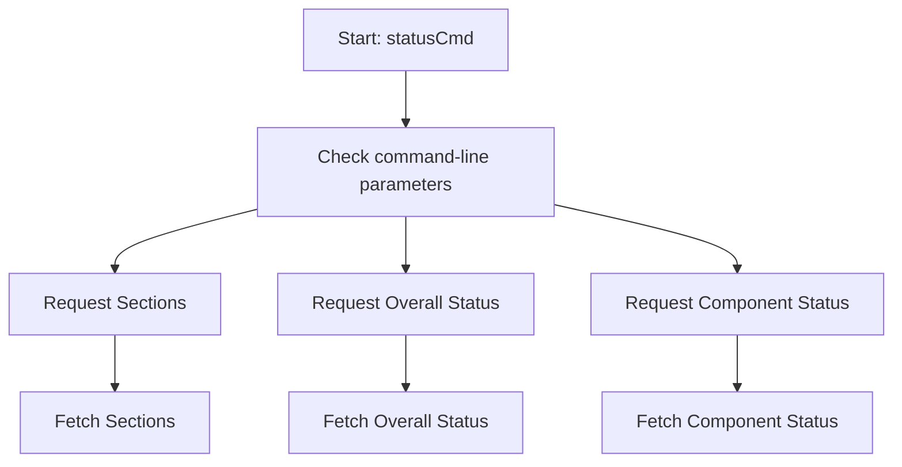

This document will cover the flow of the Status Command in the Datadog Agent, which includes:

1. Handling status requests
2. Fetching overall status
3. Fetching available sections
4. Fetching specific component status.

Technical document: <SwmLink doc-title="Status Command Flow">[Status Command Flow](/.swm/status-command-flow.b93jqau7.sw.md)</SwmLink>

# [Handling status requests](https://app.swimm.io/repos/Z2l0aHViJTNBJTNBZGF0YWRvZy1hZ2VudCUzQSUzQVN3aW1tLURlbW8=/docs/b93jqau7#statuscmd)

The Status Command flow begins with the `statusCmd` function, which is responsible for handling status requests in the Datadog Agent. It checks the command-line parameters to determine the type of status information needed. Depending on the parameters, it decides whether to list available sections, request the overall status, or get the status of a specific component.

# [Fetching overall status](https://app.swimm.io/repos/Z2l0aHViJTNBJTNBZGF0YWRvZy1hZ2VudCUzQSUzQVN3aW1tLURlbW8=/docs/b93jqau7#requeststatus)

If the command-line parameters indicate a request for the overall status, the `requestStatus` function is called. This function sets up the necessary endpoint and performs a GET request to fetch the agent's overall status. The response is then rendered and displayed to the user. This allows users to get a comprehensive view of the agent's current state.

# [Fetching available sections](https://app.swimm.io/repos/Z2l0aHViJTNBJTNBZGF0YWRvZy1hZ2VudCUzQSUzQVN3aW1tLURlbW8=/docs/b93jqau7#requestsections)

When the parameters indicate a request for available sections, the `requestSections` function is invoked. This function performs a GET request to the `/agent/status/sections` endpoint to retrieve the list of available sections. The response is then unmarshaled and displayed to the user, providing a detailed breakdown of the different sections of the agent's status.

# [Fetching specific component status](https://app.swimm.io/repos/Z2l0aHViJTNBJTNBZGF0YWRvZy1hZ2VudCUzQSUzQVN3aW1tLURlbW8=/docs/b93jqau7#componentstatuscmd)

If the parameters specify a request for a specific component's status, the `componentStatusCmd` function is called. This function ensures that only one section is specified and then calls `componentStatus` to fetch the status of the specified component. The response is rendered and displayed to the user, allowing them to see the status of individual components within the agent.

&nbsp;

*This is an auto-generated document by Swimm AI 🌊 and has not yet been verified by a human*

<SwmMeta version="3.0.0" repo-id="Z2l0aHViJTNBJTNBZGF0YWRvZy1hZ2VudCUzQSUzQVN3aW1tLURlbW8=" repo-name="datadog-agent">Powered by [Swimm](/)</SwmMeta>
