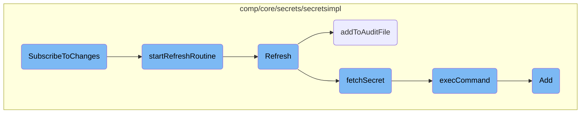

This document explains the process of subscribing to changes in secrets. It covers how the subscription is set up, how secrets are periodically refreshed, and how changes are handled and recorded.

The process starts with subscribing to changes, which involves adding a callback to a list that gets notified when secrets are resolved or refreshed. This triggers a refresh routine that periodically fetches and updates secrets. The fetched secrets are then processed, and any changes are recorded in an audit file. This ensures that the system always has the latest secret values and maintains a record of changes.

# Flow drill down



<SwmSnippet path="/comp/core/secrets/secretsimpl/secrets.go" line="255">

---

## <SwmToken path="comp/core/secrets/secretsimpl/secrets.go" pos="255:2:2" line-data="// SubscribeToChanges adds this callback to the list that get notified when secrets are resolved or refreshed">`SubscribeToChanges`</SwmToken>

The <SwmToken path="comp/core/secrets/secretsimpl/secrets.go" pos="255:2:2" line-data="// SubscribeToChanges adds this callback to the list that get notified when secrets are resolved or refreshed">`SubscribeToChanges`</SwmToken> function is responsible for adding a callback to a list that gets notified when secrets are resolved or refreshed. It locks the resolver, starts the refresh routine, and appends the callback to the subscriptions list.

```go
// SubscribeToChanges adds this callback to the list that get notified when secrets are resolved or refreshed
func (r *secretResolver) SubscribeToChanges(cb secrets.SecretChangeCallback) {
	r.lock.Lock()
	defer r.lock.Unlock()

	r.startRefreshRoutine()
	r.subscriptions = append(r.subscriptions, cb)
}
```

---

</SwmSnippet>

<SwmSnippet path="/comp/core/secrets/secretsimpl/secrets.go" line="240">

---

## <SwmToken path="comp/core/secrets/secretsimpl/secrets.go" pos="240:9:9" line-data="func (r *secretResolver) startRefreshRoutine() {">`startRefreshRoutine`</SwmToken>

The <SwmToken path="comp/core/secrets/secretsimpl/secrets.go" pos="240:9:9" line-data="func (r *secretResolver) startRefreshRoutine() {">`startRefreshRoutine`</SwmToken> function initializes a ticker that triggers the <SwmToken path="comp/core/secrets/secretsimpl/secrets.go" pos="248:12:12" line-data="			if _, err := r.Refresh(); err != nil {">`Refresh`</SwmToken> function at regular intervals. This ensures that secrets are periodically refreshed.

```go
func (r *secretResolver) startRefreshRoutine() {
	if r.ticker != nil || r.refreshInterval == 0 {
		return
	}
	r.ticker = time.NewTicker(r.refreshInterval)
	go func() {
		for {
			<-r.ticker.C
			if _, err := r.Refresh(); err != nil {
				log.Info(err)
			}
		}
	}()
}
```

---

</SwmSnippet>

<SwmSnippet path="/comp/core/secrets/secretsimpl/secrets.go" line="439">

---

## Refresh

The <SwmToken path="comp/core/secrets/secretsimpl/secrets.go" pos="439:2:2" line-data="// Refresh the secrets after they have been Resolved by fetching them from the backend again">`Refresh`</SwmToken> function fetches secrets from the backend again and processes the response. It filters handles based on an allowlist, fetches the secrets, and updates the audit file if there are new values.

```go
// Refresh the secrets after they have been Resolved by fetching them from the backend again
func (r *secretResolver) Refresh() (string, error) {
	r.lock.Lock()
	defer r.lock.Unlock()

	// get handles from the cache that match the allowlist
	newHandles := maps.Keys(r.cache)
	if allowlistPaths != nil {
		filteredHandles := make([]string, 0, len(newHandles))
		for _, handle := range newHandles {
			if r.matchesAllowlist(handle) {
				filteredHandles = append(filteredHandles, handle)
			}
		}
		newHandles = filteredHandles
	}
	if len(newHandles) == 0 {
		return "", nil
	}

	log.Infof("Refreshing secrets for %d handles", len(newHandles))
```

---

</SwmSnippet>

<SwmSnippet path="/comp/core/secrets/secretsimpl/secrets.go" line="502">

---

### <SwmToken path="comp/core/secrets/secretsimpl/secrets.go" pos="502:2:2" line-data="// addToAuditFile adds records to the audit file based upon newly refreshed secrets">`addToAuditFile`</SwmToken>

The <SwmToken path="comp/core/secrets/secretsimpl/secrets.go" pos="502:2:2" line-data="// addToAuditFile adds records to the audit file based upon newly refreshed secrets">`addToAuditFile`</SwmToken> function adds records to the audit file based on newly refreshed secrets. It sorts the handles, scrubs the secret values, and appends them to the audit file.

```go
// addToAuditFile adds records to the audit file based upon newly refreshed secrets
func (r *secretResolver) addToAuditFile(secretResponse map[string]string) error {
	if r.auditFilename == "" {
		return nil
	}
	if r.auditRotRecs == nil {
		r.auditRotRecs = newRotatingNDRecords(r.auditFilename, config{})
	}

	// iterate keys in deterministic order by sorting
	handles := make([]string, 0, len(secretResponse))
	for handle := range secretResponse {
		handles = append(handles, handle)
	}
	sort.Strings(handles)

	var newRows []auditRecord
	// add the newly refreshed secrets to the list of rows
	for _, handle := range handles {
		secretValue := secretResponse[handle]
		scrubbedValue := ""
```

---

</SwmSnippet>

<SwmSnippet path="/comp/core/secrets/secretsimpl/fetch_secret.go" line="105">

---

### <SwmToken path="comp/core/secrets/secretsimpl/fetch_secret.go" pos="105:2:2" line-data="// fetchSecret receives a list of secrets name to fetch, exec a custom">`fetchSecret`</SwmToken>

The <SwmToken path="comp/core/secrets/secretsimpl/fetch_secret.go" pos="105:2:2" line-data="// fetchSecret receives a list of secrets name to fetch, exec a custom">`fetchSecret`</SwmToken> function executes a custom command to fetch the actual secrets. It serializes the payload, runs the command, and processes the output to return the secrets.

```go
// fetchSecret receives a list of secrets name to fetch, exec a custom
// executable to fetch the actual secrets and returns them.
func (r *secretResolver) fetchSecret(secretsHandle []string) (map[string]string, error) {
	payload := map[string]interface{}{
		"version": secrets.PayloadVersion,
		"secrets": secretsHandle,
	}
	jsonPayload, err := json.Marshal(payload)
	if err != nil {
		return nil, fmt.Errorf("could not serialize secrets IDs to fetch password: %s", err)
	}
	output, err := r.execCommand(string(jsonPayload))
	if err != nil {
		return nil, err
	}

	secrets := map[string]secrets.SecretVal{}
	err = json.Unmarshal(output, &secrets)
	if err != nil {
		r.tlmSecretUnmarshalError.Inc()
		return nil, fmt.Errorf("could not unmarshal 'secret_backend_command' output: %s", err)
```

---

</SwmSnippet>

<SwmSnippet path="/comp/core/secrets/secretsimpl/fetch_secret.go" line="35">

---

### <SwmToken path="comp/core/secrets/secretsimpl/fetch_secret.go" pos="35:9:9" line-data="func (r *secretResolver) execCommand(inputPayload string) ([]byte, error) {">`execCommand`</SwmToken>

The <SwmToken path="comp/core/secrets/secretsimpl/fetch_secret.go" pos="35:9:9" line-data="func (r *secretResolver) execCommand(inputPayload string) ([]byte, error) {">`execCommand`</SwmToken> function runs the backend command to fetch secrets. It handles the command execution, logs the process, and returns the command output.

```go
func (r *secretResolver) execCommand(inputPayload string) ([]byte, error) {
	// hook used only for tests
	if r.commandHookFunc != nil {
		return r.commandHookFunc(inputPayload)
	}

	ctx, cancel := context.WithTimeout(context.Background(),
		time.Duration(r.backendTimeout)*time.Second)
	defer cancel()

	cmd, done, err := commandContext(ctx, r.backendCommand, r.backendArguments...)
	if err != nil {
		return nil, err
	}
	defer done()

	if err := checkRights(cmd.Path, r.commandAllowGroupExec); err != nil {
		return nil, err
	}

	cmd.Stdin = strings.NewReader(inputPayload)
```

---

</SwmSnippet>

<SwmSnippet path="/comp/core/secrets/secretsimpl/rotating_ndrecords.go" line="67">

---

### Add

The <SwmToken path="comp/core/secrets/secretsimpl/rotating_ndrecords.go" pos="67:2:2" line-data="// Add adds a new record to the file with the given time and payload">`Add`</SwmToken> function adds a new record to the audit file with the given time and payload. It prunes old entries, rotates the file if it gets too large, and appends the new record.

```go
// Add adds a new record to the file with the given time and payload
// old entries will be pruned, and the file will be rotated if it gets too large
func (r *rotatingNDRecords) Add(t time.Time, payload interface{}) error {
	r.ensureDefaults()

	// prune old entries
	if !r.firstEntry.IsZero() && t.Sub(r.firstEntry) > r.cfg.retention {
		if err := r.pruneOldEntries(t); err != nil {
			log.Error(err)
		}
	}
	// remove old files that were already rotated
	if !r.oldestFileMtime.IsZero() && t.Sub(*r.oldestFileMtime) > r.cfg.retention {
		if err := r.removeOldFiles(t); err != nil {
			log.Error(err)
		}
	}

	var recordData bytes.Buffer
	err := json.NewEncoder(&recordData).Encode(ndRecord{
		Time: t,
```

---

</SwmSnippet>

&nbsp;

*This is an auto-generated document by Swimm AI 🌊 and has not yet been verified by a human*

<SwmMeta version="3.0.0" repo-id="Z2l0aHViJTNBJTNBZGF0YWRvZy1hZ2VudCUzQSUzQVN3aW1tLURlbW8=" repo-name="datadog-agent"><sup>Powered by [Swimm](/)</sup></SwmMeta>
