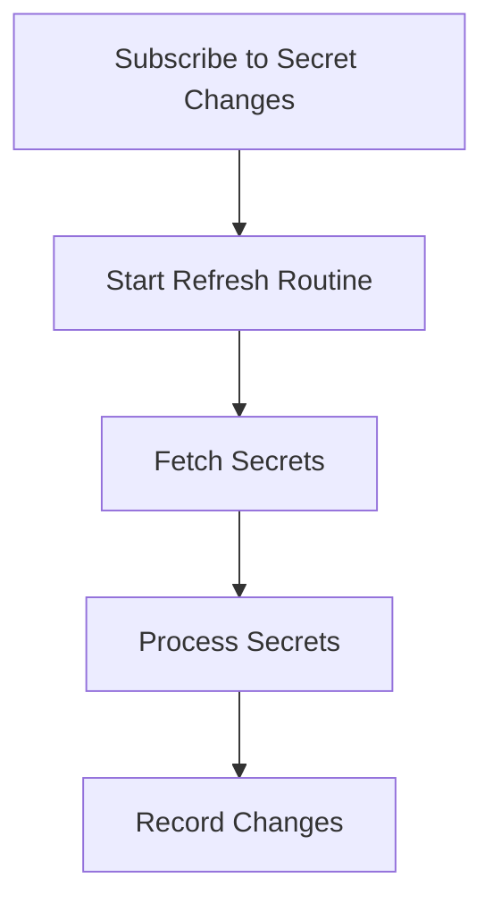

This document will cover the process of subscribing to secret changes, which includes:

1. Setting up the subscription
2. Periodically refreshing secrets
3. Handling and recording changes.

Technical document: <SwmLink doc-title="Subscribing to Secret Changes">[Subscribing to Secret Changes](/.swm/subscribing-to-secret-changes.5wb0fuif.sw.md)</SwmLink>

# [Setting up the subscription](https://app.swimm.io/repos/Z2l0aHViJTNBJTNBZGF0YWRvZy1hZ2VudCUzQSUzQVN3aW1tLURlbW8=/docs/5wb0fuif#subscribetochanges)

The process begins by subscribing to changes in secrets. This involves adding a callback function to a list that gets notified whenever secrets are resolved or refreshed. This ensures that any changes to the secrets are immediately recognized and handled. The subscription setup also initiates the refresh routine, which is responsible for periodically checking for updates to the secrets.

# [Periodically refreshing secrets](https://app.swimm.io/repos/Z2l0aHViJTNBJTNBZGF0YWRvZy1hZ2VudCUzQSUzQVN3aW1tLURlbW8=/docs/5wb0fuif#startrefreshroutine)

Once the subscription is set up, a refresh routine is started. This routine uses a timer to trigger the refresh process at regular intervals. The purpose of this routine is to ensure that the system always has the most up-to-date secret values. By periodically fetching the latest secrets, the system can maintain its security and functionality without manual intervention.

# [Fetching secrets](https://app.swimm.io/repos/Z2l0aHViJTNBJTNBZGF0YWRvZy1hZ2VudCUzQSUzQVN3aW1tLURlbW8=/docs/5wb0fuif#fetchsecret)

During the refresh process, the system fetches the latest secrets from the backend. This involves executing a command that retrieves the secret values. The fetched secrets are then processed to ensure they are in the correct format and ready for use. This step is crucial for maintaining the integrity and confidentiality of the secrets.

&nbsp;

*This is an auto-generated document by Swimm AI 🌊 and has not yet been verified by a human*

<SwmMeta version="3.0.0" repo-id="Z2l0aHViJTNBJTNBZGF0YWRvZy1hZ2VudCUzQSUzQVN3aW1tLURlbW8=" repo-name="datadog-agent">Powered by [Swimm](/)</SwmMeta>
