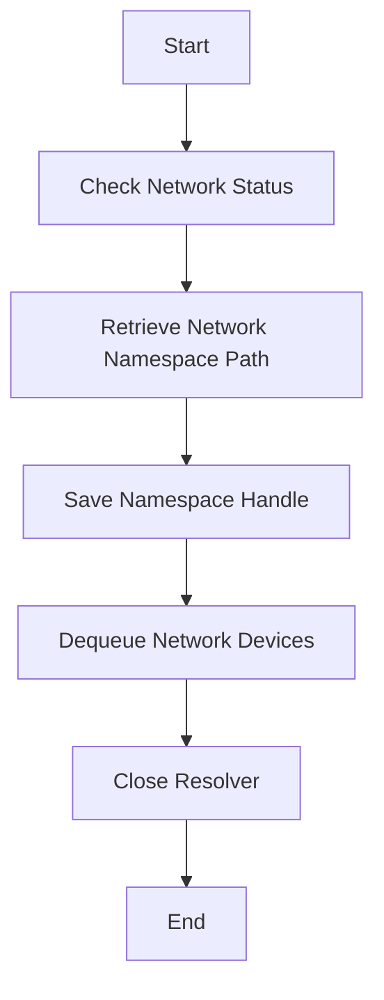

This document will cover the SyncCache Process Overview, which includes:

1. Checking network status
2. Retrieving network namespace paths
3. Saving namespace handles
4. Dequeuing network devices
5. Closing the resolver.

Technical document: <SwmLink doc-title="SyncCache Process Overview">[SyncCache Process Overview](/.swm/synccache-process-overview.n3lxzizn.sw.md)</SwmLink>

# [Checking Network Status](https://app.swimm.io/repos/Z2l0aHViJTNBJTNBZGF0YWRvZy1hZ2VudCUzQSUzQVN3aW1tLURlbW8=/docs/n3lxzizn#synccache)

The process begins by checking if the network is enabled. This is a crucial step because if the network is not enabled, the system will not proceed with retrieving or saving any network namespace information. This ensures that resources are not wasted on unnecessary operations.

# [Retrieving Network Namespace Path](https://app.swimm.io/repos/Z2l0aHViJTNBJTNBZGF0YWRvZy1hZ2VudCUzQSUzQVN3aW1tLURlbW8=/docs/n3lxzizn#synccache)

If the network is enabled, the system retrieves the network namespace path and ID for the given process. This involves accessing the process's network namespace information, which is essential for tracking and managing network namespaces effectively.

# [Saving Namespace Handle](https://app.swimm.io/repos/Z2l0aHViJTNBJTNBZGF0YWRvZy1hZ2VudCUzQSUzQVN3aW1tLURlbW8=/docs/n3lxzizn#savenetworknamespacehandle)

Once the network namespace path and ID are retrieved, the system saves this information by calling the SaveNetworkNamespaceHandle function. This function inserts the provided process network namespace into the list of tracked networks. This step is important for maintaining an up-to-date record of all active network namespaces.

# [Dequeuing Network Devices](https://app.swimm.io/repos/Z2l0aHViJTNBJTNBZGF0YWRvZy1hZ2VudCUzQSUzQVN3aW1tLURlbW8=/docs/n3lxzizn#dequeuenetworkdevices)

The system then processes the devices in the current network devices queue. This involves locking the network namespace, making a copy of the namespace handle, and iterating over the queued devices to set up new TC classifiers with the network namespace handle. Finally, it flushes the network devices queue to ensure that all devices are properly managed.

# [Closing the Resolver](https://app.swimm.io/repos/Z2l0aHViJTNBJTNBZGF0YWRvZy1hZ2VudCUzQSUzQVN3aW1tLURlbW8=/docs/n3lxzizn#close)

The final step in the SyncCache process is closing the resolver. This involves freeing all associated resources, purging the network namespaces, and manually flushing the namespaces to ensure that all resources are properly released. This step is crucial for maintaining system stability and preventing resource leaks.

&nbsp;

*This is an auto-generated document by Swimm AI 🌊 and has not yet been verified by a human*

<SwmMeta version="3.0.0" repo-id="Z2l0aHViJTNBJTNBZGF0YWRvZy1hZ2VudCUzQSUzQVN3aW1tLURlbW8=" repo-name="datadog-agent">Powered by [Swimm](/)</SwmMeta>
