In this document, we will explain the <SwmToken path="pkg/security/resolvers/netns/resolver.go" pos="366:2:2" line-data="// SyncCache snapshots /proc for the provided pid. This method returns true if it updated the namespace cache.">`SyncCache`</SwmToken> process. The process involves capturing the network namespace information for a given process ID and updating the namespace cache if necessary. This involves several steps, including checking network status, retrieving namespace paths, and saving namespace handles.

The flow starts by checking if the network is enabled. If it is, the system retrieves the network namespace path and ID for a given process. If successful, it saves this information and updates the namespace cache. This involves several functions that handle the insertion and management of network namespaces, ensuring that the system keeps track of all active network namespaces and their associated devices.

# Flow drill down

```mermaid
graph TD;
      subgraph pkgsecurityresolversnetnsresolvergo["pkg/security/resolvers/netns/resolver.go"]
5de83eec59b708eb962cb49b371a6a2ebf3251e4adfc781e4e3710e500f8bc5b(SyncCache):::mainFlowStyle --> 051ae88d9bdc477aeef9e04006658b254a5330357c2142c255ea1ac98968b553(SaveNetworkNamespaceHandle):::mainFlowStyle
end

subgraph pkgsecurityresolversnetnsresolvergo["pkg/security/resolvers/netns/resolver.go"]
051ae88d9bdc477aeef9e04006658b254a5330357c2142c255ea1ac98968b553(SaveNetworkNamespaceHandle):::mainFlowStyle --> fbf2749c07ea758c93244953c333e46b4cfeffcbcc3a8b3ba71f72a340947176(SaveNetworkNamespaceHandleLazy):::mainFlowStyle
end

subgraph pkgsecurityresolversnetnsresolvergo["pkg/security/resolvers/netns/resolver.go"]
fbf2749c07ea758c93244953c333e46b4cfeffcbcc3a8b3ba71f72a340947176(SaveNetworkNamespaceHandleLazy):::mainFlowStyle --> b98f127fd9788e7e191433691e3b02ca90b5682fb2e087f21d9712280011daa9(dequeueNetworkDevices):::mainFlowStyle
end

subgraph pkgsecurityresolversnetnsresolvergo["pkg/security/resolvers/netns/resolver.go"]
b98f127fd9788e7e191433691e3b02ca90b5682fb2e087f21d9712280011daa9(dequeueNetworkDevices):::mainFlowStyle --> a339ccc4a2f894412e303c1a6e20b1e0bc09464d6d975a17778ad990134dbac4(Close):::mainFlowStyle
end


      classDef mainFlowStyle color:#000000,fill:#7CB9F4
classDef rootsStyle color:#000000,fill:#00FFF4
classDef Style1 color:#000000,fill:#00FFAA
classDef Style2 color:#000000,fill:#FFFF00
classDef Style3 color:#000000,fill:#AA7CB9
```



<SwmSnippet path="/pkg/security/resolvers/netns/resolver.go" line="366">

---

## <SwmToken path="pkg/security/resolvers/netns/resolver.go" pos="366:2:2" line-data="// SyncCache snapshots /proc for the provided pid. This method returns true if it updated the namespace cache.">`SyncCache`</SwmToken>

The <SwmToken path="pkg/security/resolvers/netns/resolver.go" pos="366:2:2" line-data="// SyncCache snapshots /proc for the provided pid. This method returns true if it updated the namespace cache.">`SyncCache`</SwmToken> function snapshots the <SwmPath>[pkg/process/procutil/resources/test_procfs/proc/](pkg/process/procutil/resources/test_procfs/proc/)</SwmPath> directory for a given process ID (pid). It checks if the network is enabled and retrieves the network namespace path and ID for the process. If successful, it calls <SwmToken path="pkg/security/resolvers/netns/resolver.go" pos="378:10:10" line-data="	_, isNewEntry := nr.SaveNetworkNamespaceHandle(nsID, nsPath)">`SaveNetworkNamespaceHandle`</SwmToken> to save the namespace handle and returns whether a new entry was added.

```go
// SyncCache snapshots /proc for the provided pid. This method returns true if it updated the namespace cache.
func (nr *Resolver) SyncCache(pid uint32) bool {
	if !nr.config.NetworkEnabled {
		return false
	}

	nsPath := utils.NetNSPathFromPid(pid)
	nsID, err := nsPath.GetProcessNetworkNamespace()
	if err != nil {
		return false
	}

	_, isNewEntry := nr.SaveNetworkNamespaceHandle(nsID, nsPath)
	return isNewEntry
}
```

---

</SwmSnippet>

<SwmSnippet path="/pkg/security/resolvers/netns/resolver.go" line="235">

---

## <SwmToken path="pkg/security/resolvers/netns/resolver.go" pos="235:2:2" line-data="// SaveNetworkNamespaceHandle inserts the provided process network namespace in the list of tracked network. Returns">`SaveNetworkNamespaceHandle`</SwmToken>

The <SwmToken path="pkg/security/resolvers/netns/resolver.go" pos="235:2:2" line-data="// SaveNetworkNamespaceHandle inserts the provided process network namespace in the list of tracked network. Returns">`SaveNetworkNamespaceHandle`</SwmToken> function inserts the provided process network namespace into the list of tracked networks. It calls <SwmToken path="pkg/security/resolvers/netns/resolver.go" pos="238:5:5" line-data="	return nr.SaveNetworkNamespaceHandleLazy(nsID, func() *utils.NetNSPath {">`SaveNetworkNamespaceHandleLazy`</SwmToken> with the namespace ID and path, and returns the result.

```go
// SaveNetworkNamespaceHandle inserts the provided process network namespace in the list of tracked network. Returns
// true if a new entry was added.
func (nr *Resolver) SaveNetworkNamespaceHandle(nsID uint32, nsPath *utils.NetNSPath) (*NetworkNamespace, bool) {
	return nr.SaveNetworkNamespaceHandleLazy(nsID, func() *utils.NetNSPath {
		return nsPath
	})
}
```

---

</SwmSnippet>

<SwmSnippet path="/pkg/security/resolvers/netns/resolver.go" line="243">

---

## <SwmToken path="pkg/security/resolvers/netns/resolver.go" pos="243:2:2" line-data="// SaveNetworkNamespaceHandleLazy inserts the provided process network namespace in the list of tracked network. Returns">`SaveNetworkNamespaceHandleLazy`</SwmToken>

The <SwmToken path="pkg/security/resolvers/netns/resolver.go" pos="243:2:2" line-data="// SaveNetworkNamespaceHandleLazy inserts the provided process network namespace in the list of tracked network. Returns">`SaveNetworkNamespaceHandleLazy`</SwmToken> function performs the actual insertion of the network namespace into the list of tracked networks. It checks if the network is enabled and if the namespace ID and path function are valid. It then locks the resolver, checks if the namespace already exists, and either creates a new namespace or updates the existing one. It also dequeues network devices and snapshots the namespace if necessary.

```go
// SaveNetworkNamespaceHandleLazy inserts the provided process network namespace in the list of tracked network. Returns
// true if a new entry was added.
func (nr *Resolver) SaveNetworkNamespaceHandleLazy(nsID uint32, nsPathFunc func() *utils.NetNSPath) (*NetworkNamespace, bool) {
	if !nr.config.NetworkEnabled || nsID == 0 || nsPathFunc == nil {
		return nil, false
	}

	nsPath := nsPathFunc()
	if nsPath == nil {
		return nil, false
	}

	nr.Lock()
	defer nr.Unlock()

	netns, found := nr.networkNamespaces.Get(nsID)
	if !found {
		var err error
		netns, err = NewNetworkNamespaceWithPath(nsID, nsPath)
		if err != nil {
			// we'll get this namespace another time, ignore
```

---

</SwmSnippet>

<SwmSnippet path="/pkg/security/resolvers/netns/resolver.go" line="143">

---

## <SwmToken path="pkg/security/resolvers/netns/resolver.go" pos="143:2:2" line-data="// dequeueNetworkDevices dequeues the devices in the current network devices queue.">`dequeueNetworkDevices`</SwmToken>

The <SwmToken path="pkg/security/resolvers/netns/resolver.go" pos="143:2:2" line-data="// dequeueNetworkDevices dequeues the devices in the current network devices queue.">`dequeueNetworkDevices`</SwmToken> function processes the devices in the current network devices queue. It locks the network namespace, makes a copy of the namespace handle, and iterates over the queued devices to set up new TC classifiers with the network namespace handle. Finally, it flushes the network devices queue.

```go
// dequeueNetworkDevices dequeues the devices in the current network devices queue.
func (nn *NetworkNamespace) dequeueNetworkDevices(tcResolver *tc.Resolver, manager *manager.Manager) {
	nn.Lock()
	defer nn.Unlock()

	if len(nn.networkDevicesQueue) == 0 {
		return
	}

	// make a copy of the network namespace handle to make sure we don't poison our internal cache if the eBPF library
	// modifies the handle.
	handle, err := nn.getNamespaceHandleDup()
	if err != nil {
		return
	}

	defer func() {
		if cerr := handle.Close(); cerr != nil {
			seclog.Warnf("could not close file [%s]: %s", handle.Name(), cerr)
		}
	}()
```

---

</SwmSnippet>

<SwmSnippet path="/pkg/security/resolvers/netns/resolver.go" line="554">

---

## Close

The <SwmToken path="pkg/security/resolvers/netns/resolver.go" pos="554:2:2" line-data="// Close closes this resolver and frees all the resources">`Close`</SwmToken> function closes the resolver and frees all associated resources. It purges the network namespaces and manually flushes the namespaces to ensure all resources are properly released.

```go
// Close closes this resolver and frees all the resources
func (nr *Resolver) Close() {
	if nr.networkNamespaces != nil {
		nr.Lock()
		nr.networkNamespaces.Purge()
		nr.Unlock()
	}
	nr.manualFlushNamespaces()
}
```

---

</SwmSnippet>

&nbsp;

*This is an auto-generated document by Swimm AI 🌊 and has not yet been verified by a human*

<SwmMeta version="3.0.0" repo-id="Z2l0aHViJTNBJTNBZGF0YWRvZy1hZ2VudCUzQSUzQVN3aW1tLURlbW8=" repo-name="datadog-agent"><sup>Powered by [Swimm](/)</sup></SwmMeta>
