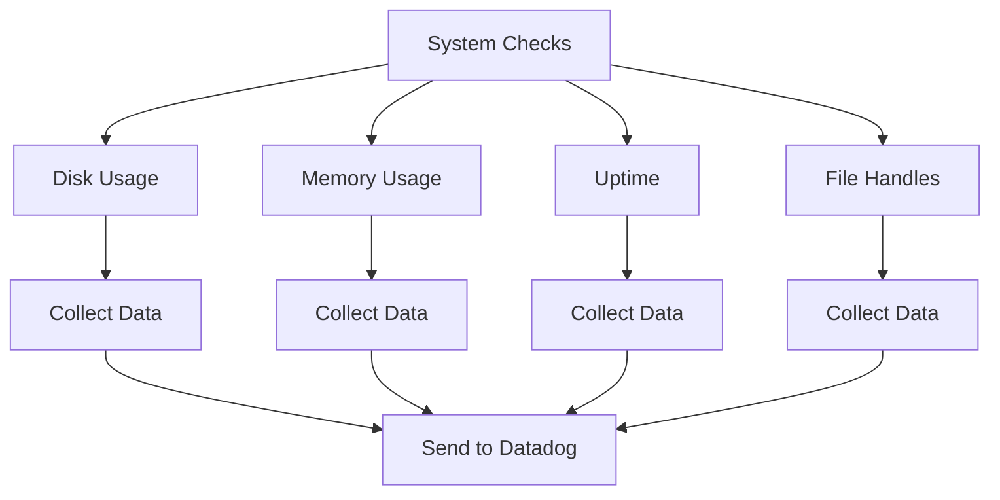

# Overview

System checks are core checks for <SwmToken path="pkg/collector/corechecks/system/doc.go" pos="7:12:14" line-data="Package system provides core checks for OS-level system metrics">`OS-level`</SwmToken> system metrics. They are used to collect and monitor various system metrics such as disk usage, memory usage, uptime, and file handles. The collected data is then sent to the Datadog platform for further analysis and monitoring.

<SwmSnippet path="/pkg/collector/corechecks/system/doc.go" line="7">

---

The <SwmToken path="pkg/collector/corechecks/system/doc.go" pos="7:2:2" line-data="Package system provides core checks for OS-level system metrics">`system`</SwmToken> package is defined in the <SwmPath>[pkg/collector/corechecks/system/doc.go](pkg/collector/corechecks/system/doc.go)</SwmPath> file. It provides core checks for <SwmToken path="pkg/collector/corechecks/system/doc.go" pos="7:12:14" line-data="Package system provides core checks for OS-level system metrics">`OS-level`</SwmToken> system metrics.

```go
Package system provides core checks for OS-level system metrics
*/
package system
```

---

</SwmSnippet>

# Sub-Packages

The system checks are implemented in various sub-packages like <SwmToken path="tasks/kernel_matrix_testing/types.py" pos="40:2:2" line-data="class Disk(TypedDict):">`Disk`</SwmToken>, <SwmToken path="tasks/kernel_matrix_testing/types.py" pos="71:1:1" line-data="    memory: list[int]">`memory`</SwmToken>, `uptime`, and `filehandles`. Each sub-package is responsible for collecting specific metrics.

# Data Flow

The collected data from these system checks is sent to the Datadog platform for further analysis and monitoring. This allows for comprehensive monitoring and analysis of system performance.

&nbsp;

*This is an auto-generated document by Swimm AI 🌊 and has not yet been verified by a human*

<SwmMeta version="3.0.0" repo-id="Z2l0aHViJTNBJTNBZGF0YWRvZy1hZ2VudCUzQSUzQVN3aW1tLURlbW8=" repo-name="datadog-agent"><sup>Powered by [Swimm](/)</sup></SwmMeta>
