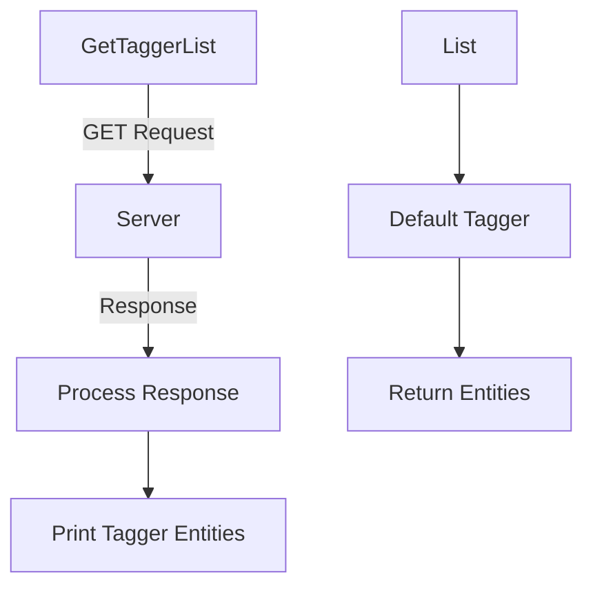

# Tagger Overview

Tagger is a module that provides tagging functionalities to Python integrations. It is intended for internal use and should not be imported directly. Checks should use the methods exposed by the <SwmToken path="rtloader/test/python/datadog_checks/base/checks/__init__.py" pos="2:2:2" line-data="class AgentCheck(object):  # noqa: UP004">`AgentCheck`</SwmToken> class instead. The module exposes functionalities that allow querying and managing the storage of entities. It includes various implementations such as remote, replay, and local taggers, each handling different aspects of entity tagging.

<SwmSnippet path="/comp/core/tagger/taggerimpl/local/tagger.go" line="24">

---

The <SwmToken path="comp/core/tagger/taggerimpl/local/tagger.go" pos="24:2:2" line-data="// Tagger is the entry class for entity tagging. It hold the tagger collector,">`Tagger`</SwmToken> struct is the main entry point for entity tagging. It includes the tagger collector, memory store, and handles the query logic. Use the package methods in <SwmPath>[comp/core/tagger/](comp/core/tagger/)</SwmPath> to utilize the default Tagger instead of instantiating it directly.

```go
// Tagger is the entry class for entity tagging. It hold the tagger collector,
// memory store, and handles the query logic. One should use the package
// methods in comp/core/tagger to use the default Tagger instead of instantiating it
// directly.
type Tagger struct {
	sync.RWMutex

	tagStore      *tagstore.TagStore
	workloadStore workloadmeta.Component
	collector     *collectors.WorkloadMetaCollector

	ctx            context.Context
	cancel         context.CancelFunc
	telemetryStore *telemetry.Store
	empty.Tagger
}
```

---

</SwmSnippet>

# Main Functions

The Tagger module includes several main functions that provide different functionalities for entity tagging.

## <SwmToken path="comp/core/tagger/taggerimpl/tagger.go" pos="233:2:2" line-data="// ReplayTagger returns the replay tagger instance">`ReplayTagger`</SwmToken>

The <SwmToken path="comp/core/tagger/taggerimpl/tagger.go" pos="233:2:2" line-data="// ReplayTagger returns the replay tagger instance">`ReplayTagger`</SwmToken> function returns the replay tagger instance. This is useful for scenarios where you need to replay a capture scenario.

<SwmSnippet path="/comp/core/tagger/taggerimpl/tagger.go" line="233">

---

The <SwmToken path="comp/core/tagger/taggerimpl/tagger.go" pos="233:2:2" line-data="// ReplayTagger returns the replay tagger instance">`ReplayTagger`</SwmToken> function returns the replay tagger instance, which is useful for replaying capture scenarios.

```go
// ReplayTagger returns the replay tagger instance
func (t *TaggerClient) ReplayTagger() taggerComp.ReplayTagger {
	return replay.NewTagger(t.telemetryStore)
}
```

---

</SwmSnippet>

## Standard

The <SwmToken path="comp/core/tagger/taggerimpl/tagger.go" pos="308:2:2" line-data="// Standard queries the defaultTagger to get entity">`Standard`</SwmToken> function queries the <SwmToken path="comp/core/tagger/taggerimpl/tagger.go" pos="308:8:8" line-data="// Standard queries the defaultTagger to get entity">`defaultTagger`</SwmToken> to get entity standard tags (env, version, service) from cache or sources. It first checks the <SwmToken path="comp/core/tagger/taggerimpl/tagger.go" pos="312:13:13" line-data="	// TODO(components) (tagger): captureTagger is a legacy global variable to be eliminated">`captureTagger`</SwmToken> and then falls back to the <SwmToken path="comp/core/tagger/taggerimpl/tagger.go" pos="308:8:8" line-data="// Standard queries the defaultTagger to get entity">`defaultTagger`</SwmToken> if necessary.

<SwmSnippet path="/comp/core/tagger/taggerimpl/tagger.go" line="308">

---

The <SwmToken path="comp/core/tagger/taggerimpl/tagger.go" pos="308:2:2" line-data="// Standard queries the defaultTagger to get entity">`Standard`</SwmToken> function queries the <SwmToken path="comp/core/tagger/taggerimpl/tagger.go" pos="308:8:8" line-data="// Standard queries the defaultTagger to get entity">`defaultTagger`</SwmToken> to get entity standard tags (env, version, service) from cache or sources. It first checks the <SwmToken path="comp/core/tagger/taggerimpl/tagger.go" pos="312:13:13" line-data="	// TODO(components) (tagger): captureTagger is a legacy global variable to be eliminated">`captureTagger`</SwmToken> and then falls back to the <SwmToken path="comp/core/tagger/taggerimpl/tagger.go" pos="308:8:8" line-data="// Standard queries the defaultTagger to get entity">`defaultTagger`</SwmToken> if necessary.

```go
// Standard queries the defaultTagger to get entity
// standard tags (env, version, service) from cache or sources.
func (t *TaggerClient) Standard(entity string) ([]string, error) {
	t.mux.RLock()
	// TODO(components) (tagger): captureTagger is a legacy global variable to be eliminated
	if t.captureTagger != nil {
		tags, err := t.captureTagger.Standard(entity)
		if err == nil && len(tags) > 0 {
			t.mux.RUnlock()
			return tags, nil
		}
	}
	t.mux.RUnlock()
	return t.defaultTagger.Standard(entity)
}
```

---

</SwmSnippet>

# Tagger APIs

The Tagger module provides several APIs to interact with the tagger entities.

## <SwmToken path="comp/core/tagger/taggerimpl/api/getlist.go" pos="22:2:2" line-data="// GetTaggerList display in a human readable format the Tagger entities into the io.Write w.">`GetTaggerList`</SwmToken>

The <SwmToken path="comp/core/tagger/taggerimpl/api/getlist.go" pos="22:2:2" line-data="// GetTaggerList display in a human readable format the Tagger entities into the io.Write w.">`GetTaggerList`</SwmToken> function retrieves the list of tagger entities from the server and displays them in a human-readable format. It sends a GET request to the specified URL and processes the response to extract and print the tagger entities.

<SwmSnippet path="/comp/core/tagger/taggerimpl/api/getlist.go" line="22">

---

The <SwmToken path="comp/core/tagger/taggerimpl/api/getlist.go" pos="22:2:2" line-data="// GetTaggerList display in a human readable format the Tagger entities into the io.Write w.">`GetTaggerList`</SwmToken> function retrieves the list of tagger entities from the server and displays them in a human-readable format.

```go
// GetTaggerList display in a human readable format the Tagger entities into the io.Write w.
func GetTaggerList(w io.Writer, url string) error {
	c := util.GetClient(false) // FIX: get certificates right then make this true

	// get the tagger-list from server
	r, err := util.DoGet(c, url, util.LeaveConnectionOpen)
	if err != nil {
		if r != nil && string(r) != "" {
			fmt.Fprintf(w, "The agent ran into an error while getting tags list: %s\n", string(r))
		} else {
			fmt.Fprintf(w, "Failed to query the agent (running?): %s\n", err)
		}
	}

	tr := types.TaggerListResponse{}
	err = json.Unmarshal(r, &tr)
	if err != nil {
		return err
	}

	printTaggerEntities(color.Output, &tr)
```

---

</SwmSnippet>

## List

The `List` function in the <SwmToken path="comp/core/tagger/taggerimpl/tagger.go" pos="234:6:6" line-data="func (t *TaggerClient) ReplayTagger() taggerComp.ReplayTagger {">`TaggerClient`</SwmToken> struct returns all the entities currently stored by the default tagger. This function is used to retrieve a comprehensive list of entities managed by the tagger.

<SwmSnippet path="/comp/core/tagger/taggerimpl/tagger.go" line="371">

---

The `List` function in the <SwmToken path="comp/core/tagger/taggerimpl/tagger.go" pos="372:6:6" line-data="func (t *TaggerClient) List() types.TaggerListResponse {">`TaggerClient`</SwmToken> struct returns all the entities currently stored by the default tagger.

```go
// List the content of the defaulTagger
func (t *TaggerClient) List() types.TaggerListResponse {
	return t.defaultTagger.List()
}
```

---

</SwmSnippet>

&nbsp;

*This is an auto-generated document by Swimm AI 🌊 and has not yet been verified by a human*

<SwmMeta version="3.0.0" repo-id="Z2l0aHViJTNBJTNBZGF0YWRvZy1hZ2VudCUzQSUzQVN3aW1tLURlbW8=" repo-name="datadog-agent"><sup>Powered by [Swimm](/)</sup></SwmMeta>
