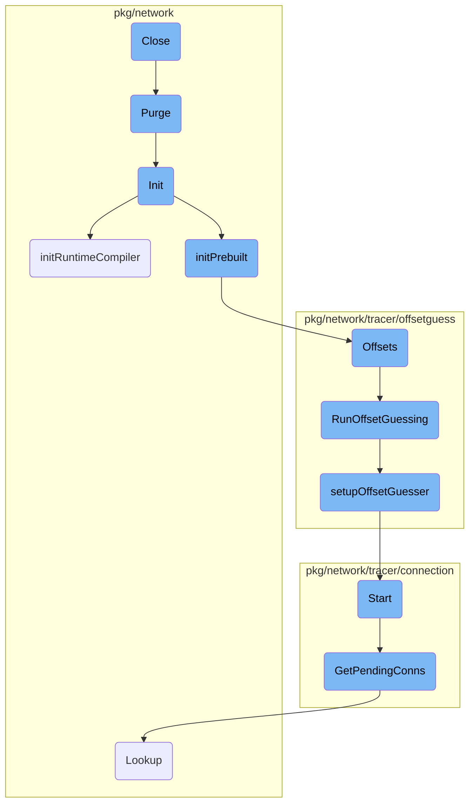
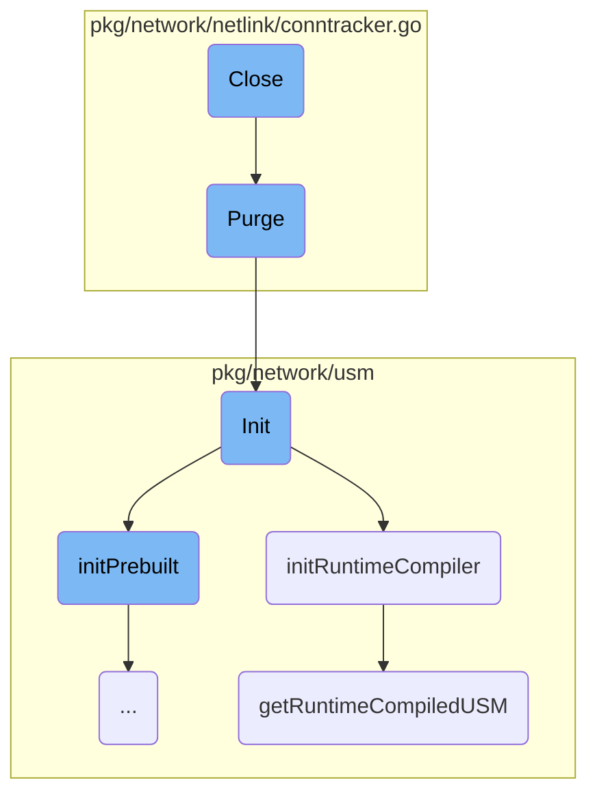
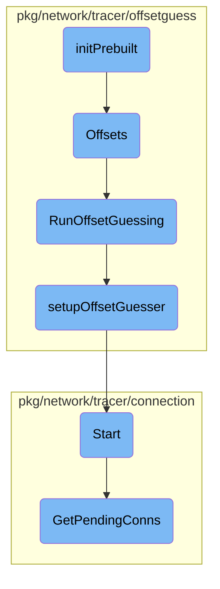

In this document, we will explain the <SwmToken path="pkg/network/netlink/conntracker.go" pos="223:9:9" line-data="func (ctr *realConntracker) Close() {">`Close`</SwmToken> function. The <SwmToken path="pkg/network/netlink/conntracker.go" pos="223:9:9" line-data="func (ctr *realConntracker) Close() {">`Close`</SwmToken> function is responsible for stopping various components, purging the cache, and closing the exit channel to ensure that all resources are properly released and no background processes are left running.

The <SwmToken path="pkg/network/netlink/conntracker.go" pos="223:9:9" line-data="func (ctr *realConntracker) Close() {">`Close`</SwmToken> function is like turning off a machine properly. First, it stops the consumer and the compact ticker, which are like the moving parts of the machine. Then, it clears out the cache, which is like emptying the machine's storage. Finally, it closes the exit channel, ensuring that everything is shut down cleanly and nothing is left running in the background.

Here is a high level diagram of the flow, showing only the most important functions:



# Flow drill down

First, we'll zoom into this section of the flow:



<SwmSnippet path="/pkg/network/netlink/conntracker.go" line="223">

---

## Close

The <SwmToken path="pkg/network/netlink/conntracker.go" pos="223:9:9" line-data="func (ctr *realConntracker) Close() {">`Close`</SwmToken> function is responsible for stopping the consumer and compact ticker, purging the cache, and closing the exit channel. This ensures that all resources are properly released and no background processes are left running.

```go
func (ctr *realConntracker) Close() {
	ctr.consumer.Stop()
	ctr.compactTicker.Stop()
	ctr.cache.Purge()
	close(ctr.exit)
}
```

---

</SwmSnippet>

<SwmSnippet path="/pkg/network/netlink/conntracker.go" line="352">

---

## Purge

The <SwmToken path="pkg/network/netlink/conntracker.go" pos="352:9:9" line-data="func (cc *conntrackCache) Purge() {">`Purge`</SwmToken> function clears the cache and reinitializes the orphans. This is crucial for maintaining the integrity of the connection tracking data by removing stale or outdated entries.

```go
func (cc *conntrackCache) Purge() {
	cc.cache.Purge()
	cc.orphans.Init()
}
```

---

</SwmSnippet>

<SwmSnippet path="/pkg/network/usm/ebpf_main.go" line="174">

---

## Init

The <SwmToken path="pkg/network/usm/ebpf_main.go" pos="174:2:2" line-data="// Init initializes the ebpf program.">`Init`</SwmToken> function initializes the <SwmToken path="pkg/network/usm/ebpf_main.go" pos="174:8:8" line-data="// Init initializes the ebpf program.">`ebpf`</SwmToken> program. It sets up the dump handler and attempts to initialize the program using different build modes: CORE, <SwmToken path="pkg/network/usm/ebpf_main.go" pos="199:9:9" line-data="		e.buildMode = buildmode.RuntimeCompiled">`RuntimeCompiled`</SwmToken>, and Prebuilt. This function ensures that the <SwmToken path="pkg/network/usm/ebpf_main.go" pos="174:8:8" line-data="// Init initializes the ebpf program.">`ebpf`</SwmToken> program is correctly set up based on the configuration.

```go
// Init initializes the ebpf program.
func (e *ebpfProgram) Init() error {
	var err error
	defer func() {
		if err != nil {
			e.buildMode = ""
		}
	}()

	e.DumpHandler = e.dumpMapsHandler

	if e.cfg.EnableCORE {
		e.buildMode = buildmode.CORE
		err = e.initCORE()
		if err == nil {
			return nil
		}

		if !e.cfg.AllowRuntimeCompiledFallback && !e.cfg.AllowPrecompiledFallback {
			return fmt.Errorf("co-re load failed: %w", err)
		}
```

---

</SwmSnippet>

<SwmSnippet path="/pkg/network/usm/ebpf_main.go" line="290">

---

### <SwmToken path="pkg/network/usm/ebpf_main.go" pos="290:9:9" line-data="func (e *ebpfProgram) initRuntimeCompiler() error {">`initRuntimeCompiler`</SwmToken>

The <SwmToken path="pkg/network/usm/ebpf_main.go" pos="290:9:9" line-data="func (e *ebpfProgram) initRuntimeCompiler() error {">`initRuntimeCompiler`</SwmToken> function attempts to initialize the <SwmToken path="pkg/network/usm/ebpf_main.go" pos="174:8:8" line-data="// Init initializes the ebpf program.">`ebpf`</SwmToken> program using runtime compilation. It calls <SwmToken path="pkg/network/usm/ebpf_main.go" pos="291:8:8" line-data="	bc, err := getRuntimeCompiledUSM(e.cfg)">`getRuntimeCompiledUSM`</SwmToken> to get the compiled output and then initializes the program with it.

```go
func (e *ebpfProgram) initRuntimeCompiler() error {
	bc, err := getRuntimeCompiledUSM(e.cfg)
	if err != nil {
		return err
	}
	defer bc.Close()
	return e.init(bc, manager.Options{})
}
```

---

</SwmSnippet>

<SwmSnippet path="/pkg/network/usm/compile.go" line="20">

---

### <SwmToken path="pkg/network/usm/compile.go" pos="20:2:2" line-data="func getRuntimeCompiledUSM(config *config.Config) (runtime.CompiledOutput, error) {">`getRuntimeCompiledUSM`</SwmToken>

The <SwmToken path="pkg/network/usm/compile.go" pos="20:2:2" line-data="func getRuntimeCompiledUSM(config *config.Config) (runtime.CompiledOutput, error) {">`getRuntimeCompiledUSM`</SwmToken> function compiles the <SwmToken path="pkg/network/usm/ebpf_main.go" pos="174:8:8" line-data="// Init initializes the ebpf program.">`ebpf`</SwmToken> program using the provided configuration. It returns the compiled output, which is then used to initialize the <SwmToken path="pkg/network/usm/ebpf_main.go" pos="174:8:8" line-data="// Init initializes the ebpf program.">`ebpf`</SwmToken> program.

```go
func getRuntimeCompiledUSM(config *config.Config) (runtime.CompiledOutput, error) {
	return runtime.Usm.Compile(&config.Config, getCFlags(config), statsd.Client)
}
```

---

</SwmSnippet>

Now, lets zoom into this section of the flow:



<SwmSnippet path="/pkg/network/usm/ebpf_main.go" line="300">

---

## <SwmToken path="pkg/network/usm/ebpf_main.go" pos="212:7:7" line-data="	err = e.initPrebuilt()">`initPrebuilt`</SwmToken>

The function <SwmToken path="pkg/network/usm/ebpf_main.go" pos="212:7:7" line-data="	err = e.initPrebuilt()">`initPrebuilt`</SwmToken> initializes the prebuilt <SwmToken path="pkg/network/usm/ebpf_main.go" pos="174:8:8" line-data="// Init initializes the ebpf program.">`ebpf`</SwmToken> program by reading the HTTP module and retrieving the necessary offsets. It then calls the <SwmToken path="pkg/network/usm/ebpf_main.go" pos="311:5:5" line-data="	return e.init(bc, manager.Options{ConstantEditors: offsets})">`init`</SwmToken> function with the retrieved offsets to complete the initialization.

```go
	bc, err := netebpf.ReadHTTPModule(e.cfg.BPFDir, e.cfg.BPFDebug)
	if err != nil {
		return err
	}
	defer bc.Close()

	var offsets []manager.ConstantEditor
	if offsets, err = offsetguess.TracerOffsets.Offsets(e.cfg); err != nil {
		return err
	}

	return e.init(bc, manager.Options{ConstantEditors: offsets})
```

---

</SwmSnippet>

<SwmSnippet path="/pkg/network/tracer/offsetguess/tracer.go" line="1166">

---

## Offsets

The function <SwmToken path="pkg/network/tracer/offsetguess/tracer.go" pos="1166:9:9" line-data="func (o *tracerOffsets) Offsets(cfg *config.Config) ([]manager.ConstantEditor, error) {">`Offsets`</SwmToken> retrieves the necessary offsets for the tracer. It reads the offset BPF module and calls <SwmToken path="pkg/network/tracer/offsetguess/tracer.go" pos="1186:12:12" line-data="	o.offsets, o.err = RunOffsetGuessing(cfg, offsetBuf, NewTracerOffsetGuesser)">`RunOffsetGuessing`</SwmToken> to perform the offset guessing, returning the offsets.

```go
func (o *tracerOffsets) Offsets(cfg *config.Config) ([]manager.ConstantEditor, error) {
	if o.err != nil {
		return nil, o.err
	}

	_, udpv6Enabled := getIpv6Configuration(cfg)
	_cfg := *cfg
	_cfg.CollectUDPv6Conns = udpv6Enabled
	cfg = &_cfg

	if len(o.offsets) > 0 {
		return o.offsets, o.err
	}

	offsetBuf, err := netebpf.ReadOffsetBPFModule(cfg.BPFDir, cfg.BPFDebug)
	if err != nil {
		o.err = fmt.Errorf("could not read offset bpf module: %s", err)
		return nil, o.err
	}
	defer offsetBuf.Close()
	o.offsets, o.err = RunOffsetGuessing(cfg, offsetBuf, NewTracerOffsetGuesser)
```

---

</SwmSnippet>

<SwmSnippet path="/pkg/network/tracer/offsetguess/offsetguess.go" line="197">

---

## <SwmToken path="pkg/network/tracer/offsetguess/offsetguess.go" pos="197:2:2" line-data="func RunOffsetGuessing(cfg *config.Config, buf bytecode.AssetReader, newGuesser func() (OffsetGuesser, error)) (editors []manager.ConstantEditor, err error) {">`RunOffsetGuessing`</SwmToken>

The function <SwmToken path="pkg/network/tracer/offsetguess/offsetguess.go" pos="197:2:2" line-data="func RunOffsetGuessing(cfg *config.Config, buf bytecode.AssetReader, newGuesser func() (OffsetGuesser, error)) (editors []manager.ConstantEditor, err error) {">`RunOffsetGuessing`</SwmToken> performs the offset guessing by initializing the offset guesser and calling <SwmToken path="pkg/network/tracer/offsetguess/offsetguess.go" pos="207:7:7" line-data="			if err = setupOffsetGuesser(guesser, cfg, buf); err != nil {">`setupOffsetGuesser`</SwmToken>. It retries up to five times if the guessing fails, ensuring robustness.

```go
func RunOffsetGuessing(cfg *config.Config, buf bytecode.AssetReader, newGuesser func() (OffsetGuesser, error)) (editors []manager.ConstantEditor, err error) {
	// Offset guessing has been flaky for some customers, so if it fails we'll retry it up to 5 times
	start := time.Now()
	for i := 0; i < 5; i++ {
		err = func() error {
			guesser, err := newGuesser()
			if err != nil {
				return err
			}

			if err = setupOffsetGuesser(guesser, cfg, buf); err != nil {
				return err
			}

			editors, err = guesser.Guess(cfg)
			guesser.Close()
			return err
		}()

		if err == nil {
			log.Infof("offset guessing complete (took %v)", time.Since(start))
```

---

</SwmSnippet>

<SwmSnippet path="/pkg/network/tracer/offsetguess/offsetguess.go" line="156">

---

### <SwmToken path="pkg/network/tracer/offsetguess/offsetguess.go" pos="156:2:2" line-data="func setupOffsetGuesser(guesser OffsetGuesser, config *config.Config, buf bytecode.AssetReader) error {">`setupOffsetGuesser`</SwmToken>

The function <SwmToken path="pkg/network/tracer/offsetguess/offsetguess.go" pos="156:2:2" line-data="func setupOffsetGuesser(guesser OffsetGuesser, config *config.Config, buf bytecode.AssetReader) error {">`setupOffsetGuesser`</SwmToken> configures the offset guesser by enabling the necessary kernel probes and initializing the <SwmToken path="pkg/network/usm/ebpf_main.go" pos="174:8:8" line-data="// Init initializes the ebpf program.">`ebpf`</SwmToken> manager with the provided options. It starts the manager to begin the offset guessing process.

```go
func setupOffsetGuesser(guesser OffsetGuesser, config *config.Config, buf bytecode.AssetReader) error {
	// Enable kernel probes used for offset guessing.
	offsetMgr := guesser.Manager()
	offsetOptions := manager.Options{
		RLimit: &unix.Rlimit{
			Cur: math.MaxUint64,
			Max: math.MaxUint64,
		},
	}
	enabledProbes, err := guesser.Probes(config)
	if err != nil {
		return fmt.Errorf("unable to configure offset guessing probes: %w", err)
	}

	for _, p := range offsetMgr.Probes {
		if _, enabled := enabledProbes[p.EBPFFuncName]; !enabled {
			offsetOptions.ExcludedFunctions = append(offsetOptions.ExcludedFunctions, p.EBPFFuncName)
		}
	}
	for funcName := range enabledProbes {
		offsetOptions.ActivatedProbes = append(
```

---

</SwmSnippet>

<SwmSnippet path="/pkg/network/tracer/connection/tcp_close_consumer.go" line="91">

---

## Start

The function <SwmToken path="pkg/network/tracer/connection/tcp_close_consumer.go" pos="91:9:9" line-data="func (c *tcpCloseConsumer) Start(callback func([]network.ConnectionStats)) {">`Start`</SwmToken> begins the TCP close consumer by registering a health check and starting a goroutine to handle incoming data and lost events. It processes the data and invokes the callback with the extracted connections.

```go
func (c *tcpCloseConsumer) Start(callback func([]network.ConnectionStats)) {
	if c == nil {
		return
	}
	health := health.RegisterLiveness("network-tracer")

	var (
		then             = time.Now()
		closedCount      uint64
		lostSamplesCount uint64
	)

	go func() {
		defer func() {
			err := health.Deregister()
			if err != nil {
				log.Warnf("error de-registering health check: %s", err)
			}
		}()

		dataChannel := c.eventHandler.DataChannel()
```

---

</SwmSnippet>

<SwmSnippet path="/pkg/network/tracer/connection/perf_batching.go" line="93">

---

## <SwmToken path="pkg/network/tracer/connection/perf_batching.go" pos="93:2:2" line-data="// GetPendingConns return all connections that are in batches that are not yet full.">`GetPendingConns`</SwmToken>

The function <SwmToken path="pkg/network/tracer/connection/perf_batching.go" pos="93:2:2" line-data="// GetPendingConns return all connections that are in batches that are not yet full.">`GetPendingConns`</SwmToken> retrieves all connections that are in batches that are not yet full. It tracks which connections have been processed to prevent <SwmToken path="pkg/network/tracer/connection/perf_batching.go" pos="95:6:8" line-data="// This prevents double-processing of connections between GetPendingConns and Extract.">`double-processing`</SwmToken> and updates the state accordingly.

```go
// GetPendingConns return all connections that are in batches that are not yet full.
// It tracks which connections have been processed by this call, by batch id.
// This prevents double-processing of connections between GetPendingConns and Extract.
func (p *perfBatchManager) GetPendingConns(buffer *network.ConnectionBuffer) {
	b := new(netebpf.Batch)
	for cpu := uint32(0); cpu < uint32(len(p.stateByCPU)); cpu++ {
		cpuState := &p.stateByCPU[cpu]

		err := p.batchMap.Lookup(&cpu, b)
		if err != nil {
			continue
		}

		batchLen := b.Len
		if batchLen == 0 {
			continue
		}

		// have we already processed these messages?
		start := uint16(0)
		batchID := b.Id
```

---

</SwmSnippet>

&nbsp;

*This is an auto-generated document by Swimm AI 🌊 and has not yet been verified by a human*

<SwmMeta version="3.0.0" repo-id="Z2l0aHViJTNBJTNBZGF0YWRvZy1hZ2VudCUzQSUzQVN3aW1tLURlbW8=" repo-name="datadog-agent"><sup>Powered by [Swimm](/)</sup></SwmMeta>
