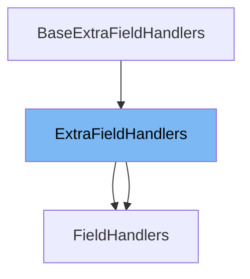

This document will cover the class <SwmToken path="pkg/security/secl/model/model_windows.go" pos="116:2:2" line-data="// ExtraFieldHandlers handlers not hold by any field">`ExtraFieldHandlers`</SwmToken> in the file <SwmPath>[pkg/security/secl/model/model_windows.go](pkg/security/secl/model/model_windows.go)</SwmPath>. We will discuss:

1. What <SwmToken path="pkg/security/secl/model/model_windows.go" pos="116:2:2" line-data="// ExtraFieldHandlers handlers not hold by any field">`ExtraFieldHandlers`</SwmToken> is.
2. The variables and functions defined in <SwmToken path="pkg/security/secl/model/model_windows.go" pos="116:2:2" line-data="// ExtraFieldHandlers handlers not hold by any field">`ExtraFieldHandlers`</SwmToken>.
3. An example of how to use <SwmToken path="pkg/security/secl/model/model_windows.go" pos="116:2:2" line-data="// ExtraFieldHandlers handlers not hold by any field">`ExtraFieldHandlers`</SwmToken> in <SwmToken path="pkg/security/secl/model/field_handlers_windows.go" pos="26:7:7" line-data="	_ = ev.FieldHandlers.ResolveContainerCreatedAt(ev, ev.BaseEvent.ContainerContext)">`FieldHandlers`</SwmToken>.



# What is <SwmToken path="pkg/security/secl/model/model_windows.go" pos="116:2:2" line-data="// ExtraFieldHandlers handlers not hold by any field">`ExtraFieldHandlers`</SwmToken>

<SwmToken path="pkg/security/secl/model/model_windows.go" pos="116:2:2" line-data="// ExtraFieldHandlers handlers not hold by any field">`ExtraFieldHandlers`</SwmToken> is an interface defined in the file <SwmPath>[pkg/security/secl/model/model_windows.go](pkg/security/secl/model/model_windows.go)</SwmPath>. It is used to handle fields that are not managed by any specific field handler. This interface extends the <SwmToken path="pkg/security/secl/model/model_windows.go" pos="118:1:1" line-data="	BaseExtraFieldHandlers">`BaseExtraFieldHandlers`</SwmToken> interface, allowing for additional field handling capabilities.

<SwmSnippet path="/pkg/security/secl/model/model_windows.go" line="116">

---

# Variables and functions

The <SwmToken path="pkg/security/secl/model/model_windows.go" pos="116:2:2" line-data="// ExtraFieldHandlers handlers not hold by any field">`ExtraFieldHandlers`</SwmToken> interface is defined here. It extends the <SwmToken path="pkg/security/secl/model/model_windows.go" pos="118:1:1" line-data="	BaseExtraFieldHandlers">`BaseExtraFieldHandlers`</SwmToken> interface, which means it inherits all the methods from <SwmToken path="pkg/security/secl/model/model_windows.go" pos="118:1:1" line-data="	BaseExtraFieldHandlers">`BaseExtraFieldHandlers`</SwmToken>.

```go
// ExtraFieldHandlers handlers not hold by any field
type ExtraFieldHandlers interface {
	BaseExtraFieldHandlers
}
```

---

</SwmSnippet>

# Usage example

To use <SwmToken path="pkg/security/secl/model/model_windows.go" pos="116:2:2" line-data="// ExtraFieldHandlers handlers not hold by any field">`ExtraFieldHandlers`</SwmToken> in <SwmToken path="pkg/security/secl/model/field_handlers_windows.go" pos="26:7:7" line-data="	_ = ev.FieldHandlers.ResolveContainerCreatedAt(ev, ev.BaseEvent.ContainerContext)">`FieldHandlers`</SwmToken>, you would typically implement the <SwmToken path="pkg/security/secl/model/model_windows.go" pos="116:2:2" line-data="// ExtraFieldHandlers handlers not hold by any field">`ExtraFieldHandlers`</SwmToken> interface in your <SwmToken path="pkg/security/secl/model/field_handlers_windows.go" pos="26:7:7" line-data="	_ = ev.FieldHandlers.ResolveContainerCreatedAt(ev, ev.BaseEvent.ContainerContext)">`FieldHandlers`</SwmToken> struct. Here is an example of how this can be done:

<SwmSnippet path="/pkg/security/secl/model/field_handlers_windows.go" line="1">

---

This file contains the implementation of <SwmToken path="pkg/security/secl/model/field_handlers_windows.go" pos="26:7:7" line-data="	_ = ev.FieldHandlers.ResolveContainerCreatedAt(ev, ev.BaseEvent.ContainerContext)">`FieldHandlers`</SwmToken>, which is an example of <SwmToken path="pkg/security/secl/model/model_windows.go" pos="116:2:2" line-data="// ExtraFieldHandlers handlers not hold by any field">`ExtraFieldHandlers`</SwmToken>. By implementing the <SwmToken path="pkg/security/secl/model/model_windows.go" pos="116:2:2" line-data="// ExtraFieldHandlers handlers not hold by any field">`ExtraFieldHandlers`</SwmToken> interface, <SwmToken path="pkg/security/secl/model/field_handlers_windows.go" pos="26:7:7" line-data="	_ = ev.FieldHandlers.ResolveContainerCreatedAt(ev, ev.BaseEvent.ContainerContext)">`FieldHandlers`</SwmToken> can handle additional fields that are not managed by any specific field handler.

```go
// Unless explicitly stated otherwise all files in this repository are licensed
// under the Apache License Version 2.0.
// This product includes software developed at Datadog (https://www.datadoghq.com/).
// Copyright 2022-present Datadog, Inc.
// Code generated - DO NOT EDIT.

//go:build windows
```

---

</SwmSnippet>

&nbsp;

*This is an auto-generated document by Swimm AI 🌊 and has not yet been verified by a human*

<SwmMeta version="3.0.0" repo-id="Z2l0aHViJTNBJTNBZGF0YWRvZy1hZ2VudCUzQSUzQVN3aW1tLURlbW8=" repo-name="datadog-agent"><sup>Powered by [Swimm](/)</sup></SwmMeta>
